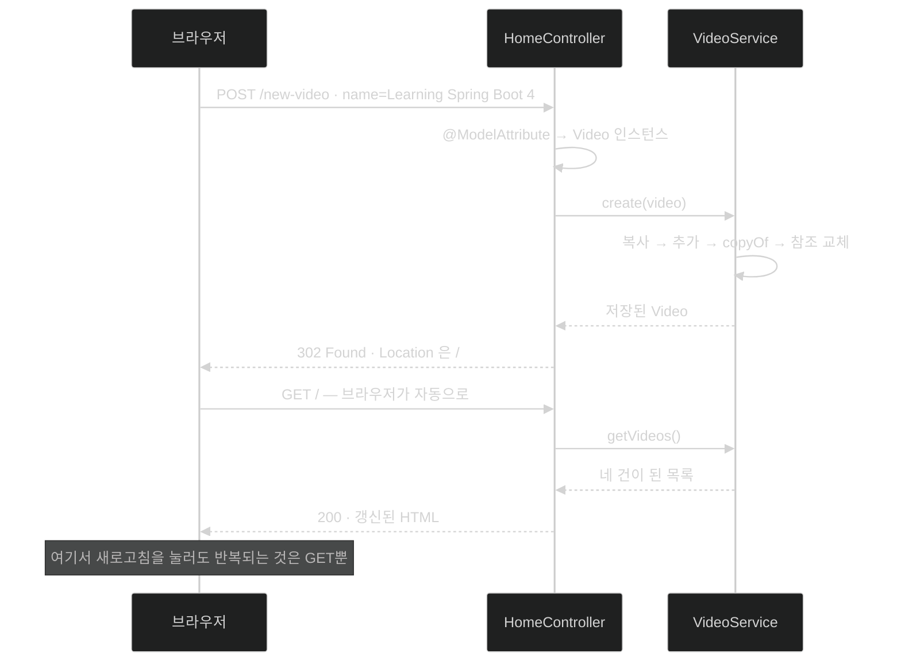

# HTML 폼으로 데이터 바꾸기 — 폼 바인딩·리다이렉트·불변 목록 갱신

## 한눈에 보기

| 질문 | 핵심 답 |
|---|---|
| 폼 만드는 데 Mustache 문법이 필요한가? | 아니다. **순수 HTML `<form>`**이면 된다. |
| 폼 필드가 Java 객체가 되는 경로 | `@ModelAttribute`가 필드 이름을 record 컴포넌트에 맞춰 채운다. |
| POST 처리 후 왜 HTML을 안 돌려주나? | `redirect:/`로 302를 보내 브라우저가 GET을 다시 하게 한다 (PRG). |
| 302와 301의 차이 | 302는 임시, 301은 영구. 원래 URL을 계속 쓸지 여부가 갈린다. |
| `List.of()` 목록에 `add()`를 부르면? | `UnsupportedOperationException` |
| 그래서 어떻게 추가하나? | 가변 복사본 → 추가 → `List.copyOf`로 새 불변 목록 → 참조 교체 |
| 이렇게 하면 안전한가? | 일관성은 얻지만 **thread-safe하지는 않다.** |

## 1. 왜 이게 필요한가

### 출발 장면: 읽기만 되는 페이지

지금 화면은 서버가 가진 비디오 세 건을 보여 준다. 그게 전부다. 책의 표현대로 "서버 쪽 데이터를 보여 주기만 한다면 우리 웹 페이지는 그리 인상적이지 않다." 사용자가 새 항목을 넣고, 그것이 서버로 가고, 갱신된 결과가 다시 보여야 한다.

### 여기서 뭐가 무너지나

폼을 만들고 컨트롤러가 값을 받는 것까지는 순조롭다. 그런데 **받은 값을 목록에 넣는 순간** 예상 못 한 곳에서 막힌다.

```java
videos.add(newVideo);   // ← 컴파일은 된다
```

`videos`는 `List<Video>` 타입이고 `List` 인터페이스에는 `add()`가 있다. 그래서 **컴파일러는 아무 불평도 하지 않는다.** 실행하면 그제서야 터진다.

```text
java.lang.UnsupportedOperationException
```

[[04a-adding-demo-data-to-a-template]]에서 `List.of()`로 만든 것이 **[[불변-컬렉션]]**(= 만들어진 뒤 원소를 바꿀 수 없는 컬렉션)이기 때문이다. 책의 설명대로 "이 불변 리스트는 Java의 `List` 인터페이스를 존중하므로 `add()` 메서드에 접근할 수 있게 해 준다. 그러나 실제로 쓰려고 하면 `UnsupportedOperationException`만 만들어 낼 뿐이다."

두 번째로 막히는 곳은 응답이다. 새 비디오를 저장한 뒤 갱신된 HTML을 그냥 돌려주면 동작은 한다. 그런데 사용자가 **브라우저 새로고침을 누르는 순간** 브라우저는 방금 한 POST를 그대로 다시 보낸다. 같은 비디오가 하나 더 들어간다. F5를 다섯 번 누르면 다섯 개가 더 생긴다.

### 그래서 나온 생각

두 문제에 각각 답이 필요하다.

- 불변 목록에 "추가"하려면 → 원본을 고치는 대신 **새 불변 인스턴스를 만들어 참조를 갈아 끼운다**. 이것이 **[[복사-후-교체]]**(= 원본 내용에 변경을 더한 새 불변 인스턴스를 만들어 참조를 교체하는 방식)다.
- 새로고침 재전송을 막으려면 → POST 응답으로 HTML이 아니라 **[[리다이렉트]]**(= "다른 URL로 다시 요청하라"는 지시를 돌려주는 방식)를 보낸다. 이 흐름의 이름이 **[[PRG]]**(= POST로 바꾼 뒤 리다이렉트를 보내 브라우저가 GET으로 결과를 다시 읽게 하는 패턴)다.

복사-후-교체를 비유하면 **계약서 수정**과 같다. 원본에 줄을 긋고 덧쓰는 대신, 조항을 더한 새 계약서를 통째로 다시 쓰고 옛 것을 대체한다. 그래야 이미 옛 계약서를 들고 있는 사람의 문서가 몰래 바뀌는 일이 없다.

→ 비유가 깨지는 지점: 종이 계약서는 **원본이 물리적으로 하나**라 두 사람이 동시에 새 판을 만들 수 없다. 하지만 메모리의 참조 교체는 그런 보호가 없다 — 두 요청 스레드가 동시에 옛 목록을 읽고, 각자 자기 항목만 더한 새 목록을 만들고, 차례로 덮어쓰면 **한쪽의 추가가 흔적 없이 사라진다.** 책이 Note로 못 박는 지점이 정확히 여기다.

## 2. 어떻게 동작하는가

### 2.1 폼은 그냥 HTML이다

`index.mustache`에 다음을 더한다.

```html
<form action="/new-video" method="post">
     <input type="text" name="name">
     <button type="submit">Submit</button>
</form>
```

책의 설명은 세 줄이다.

- 이 HTML 폼은 서버 앱에 `POST /new-video` 호출을 만들어 낸다.
- `name`이라는 이름의 텍스트 입력 하나를 갖는다.
- Submit 버튼을 누르면 발동한다.

그리고 곧바로 이렇게 덧붙인다 — "Mustache 관련 내용이 어디 있는지 궁금하다면, 없다. HTML 폼은 꽤 단순하다."

이 사실이 사소해 보이지만 [[04-leveraging-templates-to-create-content]]에서 본 성질의 연장이다. 템플릿 파일은 **HTML인데 필요할 때만 몇 글자가 더 있는 문서**이므로, 동적 요소가 없는 부분은 순수 HTML 그대로다.

`name="name"`이 우연한 반복처럼 보이지만 그렇지 않다. **왼쪽 `name` 속성은 HTML의 문법이고, 오른쪽 값 `"name"`은 `Video` record의 컴포넌트 이름과 맞춘 것이다.** 이 값이 다음 절의 자동 변환을 가능하게 하는 유일한 연결고리다.

### 2.2 POST를 받는 컨트롤러 메서드

```java
@PostMapping("/new-video")
public String newVideo(@ModelAttribute Video newVideo) {
    videoService.create(newVideo);
    return "redirect:/";
}
```

책의 항목별 설명을 따라가 보자.

- `@PostMapping("/new-video")` — `POST /new-video` 호출을 잡아 이 메서드로 보내는 Spring MVC의 **[[요청-매핑]]**(= HTTP 메서드·경로를 컨트롤러 메서드에 연결하는 선언)이다. — 같은 경로라도 GET과 POST가 서로 다른 메서드로 가야 하기 때문이다.
- `@ModelAttribute` — 들어온 HTML 폼을 파싱해 `Video` 객체로 풀어 담는 Spring MVC 애노테이션이다. 이 변환이 **[[폼-바인딩]]**(= 폼 필드 이름과 값을 Java 객체 속성으로 옮겨 담는 과정)이다. — 컨트롤러가 요청에서 문자열을 하나씩 꺼내 타입을 바꾸는 배관 코드를 쓰지 않게 하기 위해서다.
- `videoService.create()` — 새 비디오를 저장할, **아직 쓰지 않은** 메서드다.
- `"redirect:/"` — 브라우저에 `/` URL로 **HTTP 302 Found**를 보내라는 Spring MVC 지시다. — 새로고침이 POST 재전송이 되지 않게 하기 위해서다.

책은 302를 설명하며 301과 대비한다.

| | 302 Found | 301 Moved Permanently |
|---|---|---|
| 의미 | 임시 이동 | 영구 이동 |
| 원래 URL | 앞으로도 계속 쓸 수 있다 | 더 이상 유효하지 않다 |
| 브라우저·클라이언트 | 다음에도 원래 URL로 먼저 온다 | 새 URL을 기억하고 바로 간다 |
| 이 상황에 맞는 것 | **302** — `/new-video`는 다음 제출에도 그대로 쓴다 | 아니다 |

`@ModelAttribute`가 어떻게 `Video`를 만드는지 단계로 보면 다음과 같다.

1. 요청 본문에서 폼 인코딩된 키-값(`name=Learning+Spring+Boot+4`)을 파싱한다. — 브라우저가 보낸 형식을 먼저 풀어야 하기 때문이다.
2. 대상 타입 `Video`의 컴포넌트 이름 목록(`name`)을 확인한다. — 어떤 키를 어디에 넣을지 알아야 하기 때문이다.
3. 이름이 일치하는 값을 해당 타입으로 변환해 채운다. — HTTP는 문자열만 나르므로 타입 변환이 반드시 한 번 필요하기 때문이다.
4. `new Video("Learning Spring Boot 4")`에 해당하는 인스턴스를 만들어 인자로 넘긴다. — 컨트롤러가 원시 요청이 아니라 도메인 타입을 다루게 하기 위해서다.

3번 때문에 **폼의 `name` 속성 값과 record 컴포넌트 이름이 같아야 한다.** 다르면 그 필드는 채워지지 않는다.

### 2.3 불변 목록에 추가하는 방법

이제 `VideoService`에 `create()`를 더해야 한다. 책의 표현대로 "불변인 무언가에 추가하는 요령은, 원래 내용과 새 내용을 합쳐 **새 불변 인스턴스를 만드는 것**"이다.

```java
public Video create(Video newVideo) {
       List<Video> extend = new ArrayList<>(videos);
       extend.add(newVideo);
       this.videos = List.copyOf(extend);
       return newVideo;
}
```

책의 항목별 설명이다.

- 메서드 시그니처가 새 비디오를 받아 **같은 것을 그대로 돌려준다.** 저장소 성격의 서비스에서 흔한 동작이다.
- `new ArrayList<>()`가 `List` 기반 생성자로 가변 컬렉션인 새 `ArrayList`를 만든다. 이 새 컬렉션은 적절한 크기로 초기화되고 모든 항목을 복사해 넣는다. — 원본을 건드리지 않고 작업할 공간이 필요하기 때문이다.
- 이 `ArrayList`에는 **쓸 수 있는** `add()`가 있어 새 `Video`를 끝에 더할 수 있다. — 실제 변경이 일어나는 유일한 지점이다.
- Java의 `copyOf()`가 기존 `List`를 받아 모든 원소를 새 불변 리스트로 복사한다. — 완성된 결과를 다시 불변으로 되돌려 밖으로 새어 나간 참조가 변하지 않게 하기 위해서다.
- 마지막으로 새 `Video`를 반환한다.

책이 정리하는 이 방식의 값은 이렇다 — "단계가 몇 개 더 들긴 했지만, 앞의 코드는 **기존 데이터 사본이 메서드 호출로 인해 우연히 변경되는 일이 없도록** 보장한다. 부작용이 방지되어 일관된 상태가 유지된다."

구체적으로 무슨 부작용인가? [[04b-building-our-app-with-a-better-design]]에서 `getVideos()`가 내부 목록 참조를 그대로 돌려준다고 했다. 만약 그 목록이 가변이었다면, 컨트롤러나 템플릿이 받은 참조로 목록을 바꿔 버릴 수 있다. 불변이면 **밖으로 나간 참조는 영원히 그 시점의 스냅숏**이다.

### 2.4 안전하지 **않은** 지점

> **Note (책 p.42)**: 불변 리스트 덕분에 이 데이터가 일관성을 갖긴 하지만, **결코 thread-safe하지는 않다.** 방금 정의한 엔드포인트로 여러 POST 호출이 들어오면 모두 같은 `VideoService`를 갱신하려 들 것이고, 아마 어떤 형태의 **[[경쟁-상태]]**(= 여러 실행 흐름이 같은 상태를 동시에 읽고 써서 일부 변경이 사라질 수 있는 상황)로 이어져 데이터 손실을 일으킬 수 있다. 이런 문제를 푸는 데만 책 여러 권이 있으니, 이 책에서는 코드를 방탄으로 만드는 데 초점을 두지 않는다.

이 Note를 정확히 읽는 것이 중요하다. **`List.copyOf`가 만든 목록 자체는 불변이라 안전하다.** 안전하지 않은 것은 `create()` 메서드의 **세 줄이 원자적이지 않다**는 점이다.

```text
스레드 A                          스레드 B
────────────────────────────      ────────────────────────────
videos 읽기 → [v1,v2,v3]
                                  videos 읽기 → [v1,v2,v3]
복사본에 A항목 추가
                                  복사본에 B항목 추가
this.videos = [v1,v2,v3,A]
                                  this.videos = [v1,v2,v3,B]   ← A가 사라졌다
```

각 단계는 개별적으로 안전한데 **전체가 하나의 원자적 연산이 아니라서** 마지막 쓰기가 앞의 쓰기를 덮는다. 이것이 "일관성"과 "thread-safety"가 서로 다른 성질인 이유다.

### 2.5 실제로 돌려 보기

애플리케이션을 다시 실행하면 목록 아래에 입력창과 Submit 버튼이 붙어 있다. 입력창에 `Learning Spring Boot 4`를 넣고 Submit을 누르면 다음이 일어난다.

1. 브라우저가 `POST /new-video`를 보낸다.
2. `newVideo()`가 폼을 `Video`로 바인딩하고 `create()`를 호출한다.
3. 컨트롤러가 `/`로의 리다이렉트를 발행한다.
4. 브라우저가 루트 경로로 되돌아가며 **새 GET 요청**을 보낸다.
5. 그 GET이 `index()`를 타고 갱신된 목록을 렌더링한다.

4번이 PRG의 핵심이다. 화면에 보이는 HTML은 POST의 응답이 아니라 **그 뒤에 이어진 GET의 응답**이므로, 이 상태에서 새로고침을 눌러도 POST가 아니라 GET이 반복된다.

> **Note (책 p.43)**: Mustache와 Spring Boot의 연동을 더 알고 싶다면 Dave Syer의 글 *The Joy of Mustache: Server Side Templates for the JVM* (`https://springbootlearning.com/mustache`)을 참고하라. 일관된 레이아웃 구성이나 커스텀 Mustache 람다 함수 작성까지 자세히 다룬다.

## 3. 그림으로 보기

### PRG — 제출 한 번에 오가는 요청 두 개



### 불변 목록을 "바꾸는" 세 단계

```text
[시작]
  this.videos ──▶ 불변목록#1 [v1, v2, v3]
                  (밖으로 나간 참조도 전부 여기를 본다)

[1] new ArrayList<>(videos)
  extend ──▶ 가변목록 [v1, v2, v3]          ← 내용만 복사. 원본은 그대로
  this.videos ──▶ 불변목록#1 [v1, v2, v3]

[2] extend.add(newVideo)
  extend ──▶ 가변목록 [v1, v2, v3, v4]      ← 여기서만 실제 변경이 일어난다
  this.videos ──▶ 불변목록#1 [v1, v2, v3]   ← 아직 아무도 영향받지 않았다

[3] this.videos = List.copyOf(extend)
  extend ──▶ 가변목록 [v1, v2, v3, v4]      (버려진다)
  this.videos ──▶ 불변목록#2 [v1, v2, v3, v4]
  옛 참조를 들고 있던 쪽 ──▶ 불변목록#1     ← 그 스냅숏은 끝까지 안 변한다

  ▶ 원본을 고치지 않았기 때문에 "이미 나눠 준 목록이 몰래 바뀌는" 부작용이 없다.
  ▶ 그러나 [1]~[3]이 원자적이지 않아, 동시에 두 요청이 들어오면 한쪽이 사라진다.
```

### 폼이 붙은 화면

![[_assets/lsb4-p68-fig2-9-mustache-list-with-form.png]]
> 출처: *Learning Spring Boot 4*, p.43 (Figure 2.9)

목록 아래에 텍스트 입력과 Submit 버튼이 보인다. 화면상으로는 평범한 HTML 폼이며, Mustache의 흔적은 없다.

## 4. 이 노트에 나온 용어

| 용어 | 한 줄 풀이 | 자세히 |
|---|---|---|
| 요청 매핑 | HTTP 메서드·경로를 컨트롤러 메서드에 연결하는 선언 | [[_glossary#요청-매핑]] |
| 폼 바인딩 | 폼 필드 이름·값을 Java 객체 속성으로 옮기는 과정 | [[_glossary#폼-바인딩]] |
| 리다이렉트 | 다른 URL로 다시 요청하라는 지시를 돌려주는 방식 | [[_glossary#리다이렉트]] |
| PRG | POST → 리다이렉트 → GET으로 결과를 읽게 하는 흐름 | [[_glossary#PRG]] |
| 불변 컬렉션 | 만들어진 뒤 원소를 바꿀 수 없는 컬렉션 | [[_glossary#불변-컬렉션]] |
| 복사 후 교체 | 새 불변 인스턴스를 만들어 참조를 갈아 끼우는 방식 | [[_glossary#복사-후-교체]] |
| 경쟁 상태 | 동시 접근으로 일부 변경이 사라질 수 있는 상황 | [[_glossary#경쟁-상태]] |
| 레코드 | 필드 목록만 선언하면 나머지를 컴파일러가 만드는 불변 데이터 클래스 | [[_glossary#레코드]] |

## 5. 자주 헷갈리는 것

### `@ModelAttribute` vs `@RequestBody`

둘 다 요청 데이터를 객체로 만든다. 판별 기준은 **들어오는 형식**이다. HTML 폼이 보내는 `application/x-www-form-urlencoded`는 `@ModelAttribute`, JSON 본문은 `@RequestBody`다 — [[05-creating-json-based-apis]].

### `redirect:` vs `forward:`

`redirect:`는 브라우저에 302를 보내 **브라우저가 새 요청을 만든다.** 주소창 URL이 바뀌고 요청이 두 번 오간다. `forward:`는 서버 안에서 처리를 넘길 뿐이라 브라우저는 요청이 하나였다고 안다. 새로고침 재전송을 막으려면 반드시 `redirect:`여야 한다.

### 불변 컬렉션 vs thread-safe

같은 말이 아니다. 불변 목록은 **그 목록을 여럿이 동시에 읽어도 안전**하지만, 그 목록을 가리키는 **필드를 여럿이 동시에 갈아 끼우는 것**은 별개 문제다. 책의 Note가 정확히 이 구분을 짚는다.

### 컴파일이 된다 vs 동작한다

`videos.add(...)`는 컴파일된다. `List` 인터페이스에 `add()`가 있기 때문이다. 불변성은 **타입이 아니라 런타임 구현**이 강제하므로 컴파일러가 막아 주지 않는다. Java 컬렉션 API의 오래된 설계 특성이며, 이 절이 실제로 그 함정을 밟아 보여 준다.

## 6. 언제 안 쓰나 / 경계

- 이 `create()`는 **동시 요청에 안전하지 않다.** 실제 애플리케이션이라면 동기화, 원자적 참조, 또는 애초에 트랜잭션을 지원하는 저장소가 필요하다. Chapter 3에서 실제 저장소로 넘어가는 이유이기도 하다.
- 복사-후-교체는 목록이 커지면 매 추가마다 전체를 두 번 복사한다. 항목 수가 수만 건이 되면 이 비용이 문제가 된다.
- 폼 바인딩은 **입력 검증을 하지 않는다.** 빈 문자열도 그대로 `Video`가 된다. 검증은 별도 장치(`@Valid`와 제약 애노테이션)의 몫이다.
- PRG는 리다이렉트 후 GET에서 "무엇이 저장됐는지"를 알려 주지 못한다. 성공 메시지 같은 것을 전달하려면 flash attribute 같은 별도 수단이 필요하다.
- 폼 방식은 화면 전체를 다시 그린다. 목록 일부만 갱신하고 싶다면 브라우저 쪽에서 API를 호출하는 접근이 대안이다 — [[07a-creating-a-reactjs-app]].

## 7. 연결

- [[04c-injecting-dependencies-through-constructor-calls]] — 여기서 호출하는 `videoService`가 그 노트에서 주입된 바로 그 인스턴스다.
- [[04a-adding-demo-data-to-a-template]] — `List.of()`로 만든 불변 목록이 여기서 처음 걸림돌이 된다.
- [[05-creating-json-based-apis]] — 같은 `create()`를 이번에는 JSON 본문으로 호출한다. 서비스는 그대로 두고 진입 경로만 하나 더 생긴다.

## 8. 스스로 확인

1. `videos.add(newVideo)`가 컴파일은 되는데 실행하면 터지는 이유를 타입과 런타임 구현으로 나눠 설명할 수 있는가?
2. 폼의 `name="name"`에서 왼쪽과 오른쪽이 각각 무엇과 맞물리는가?
3. POST 응답으로 HTML을 바로 돌려주면 사용자가 새로고침했을 때 무슨 일이 벌어지는가?
4. 302와 301 중 이 상황에 302가 맞는 이유는?
5. `create()`의 세 줄을 순서대로 설명하고, 각 줄이 왜 필요한지 말할 수 있는가?
6. "일관성은 있지만 thread-safe하지 않다"를 두 스레드의 실행 순서로 그려 설명할 수 있는가?
7. `redirect:`와 `forward:`를 바꿔 쓰면 어떤 문제가 되살아나는가?
8. 화면에 보이는 갱신된 HTML은 어느 요청의 응답인가?

> 여덟 문항을 스스로 답한 **뒤에** [[_04d-changing-the-data-through-html-forms]]에서 모범답안과 대조한다. 먼저 열면 이 문항들은 다시 인출 문제로 쓸 수 없다.

<!-- ==== 아래는 내 영역 · 스킬 수정 금지 ==== -->

## 내 설명 시도


## 막혔던 지점


## 리뷰 이력
