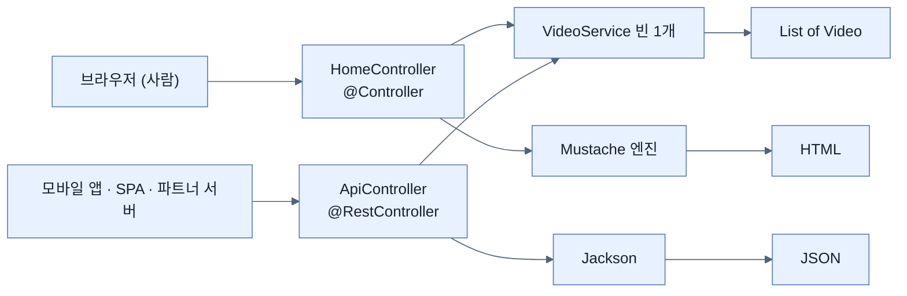

# JSON API 만들기 — @RestController와 Jackson

## 한눈에 보기

| 질문 | 핵심 답 |
|---|---|
| 설정을 얼마나 해야 하나? | **한 줄도 안 한다.** Spring Web이 Jackson을 이미 데려왔다. |
| `@RestController`가 `@Controller`와 다른 딱 한 가지 | 반환값을 **뷰 이름이 아니라 응답 본문**으로 취급한다. |
| `record Video(String name)` → JSON | `{"name":"..."}`. 컴포넌트 하나가 키 하나. |
| JSON 본문을 받으려면? | `@RequestBody` — 폼용 `@ModelAttribute`와 갈린다. |
| 서비스 코드를 다시 써야 하나? | 아니다. **같은 `VideoService` 빈**을 그대로 주입받는다. |
| 결과 | 같은 백엔드가 사람용 HTML과 기계용 JSON을 동시에 낸다. |

## 1. 왜 이게 필요한가

### 출발 장면: 브라우저가 아닌 소비자

지금까지 만든 화면은 사람이 눈으로 읽는 HTML이다. 그런데 이 비디오 목록을 쓰려는 쪽이 브라우저만은 아니다.

- 모바일 앱이 목록을 받아 네이티브 UI로 그리려 한다.
- 브라우저 안에서 도는 JavaScript 앱이 화면 갱신 없이 목록만 새로 받으려 한다 — [[07a-creating-a-reactjs-app]]가 실제로 하는 일이다.
- 파트너 회사의 서버가 우리 목록을 주기적으로 가져가려 한다.

### 여기서 뭐가 무너지나

이들에게 `GET /`의 HTML을 그대로 준다고 해 보자. 받는 쪽은 이런 문자열을 받는다.

```html
<ul>
    <li>Need HELP with your SPRING BOOT 4 App?</li>
    ...
</ul>
```

여기서 제목만 뽑으려면 HTML을 파싱해 `<li>` 태그를 찾아야 한다. 세 가지가 무너진다.

1. **표현과 데이터가 섞여 있다.** 우리가 디자인을 바꿔 `<ul>`을 `<table>`로 만드는 순간 파트너의 파싱 코드가 깨진다. 화면 스타일 변경이 **API 장애**가 된다.
2. **타입이 없다.** 조회수를 숫자로 쓰고 싶어도 HTML에서 뽑은 것은 전부 문자열이다.
3. **모든 소비자가 같은 파싱 코드를 각자 쓴다.** 그리고 각자 다르게 틀린다.

책은 이 상황을 "옛날에는 이것이 복잡했고 호환성을 보장하기 어려웠다"고 회고한 뒤, 지금은 세상이 대체로 소수의 형식으로 수렴했고 그 상당수가 JSON 기반이라고 정리한다.

### 그래서 나온 생각

**표현을 뺀 데이터만** 약속된 형식으로 내보낸다. 그 형식이 JSON이고, Java 객체와 JSON을 오가는 변환을 맡는 라이브러리가 **[[Jackson]]**(= Java 객체와 JSON을 서로 변환하는 라이브러리)이다.

Spring Boot가 여기서 하는 일은 책의 표현대로 이렇다 — "Spring Boot의 강력한 기능 중 하나는, 이 장 앞에서 한 것처럼 프로젝트에 Spring Web을 추가하면 **Jackson이 클래스패스에 함께 올라온다**는 것이다."

이건 마법이 아니라 의존성 그래프다. [[02-creating-a-spring-mvc-web-controller]]에서 확인한 대로 **[[스타터]]**(= 기능 하나를 시작하는 데 필요한 의존성 묶음 아티팩트) `spring-boot-starter-webmvc`가 `spring-boot-starter-jackson`을 전이 의존성으로 포함한다. 거기에 자동 구성이 Jackson 기반 메시지 변환기를 등록한다. 그래서 책이 말하듯 "API를 코딩하기 시작하는 데 손가락 하나 더 움직일 필요가 없다."

비유하자면 `@Controller`와 `@RestController`는 **같은 주방에서 나온 요리를 접시에 담느냐 포장 용기에 담느냐**의 차이다. 조리(서비스 계층)는 똑같고 담는 그릇만 다르다.

→ 비유가 깨지는 지점: 식당에서는 포장해 온 음식을 집에서 접시에 옮겨 담을 수 있다. 하지만 `@RestController`는 **클래스 전체에 걸리는 결정**이라 그 안의 메서드 하나만 HTML로 돌리는 식으로 섞을 수 없다. 섞으려면 클래스를 나누거나 `@Controller` + `@ResponseBody` 조합으로 메서드 단위로 지정해야 한다.

## 2. 어떻게 동작하는가

### 2.1 `@RestController`가 바꾸는 딱 한 가지

`com.learningspringboot4` 패키지에 `ApiController` 클래스를 만들고 맨 위에 `@RestController`를 붙인다.

책의 설명은 정확히 두 부분으로 갈린다.

**같은 점** — `@Controller`처럼 이 클래스가 컴포넌트 스캔에 걸려 Spring 빈이 되어야 함을 알린다. 그 빈은 애플리케이션 컨텍스트에 등록되고, 웹 호출을 라우팅할 수 있도록 Spring MVC에도 컨트롤러로 등록된다.

**다른 점 하나** — 모든 웹 메서드를 **템플릿 기반에서 JSON 기반으로 전환한다.** 웹 메서드가 Spring MVC가 템플릿 엔진으로 렌더링할 템플릿 이름을 반환하는 대신, 결과를 Jackson으로 **[[직렬화]]**(= 메모리의 객체를 전송·저장 가능한 문자열이나 바이트열로 바꾸는 일)한다.

한 문장으로 압축하면 이렇다. **`@RestController` = `@Controller` + "반환값은 뷰 이름이 아니라 응답 본문이다".** 그래서 [[02-creating-a-spring-mvc-web-controller]]의 `return "index";`가 여기서는 `index`라는 다섯 글자짜리 응답 본문이 된다.

이름의 `Rest`는 REST(Representational State Transfer) 아키텍처 스타일에서 왔지만, 애노테이션이 실제로 강제하는 것은 REST 원칙 전체가 아니라 **본문 직렬화 하나**뿐이다. 이름이 실제 기능보다 넓게 들린다는 점은 알아 두는 편이 좋다.

### 2.2 조회 엔드포인트

```java
@RestController
public class ApiController {
     private final VideoService videoService;

     public ApiController(VideoService videoService) {
         this.videoService = videoService;
     }

     @GetMapping("/api/videos")
     public List<Video> all() {
         return videoService.getVideos();
     }
}
```

책의 항목별 설명이다.

- `@RestController`가 이 클래스를 JSON을 반환하는 Spring MVC 컨트롤러로 표시한다.
- **[[생성자-주입]]**(= 필요한 협력 객체를 생성자 매개변수로 받는 방식)을 써서 이 장 앞에서 만든 **바로 그** `VideoService`의 사본을 자동으로 받는다.
- `@GetMapping`이 `/api/videos`로 오는 HTTP GET 호출에 응답한다.
- 이 웹 메서드가 `Video` 레코드 목록을 가져와 반환하고, Jackson이 그것을 JSON 배열로 렌더링한다.

두 번째 항목이 [[04b-building-our-app-with-a-better-design]] 리팩터링의 배당금이다. **같은 빈**이므로 폼으로 추가한 비디오가 API에도 즉시 보이고, API로 추가한 비디오가 HTML 화면에도 보인다. 계층을 나누지 않았다면 여기서 목록이 두 벌로 갈라졌을 것이다.

실행하고 그 엔드포인트를 `curl`로 치면 이렇게 나온다.

```json
[
     {"name": "Need HELP with your SPRING BOOT 4 App?"},
     {"name": "Don't do THIS to your own CODE!"},
     {"name": "SECRETS to fix BROKEN CODE!"}
]
```

책의 정리 — "이 최소한의 JSON 배열은 `Video` 레코드 하나마다 항목 하나씩 세 개를 담고 있다. 그리고 `Video` 레코드에는 속성이 `name` 하나뿐이므로 Jackson이 내놓는 것이 정확히 이것이다. **Jackson이 생산을 시작하게 하려고 설정할 것은 아무것도 없다.**"

**[[레코드]]**(= 필드 목록만 선언하면 나머지를 컴파일러가 만드는 불변 데이터 클래스)의 컴포넌트 하나가 JSON 키 하나에 대응한다는 점이 중요하다. `Video`에 필드를 하나 더하면 JSON 키도 자동으로 하나 는다 — 편리하지만 동시에 **내부 필드 추가가 곧 공개 계약 변경**이 된다는 뜻이기도 하다. 이 위험이 [[08-versioning-apis-with-spring-boot-4]]의 출발점이다.

### 2.3 HTTP 동사를 정확히 쓰기

책은 쓰기 엔드포인트를 만들기 전에 HTTP 동사의 의미를 별도 Note로 정리한다.

> **Note (책 pp. 45–46)**: 표준 HTTP 동사 여럿이 있고 가장 흔한 것이 GET, POST, PUT, DELETE다.
> - **GET**은 서버 상태를 바꾸지 않고 데이터를 반환할 것으로 기대된다. HTTP 용어로 GET은 **safe**하다. GET은 **idempotent**하기도 해서, 같은 요청을 여러 번 해도 한 번 한 것과 효과가 같다.
> - **POST**는 시스템에 새 데이터를 들이는 데 쓴다. 관계형 데이터베이스 테이블에 새 행을 넣는 것에 대응한다.
> - **PUT**은 변경을 가한다는 점에서 POST와 비슷하지만, 기존 리소스를 **갱신하거나 대체**한다고 설명하는 편이 낫다. 같은 갱신을 여러 번 보내도 최종 상태가 같아야 하므로 PUT은 idempotent하다. 다만 서버 상태를 바꾸므로 **safe하지는 않다.**
> - **DELETE**는 서버에서 무언가를 제거하며, 반복 요청이 리소스를 같은 최종 상태로 남기므로 역시 idempotent로 간주된다.
>
> HTTP 표준이 요구하는 것은 아니지만, 갱신 연산이 새로운·갱신된·삭제된 항목의 사본을 요청한 클라이언트에 돌려주는 것은 다소 흔한 동작이다.

두 성질을 표로 갈라 두면 헷갈리지 않는다.

| 동사 | **[[안전한-메서드]]**(상태를 안 바꾼다) | **[[멱등성]]**(여러 번 = 한 번) | 이 절의 예 |
|---|---|---|---|
| GET | 예 | 예 | `GET /api/videos` |
| POST | 아니오 | **아니오** | `POST /api/videos` — 두 번 보내면 두 개 생긴다 |
| PUT | 아니오 | 예 | (이 장에는 없음) |
| DELETE | 아니오 | 예 | (이 장에는 없음) |

POST만 멱등하지 않다는 사실이 실무에서 가장 자주 문제를 만든다. 네트워크가 끊겨 응답을 못 받았을 때 **재시도하면 중복 생성**이 되기 때문이다. [[04d-changing-the-data-through-html-forms]]의 PRG 패턴이 브라우저 새로고침으로 인한 POST 재전송을 막았던 것도 같은 성질에서 나온 대응이다.

### 2.4 JSON을 받는 엔드포인트

`all()` 바로 아래에 추가한다.

```java
@PostMapping("/api/videos")
public Video newVideo(@RequestBody Video newVideo) {
       return videoService.create(newVideo);
}
```

책의 설명이다.

- `@PostMapping`이 `/api/videos`로 오는 HTTP POST 호출을 이 메서드에 매핑한다.
- `@RequestBody`는 들어오는 HTTP **[[요청-본문]]**(= HTTP 요청의 헤더 뒤에 실려 오는 데이터 덩어리)을 Jackson을 통해 `Video` 레코드인 `newVideo` 인자로 **[[역직렬화]]**(= 전송받은 텍스트를 객체로 되돌리는 일)하라는 신호다.
- 실제 처리는 `VideoService`에 위임하고, 시스템에 추가된 뒤의 레코드를 반환한다.

그리고 못 박는다 — "이 `create()` 연산은 이 장 앞에서 이미 코딩했으므로 다시 들여다볼 필요가 없다." [[04d-changing-the-data-through-html-forms]]에서 쓴 복사-후-교체 로직이 그대로 재사용된다. **새 진입 경로가 생겼을 뿐 업무 로직은 하나다.**

### 2.5 명령행에서 확인하기

> **Tip (책 p.46)**: 앞에서 "그 엔드포인트를 curl로 친다"고 하고 JSON이 찍히는 것을 봤다. **[[curl]]**(= 명령행에서 HTTP 요청을 보내고 응답을 그대로 보여 주는 도구, `https://curl.se/`)은 웹 API를 다루게 해 주는 인기 있는 명령행 도구다. 이 한 줄 요약으로는 이 도구를 제대로 설명했다고 하기 어려울 정도이니, 시스템에 설치해 두는 편이 좋다.

```bash
curl -v -X POST localhost:8080/api/videos -d '{"name": "Learning Spring Boot 4"}' -H 'Content-type:application/json'
```

옵션별 의미는 책의 설명 그대로다.

| 옵션 | 역할 | 빼면 어떻게 되나 |
|---|---|---|
| `-v` | verbose 출력. 상호작용 전체를 자세히 보여 준다 | 응답 본문만 보인다 |
| `-X POST` | 기본 GET 대신 HTTP POST를 쓰라고 지시 | GET으로 가서 405나 조회 결과가 온다 |
| `localhost:8080/api/videos` | 명령을 보낼 URL | — |
| `-d '{…}'` | 보낼 데이터. JSON 필드가 큰따옴표로 구분되므로 문서 전체를 **작은따옴표**로 감싼다 | 본문이 없어 역직렬화가 실패한다 |
| `-H 'Content-type:application/json'` | 이 요청 본문이 JSON 형식임을 웹 앱에 알리는 헤더 | Spring이 본문 형식을 몰라 **415 Unsupported Media Type**이 난다 |

마지막 줄이 특히 중요하다. `@RequestBody`가 "본문을 객체로 바꿔라"라고만 말할 뿐, **어떤 형식인지는 `Content-Type` 헤더가 말한다.** 헤더가 없거나 틀리면 Jackson 변환기가 선택되지 않는다.

응답은 이렇게 나온다.

```text
> POST /api/videos HTTP/1.1
> Host: localhost:8080
> User-Agent: curl/8.7.1
> Accept: */*
> Content-type:application/json
> Content-Length: 34
>
< HTTP/1.1 200
< Content-Type: application/json
{"name":"Learning Spring Boot 4"}
```

`>`로 시작하는 줄이 우리가 **보낸** 것, `<`로 시작하는 줄이 서버가 **돌려준** 것이다. 책이 짚는 확인 포인트는 넷이다 — 위쪽의 동사·URL·헤더, 아래쪽의 `HTTP 200` 성공 코드, 응답이 `application/json`이라는 표시, 그리고 방금 만든 `Video` 항목이 담긴 본문.

마지막 본문이 `create()`가 인자를 그대로 돌려주도록 만든 이유다 — Note가 말한 "갱신 연산이 결과 사본을 돌려주는 흔한 동작"이 여기 구현되어 있다.

### 2.6 실제로 저장됐는지 다시 확인

응답 하나만 보고 믿지 않고 조회 엔드포인트를 다시 친다.

```bash
curl localhost:8080/api/videos
```

```json
[
     {"name":"Need HELP with your SPRING BOOT 4 App?"},
     {"name":"Don't do THIS to your own CODE!"},
     {"name":"SECRETS to fix BROKEN CODE!"},
     {"name":"Learning Spring Boot 4"}
]
```

맨 아래에 새 항목이 붙었다. 이 두 단계(쓰고 → 다시 읽어 확인) 자체가 API를 검증하는 기본 절차다.

### 2.7 지금 얻은 구조

책의 정리는 이렇다 — 이제 우리에게는 두 얼굴을 가진 웹 애플리케이션이 있다. **사람이 읽도록 브라우저에서 렌더링되는 템플릿 기반 버전**과 **제3자가 소비할 수 있는 JSON 기반 버전**이다. 그리고 이 이중 접근이 현대 애플리케이션에서 중요한 이유는, **같은 백엔드가 사람용 페이지와 모바일 앱·프런트엔드 프레임워크·외부 연동이 쓰는 기계용 API를 모두 서비스할 수 있기 때문**이다.

여기서 "같은 백엔드"의 실체는 `VideoService` 빈 하나다. 표현 계층만 둘로 갈렸다.

## 3. 그림으로 보기

### 하나의 서비스, 두 개의 표현



같은 `VideoService`에서 갈라져 나온 두 줄기가 서로 다른 변환기를 거쳐 서로 다른 형식이 된다. 갈리는 지점이 **컨트롤러의 애노테이션**이라는 것이 이 그림의 요지다.

### 반환값이 해석되는 갈림길

```text
컨트롤러 메서드가  return X;  했을 때

  @Controller 인 경우                    @RestController 인 경우
  ──────────────────────────────────     ──────────────────────────────────
  X가 String  → 논리적 뷰 이름            X가 String  → 응답 본문 그대로
                templates/X.mustache                    (5글자짜리 텍스트)

  X가 객체    → (뷰 이름이 아니라서                X가 객체    → Jackson이 JSON으로
                 별도 처리가 필요)                              직렬화

  예) return "index";                     예) return List.of(v1, v2, v3);
      → HTML 한 장                             → [{"name":...}, ...]

  ▶ 클래스에 붙은 애노테이션 하나가 같은 return 문의 의미를 바꾼다.
```

### 두 애노테이션의 요청 데이터 처리

| | `@ModelAttribute` | `@RequestBody` |
|---|---|---|
| 어디서 쓰나 | [[04d-changing-the-data-through-html-forms]]의 폼 | 이 노트의 JSON API |
| 들어오는 형식 | `application/x-www-form-urlencoded` | `application/json` |
| 변환 주체 | Spring MVC 데이터 바인더 | Jackson |
| 값을 찾는 기준 | 폼 필드 이름 | JSON 키 이름 |
| 부분 채움 | 일부만 와도 나머지는 기본값 | 본문 전체를 하나의 객체로 |
| 헤더 의존 | 없음 | **`Content-Type`에 의존** |

## 4. 이 노트에 나온 용어

| 용어 | 한 줄 풀이 | 자세히 |
|---|---|---|
| Jackson | Java 객체와 JSON을 서로 변환하는 라이브러리 | [[_glossary#Jackson]] |
| 직렬화 | 객체를 전송 가능한 문자열·바이트열로 바꾸는 일 | [[_glossary#직렬화]] |
| 역직렬화 | 전송받은 텍스트를 객체로 되돌리는 일 | [[_glossary#역직렬화]] |
| 요청 본문 | HTTP 요청 헤더 뒤에 실려 오는 데이터 덩어리 | [[_glossary#요청-본문]] |
| 안전한 메서드 | 서버 상태를 바꾸지 않는다고 약속된 HTTP 메서드 | [[_glossary#안전한-메서드]] |
| 멱등성 | 여러 번 보내도 최종 상태가 한 번과 같은 성질 | [[_glossary#멱등성]] |
| curl | 명령행에서 HTTP 요청·응답을 확인하는 도구 | [[_glossary#curl]] |
| 스타터 | 기능 하나를 시작하는 데 필요한 의존성 묶음 | [[_glossary#스타터]] |
| 생성자 주입 | 필요한 협력 객체를 생성자 매개변수로 받는 방식 | [[_glossary#생성자-주입]] |
| 레코드 | 필드 목록만 선언하면 나머지를 컴파일러가 만드는 불변 데이터 클래스 | [[_glossary#레코드]] |

## 5. 자주 헷갈리는 것

### safe vs idempotent

같은 말이 아니다. **safe = 상태를 안 바꾼다**, **idempotent = 여러 번 해도 결과가 같다**. PUT은 상태를 바꾸므로 safe하지 않지만, 같은 값으로 덮어쓰는 것이므로 idempotent다. 이 구분이 재시도 정책을 정한다 — idempotent한 요청만 마음 놓고 재시도할 수 있다.

### `@RestController` vs `@Controller` + `@ResponseBody`

기능적으로 같다. `@RestController`는 클래스의 **모든** 메서드에 `@ResponseBody`를 붙인 것과 같은 효과를 낸다. 한 클래스에서 HTML과 JSON을 섞고 싶다면 `@RestController`를 쓸 수 없고, `@Controller`에 메서드마다 `@ResponseBody`를 붙여야 한다.

### "설정이 필요 없다" vs "설정할 수 없다"

Jackson이 기본값으로 잘 동작한다는 것이지 조정이 불가능하다는 뜻이 아니다. 날짜 형식, `null` 필드 생략, 필드 이름 규칙 등은 프로퍼티나 `ObjectMapper` 커스터마이징으로 바꿀 수 있다. Chapter 1의 back-off 원리가 여기도 적용된다.

### JSON 배열 vs Java `List`

`List<Video>`를 반환하면 JSON **배열**이 나온다. 단일 `Video`를 반환하면 JSON **객체**가 나온다. `all()`과 `newVideo()`의 반환 타입이 다르기 때문에 응답 모양도 다르다는 점을 curl 출력에서 확인할 수 있다.

## 6. 언제 안 쓰나 / 경계

- record 필드를 하나 더하면 **JSON 응답이 조용히 바뀐다.** 내부 리팩터링이 곧 공개 계약 변경이 되는 위험이며, 이 때문에 실무에서는 응답 전용 타입(DTO)을 따로 두거나 버전을 명시한다 — [[08-versioning-apis-with-spring-boot-4]].
- POST는 멱등하지 않다. 클라이언트가 타임아웃 후 재시도하면 중복이 생긴다. 이 장의 코드에는 그 대비가 없다.
- `@RequestBody`는 **검증하지 않는다.** `{"name": ""}`도 그대로 `Video`가 된다.
- 예외가 나면 무엇이 응답으로 나가는지 이 장에서는 다루지 않는다. 실제 API에는 오류 응답 형식의 약속이 함께 필요하다.
- API를 공개한다는 것은 **소비자와 계약을 맺는 일**이다. 잘 동작하는 엔드포인트를 만드는 것과 그것을 오래 유지하는 것은 다른 문제다.

## 7. 연결

- [[04d-changing-the-data-through-html-forms]] — 여기서 호출하는 `create()`가 그 노트에서 만든 바로 그 메서드다. 진입 경로만 늘고 업무 로직은 하나다.
- [[07a-creating-a-reactjs-app]] — 이 절에서 만든 `/api/videos`를 브라우저 JavaScript가 `fetch`로 소비한다.
- [[08-versioning-apis-with-spring-boot-4]] — 공개한 JSON 계약을 나중에 바꿔야 할 때의 문제와 Spring Boot 4의 해법으로 이어진다.

## 8. 스스로 확인

1. 파트너에게 HTML을 그대로 주면 무엇이 무너지는가? 특히 "화면 스타일 변경이 API 장애가 된다"를 설명할 수 있는가?
2. "Spring Web을 넣으면 Jackson이 온다"를 의존성 그래프로 설명할 수 있는가?
3. `@RestController`가 `@Controller`와 다른 **딱 한 가지**는 무엇인가?
4. `return "index";`가 두 애노테이션에서 각각 어떻게 해석되는가?
5. safe와 idempotent의 차이를 PUT을 예로 설명할 수 있는가? POST가 위험한 이유는?
6. `-H 'Content-type:application/json'`을 빼면 왜 실패하는가? `@RequestBody`가 모르는 것은 무엇인가?
7. curl verbose 출력에서 `>`와 `<`는 각각 무엇인가?
8. `create()`가 인자를 그대로 돌려주도록 만든 이유는 무엇인가?
9. `Video` record에 필드를 하나 더하면 어떤 일이 자동으로 일어나고, 왜 그것이 위험한가?

<!-- ==== 아래는 내 영역 · 스킬 수정 금지 ==== -->

## 내 설명 시도


## 막혔던 지점


## 리뷰 이력
