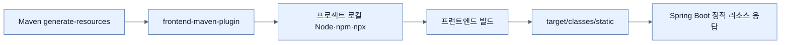

# Spring Boot 웹 앱에 Node.js 연결하기

## 한눈에 보기

`frontend-maven-plugin`은 프로젝트 로컬에 Node.js·npm·npx를 설치하고 Maven 생명주기에서 프런트엔드 작업을 실행한다. 생성된 정적 자산을 `target/classes/static`에 두면 Boot가 웹 루트에서 제공한다.

## 1. 왜 이게 필요한가

Java 백엔드와 JavaScript 프런트엔드는 서로 다른 도구·패키지 생태계를 쓴다. 개발자 머신의 전역 Node 버전에 의존하면 로컬과 CI 결과가 어긋난다. Maven 안에 Node 설치와 빌드를 묶으면 한 명령으로 양쪽 산출물을 재현할 수 있다.

## 2. 어떻게 동작하는가

1. Maven 플러그인의 `install-node-and-npm` goal이 지정 버전을 프로젝트의 `node` 폴더에 내려받는다.
2. `generate-resources` 단계에서 프런트엔드 준비 작업이 백엔드 패키징보다 먼저 수행된다.
3. `node`, `node_modules`는 중간 산출물이므로 버전 관리에서 제외한다.
4. 번들러 출력은 Maven `target` 아래의 `classes/static`으로 향하게 한다.
5. Boot의 정적 리소스 처리기가 빌드 결과를 HTTP로 제공한다.

플러그인은 두 공장의 컨베이어 시간을 맞추는 조정자다. 프런트엔드 설계를 대신하지 않으며, 외부 다운로드가 필요한 만큼 캐시·프록시·공급망 보안도 고려해야 한다.

## 3. 그림으로 보기

## 4. 이 노트에 나온 용어

- **Node.js**: 브라우저 밖에서 JavaScript를 실행하는 런타임.
- **npm/npx**: 각각 Node 패키지 설치와 패키지 명령 실행에 쓰는 도구.
- **Maven lifecycle**: validate부터 package까지 빌드 단계를 순서화한 모델.

## 7. 연결

- [[07-bundling-javascript-and-building-a-react-app]] — 설치한 도구로 Parcel과 React 산출물을 만든다.
- [[05-creating-json-based-apis]] — 프런트엔드가 호출할 백엔드 API다.
- [[chapter-7-releasing-an-application-with-spring-boot/01-creating-an-uber-jar|실행 가능 JAR]] — 정적 번들도 최종 애플리케이션 산출물에 포함된다.

## 8. 스스로 확인

- 전체 1차 정리 후: 시스템 전역 Node 대신 프로젝트 로컬 Node를 설치하는 장점을 설명한다.

<!-- ==== 아래는 내 영역 · 스킬 수정 금지 ==== -->

## 내 설명 시도

## 막혔던 지점

## 리뷰 이력

