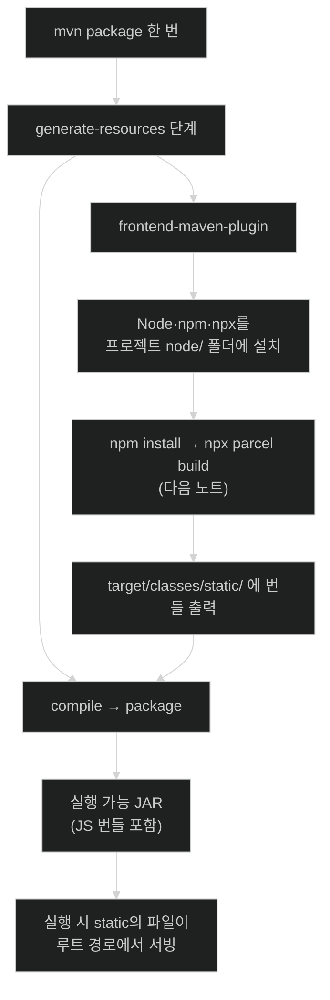

# Spring Boot 앱에 Node.js 끌어들이기 — frontend-maven-plugin과 static 폴더

## 한눈에 보기

| 질문 | 핵심 답 |
|---|---|
| 왜 Node.js가 필요한가 | 최신 JavaScript 도구가 전부 그 위에서 돌기 때문이다. |
| 두 빌드 세계를 어떻게 잇나 | `frontend-maven-plugin`이 Maven 생명주기 안에서 Node를 실행한다. |
| Node를 어디에 설치하나 | 개발자 PC가 아니라 **프로젝트 폴더 안**(`node/`)에 내려받는다. |
| 어느 단계에서 도나 | Maven의 `generate-resources` |
| 만든 JS를 Spring Boot가 어떻게 서빙하나 | `src/main/resources/static` 아래 파일은 **루트 경로에서 자동 서빙**된다. |
| `node/`·`node_modules/`는? | 중간 산출물이다. `.gitignore`에 넣는다. |

## 1. 왜 이게 필요한가

### 출발 장면: 두 개의 빌드 세계

[[05-creating-json-based-apis]]에서 `/api/videos`를 만들었다. 이제 그 API를 브라우저 안의 JavaScript가 호출해 화면을 갱신하게 하려 한다. 그런데 그 JavaScript를 "제대로" 쓰려면 모듈 시스템, 패키지 관리자, 번들러가 필요하고, 이것들은 전부 Java 세계 밖에 있다.

책의 표현대로 "JavaScript는 도구와 앱 빌드에 관한 한 완전히 다른 차원에 있으며, 사실상 모든 웹 브라우저에서 발견되는 사실상의 표준 도구가 되었다." 그렇다면 **"Java와 JavaScript 개발자 도구 사이의 이 광대한 간극을 어떻게 건너는가?"**

### 여기서 뭐가 무너지나

가장 단순한 방법은 각자 알아서 하는 것이다. 개발자가 자기 PC에 Node.js를 설치하고, 터미널에서 `npm install && npm run build`를 돌린 뒤, 결과 파일을 프로젝트에 복사한다.

네 가지가 무너진다.

1. **개발자마다 Node 버전이 다르다.** 한 사람은 Node 20, 다른 사람은 Node 24다. 어떤 패키지는 이 차이에서 다르게 동작한다.
2. **CI 서버에는 Node가 아예 없다.** 빌드 이미지에 Node를 넣는 별도 작업이 생기고, 그 버전이 또 개발자 PC와 다르다.
3. **"복사"를 사람이 기억해야 한다.** JS를 고치고 빌드한 뒤 복사를 잊으면 옛 파일이 배포된다.
4. **빌드가 하나가 아니다.** `mvn package` 하나로 배포 가능한 산출물이 나오지 않으므로, 배포 문서에 "그전에 이걸 하세요"가 붙는다.

### 그래서 나온 생각

**JavaScript 빌드를 Java 빌드의 일부로 만든다.** 구체적으로 세 가지가 필요하다.

- **[[Node.js]]**(= 브라우저 밖에서 JavaScript를 실행하는 런타임)를 프로젝트가 스스로 확보한다.
- 그 Node를 Maven이 **적절한 시점에** 실행한다.
- 만들어진 결과 파일을 Spring Boot가 **자동으로 서빙하는 자리**에 놓는다.

첫 두 가지를 맡는 것이 **[[frontend-maven-plugin]]**(= Node·npm·npx를 프로젝트 안에 설치하고 Maven 생명주기의 정해진 단계에서 실행해 주는 플러그인)이고, 세 번째는 Spring Boot가 이미 갖고 있는 관례다.

비유하자면 이건 **원청 건설사가 전기 공사를 하청에 맡기되, 하청이 쓸 공구까지 현장에 직접 들여오는** 방식이다. 기사가 자기 집 공구를 가져오면 사람마다 공구가 달라지므로, 현장 공구를 지정해 두고 그것만 쓰게 한다.

→ 비유가 깨지는 지점: 건설 하청은 공정이 끝나면 공구를 챙겨 **철수한다.** 하지만 `frontend-maven-plugin`이 내려받은 `node/` 폴더와 `node_modules/`는 프로젝트 폴더에 **그대로 남는다.** 수백 MB를 차지하고, 버전 관리에 실수로 커밋되기 쉬워서 `.gitignore` 관리가 별도로 필요해진다.

책도 이 절이 복잡하다는 것을 인정한다 — "혼란스럽게 들리기 시작한다면… 음, 실제로 그렇다. 적어도 그럴 수 있다. 그러니 한 번에 한 단계씩 가 보자."

## 2. 어떻게 동작하는가

### 2.1 Spring Boot 쪽 절반 — `static` 폴더

먼저 도착지를 정해 둔다. 책의 설명대로 "Spring Boot에는 해법이 있다 — `src/main/resources/static` 아래에 놓인 **어떤 파일이든 자동으로 감지되어 웹 애플리케이션의 루트 경로에서 서빙된다.**"

이것이 **[[정적-리소스]]**(= 서버가 가공 없이 그대로 내보내는 파일) 관례다. [[04-leveraging-templates-to-create-content]]의 `templates/`와 짝을 이루는 다른 절반이다.

| | `templates/` | `static/` |
|---|---|---|
| 거치는 것 | 컨트롤러 → 뷰 해석 → 템플릿 엔진 | 아무것도 안 거침 |
| URL | 컨트롤러가 정한 경로 | 파일 경로 그대로 |
| 예 | `index.mustache` → `GET /` | `static/index.js` → `GET /index.js` |

그러므로 할 일은 명확하다 — **Node 번들링 도구의 출력 디렉터리를 이 자리로 맞춘다.** 실제 설정은 [[07-bundling-javascript-with-nodejs]]에서 한다.

> **공식 문서 기준 보강**: 책은 "루트 경로에서 서빙된다"까지만 말하지만, 이 동작도 **[[구성-프로퍼티]]**(= 외부 파일의 키-값으로 동작을 조정하는 설정)로 조정 가능하다. `spring.mvc.static-path-pattern`으로 서빙 경로 패턴을 `/resources/**` 같은 것으로 바꿀 수 있고, `spring.web.resources.chain.strategy.content.enabled=true`로 정적 파일 URL에 내용 해시를 붙이는 캐시 무효화를 켤 수 있다. Chapter 1의 "기본값이 있고 명시하면 물러난다" 원리가 여기도 그대로 적용된다.

### 2.2 Maven 쪽 절반 — 플러그인 한 덩어리

`pom.xml`의 `<plugins>` 안, `spring-boot-maven-plugin` 바로 아래에 더한다.

```xml
<plugin>
    <groupId>com.github.eirslett</groupId>
    <artifactId>frontend-maven-plugin</artifactId>
    <version>2.0.0</version>
    <executions>
        <execution>
            <goals>
                <goal>install-node-and-npm</goal>
            </goals>
        </execution>
    </executions>
    <configuration>
        <nodeVersion>v24.10.0</nodeVersion>
    </configuration>
</plugin>
```

책의 항목별 설명이다.

- 집필 시점 기준 최신 `frontend-maven-plugin`의 좌표를 넣었다. — 이 플러그인은 Spring Boot BOM이 관리하는 아티팩트가 아니라 서드파티이므로 **`<version>`을 직접 써야 한다.** [[03-augmenting-an-existing-project-with-initializr]]에서 Boot 스타터에는 버전을 안 썼던 것과 대비된다.
- 지금은 execution이 하나뿐이며 `install-node-and-npm`이다. 이 명령이 Node.js와 그 패키지 관리자 **[[npm]]**(= Node.js의 패키지 관리자)을 내려받는다. — 개발자 PC의 설치 상태에 빌드가 좌우되지 않게 하기 위해서다.
- 아래쪽 `configuration` 절이 Node.js의 최신 LTS 버전을 지정한다. — 버전을 코드로 고정해야 모든 환경에서 같은 결과가 나오기 때문이다.

### 2.3 어느 시점에 도는가

이 플러그인은 Maven의 `generate-resources` 단계에서 일한다. **[[Maven-생명주기]]**(= Maven이 정해진 순서로 지나가는 빌드 단계들의 열)에서 이 단계가 어디쯤인지가 중요하다.

```text
validate → generate-sources → process-sources
        → generate-resources ← 여기서 Node 설치·JS 빌드가 돈다
        → process-resources → compile → test → package
```

`compile`과 `package`보다 **앞**이라는 점이 핵심이다. 그래야 만들어진 JS 번들이 최종 JAR에 함께 담긴다. 순서가 반대였다면 번들이 JAR 밖에 남아 배포되지 않는다.

바로 확인할 수 있다.

```bash
./mvnw generate-resources
```

콘솔에 이런 출력이 찍힌다.

```text
[INFO] --- frontend:2.0.0:install-node-and-npm (default) @ ch2 ---
[INFO] Installing node version v24.10.0
[INFO] Downloading https://nodejs.org/dist/v24.10.0/node-v24.10.0-darwin-arm64.tar.gz to ~/.m2/repository/com/github/eirslett/node/24.10.0/...
[INFO] No proxies configured
[INFO] No proxy was configured, downloading directly
[INFO] Unpacking ~/.m2/repository/.../node-24.10.0-darwin-arm64.tar.gz into <프로젝트>/node/tmp
[INFO] Copying node binary from <프로젝트>/node/tmp/node-v24.10.0-darwin-arm64/bin/node to <프로젝트>/node/node
[INFO] Extracting NPM
[INFO] Installed node locally.
```

로그를 세 구간으로 읽으면 무슨 일이 벌어지는지 그대로 보인다.

| 로그 구간 | 하는 일 | 왜 필요한가 |
|---|---|---|
| `Downloading … to ~/.m2/repository/…` | Node 배포판을 Maven 로컬 저장소에 받는다 | 다른 프로젝트에서도 같은 파일을 재사용하기 위해 |
| `Unpacking … into <프로젝트>/node/tmp` | 프로젝트 폴더 안에 푼다 | 이 프로젝트 전용 Node를 확보하기 위해 |
| `Copying node binary … Extracting NPM` | `node/node`와 npm을 제자리에 놓는다 | 이후 실행이 `node/npm` 경로로 일정하게 되기 위해 |

다운로드 URL에 `darwin-arm64`가 들어 있는 점도 눈여겨볼 만하다 — 플러그인이 **현재 OS·CPU에 맞는 배포판**을 고른다. 그래서 macOS·Linux·Windows에서 같은 `pom.xml`이 각자 맞는 Node를 가져온다.

### 2.4 프로젝트에 남는 것

> **Note (책 p.50)**: `frontend-maven-plugin`은 실제로 Node.js, npm, 그리고 **[[npx]]**(= 설치된 Node 패키지의 실행 파일을 찾아 실행해 주는 도구, node package execute)를 프로젝트 루트 디렉터리의 `node` 폴더 아래에 내려받아 압축을 푼다.

> **Tip (책 p.50)**: Node.js와 그 모든 도구·모듈은 **중간 빌드 산출물**로 볼 수 있다. 버전 관리에 커밋할 필요가 없다. `node` 폴더와 중간 `node_modules` 폴더를 커밋하지 않을 항목 목록에 넣어 둔다 — 예를 들어 프로젝트의 `.gitignore`에 `node`와 `node_modules`를 추가한다.

이 Tip을 가볍게 지나치면 안 되는 이유가 있다. `node_modules`는 의존성 수에 따라 **수만 개의 파일과 수백 MB**가 되는 것이 보통이다. 실수로 커밋하면 저장소가 급격히 무거워지고, 이미 커밋된 것을 되돌리는 일은 이력 재작성을 요구한다.

판단 기준은 단순하다 — **"이 파일이 빌드로 다시 만들어지는가?"** 그렇다면 산출물이지 소스가 아니다. `node/`와 `node_modules/`는 둘 다 그렇다. 반면 다음 노트에서 만들 `package.json`은 **어떤 의존성을 쓸지 사람이 결정한 기록**이므로 반드시 커밋한다.

## 3. 그림으로 보기

### 두 빌드가 한 빌드가 되는 구조



명령 하나(`mvn package`)에서 시작해 JAR 하나로 끝나는 것이 이 구조의 목표다. 중간에 사람이 손으로 하는 단계가 없다.

### 커밋할 것과 안 할 것

```text
프로젝트 루트
├── pom.xml                      ✅ 커밋  ─ 어떤 도구를 어느 버전으로 쓸지의 결정
├── package.json                 ✅ 커밋  ─ 어떤 JS 의존성을 쓸지의 결정
├── src/main/javascript/*.js     ✅ 커밋  ─ 사람이 쓴 소스
├── src/main/resources/          ✅ 커밋  ─ 템플릿·설정
│
├── node/                        ❌ 무시  ─ 플러그인이 내려받은 런타임
├── node_modules/                ❌ 무시  ─ npm이 내려받은 패키지 (수만 개 파일)
└── target/                      ❌ 무시  ─ 빌드 산출물 (번들 포함)

   ▶ 판단 기준: "빌드로 다시 만들어지는가?"
     그렇다 → 산출물, 무시한다.  아니다 → 사람의 결정, 커밋한다.
```

## 4. 이 노트에 나온 용어

| 용어 | 한 줄 풀이 | 자세히 |
|---|---|---|
| Node.js | 브라우저 밖에서 JavaScript를 실행하는 런타임 | [[_glossary#Node.js]] |
| npm | Node.js의 패키지 관리자 | [[_glossary#npm]] |
| npx | 설치된 Node 패키지의 실행 파일을 찾아 실행하는 도구 | [[_glossary#npx]] |
| frontend-maven-plugin | Node 도구를 프로젝트에 설치하고 Maven 단계에서 실행하는 플러그인 | [[_glossary#frontend-maven-plugin]] |
| Maven 생명주기 | Maven이 정해진 순서로 지나가는 빌드 단계들의 열 | [[_glossary#Maven-생명주기]] |
| 정적 리소스 | 서버가 가공 없이 그대로 내보내는 파일 | [[_glossary#정적-리소스]] |
| 구성 프로퍼티 | 외부 파일의 키-값으로 동작을 조정하는 설정 | [[_glossary#구성-프로퍼티]] |

## 5. 자주 헷갈리는 것

### `static/`과 `templates/`

이름이 비슷하지만 **거치는 경로가 완전히 다르다.** `static/`은 컨트롤러도 뷰 해석도 거치지 않고 URL로 직접 나간다. 이 노트에서 만든 JS 번들이 `static/`으로 가는 이유는, 그 파일에 서버 데이터를 끼워 넣을 일이 없기 때문이다.

### 전역 Node vs 프로젝트 로컬 Node

`node/npm install`처럼 경로를 앞에 붙여 쓰는 이유가 여기 있다. 시스템에 설치된 `npm`이 아니라 **플러그인이 프로젝트 안에 내려받은 것**을 쓴다는 뜻이다. 경로를 빼고 그냥 `npm`이라고 치면 시스템 것이 실행되어 버전이 어긋날 수 있다.

### npm vs npx

`npm`은 **가져오는** 도구, `npx`는 **돌리는** 도구다. 이 구분이 다음 노트의 execution 두 개(`npm install` / `npx parcel build`)로 그대로 이어진다.

### 플러그인 버전 vs 스타터 버전

`frontend-maven-plugin`에는 `<version>`을 썼고 Boot 스타터에는 안 썼다. Boot BOM이 관리하는 아티팩트인지가 갈림점이다. **관리 대상이면 버전을 쓰지 않고, 아니면 반드시 쓴다.**

## 6. 언제 안 쓰나 / 경계

- 프로젝트에 JavaScript 빌드가 필요 없다면 이 플러그인은 순수한 비용이다. 빌드 시간이 늘고 디스크를 먹는다.
- 첫 빌드에는 **네트워크가 필요하다.** Node 배포판과 npm 패키지를 내려받기 때문이다. 폐쇄망 CI에서는 사내 미러나 사전 캐시가 필요하다.
- 플러그인은 서드파티다. Spring Boot의 버전 정렬 대상이 아니므로 업그레이드와 호환성은 우리 책임이다.
- 프런트엔드가 커지면 Java 빌드에 얹는 방식 자체가 병목이 될 수 있다. 그때는 프런트엔드를 별도 저장소·별도 배포로 분리하는 편이 낫다. 이 절의 접근은 **하나의 배포 단위로 유지하고 싶을 때** 유효하다.
- `.gitignore` 설정을 빠뜨리면 첫 커밋에서 수만 개 파일이 올라간다. 되돌리기가 매우 번거로우므로 플러그인을 넣는 커밋과 `.gitignore`를 고치는 커밋을 함께 다뤄야 한다.

## 7. 연결

- [[05-creating-json-based-apis]] — 이 노드 도구 체인으로 만들 JavaScript가 소비할 대상이 그 절의 `/api/videos`다.
- [[07-bundling-javascript-with-nodejs]] — 여기서 설치한 npm·npx로 실제 번들러를 설정하고 출력 경로를 `static`에 맞춘다.
- [[07a-creating-a-reactjs-app]] — 그 번들 안에 들어갈 실제 애플리케이션 코드를 쓴다.

## 8. 스스로 확인

1. 개발자가 각자 Node를 설치해 빌드하는 방식이 무너지는 네 지점은 무엇인가?
2. `frontend-maven-plugin`이 Node를 **프로젝트 안에** 설치하는 이유는?
3. 이 플러그인이 `generate-resources`에서 도는 것이 왜 중요한가? `package` 뒤였다면 무엇이 깨지는가?
4. 콘솔 로그의 세 구간(다운로드 / 압축 해제 / 복사)이 각각 무엇을 위한 단계인가?
5. `node/`와 `node_modules/`를 커밋하면 안 되는 이유와, `package.json`은 커밋해야 하는 이유의 공통 판단 기준은?
6. `static/`과 `templates/`에 파일을 두는 기준을 한 문장으로 말할 수 있는가?
7. `frontend-maven-plugin`에는 버전을 쓰고 Boot 스타터에는 안 쓰는 이유는?
8. 이 방식이 적합하지 **않은** 상황을 하나 들 수 있는가?

> 여덟 문항을 스스로 답한 **뒤에** [[_06-integrating-nodejs-with-a-spring-boot-web-app]]에서 모범답안과 대조한다. 먼저 열면 이 문항들은 다시 인출 문제로 쓸 수 없다.

<!-- ==== 아래는 내 영역 · 스킬 수정 금지 ==== -->

## 내 설명 시도


## 막혔던 지점


## 리뷰 이력
