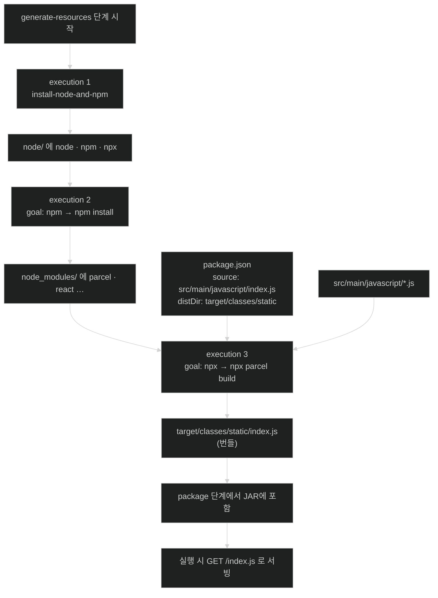

# JavaScript 번들 만들기 — Parcel과 두 개의 execution

## 한눈에 보기

| 질문 | 핵심 답 |
|---|---|
| 지금 상태 | 도구는 있는데 모듈이 없다. |
| 고른 번들러 | Parcel — 설정을 거의 요구하지 않는 것을 목표로 만든 도구 |
| `--save-dev`의 뜻 | 빌드에만 쓰고 **배포물에는 안 들어가는** 의존성 |
| Parcel에 알려 줄 두 가지 | 시작 파일(`source`)과 출력 폴더(`distDir`) |
| 출력 경로가 `target/classes/static`인 이유 | 그 폴더가 **런타임의 클래스패스 루트**이고, `mvn clean`에 함께 지워진다 |
| execution이 두 개인 이유 | `npm`은 **가져오고**, `npx`는 **돌린다** |

## 1. 왜 이게 필요한가

### 출발 장면: 파일 세 개를 브라우저에 어떻게 넣나

[[06-integrating-nodejs-with-a-spring-boot-web-app]]에서 Node·npm·npx를 프로젝트 안에 확보했다. 책의 표현대로 "이 시점에 우리에게는 도구는 있지만 실제 모듈은 없다."

곧 만들 JavaScript는 파일 하나가 아니다 — [[07a-creating-a-reactjs-app]]에서 `index.js`, `App.js`, `ListOfVideos.js`, `NewVideo.js` 네 개를 쓰고, 거기에 `react`와 `react-dom` 패키지가 더해진다.

### 여기서 뭐가 무너지나

순진한 해법은 이 파일들을 그대로 `static/`에 두고 HTML에서 하나씩 불러오는 것이다.

```html
<script src="/react.js"></script>
<script src="/react-dom.js"></script>
<script src="/ListOfVideos.js"></script>
<script src="/NewVideo.js"></script>
<script src="/App.js"></script>
<script src="/index.js"></script>
```

네 가지가 무너진다.

1. **순서를 사람이 관리해야 한다.** `App.js`가 `ListOfVideos.js`보다 먼저 로드되면 깨진다. 파일이 늘수록 이 목록의 순서가 지뢰밭이 된다.
2. **`import`/`export`가 그대로는 안 돈다.** `react` 같은 패키지 이름을 브라우저가 해석하지 못한다 (`import React from "react"`의 `"react"`는 URL이 아니다).
3. **JSX는 브라우저가 이해하지 못한다.** [[07a-creating-a-reactjs-app]]에서 쓸 `<App />` 같은 문법은 JavaScript가 아니다. 누군가 변환해야 한다.
4. **요청이 파일 수만큼 늘어난다.** 의존성까지 합치면 수십·수백 개가 된다.

### 그래서 나온 생각

여러 모듈과 그 의존성을 브라우저가 한 번에 읽을 수 있는 소수의 파일로 **합치고 변환하는** 도구가 필요하다. 그것이 **[[번들러]]**(= 여러 JavaScript 모듈과 의존성을 브라우저용 소수 파일로 합치고 변환하는 도구)이고, 결과물이 **[[번들]]**(= 번들러가 만들어 낸 최종 산출물 파일)이다.

책은 "고를 것이 많지만" 하고 **[[Parcel]]**(= 설정을 거의 요구하지 않는 것을 목표로 만든 JavaScript 번들러)을 고른다. 이름은 "소포"라는 뜻으로, 흩어진 것을 하나로 싸서 보낸다는 역할을 그대로 담았다.

비유하자면 번들링은 **이삿짐 포장**이다. 방마다 흩어진 물건을 상자 몇 개로 묶어 트럭에 싣는다. 트럭(브라우저)은 상자 단위로만 받으면 된다.

→ 비유가 깨지는 지점: 이삿짐은 도착해서 **다시 풀어 원래 방 구조로 되돌린다.** 하지만 번들은 되돌아가지 않는다 — 모듈 경계와 원래 파일 이름이 사라진 채로 실행된다. 그래서 브라우저에서 오류가 나면 스택 트레이스가 번들 파일의 낯선 줄 번호를 가리키고, 원본 위치를 보려면 source map이라는 별도 장치가 필요해진다. 포장의 대가다.

## 2. 어떻게 동작하는가

### 2.1 번들러 설치와 `package.json`의 탄생

```bash
node/npm install --save-dev parcel
```

경로에 `node/`가 붙은 것이 [[06-integrating-nodejs-with-a-spring-boot-web-app]]에서 설치한 **프로젝트 로컬** npm을 쓴다는 뜻이다. 시스템에 깔린 npm이 아니다.

책의 설명 — "이것은 로컬에 설치된 Node.js 사본과 그 `npm` 명령을 사용해 `package.json` 파일을 만든다. `--save-dev` 옵션은 이것이 **[[개발-의존성]]**(= 빌드·테스트에만 필요하고 배포물에는 들어가지 않는 의존성)이며 우리 앱이 사용하는 패키지가 아님을 알린다."

이 구분이 왜 중요한가? **번들러는 번들을 만드는 도구이지 번들 안에 들어가는 코드가 아니기 때문**이다. 사용자의 브라우저는 Parcel을 실행하지 않는다. Maven의 `provided` scope나 `test` scope와 같은 발상이다.

### 2.2 `npm install`을 빌드에 고정한다

`package.json`이 생겼으니 이제 이것을 **[[frontend-maven-plugin]]**(= Node 도구를 프로젝트에 설치하고 Maven 단계에서 실행하는 플러그인)에 연결한다. `<execution>`을 하나 더 넣는다.

```xml
<execution>
    <id>npm install</id>
    <goals>
            <goal>npm</goal>
    </goals>
</execution>
```

이 조각이 하는 일은 **[[npm]]**(= Node.js의 패키지 관리자) `install`을 빌드의 일부로 실행하는 것이다. 사람이 터미널에서 치던 명령을 빌드 파일에 박아 두면, 새로 클론한 사람도 `mvn package` 한 번으로 같은 상태에 도달한다.

> **책의 표현 정리**: 책은 이 execution을 "우리 JavaScript 번들을 빌드할 명령인 `npm install`을 실행하도록 구성한다"고 적는다. 엄밀히 말하면 `npm install`은 **의존성을 내려받아 `node_modules/`를 채우는** 단계이고, 실제 번들을 만드는 것은 §2.4의 `npx parcel build`다. 두 단계가 하나의 목표를 향해 붙어 있어 뭉뚱그려진 표현으로 읽는 편이 정확하다.

### 2.3 Parcel에게 시작점과 도착점 알려 주기

`npm`이 방금 만든 `package.json`을 열어 두 항목을 더한다.

```json
{
    "source": "src/main/javascript/index.js",
    "targets": {
        "default": {
             "distDir": "target/classes/static"
         }
    }
}
```

책의 설명이다.

- `source` — 아직 쓰지 않은 `index.js` JavaScript 파일을 가리킨다. 이것이 우리 JavaScript 앱의 **[[엔트리-포인트]]**(= 번들러가 의존성 그래프를 따라가기 시작하는 첫 파일)가 된다. Parcel 입장에서는 이 파일이 어디 있든 상관없다. 우리는 Maven 기반 프로젝트를 쓰고 있으니 `src/main/javascript`를 쓸 수 있다.
- `targets` — 기본 target에 `distDir`을 `target/classes/static`으로 설정한다. Parcel은 브라우저별로 여러 target을 만드는 것도 지원하지만 우리에겐 필요 없다. 단일 기본 목적지면 충분하다. **결과를 `target` 폴더에 넣어 두면, Maven clean 사이클을 돌릴 때마다 이 컴파일된 번들도 함께 지워진다.**

`source`가 하나뿐인 이유는 번들러의 동작 방식 때문이다. 엔트리 포인트에서 `import`를 따라가며 도달 가능한 모듈을 전부 모으므로, **시작점 하나만 알려 주면 나머지는 자동으로 발견된다.** 반대로 말하면 어디서도 import되지 않는 파일은 번들에 들어가지 않는다.

**출력 경로가 `src/main/resources/static`이 아니라 `target/classes/static`인 이유**는 책이 "clean에 함께 지워진다"까지만 말하고 넘어가지만, 더 중요한 이유가 하나 더 있다.

```text
Maven 빌드 중 process-resources 단계:

  src/main/resources/**  ──복사──▶  target/classes/**

즉 런타임에 클래스패스 루트로 쓰이는 것은 target/classes/ 다.
  src/main/resources/static/logo.png  →  target/classes/static/logo.png  → GET /logo.png
  (Parcel이 직접)                        target/classes/static/index.js   → GET /index.js

▶ 둘은 최종적으로 같은 자리에 도착한다. 다만 하나는 "복사되어" 오고 하나는 "생성되어" 온다.
▶ 생성물을 src/ 아래에 두면 소스와 산출물이 섞이고 .gitignore가 지저분해진다.
  target/ 아래에 바로 만들면 그 문제가 애초에 없다.
```

이것이 [[06-integrating-nodejs-with-a-spring-boot-web-app]]에서 본 "`static` 아래 파일은 루트에서 자동 서빙된다"는 관례와 이 설정이 어긋나 보이는데도 실제로는 맞아떨어지는 이유다.

### 2.4 npm과 npx — 가져오기와 돌리기

책의 구분은 명확하다. "`npm`이 패키지를 내려받고 설치하는 Node.js의 도구라면, **[[npx]]**(= 설치된 Node 패키지의 실행 파일을 찾아 실행해 주는 도구)는 명령을 실행하는 Node.js의 도구다."

그래서 execution을 하나 더 넣어 Parcel의 빌드 명령을 실행시킨다.

```xml
<execution>
    <id>npx run</id>
    <goals>
        <goal>npx</goal>
    </goals>
    <phase>generate-resources</phase>
    <configuration>
        <arguments>parcel build</arguments>
    </configuration>
</execution>
```

책의 정리 — "이 추가 단계가 `npm install` 명령 다음에 `npx parcel build`를 실행해, Parcel이 빌드 단계를 수행하도록 보장한다."

**"다음에"가 보장되는 근거**는 명시되어 있지 않지만 Maven의 규칙에서 나온다. 같은 **[[Maven-생명주기]]**(= Maven이 정해진 순서로 지나가는 빌드 단계들의 열) 단계에 묶인 execution들은 **`pom.xml`에 선언된 순서대로** 실행된다. 그래서 세 execution의 순서가 그대로 실행 순서가 된다.

| 순서 | execution id | goal | 하는 일 | 이 단계가 필요한 이유 |
|---:|---|---|---|---|
| 1 | (기본) | `install-node-and-npm` | Node·npm·npx를 `node/`에 설치 | 뒤의 두 단계를 실행할 도구가 있어야 하므로 |
| 2 | `npm install` | `npm` | `package.json`의 의존성을 `node_modules/`에 설치 | Parcel과 그 플러그인이 있어야 빌드가 가능하므로 |
| 3 | `npx run` | `npx` | `parcel build` 실행 | 실제 **[[번들]]** 생성. 앞 두 단계의 결과물을 소비한다 |

세 execution이 모두 `generate-resources`에서 돈다는 것도 중요하다. `compile`과 `package`보다 앞이므로, 만들어진 번들이 최종 JAR 안에 들어간다.

### 2.5 결과물이 무엇이 되는가

Parcel이 `index.js`에서 시작해 `import` 그래프를 따라간 결과물은 **[[ES6-모듈]]**(= `import`/`export`로 의존 관계를 선언하는 JavaScript 표준 모듈 형식) 형태로 나온다. [[07a-creating-a-reactjs-app]]에서 이 번들을 HTML에서 불러올 때 `<script type="module">`을 쓰는 이유가 이것이다.

그리고 이 파일이 놓이는 자리가 **[[정적-리소스]]**(= 서버가 가공 없이 그대로 내보내는 파일) 폴더이므로, 컨트롤러를 한 줄도 쓰지 않고 `GET /index.js`로 접근된다.

책은 이 절을 "이제 정교한 프런트엔드를 만들 Node 패키지들을 설치하기 시작할 수 있다"로 닫는다.

## 3. 그림으로 보기

### 세 execution이 만드는 파이프라인



### npm과 npx가 갈리는 지점

| | `npm` | `npx` |
|---|---|---|
| 한 줄 역할 | 가져온다 | 돌린다 |
| 이 프로젝트에서 | `npm install` — `node_modules/` 채우기 | `npx parcel build` — 번들 생성 |
| 대응하는 Maven 개념 | 의존성 해석 (`dependency:resolve`) | 플러그인 goal 실행 |
| 없으면 | 실행할 패키지가 없다 | 설치는 됐는데 아무 일도 안 일어난다 |
| 이름의 유래 | node package manager | node package **execute** |

### 두 개의 `static`이 같은 곳인 이유

```text
        [소스 트리]                          [빌드 산출 트리 = 런타임 클래스패스]

  src/main/resources/                        target/classes/
    ├── templates/index.mustache  ──복사──▶    ├── templates/index.mustache
    ├── static/logo.png           ──복사──▶    ├── static/logo.png
    └── application.properties    ──복사──▶    ├── application.properties
                                               │
  src/main/javascript/                         │
    ├── index.js  ──┐                          │
    ├── App.js    ──┤ Parcel이 번들링 ──생성──▶ └── static/index.js
    └── ...       ──┘

  ▶ Spring Boot가 실행 시 보는 것은 오른쪽뿐이다.
  ▶ 그래서 "src/main/resources/static에 두면 서빙된다"와
    "Parcel 출력은 target/classes/static"이 모순이 아니다.
  ▶ mvn clean → target/ 전체가 사라진다 → 오래된 번들이 남을 일이 없다.
```

## 4. 이 노트에 나온 용어

| 용어 | 한 줄 풀이 | 자세히 |
|---|---|---|
| 번들러 | 여러 모듈을 브라우저용 소수 파일로 합치고 변환하는 도구 | [[_glossary#번들러]] |
| 번들 | 번들러가 만든 최종 산출물 파일 | [[_glossary#번들]] |
| Parcel | 설정을 거의 요구하지 않는 것을 목표로 한 번들러 | [[_glossary#Parcel]] |
| npm | Node.js의 패키지 관리자 | [[_glossary#npm]] |
| npx | 설치된 패키지의 실행 파일을 찾아 실행하는 도구 | [[_glossary#npx]] |
| 개발 의존성 | 빌드·테스트에만 필요하고 배포물에는 안 들어가는 의존성 | [[_glossary#개발-의존성]] |
| 엔트리 포인트 | 번들러가 의존성 그래프를 따라가기 시작하는 첫 파일 | [[_glossary#엔트리-포인트]] |
| ES6 모듈 | `import`/`export`로 의존 관계를 선언하는 표준 모듈 형식 | [[_glossary#ES6-모듈]] |
| 정적 리소스 | 서버가 가공 없이 그대로 내보내는 파일 | [[_glossary#정적-리소스]] |
| Maven 생명주기 | Maven이 정해진 순서로 지나가는 빌드 단계들의 열 | [[_glossary#Maven-생명주기]] |
| frontend-maven-plugin | Node 도구를 설치하고 Maven 단계에서 실행하는 플러그인 | [[_glossary#frontend-maven-plugin]] |

## 5. 자주 헷갈리는 것

### `npm install`과 "번들 빌드"

책의 문장이 둘을 붙여 놓았지만 다른 일이다. `npm install`은 **의존성을 채우고**, `npx parcel build`가 **번들을 만든다.** 번들이 안 나오면 두 번째 execution을 먼저 의심해야 한다.

### `--save-dev`와 `--save`

`--save-dev`는 빌드에만 쓰는 것(Parcel), `--save`는 앱 코드가 실제로 쓰는 것(React)이다. [[07a-creating-a-reactjs-app]]에서 `react`를 설치할 때 옵션이 달라지는 이유다. 판별 질문 — "사용자의 브라우저에서 이 코드가 실행되는가?"

### `src/main/resources/static`과 `target/classes/static`

같은 최종 위치를 소스 쪽과 산출물 쪽에서 부른 두 이름이다. **손으로 두는 파일은 앞쪽에, 빌드가 만드는 파일은 뒤쪽에** 둔다.

### 번들러 vs 컴파일러

Parcel은 합치기(bundling)와 변환(transform)을 둘 다 한다. JSX를 일반 JavaScript로 바꾸는 것은 변환 쪽 일이고, 파일들을 하나로 묶는 것이 번들링 쪽 일이다. "번들러"라는 이름이 실제 역할의 절반만 담고 있는 셈이다.

## 6. 언제 안 쓰나 / 경계

- Parcel의 "설정이 거의 필요 없다"는 관례에 기댄다는 뜻이다. 관례를 벗어나는 요구(특정 브라우저 타깃, 복잡한 코드 분할)가 생기면 결국 설정이 늘고, 그때는 다른 번들러가 나을 수 있다.
- 번들은 원본 파일 구조를 잃는다. 프로덕션 디버깅을 하려면 source map 생성과 배포 정책을 따로 정해야 한다.
- 세 execution이 모두 `generate-resources`에서 돌므로 **매 빌드마다 JS 빌드가 함께 돈다.** 프런트엔드가 커지면 Java만 고쳤는데도 빌드가 느려진다. 프로파일로 분리하는 것이 흔한 대응이다.
- `package.json`의 `distDir`이 Maven의 출력 디렉터리 이름(`target`)에 의존한다. 빌드 디렉터리를 바꾸면 이 설정도 함께 고쳐야 하며, 그 연결은 어디에도 자동으로 검사되지 않는다.

## 7. 연결

- [[06-integrating-nodejs-with-a-spring-boot-web-app]] — 여기서 쓰는 `node/npm`과 `npx`가 그 노트에서 설치된다. 출력 경로의 근거인 `static` 관례도 그쪽에 있다.
- [[07a-creating-a-reactjs-app]] — `source`가 가리키는 `index.js`와 그것이 import할 모듈들을 실제로 작성한다.
- [[05-creating-json-based-apis]] — 이 번들 안의 코드가 최종적으로 호출할 대상이 그 절의 `/api/videos`다.

## 8. 스스로 확인

1. JS 파일들을 `<script>` 태그로 하나씩 부르는 방식이 무너지는 네 지점은 무엇인가?
2. Parcel을 `--save-dev`로 설치하는 이유를 "브라우저에서 실행되는가"로 설명할 수 있는가?
3. `source`를 하나만 지정해도 되는 이유는 번들러의 어떤 동작 때문인가?
4. 출력 경로가 `target/classes/static`인 두 가지 이유를 말할 수 있는가?
5. "`src/main/resources/static`에 두면 서빙된다"와 "Parcel은 `target/classes/static`에 쓴다"가 모순이 아닌 이유는?
6. execution 세 개의 실행 순서를 무엇이 보장하는가?
7. `npm`과 `npx`의 역할 차이를 Maven 개념에 대응시켜 설명할 수 있는가?
8. 번들이 안 만들어졌을 때 어느 execution부터 의심해야 하는가?

> 여덟 문항을 스스로 답한 **뒤에** [[_07-bundling-javascript-with-nodejs]]에서 모범답안과 대조한다. 먼저 열면 이 문항들은 다시 인출 문제로 쓸 수 없다.

<!-- ==== 아래는 내 영역 · 스킬 수정 금지 ==== -->

## 내 설명 시도


## 막혔던 지점


## 리뷰 이력
