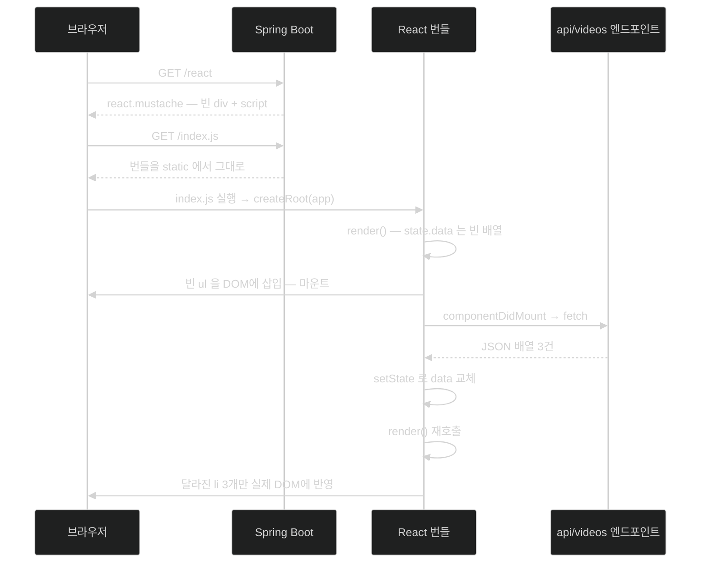

# React 앱 만들기 — 상태가 화면을 끌고 가는 구조

## 한눈에 보기

| 질문 | 핵심 답 |
|---|---|
| React의 기본 발상 | 화면을 직접 고치지 않는다. **상태를 바꾸면 화면이 따라온다.** |
| 진입점 | `index.js`가 `id="app"` 요소를 찾아 `<App/>`을 그 자리에 그린다. |
| state와 props의 차이 | state는 **안에서 바뀌는 값**, props는 **밖에서 받는, 안 바꾸는 값**. |
| 서버 데이터는 언제 가져오나 | `componentDidMount()` — 컴포넌트가 DOM에 붙은 직후 |
| 서버 쪽에 필요한 것 | 템플릿 한 장(`react.mustache`)과 컨트롤러 메서드 한 개 |
| 이 절의 진짜 목표 | React 학습이 아니라 **JavaScript 빌드를 Spring Boot에 합치는 법** |
| 책의 표기 주의 | 책이 "shadow DOM"이라 부른 것은 정확히는 **virtual DOM**이다. |

## 1. 왜 이게 필요한가

### 출발 장면: 항목 하나 추가하는데 화면 전체가 다시 그려진다

[[04d-changing-the-data-through-html-forms]]의 폼은 잘 동작한다. 다만 Submit을 누를 때마다 이런 일이 벌어진다.

1. 브라우저가 `POST /new-video`를 보낸다.
2. 서버가 302를 돌려준다.
3. 브라우저가 `GET /`를 다시 보낸다.
4. 서버가 **HTML 문서 전체**를 다시 만들어 보낸다.
5. 브라우저가 페이지를 통째로 다시 그린다. 스크롤 위치가 초기화되고, 화면이 한 번 깜빡인다.

목록에 줄 하나가 늘었을 뿐인데 문서 전체가 왕복한다.

### 여기서 뭐가 무너지나

"그러면 JavaScript로 필요한 부분만 고치면 되지 않나?" 맞다. 순진한 방법은 이것이다.

```js
const response = await fetch("/api/videos");
const videos = await response.json();
const ul = document.querySelector("ul");
ul.innerHTML = "";                                  // 기존 항목 지우고
for (const v of videos) {                           // 새로 만들어 붙인다
    const li = document.createElement("li");
    li.textContent = v.name;
    ul.appendChild(li);
}
```

동작한다. 그리고 화면이 복잡해질수록 세 가지가 무너진다.

1. **"지금 화면이 어떤 상태인지"를 DOM에서 읽어야 한다.** 데이터의 진짜 출처가 자바스크립트 변수인지 화면의 `<li>`들인지 모호해진다.
2. **모든 변화마다 "무엇을 지우고 무엇을 더할지"를 손으로 쓴다.** 조건에 따라 나타났다 사라지는 요소가 몇 개만 겹쳐도 이 코드가 폭발한다.
3. **갱신 누락이 조용히 생긴다.** 데이터는 바꿨는데 화면 갱신 코드를 빠뜨리면 둘이 어긋난 채로 남는다.

### 그래서 나온 생각

화면을 **명령형으로 고치는** 대신, "이 상태일 때 화면은 이렇게 생겼다"를 **선언**해 두고 상태만 바꾼다. 나머지는 라이브러리가 계산한다. 이것이 **[[React]]**(= 화면을 컴포넌트 단위로 선언하고 상태가 바뀌면 다시 그리는 JavaScript UI 라이브러리)의 발상이며, 이름 자체가 "상태 변화에 **반응(react)**해 화면이 따라온다"를 뜻한다.

책은 이를 두 문장으로 요약한다 — "React는 **하향식(top-down)** 관점으로 동작한다. 최상위 컴포넌트를 렌더하면 그 컴포넌트가 다시 그 아래 중첩된 컴포넌트들을 렌더한다."

비유하자면 React는 **스프레드시트**다. `A1` 셀의 숫자를 바꾸면 그것을 참조하는 `B1`, `C1`이 자동으로 다시 계산된다. "수식을 다시 실행해라"라고 명령하지 않는다.

→ 비유가 깨지는 지점: 스프레드시트는 셀 값이 **어떻게 바뀌든** 의존 관계를 엔진이 추적한다. React는 그렇지 않다 — `setState()`를 **호출해야만** 다시 그린다. `this.state.data.push(newItem)`처럼 상태 객체를 직접 건드리면 값은 바뀌지만 화면은 그대로다. React가 "무엇이 바뀌었는지"를 감시하는 것이 아니라 "바뀌었다고 알려 준 시점"에만 일하기 때문이다. 초보자가 가장 자주 밟는 함정이다.

## 2. 어떻게 동작하는가

### 2.1 패키지 설치 — 이번엔 `--save`

```bash
node/npm install --save react react-dom
```

`package.json`에 `react`와 `react-dom` 모듈이 추가된다. [[07-bundling-javascript-with-nodejs]]에서 Parcel을 `--save-dev`로 설치했던 것과 옵션이 다르다는 점이 중요하다. **Parcel은 빌드 기계이고 React는 브라우저에서 실제로 실행되는 코드**이므로, React는 **[[번들]]**(= 번들러가 만든 최종 산출물 파일) 안에 들어가야 한다.

### 2.2 진입점 `index.js`

`src/main/javascript/index.js`를 만든다. [[07-bundling-javascript-with-nodejs]]의 `package.json`에서 `source`로 지정한 바로 그 **[[엔트리-포인트]]**(= 번들러가 의존성 그래프를 따라가기 시작하는 첫 파일)다.

```js
import React from "react";
import { createRoot } from "react-dom/client";
import { App } from "./App";

const container = document.getElementById("app");
if (container) {
     const root = createRoot(container);
     root.render(<App />);
}
```

책의 항목별 설명이다.

- 앞의 두 줄이 React와 React 애플리케이션을 시작할 때 쓰는 `createRoot` API를 import한다.
- 세 번째 줄이 UI의 루트를 나타내는 `App` 컴포넌트를 import한다.
- 네 번째 줄이 순수 JavaScript로 웹 페이지에서 `id="app"`인 요소를 찾는다. 이것이 React 애플리케이션의 **마운트 지점**이 된다.
- 마지막 줄들이 React root를 만들고 `<App/>` 컴포넌트를 그 요소 안에 렌더한다.

`import`가 **[[ES6-모듈]]**(= `import`/`export`로 의존 관계를 선언하는 표준 모듈 형식) 문법이라는 점을 짚어 둘 필요가 있다. 브라우저가 `"react"`라는 이름을 직접 해석하지는 못하므로, Parcel이 이 이름을 실제 파일로 바꿔 번들에 넣는다. [[07-bundling-javascript-with-nodejs]]에서 번들러가 필요했던 두 번째 이유가 바로 이것이었다.

`if (container)` 검사도 의미가 있다. 이 번들은 `static/`에 놓여 **어떤 페이지에서든 로드될 수 있으므로**, `id="app"`이 없는 페이지에서 실행되면 `createRoot(null)`이 오류를 낸다.

### 2.3 `App.js`와 JSX

```js
import React from 'react'
import ListOfVideos from './ListOfVideos'
import NewVideo from "./NewVideo"

export function App() {
     return (
          <div>
               <ListOfVideos/>
               <NewVideo/>
          </div>
     )
}
```

책의 설명 — React를 import해 컴포넌트를 만들고, 곧 작성할 로컬 JavaScript 조각들(비디오 목록 `ListOfVideos.js`와 새 비디오 생성 폼 `NewVideo.js`)을 가져온다. 그리고 공개로 export된 함수 `App()` 하나가 있다. **이 함수가 HTML 스타일 요소를 반환하기 때문에, Parcel에게 우리가 JSX를 다루고 있다는 신호가 된다.**

**[[JSX]]**(= JavaScript 코드 안에 HTML을 닮은 태그 문법을 직접 쓸 수 있게 한 확장 문법)는 브라우저가 이해하지 못한다. Parcel이 이것을 일반 함수 호출로 변환해 번들에 넣는다. [[07-bundling-javascript-with-nodejs]]에서 "번들러는 합치기와 변환을 둘 다 한다"고 한 그 변환이 여기서 일어난다.

> **Note (책 p.54)**: React는 JSX라는 개념을 도입해, 고유한 HTML 요소와 JavaScript 코드를 결합할 수 있게 했다. 예전에는 HTML과 JavaScript를 섞는 것이 나쁘다고 배웠다. 하지만 사실은, 함수들을 하나로 묶는 UI를 배치할 때 JSX는 훌륭한 조합을 제공한다. JavaScript를 HTML 위에 얹으려고 까다로운 함수를 쓰는 대신, React는 작은 HTML 조각들과 그 동작을 지원하는 함수들을 응집력 있게 결합해 쌓아 올리게 해 준다. 내부 상태 관리와 결합되면서 React는 웹 앱 제작에서 꽤 인기를 얻었다.

이 Note가 짚는 것은 **관심사 분리의 축이 바뀌었다**는 점이다. 예전 기준은 "기술별로 나눈다"(HTML / CSS / JS 파일)였고, React의 기준은 "**기능별로 나눈다**"(비디오 목록 컴포넌트 / 새 비디오 폼 컴포넌트)다. `ListOfVideos.js` 한 파일 안에 그 기능의 마크업과 로직이 함께 있는 것이 그래서 일관된 선택이다.

### 2.4 목록 컴포넌트 — 상태가 화면을 끌고 가는 루프

```js
import React from "react"

class ListOfVideos extends React.Component {
      constructor(props) {
           super(props)
           this.state = {data: []}
      }

      async componentDidMount() {
           let json = await fetch("/api/videos").json()
           this.setState({data: json})
      }

      render() {
           return (
                <ul>
                     {this.state.data.map(item =>
                          <li>{item.name}</li>)}
                </ul>
           )
      }
}
export default ListOfVideos
```

책의 항목별 설명이다.

- ES6 클래스로 `React.Component`를 확장한다.
- 생성자가 내부 상태를 유지할 `state` 필드를 만든다.
- `componentDidMount()`는 이 컴포넌트가 DOM에 삽입되어 렌더된 **직후** React가 호출하는 함수다. 순수 JavaScript의 `fetch()` 함수로 이 장 앞에서 만든 JSON API에서 데이터를 가져온다. 그 함수가 promise를 반환하므로 ES6의 `await`로 결과를 기다린 뒤 `React.Component`의 `setState()`로 내부 상태를 갱신한다. 이것이 제대로 동작하려면 메서드를 `async`로 표시해야 한다. 그리고 **`setState()`가 호출될 때마다 React가 컴포넌트를 다시 렌더한다**는 점을 이해하는 것이 중요하다.
- 알맹이는 `render()`에 있다. 실제로 HTML 요소(또는 다른 React 컴포넌트)를 배치하는 곳이다. 내부 상태를 사용해 데이터 배열을 `map`으로 순회하며 각 JSON 조각을 HTML 줄 항목으로 바꾼다. 요소가 없으면? 줄 항목도 없다.

여기서 벌어지는 일을 순서대로 풀면 React의 핵심 루프가 보인다.

1. 생성자가 **[[컴포넌트-상태]]**(= 컴포넌트가 자기 안에서 관리하며 바뀌는 값)를 `{data: []}`로 초기화한다. — 첫 렌더 때 참조할 값이 반드시 있어야 하기 때문이다. 없으면 `render()`가 `undefined.map`으로 터진다.
2. React가 `render()`를 부른다. `data`가 빈 배열이므로 **빈 `<ul>`**이 그려진다. — 데이터를 기다리는 동안에도 화면에 무언가는 있어야 하기 때문이다.
3. 그 결과가 실제 DOM에 삽입된다. 이 순간이 **[[마운트]]**(= 컴포넌트가 처음으로 실제 DOM에 삽입되어 화면에 등장하는 순간)다.
4. React가 `componentDidMount()`를 호출한다. — 화면에 붙기 **전에** 네트워크 요청을 걸면 응답이 와도 갱신할 대상이 없기 때문이다.
5. `fetch`가 반환한 **[[프로미스]]**(= 아직 끝나지 않은 비동기 작업의 미래 결과를 나타내는 객체)를 `await`로 기다려 JSON을 받는다. — 응답을 기다리는 동안 브라우저 화면이 멈추면 안 되기 때문이다.
6. `setState({data: json})`으로 상태를 교체한다. — **React에게 "바뀌었다"고 알리는 유일한 방법**이기 때문이다.
7. React가 `render()`를 다시 부르고, 이번엔 항목 세 개짜리 `<ul>`이 나온다. 달라진 부분만 실제 DOM에 반영된다.

2번과 7번이 **같은 `render()` 함수**라는 점이 이 설계의 핵심이다. "처음 그릴 때"와 "갱신할 때"의 코드가 나뉘지 않는다 — §1에서 지적한 "갱신 누락"이 구조적으로 사라진다.

> **책의 코드에 있는 오류**: `let json = await fetch("/api/videos").json()` 이 줄은 실제로는 동작하지 않는다. `fetch(...)`가 반환하는 것은 `Response`가 아니라 `Promise<Response>`이고, `Promise`에는 `.json()` 메서드가 없어 `TypeError: fetch(...).json is not a function`이 난다. `await`가 `.json()`보다 **나중에** 적용되기 때문이다. 올바른 형태는 응답을 먼저 기다리는 것이다.
>
> ```js
> const response = await fetch("/api/videos")
> const json = await response.json()
> ```
>
> 또는 `const json = await fetch("/api/videos").then(r => r.json())`. 책의 의도(응답 JSON을 받아 상태에 넣는다)는 그대로이고 문법만 어긋난 것이다.

### 2.5 state와 props — 이 둘을 가르는 기준

책은 목록 컴포넌트를 설명한 뒤 개념 정리를 한 문단 넣는다.

> **[[컴포넌트-속성]]**(= 부모가 자식 컴포넌트에 밖에서 넣어 주는 값)은 보통 React 컴포넌트에 **바깥에서 주입된** 정보로 구성된다. state는 **안에서 유지된다.** props로부터 state를 초기화하는 것도 가능하고, 이 코드처럼 컴포넌트 자신이 state에 담을 데이터를 가져올 수도 있다. 분명히 해 둘 점은, **props는 그것을 주입받은 React 컴포넌트 안에서는 불변으로 취급된다**는 것이다. state는 변화하도록 만들어졌고, 그 변화가 렌더되는 요소들을 이끈다.

| | state | props |
|---|---|---|
| 어디서 오나 | 컴포넌트 자신 | 부모 컴포넌트 |
| 안에서 바꿀 수 있나 | 예 — `setState()`로만 | **아니오** (불변으로 취급) |
| 바뀌면 | 재렌더가 일어난다 | 부모가 다시 렌더하면서 새 값이 내려온다 |
| Java에 대응시키면 | 인스턴스 필드 | 생성자 인자 |
| 이 절의 예 | `ListOfVideos`의 `data` | `App`이 자식에 아무것도 안 넘겨서 지금은 없음 |

`constructor(props)`와 `super(props)`가 보이는데 실제로 넘겨받는 props가 없는 이유가 여기 있다 — `App`이 `<ListOfVideos/>`를 속성 없이 쓰기 때문이다. 형식만 갖춰 둔 것이다.

### 2.6 폼 컴포넌트 — 사용자 입력도 상태다

```js
import React from "react"

class NewVideo extends React.Component {
     constructor(props) {
          super(props)
          this.state = {name: ""}
          this.handleChange = this.handleChange.bind(this);
          this.handleSubmit = this.handleSubmit.bind(this);
     }

     handleChange(event) {
          this.setState({name: event.target.value})
     }

     async handleSubmit(event) {
          event.preventDefault()
          await fetch("/api/videos", {
               method: "POST",
               headers: { "Content-type": "application/json" },
               body: JSON.stringify({name: this.state.name})
          }).then(response => window.location.href = "/react")
     }

     render() {
          return (
               <form onSubmit={this.handleSubmit}>
                    <input type="text"
                            value={this.state.name}
                            onChange={this.handleChange}/>
                    <button type="submit">Submit</button>
               </form>
          )
     }
}
export default NewVideo
```

책의 항목별 설명이다.

- `handleChange`와 `handleSubmit` 함수가 있고 둘 다 컴포넌트에 **바인딩**되어 있다. 호출될 때 `this`가 컴포넌트를 제대로 가리키게 하기 위해서다.
- `handleChange`는 폼의 필드가 바뀔 때마다 호출되어 컴포넌트의 내부 상태를 갱신한다.
- `handleSubmit`은 버튼이 눌릴 때 호출된다. 표준 JavaScript의 이벤트 버블링 동작을 막는다. 버튼 클릭 이벤트가 스택 위로 올라가는 대신 여기서 처리되어, 순수 JavaScript `fetch()`로 이 장 앞의 [[05-creating-json-based-apis]]에서 만든 `/api/videos` 엔드포인트에 POST 호출을 건다.
- `render()`는 `onSubmit()` 이벤트를 `handleSubmit`에, `onChange` 이벤트를 `handleChange`에 연결한 HTML form 요소를 만든다.

세 가지가 왜 필요한지 짚어 둘 값이 있다.

**`bind(this)`** — JavaScript에서 메서드를 값으로 넘기면 `this` 결속이 풀린다. `onSubmit={this.handleSubmit}`은 함수 자체를 넘기는 것이므로, 나중에 호출될 때 `this`가 컴포넌트가 아니게 된다. 생성자에서 미리 묶어 두면 그 문제가 사라진다.

**`event.preventDefault()`** — 이것이 없으면 브라우저의 기본 폼 제출 동작이 그대로 일어나 [[04d-changing-the-data-through-html-forms]]와 똑같이 페이지 전체가 이동한다. React가 화면을 관리하는 의미가 사라진다.

**`value={this.state.name}` + `onChange`** — 입력창의 표시값이 상태에서 오고, 입력이 다시 상태를 바꾼다. 이 왕복 덕분에 "화면에 보이는 값"과 "코드가 아는 값"이 절대 어긋나지 않는다.

> **async/await에 대한 책의 설명 (p.57)**: 일부 JavaScript 함수는 표준 promise를 반환한다(`https://promisesaplus.com/`). 내장 `fetch`가 그렇다. 이런 API를 쉽게 쓰기 위해(그리고 서드파티 라이브러리를 안 쓰기 위해) ES6는 `await` 키워드를 도입해 결과를 기다리겠다는 표시를 하게 했다. 이를 지원하려면 함수 자체에 `async`를 표시해야 한다.

`handleSubmit`이 성공 후 `window.location.href = "/react"`로 페이지를 새로 로드한다는 점은 짚어 둘 만하다. 이건 **React다운 처리가 아니다** — 상태를 갱신해 목록 컴포넌트를 다시 그리게 하는 대신 페이지를 통째로 다시 부르므로, §1에서 지적한 문제가 부분적으로 되돌아온다. 책이 React 문법 자체보다 "JavaScript를 Spring Boot에 어떻게 합치는가"에 초점을 두었기 때문에 나온 단순화로 읽는 편이 맞다.

### 2.7 서버 쪽에 필요한 두 조각

React 앱을 띄우려면 **[[정적-리소스]]**(= 서버가 가공 없이 그대로 내보내는 파일)로 나간 번들을 불러올 HTML이 필요하다. `src/main/resources/templates`에 `react.mustache`를 만든다.

```html
<div id="app"></div>
<script type="module" src="index.js"></script>
```

책이 짚는 두 가지 결정적 지점이다.

- `<div id="app"/>`는 §2.2의 `document.getElementById("app")`에 따라 `<App />` 컴포넌트가 렌더될 요소다.
- `<script>` 태그가 Parcel이 빌드할 `index.js` 번들을 통해 우리 앱을 로드한다. `type="module"` 인자는 이것이 ES6 모듈임을 나타낸다.

나머지 부분은 다른 템플릿과 같은 헤더·문단을 쓰면 된다.

그리고 이 템플릿을 서빙할 컨트롤러 메서드를 `HomeController`에 더한다.

```java
@GetMapping("/react")
public String react() {
     return "react";
}
```

사용자가 `GET /react`를 요청하면 React용 Mustache 템플릿이 나간다. 여기서 반환하는 `"react"`도 [[04-leveraging-templates-to-create-content]]에서 본 것과 똑같은 **[[논리적-뷰-이름]]**(= 파일 위치 대신 무엇을 그릴지만 담은 문자열)이다 — 서버 렌더링이든 SPA 부트스트랩이든 규칙은 다르지 않다.

**서버 템플릿이 하는 일이 두 화면에서 완전히 다르다**는 점을 눈여겨볼 만하다. `index.mustache`는 데이터를 채워 완성된 화면을 만들었지만, `react.mustache`는 **빈 자리와 스크립트 태그만** 준다. 실제 내용은 브라우저가 API를 호출해 채운다.

### 2.8 그래서 이게 값을 했나

책은 솔직하게 되묻는다 — "이 모든 수고 끝에, 그럴 가치가 있었는지 궁금할 수 있다. 결국 우리는 템플릿의 내용을 그대로 복제했을 뿐이고, 훨씬 더 많은 노력이 들었다. **그게 전부라면 맞다. 이건 너무 많은 수고다.**"

그리고 언제 값을 하는지 답한다.

- **훨씬 복잡한 UI를 설계해야 할 때** React가 진가를 발휘한다. 예를 들어 여러 컴포넌트가 선택적으로 렌더되어야 하거나, 내부 상태에 따라 서로 다른 종류의 컴포넌트가 나타나야 할 때다.
- **[[가상-DOM]]**(= 메모리 안의 가벼운 화면 구조 표현) 덕분에 DOM의 특정 부분을 찾아 수동으로 갱신하는 다소 낡은 방식에 매달릴 필요가 없다. HTML 컴포넌트 집합을 내보내면, 내부 상태가 갱신될 때 컴포넌트들이 다시 렌더되고 React가 실제 DOM 요소의 변경분을 계산해 자동으로 반영한다.

> **책의 용어에 대한 주의**: 책은 이 메커니즘을 "shadow document object model (DOM)"이라고 부르지만, React 공식 용어는 **virtual DOM**이다. **Shadow DOM은 별개의 웹 표준 기능**으로, 웹 컴포넌트가 자기 마크업과 스타일을 바깥으로부터 캡슐화하기 위해 쓰는 브라우저 API다. 이름이 비슷해 혼동하기 쉽지만 목적이 다르다 — virtual DOM은 **효율적인 갱신 계산**을 위한 것이고, Shadow DOM은 **캡슐화**를 위한 것이다. 책이 설명하는 동작(가상 노드로 변경분을 계산해 반영)은 명백히 virtual DOM이므로, 이 노트에서는 그렇게 부른다.

### 2.9 이 절의 진짜 결론

책은 마지막에 초점을 다시 맞춘다.

> React 이야기는 이만하자. 이 절의 초점은 **JavaScript를 Spring Boot 웹 애플리케이션에 병합하는 방법**을 보여 주는 것이었다. Node.js를 설정하고, 패키지를 설치하고, 빌드 도구를 활용하는 이 기법들은 React를 쓰든 Angular, Vue.js, 그 무엇을 쓰든 상관없이 통한다.
>
> 정적 컴포넌트가 있다면 — JavaScript든 CSS든 — `src/main/resources/static` 폴더에 넣으면 된다. 생성되는 것이라면, 예를 들어 컴파일·번들된 JavaScript 모듈이라면, 그 출력을 `target/classes/static`으로 보내는 법을 이미 봤다.

두 문단을 합치면 이 장 후반부 세 노트의 요지가 나온다 — **프런트엔드 프레임워크가 무엇이든 Spring Boot 쪽 인터페이스는 `static` 폴더 하나다.**

## 3. 그림으로 보기

### 상태가 화면을 끌고 가는 루프



### 두 화면의 서버 역할 차이

| | `GET /` (Mustache 렌더링) | `GET /react` (React 부트스트랩) |
|---|---|---|
| 서버가 보내는 HTML | 데이터가 이미 채워진 완성 화면 | **빈 `<div id="app">`과 스크립트 태그** |
| 데이터가 오는 경로 | 서버가 모델에 담아 템플릿에 주입 | 브라우저가 `/api/videos`를 따로 호출 |
| 요청 수 | 1 | 최소 3 (HTML → 번들 → API) |
| 항목 추가 후 | 302 → 전체 페이지 재요청 | (책의 코드에서는) 페이지 재로드 |
| 화면 로직이 사는 곳 | 서버 (컨트롤러 + 템플릿) | 브라우저 (컴포넌트) |
| 첫 화면이 보이는 시점 | HTML 도착 즉시 | 번들 로드 + API 응답 후 |

마지막 줄이 두 방식의 실질적 트레이드오프다. 서버 렌더링은 첫 화면이 빠르고, SPA는 이후 상호작용이 빠르다.

### 명령형 갱신과 선언형 갱신

```text
[명령형 — 순수 DOM 조작]

  데이터 바뀜
      │
      ▼
  "무엇을 지우고 무엇을 더할지"를 내가 계산해서 쓴다
      │
      ▼
  ul.innerHTML = ""; for(...) appendChild(...)
      │
      ▼
  화면
  ▶ 상태가 두 곳(변수와 DOM)에 있고, 둘을 맞추는 코드를 내가 유지한다


[선언형 — React]

  setState({data: json})
      │
      ▼
  render() 가 "이 상태의 화면은 이렇다"를 통째로 반환
      │
      ▼
  React가 이전 가상 DOM과 비교해 변경분만 계산
      │
      ▼
  실제 DOM에 최소 변경 적용
  ▶ 상태는 한 곳(state)에만 있고, 화면은 그 함수의 결과다
  ▶ 단, setState를 안 부르면 아무 일도 안 일어난다 — 이것이 유일한 트리거다
```

## 4. 이 노트에 나온 용어

| 용어 | 한 줄 풀이 | 자세히 |
|---|---|---|
| React | 상태가 바뀌면 컴포넌트를 다시 그리는 UI 라이브러리 | [[_glossary#React]] |
| JSX | JavaScript 안에 HTML 닮은 태그를 쓰는 확장 문법 | [[_glossary#JSX]] |
| 가상 DOM | 메모리 안의 가벼운 화면 구조 표현 | [[_glossary#가상-DOM]] |
| 컴포넌트 상태 | 컴포넌트가 자기 안에서 관리하며 바뀌는 값 | [[_glossary#컴포넌트-상태]] |
| 컴포넌트 속성 | 부모가 밖에서 넣어 주는, 안에서 바꾸지 않는 값 | [[_glossary#컴포넌트-속성]] |
| 마운트 | 컴포넌트가 처음 실제 DOM에 삽입되는 순간 | [[_glossary#마운트]] |
| 프로미스 | 아직 끝나지 않은 비동기 작업의 미래 결과 | [[_glossary#프로미스]] |
| ES6 모듈 | `import`/`export`로 의존 관계를 선언하는 형식 | [[_glossary#ES6-모듈]] |
| 번들 | 번들러가 만든 최종 산출물 파일 | [[_glossary#번들]] |
| 정적 리소스 | 서버가 가공 없이 그대로 내보내는 파일 | [[_glossary#정적-리소스]] |
| 엔트리 포인트 | 번들러가 그래프를 따라가기 시작하는 첫 파일 | [[_glossary#엔트리-포인트]] |
| 논리적 뷰 이름 | 파일 위치 대신 "무엇을 그릴지"만 담은 문자열 | [[_glossary#논리적-뷰-이름]] |

## 5. 자주 헷갈리는 것

### virtual DOM vs Shadow DOM

책이 섞어 쓴 지점이다. **virtual DOM**은 React가 변경분을 계산하려고 메모리에 두는 화면 표현이고, **Shadow DOM**은 웹 컴포넌트가 스타일과 마크업을 캡슐화하려고 쓰는 브라우저 표준 API다. 판별 질문 — "무엇을 위한 것인가?" 갱신 효율이면 virtual, 캡슐화면 shadow다.

### state vs props

한 문장으로 — **state는 내가 바꾸는 값, props는 남이 준 값.** 컴포넌트 안에서 props를 바꾸려 하면 React의 데이터 흐름(위에서 아래로)이 깨진다.

### `setState()` vs 상태 직접 수정

`this.state.data.push(x)`는 배열을 바꾸지만 React에 알리지 않아 화면이 안 바뀐다. `setState()`만이 재렌더를 트리거한다. React가 값을 감시하는 것이 아니라 **알림을 기다린다**는 사실이 이 차이의 근원이다.

### `componentDidMount` vs 생성자

둘 다 "처음에 한 번"이지만 시점이 다르다. 생성자는 **DOM에 붙기 전**, `componentDidMount`는 **붙은 직후**다. 그래서 네트워크 요청은 후자에 둔다 — 응답이 왔을 때 갱신할 대상이 화면에 이미 있어야 하기 때문이다.

### `/` 화면과 `/react` 화면

같은 데이터를 두 방식으로 보여 준다. `/`는 서버가 완성해서 주고, `/react`는 브라우저가 조립한다. 같은 `VideoService`, 같은 `/api/videos`를 쓰므로 **데이터는 하나**다 — [[05-creating-json-based-apis]]에서 만든 이중 표현 구조가 여기서 실제로 쓰인다.

## 6. 언제 안 쓰나 / 경계

- 화면이 단순하고 상태 변화가 적다면 SPA는 순수한 비용이다. 책 스스로 "그게 전부라면 너무 많은 수고"라고 인정한다.
- 첫 화면이 보이기까지 최소 세 번의 왕복(HTML → 번들 → API)이 필요하다. 첫 로딩 속도가 중요한 화면에서는 서버 렌더링이 유리하다.
- 책의 `handleSubmit`은 성공 후 `window.location.href`로 페이지를 다시 로드한다. React 방식이라면 상태를 갱신해 부분만 다시 그려야 한다. 예제 단순화로 읽어야지 권장 패턴으로 보면 안 된다.
- `render()`의 `map`에 `key` prop이 없다. 항목이 추가·삭제·정렬될 때 React가 어느 항목이 어느 것인지 추적하지 못해 비효율이나 잘못된 상태 유지를 만들 수 있다. 실제 코드에서는 `key`를 넣는다.
- 이 절의 클래스 컴포넌트 방식은 React의 오래된 스타일이다. 현재 React 문서는 함수 컴포넌트와 훅(`useState`, `useEffect`)을 기본으로 안내한다. 개념(상태 → 재렌더)은 그대로이고 문법이 다르다.

## 7. 연결

- [[07-bundling-javascript-with-nodejs]] — 이 노트의 네 파일이 그 절이 설정한 `source`와 `distDir`을 통해 하나의 번들이 된다.
- [[05-creating-json-based-apis]] — `componentDidMount`의 `fetch`와 `handleSubmit`의 POST가 모두 그 절의 엔드포인트를 부른다.
- [[04d-changing-the-data-through-html-forms]] — 같은 "추가" 기능을 서버 폼 방식으로 구현한 것. 두 노트를 나란히 놓으면 서버 렌더링과 SPA의 차이가 그대로 드러난다.

## 8. 스스로 확인

1. 순수 DOM 조작으로 화면을 갱신하는 방식이 복잡해질 때 무너지는 세 지점은 무엇인가?
2. React를 스프레드시트에 비유했을 때, 그 비유가 깨지는 지점은 어디인가?
3. `constructor`에서 `state`를 빈 배열로 초기화하지 않으면 무엇이 터지는가?
4. 네트워크 요청을 생성자가 아니라 `componentDidMount`에 두는 이유는?
5. `setState()`를 부르지 않고 `this.state.data.push(x)`를 하면 어떻게 되는가? 왜인가?
6. `bind(this)`가 필요한 이유를 JavaScript의 `this` 결속으로 설명할 수 있는가?
7. `event.preventDefault()`를 빼면 무엇이 되살아나는가?
8. `react.mustache`가 `index.mustache`와 근본적으로 다른 점은 무엇인가?
9. 책이 "shadow DOM"이라 부른 것의 정확한 이름은 무엇이고, 진짜 Shadow DOM은 무엇을 위한 것인가?
10. 이 절의 진짜 목표가 React 학습이 아니라면 무엇인가?

> 열 문항을 스스로 답한 **뒤에** [[_07a-creating-a-reactjs-app]]에서 모범답안과 대조한다. 먼저 열면 이 문항들은 다시 인출 문제로 쓸 수 없다.

<!-- ==== 아래는 내 영역 · 스킬 수정 금지 ==== -->

## 내 설명 시도


## 막혔던 지점


## 리뷰 이력
