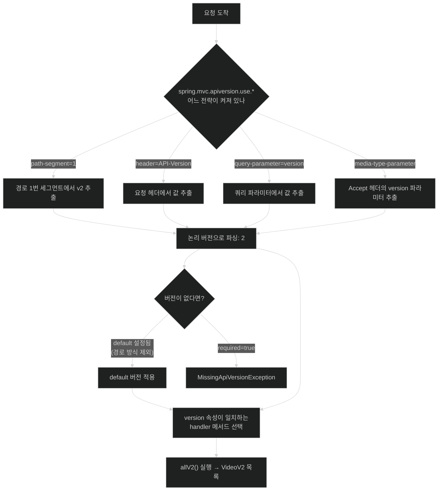

# API 버전 관리 — Spring Boot 4의 일급 기능

## 한눈에 보기

| 질문 | 핵심 답 |
|---|---|
| 왜 버전이 필요한가 | API는 소비자와 맺은 **계약**이다. 말없이 바꾸면 상대가 깨진다. |
| 전략은 몇 가지인가 | 4가지 — 경로, 요청 헤더, 쿼리 파라미터, 미디어 타입 |
| Spring Boot 4 이전에는? | 전부 수동. 버전 로직이 컨트롤러와 클라이언트에 흩어져 있었다. |
| Boot 4에서 바뀐 점 | 매핑 애노테이션에 **`version` 속성 하나**를 더하면 끝난다. |
| 전략은 어디서 정하나 | 컨트롤러 코드가 아니라 **`spring.mvc.apiversion.use.*` 프로퍼티** |
| 몇 개를 고를 수 있나 | **애플리케이션당 하나.** |
| default 버전은? | 헤더·쿼리·미디어 타입에는 되고, **경로 방식에는 안 된다.** |

## 1. 왜 이게 필요한가

### 출발 장면: 응답에 필드를 하나 더하기로 했다

[[05-creating-json-based-apis]]에서 `/api/videos`를 공개했다. 응답은 이랬다.

```json
[{"name": "Need HELP with your SPRING BOOT 4 App?"}]
```

이제 비디오에 설명을 붙이기로 하고 **[[레코드]]**(= 필드 목록만 선언하면 나머지를 컴파일러가 만드는 불변 데이터 클래스)에 필드를 추가한다. 그러면 응답이 이렇게 바뀐다.

```json
[{"name": "…", "description": "…"}]
```

여기까지는 대개 무해하다. 그런데 요구가 한 걸음 더 나가서 `name`을 `title`로 바꾸거나, 문자열이던 필드를 객체로 바꾸는 순간 이야기가 달라진다.

### 여기서 뭐가 무너지나

책의 진단은 간명하다 — "API를 개발하고 릴리스할 때 우리는 그 소비자들과 **계약**을 맺는 것이다. 계약에 사소한 변경만 생겨도 소비자들이 동작을 멈출 수 있고, 그건 좋지 않으며, 우리는 곤란해질 수 있다."

**[[API-계약]]**(= API 제공자와 소비자 사이의 약속. 경로·요청 형식·응답 필드·타입·의미가 모두 포함된다)이 깨졌을 때의 구체적 모습은 이렇다.

- 파트너의 파싱 코드가 `name` 키를 못 찾아 `null`을 다룬다.
- 이미 배포된 모바일 앱은 **우리가 고칠 수 없다.** 사용자가 업데이트할 때까지 몇 주가 걸린다.
- 우리 잘못이 아닌 것처럼 보이지만, 장애 신고는 우리에게 온다.

그렇다고 계약을 영원히 안 바꿀 수도 없다. 요구는 계속 바뀐다.

### 그래서 나온 생각

**호환되지 않는 계약을 여러 개 동시에 제공하고, 어느 것을 쓸지 요청마다 명시하게 한다.** 이것이 **[[API-버전-관리]]**(= 호환되지 않는 여러 계약을 동시에 제공하면서 요청마다 어느 계약을 쓸지 명시하게 하는 방식)다.

비유하자면 **전기 콘센트 규격을 바꾸면서 옛 규격 콘센트도 벽에 남겨 두는 것**이다. 새 기기는 새 구멍에, 옛 기기는 옛 구멍에 꽂는다. 모두가 한날한시에 새 기기로 바꿀 필요가 없어진다.

→ 비유가 깨지는 지점: 벽의 콘센트는 두 벌을 설치하면 **눈에 보이는 자리를 차지한다.** 그래서 언젠가는 "이 옛 콘센트 아직 쓰나?"라는 질문이 자연히 나온다. 하지만 API의 옛 버전은 코드베이스 안 handler 메서드 하나일 뿐이라 **유지 비용이 보이지 않게 쌓인다.** 아무도 지우자고 말하지 않으면 v1, v2, v3가 영원히 남고, 모든 버그 수정을 세 곳에 반영해야 하는 상태가 된다. 버전 관리에는 **폐기 계획이 함께 있어야** 한다.

## 2. 어떻게 동작하는가

### 2.1 네 가지 전략과 그 대가

책은 버전을 표현할 자리를 네 곳으로 정리한다. 각각 장단이 분명하다.

| 전략 | 형태 | 책이 든 장점 | 책이 든 단점 |
|---|---|---|---|
| **URI(경로)** | `/api/v1/videos` | 말이 되고 테스트가 비교적 간단하다 | 버전이 **모든 링크에 박힌다** |
| **요청 헤더** | `API-Version: 2.0` | URL이 깨끗하게 유지된다. 웹·모바일·파트너가 서로 다른 버전을 쓸 때 잘 맞는다 | (URL만 보고는 버전을 알 수 없다) |
| **쿼리 파라미터** | `/api/videos?api-version=2.0` | 단순하고 갖고 놀기 쉽다 | 지저분해지기 쉽고 **공개 API에는 대체로 선호되지 않는다** |
| **미디어 타입** | `Accept: application/vnd.myapp.v2+json` | 가장 "REST 순수주의적" | 가장 장황하고 실무에서 다루기 어렵다 |

네 번째가 기대는 것이 **[[콘텐츠-협상]]**(= 클라이언트가 `Accept` 헤더로 원하는 표현 형식을 알리고 서버가 그에 맞춰 응답을 고르는 HTTP 메커니즘)이다. "버전도 결국 같은 리소스의 다른 표현"이라는 관점에서 보면 가장 이론적으로 일관된 자리다.

첫 번째의 단점 "모든 링크에 박힌다"는 실제로 뼈아프다. 응답 본문 안에 다른 리소스의 URL을 담는 API라면, 버전을 올릴 때 **본문 속 URL까지 전부 바뀐다.**

### 2.2 Boot 4 이전에는 무엇이 문제였나

책의 서술 — "이전에는 Spring이 API 버전을 제대로 이해하지 못했다. 이 전략들은 전부 수동으로 이뤄졌고, Spring은 그저 그 조건들에 따라 요청을 매칭했을 뿐이다. **버전 관리는 암묵적이었고 컨트롤러 매핑과 클라이언트 코드 여기저기에 흩어져 있었으며**, 각 엔드포인트가 서로 다른 전략을 써서 엉망이 될 수 있었다."

구체적으로 예전에는 이런 식이었다.

```java
@GetMapping(value = "/api/videos", headers = "API-Version=1")   // 조건을 손으로 적는다
public List<Video> allV1() { ... }

@GetMapping(value = "/api/videos", params = "version=2")        // 다른 엔드포인트는 다른 전략
public List<VideoV2> allV2() { ... }
```

**"버전"이라는 개념이 프레임워크에 없었다**는 것이 핵심이다. 헤더 조건, 파라미터 조건, 경로 조건은 전부 있었지만 그것들이 "버전을 나타낸다"는 사실은 개발자 머릿속에만 있었다. 그래서 전략이 엔드포인트마다 달라져도 아무도 못 막았다.

### 2.3 Boot 4의 해법 — `version` 속성 하나

책의 표현대로 "Spring Boot 4와 Spring Framework 7에서 이 모든 것이 바뀐다. API 버전 관리가 프레임워크 안의 **일급(first-class) 개념**이 된다. 이제 Spring은 경로·헤더·파라미터·미디어 타입을 통한 버전 정의를 위한 **통일된 API**를 제공한다."

방법은 매우 단순하다 — `@GetMapping`, `@PostMapping`, `@PutMapping` 같은 **[[요청-매핑]]**(= HTTP 메서드·경로를 컨트롤러 메서드에 연결하는 선언) 애노테이션에 `version` 속성만 더하면 된다.

```java
@GetMapping(value = "/api/{version}/videos", version = "1")
public List<Video> all() {
     return videoService.getVideos();
}

@GetMapping(value = "/api/{version}/videos", version = "2")
public List<VideoV2> allV2() {
     return videoService.getVideosV2();
}
```

책이 짚듯 `value` 속성에 `{version}`을 넣었고 `version` 속성에 각각 1과 2를 넣었다. `VideoV2`와 `getVideosV2()`는 이 시점에는 아직 보여 주지 않은 코드인데, 실제 정의는 [[10-writing-null-safe-applications-with-jspecify]]에 나온다 — `record VideoV2(String name, @Nullable String description) {}`처럼 필드가 하나 더 있는 새 계약이다.

여기서 결정적으로 중요한 점이 있다. **컨트롤러 코드에는 "1"과 "2"라는 논리 버전만 있고, 그 버전을 요청에서 어떻게 읽어낼지는 전혀 적혀 있지 않다.** 그게 다음 절이다.

### 2.4 전략은 코드가 아니라 프로퍼티로 정한다

버전 타입은 **[[구성-프로퍼티]]**(= 외부 파일의 키-값으로 동작을 조정하는 설정)에서 지정한다.

```properties
spring.mvc.apiversion.use.path-segment=1
```

책의 설명 — "`spring.mvc.apiversion.use.path-segment=1` 프로퍼티는 Spring에게 요청 경로의 **두 번째 세그먼트**에서 API 버전을 뽑아내라고 알린다. **0부터 세는 색인**을 쓴다. 예를 들어 `/api/v2/videos`에서 세그먼트 0은 `api`, 세그먼트 1은 `v2`, 세그먼트 2는 `videos`다."

**[[경로-세그먼트]]**(= URL 경로를 `/`로 나눴을 때 생기는 각 조각)를 그림으로 보면 헷갈리지 않는다.

```text
   /api/v2/videos
    │    │    │
    │    │    └── segment 2 = "videos"
    │    └─────── segment 1 = "v2"      ← use.path-segment=1 이 가리키는 곳
    └──────────── segment 0 = "api"
```

그다음 Spring이 하는 일 — "Spring은 버전 세그먼트 `v2`를 읽어 논리 버전 2에 매칭하고, 그것이 `version = "2"`로 선언된 handler에 대응한다."

즉 **`v2`라는 문자열에서 숫자 2를 뽑아내는 파싱까지 프레임워크가 한다.** 우리가 `version = "v2"`가 아니라 `version = "2"`라고 쓴 이유다.

호출은 이렇다.

```bash
curl http://localhost:8080/api/v1/videos
curl http://localhost:8080/api/v2/videos
```

### 2.5 나머지 세 전략 — 프로퍼티만 바꾼다

**헤더 방식**

```properties
spring.mvc.apiversion.use.header=API-Version
spring.mvc.apiversion.default=1
```

책의 설명 — `use.header`가 헤더 옵션을 쓰도록 구성해 Spring이 `API-Version` 요청 헤더에서 버전을 읽게 하고, `apiversion.default=1` 덕분에 버전 정보가 아예 없으면 자동으로 버전 1로 되돌아간다.

이때 `@GetMapping`의 경로를 `/api/videos`로 되돌린다. **URL에서 버전이 사라진다.**

```bash
curl 'http://localhost:8080/api/videos' --header 'API-Version: 1'
curl 'http://localhost:8080/api/videos' --header 'API-Version: 2'
```

**쿼리 파라미터 방식**

```properties
spring.mvc.apiversion.use.query-parameter=version
```

```bash
curl 'http://localhost:8080/api/videos?version=1'
```

**미디어 타입 방식**

```properties
spring.mvc.apiversion.use.media-type-parameter[application/json]=version
```

책의 설명 — 이 프로퍼티를 더하면 Spring에게 "미디어 타입 버전 관리를 켜라"고 말하는 것이고, Spring은 `application/json` 요청의 `Accept` 헤더에 있는 `version` 파라미터에서 API 버전을 뽑아낸다. 예를 들어 `Accept: application/json; version=2.0`이다.

```bash
curl http://localhost:8080/api/videos -H "Accept: application/json;version=2"
```

대괄호 `[application/json]`이 들어간 것은 이 프로퍼티가 **미디어 타입별로 다른 파라미터 이름을 쓸 수 있는 맵**이기 때문이다.

네 전략을 한눈에 비교하면 이렇다.

| | 프로퍼티 | 컨트롤러 경로 | 호출 예 |
|---|---|---|---|
| 경로 | `use.path-segment=1` | `/api/{version}/videos` | `curl .../api/v2/videos` |
| 헤더 | `use.header=API-Version` | `/api/videos` | `-H 'API-Version: 2'` |
| 쿼리 | `use.query-parameter=version` | `/api/videos` | `?version=2` |
| 미디어 타입 | `use.media-type-parameter[application/json]=version` | `/api/videos` | `-H "Accept: application/json;version=2"` |

**컨트롤러의 `version = "2"`는 네 경우 모두 동일하다.** 전략을 바꿔도 handler 코드는 안 바뀐다는 것이 "일급 개념"이 준 실질적 이득이다.

### 2.6 버전 검증 프로퍼티

책은 다른 버전 관련 프로퍼티 둘을 짧게 언급한다.

- `spring.mvc.apiversion.required` — 모든 요청이 반드시 API 버전을 명시하도록 강제한다.
- `spring.mvc.apiversion.detect-supported` — 요청된 버전이 지원 버전 목록에 있는지 검증되도록 보장한다.

> **공식 문서 기준 보강**: Spring Boot 4.1.0의 `WebMvcProperties.Apiversion`에는 위 둘 외에 **`spring.mvc.apiversion.supported`** 도 있다. 지원 버전을 목록으로 직접 적는 프로퍼티이며, 보통 `detect-supported=false`와 함께 써서 "선언한 버전만 허용"을 만든다. 그리고 검증에 걸렸을 때의 동작도 구체적이다 — `required=true`인데 버전이 없으면 `MissingApiVersionException`, 지원 목록에 없는 버전이면 `InvalidApiVersionException`이 발생한다. 책은 "검증된다"까지만 말하고 어떤 예외로 드러나는지는 다루지 않는다.

### 2.7 전략은 하나만 고른다

> **Note (책 p.61)**: 애플리케이션당 API 버전 전략은 **항상 하나만** 고른다. default 버전을 쓰는 것은 헤더·쿼리 파라미터·미디어 타입 전략에서는 지원되지만, **경로 기반 버전 관리에는 적용되지 않는다** — 경로 방식에서는 버전이 URL에 항상 존재해야 하기 때문이다. 더 알아보려면 `https://spring.io/blog/2025/09/16/api-versioning-in-spring` 문서를 참고하라.

두 가지 제약을 각각 이해할 값이 있다.

**왜 전략은 하나인가?** 두 전략을 켜면 "헤더에는 1, 쿼리에는 2가 들어온 요청"에서 무엇이 이겨야 하는지 규칙이 필요해진다. 그 모호함이 §2.2에서 지적한 "엔드포인트마다 다른 전략을 쓰는 엉망"으로 돌아가는 길이다.

**왜 경로 방식엔 default가 없는가?** 이건 임의의 제약이 아니라 **논리적 필연**이다. `/api/{version}/videos`라는 매핑에서 버전 세그먼트를 뺀 `/api/videos`는 애초에 **다른 URL**이라 이 매핑에 걸리지 않는다. 버전이 없는 요청 자체가 도달할 수 없으므로 "없을 때의 기본값"이라는 개념이 성립하지 않는다.

```text
헤더 방식:  GET /api/videos                  → 매핑에 걸린다 → 헤더 없음 → default 적용 가능
경로 방식:  GET /api/videos                  → 매핑에 안 걸린다 → 404. default가 낄 자리가 없다
            GET /api/v1/videos               → 매핑에 걸린다 → 버전이 이미 있다
```

## 3. 그림으로 보기

### 요청 하나가 버전 handler에 도달하기까지



전략이 무엇이든 **"논리 버전으로 파싱" 지점에서 하나로 합류한다**는 것이 Boot 4가 만든 구조다. 그 아래는 전략과 무관하게 동일하다.

### 계약이 갈리는 지점

```text
[버전 관리가 없을 때]

  record Video(String name)  ──▶ /api/videos ──▶ 모든 소비자
                                                  웹 · 모바일 · 파트너
       │
       │ description 필드 추가 + name → title 이름 변경
       ▼
  record Video(String title, String description)
                             ──▶ /api/videos ──▶ 모든 소비자가 동시에 깨진다


[버전 관리가 있을 때]

  record Video(String name)          ──▶ version "1" handler ──▶ 옛 모바일 앱
  record VideoV2(String name,
                 String description) ──▶ version "2" handler ──▶ 새 웹 프런트엔드

  ▶ 소비자가 각자의 속도로 옮겨 갈 수 있다
  ▶ 그 대신 두 계약을 동시에 유지해야 한다 — 폐기 시점을 정해 두지 않으면 영원히 쌓인다
```

## 4. 이 노트에 나온 용어

| 용어 | 한 줄 풀이 | 자세히 |
|---|---|---|
| API 계약 | 제공자와 소비자 사이의 약속(경로·형식·필드·의미) | [[_glossary#API-계약]] |
| API 버전 관리 | 여러 계약을 동시에 제공하며 요청마다 명시하게 하는 방식 | [[_glossary#API-버전-관리]] |
| 경로 세그먼트 | URL 경로를 `/`로 나눈 각 조각 (0부터 센다) | [[_glossary#경로-세그먼트]] |
| 콘텐츠 협상 | `Accept` 헤더로 원하는 표현 형식을 고르는 HTTP 메커니즘 | [[_glossary#콘텐츠-협상]] |
| 요청 매핑 | HTTP 메서드·경로를 컨트롤러 메서드에 연결하는 선언 | [[_glossary#요청-매핑]] |
| 구성 프로퍼티 | 외부 파일의 키-값으로 동작을 조정하는 설정 | [[_glossary#구성-프로퍼티]] |
| 레코드 | 필드 목록만 선언하면 나머지를 컴파일러가 만드는 불변 데이터 클래스 | [[_glossary#레코드]] |

## 5. 자주 헷갈리는 것

### `version = "2"` vs 경로의 `v2`

컨트롤러에 쓰는 것은 **논리 버전 `"2"`**이고 URL에 나타나는 것은 `v2`다. 둘을 잇는 파싱은 프레임워크가 한다. 그래서 전략을 헤더 방식으로 바꿔도 `version = "2"`는 그대로다.

### 경로 세그먼트 번호

`use.path-segment=1`의 `1`은 **버전 번호가 아니라 위치 색인**이다. `/api/v2/videos`에서 1번 자리가 `v2`라는 뜻이지, "버전 1"이라는 뜻이 아니다. 이 오해가 가장 흔하다.

### 버전 관리 vs 하위 호환 유지

버전을 나누는 것과 옛 버전을 계속 동작시키는 것은 다른 일이다. `version = "1"` handler를 만들어 두는 것만으로는 부족하고, 그 handler가 참조하는 서비스·데이터 구조도 함께 살아 있어야 한다.

### `required`와 `default`

`required=true`는 "버전을 반드시 명시하라", `default=1`은 "없으면 1로 본다"이다. **둘은 서로 반대 방향**이므로 함께 켜면 `default`가 사실상 무의미해진다.

## 6. 언제 안 쓰나 / 경계

- 내부에서만 쓰는 API이고 제공자와 소비자를 **동시에 배포**할 수 있다면 버전 관리는 과잉이다. 그냥 함께 바꾸면 된다.
- 버전을 늘리는 것은 쉽고 **줄이는 것은 어렵다.** 폐기 정책과 시한 없이 v1을 만들면 영원히 남는다.
- 이 절의 두 handler는 서로 다른 반환 타입(`Video`, `VideoV2`)을 쓴다. 즉 **데이터 모델도 두 벌**이 된다. 버전이 늘수록 변환 코드가 늘어난다는 뜻이다.
- 경로 방식은 리버스 프록시·API 게이트웨이·캐시와 잘 맞지만 링크에 버전이 박힌다. 헤더 방식은 URL이 깨끗하지만 중간 캐시가 `Vary` 헤더를 제대로 다루지 않으면 **다른 버전의 응답을 섞어 줄 수 있다.** 전략 선택은 애플리케이션 코드만의 문제가 아니다 — [[09-calling-versioned-apis-with-http-service-clients]]에서 클라이언트 쪽 관점이 이어진다.
- 버전은 계약 변경을 **관리 가능하게** 만들 뿐 **없애 주지는 않는다.** 애초에 깨는 변경을 줄이는 설계(필드 추가만 하기, 응답 전용 타입 두기)가 먼저다.

## 7. 연결

- [[05-creating-json-based-apis]] — 여기서 공개한 계약이 이 노트가 지키려는 대상이다. record 필드 추가가 곧 계약 변경이라는 그 노트의 경계가 출발점이다.
- [[09-calling-versioned-apis-with-http-service-clients]] — 제공자 관점의 이 노트에 이어 **소비자 관점**을 다룬다. 서버 전략과 클라이언트 전략은 짝을 이뤄야 한다.
- [[10-writing-null-safe-applications-with-jspecify]] — 여기서 이름만 나온 `VideoV2` record의 실제 정의가 그 노트에 있다.

## 8. 스스로 확인

1. API를 "계약"이라 부를 때, 그 계약에 포함되는 것을 네 가지 이상 말할 수 있는가?
2. 이미 배포된 모바일 앱이 있다는 사실이 왜 버전 관리를 필수로 만드는가?
3. 네 가지 전략을 각각의 대가와 함께 설명할 수 있는가?
4. Boot 4 이전에도 헤더·파라미터 조건 매칭은 가능했다. 그런데 무엇이 없었던 것인가?
5. `use.path-segment=1`의 `1`은 무슨 뜻인가? 흔한 오해는?
6. 전략을 헤더에서 쿼리로 바꿀 때 컨트롤러 코드는 얼마나 바뀌는가? 왜인가?
7. 경로 방식에 default 버전을 적용할 수 없는 이유를 매핑 관점에서 설명할 수 있는가?
8. 전략을 애플리케이션당 하나로 제한하는 이유는?
9. 버전을 나눴을 때 새로 생기는 비용은 무엇인가?

> 아홉 문항을 스스로 답한 **뒤에** [[_08-versioning-apis-with-spring-boot-4]]에서 모범답안과 대조한다. 먼저 열면 이 문항들은 다시 인출 문제로 쓸 수 없다.

<!-- ==== 아래는 내 영역 · 스킬 수정 금지 ==== -->

## 내 설명 시도


## 막혔던 지점


## 리뷰 이력
