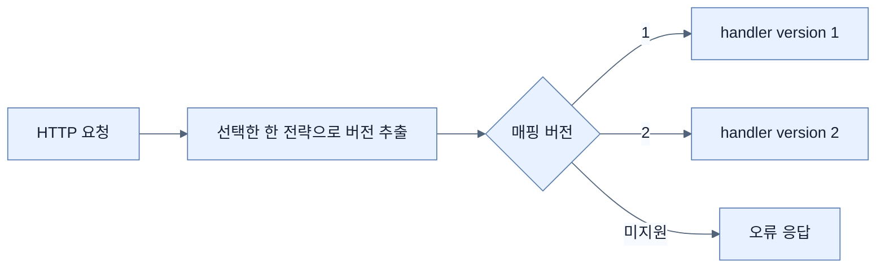

# Spring Boot 4 API 버전 관리

## 한눈에 보기

Spring Framework 7은 버전을 요청 매핑의 1급 조건으로 다룬다. 핸들러에 `version="1"`처럼 논리 버전을 선언하고, 설정으로 경로 세그먼트·헤더·쿼리 파라미터·미디어 타입 중 **한 가지** 추출 전략을 고른다.

## 1. 왜 이게 필요한가

응답 필드나 의미가 바뀌면 이미 배포된 모바일·파트너 클라이언트가 즉시 깨질 수 있다. 버전은 서버가 여러 계약을 동시에 제공하고 소비자가 의존하는 계약을 명시하게 한다. 전략이 엔드포인트마다 흩어지면 라우팅과 문서가 불일치하므로 프레임워크 수준에서 통일한다.

## 2. 어떻게 동작하는가

| 전략 | 요청 예 | 특징 |
|---|---|---|
| 경로 | `/api/v2/videos` | 눈에 보이지만 링크에 버전이 박힌다. |
| 헤더 | `API-Version: 2` | URL이 깨끗하고 게이트웨이와 쓰기 좋다. |
| 쿼리 | `?version=2` | 시험하기 쉽지만 공개 API가 산만해질 수 있다. |
| 미디어 타입 | `Accept: application/json;version=2` | 콘텐츠 협상과 결합하지만 사용이 복잡하다. |

요청에서 추출한 버전을 `@GetMapping(..., version="2")`의 조건과 비교해 핸들러를 고른다. header/query/media 전략에는 기본 버전을 둘 수 있지만, 경로 전략에서는 URL에 버전이 반드시 있어야 한다. `required`와 지원 버전 감지는 누락·미지원 요청을 엄격하게 다루는 보조 설정이다.

## 3. 그림으로 보기

## 4. 이 노트에 나온 용어

- **API contract**: 소비자가 의존하는 경로·요청·응답·오류·의미의 약속.
- **content negotiation**: Accept/Content-Type 등을 보고 자원 표현을 선택하는 HTTP 메커니즘.
- **version strategy**: 요청 어디에서 논리 버전을 읽을지 정한 정책.

## 7. 연결

- [[05-creating-json-based-apis]] — 버전을 붙일 기본 JSON 계약이다.
- [[09-calling-versioned-apis-with-http-service-clients]] — 소비자도 호출 버전을 명시해야 한다.
- [[chapter-15-whats-new-in-spring-boot-4/02-web-and-api-changes|Boot 4 웹/API 변화]] — API versioning은 Boot 4 변화 목록에도 다시 등장한다.

## 8. 스스로 확인

- 전체 1차 정리 후: 기본 버전을 경로 전략에 적용할 수 없는 이유를 설명한다.

<!-- ==== 아래는 내 영역 · 스킬 수정 금지 ==== -->

## 내 설명 시도

## 막혔던 지점

## 리뷰 이력

