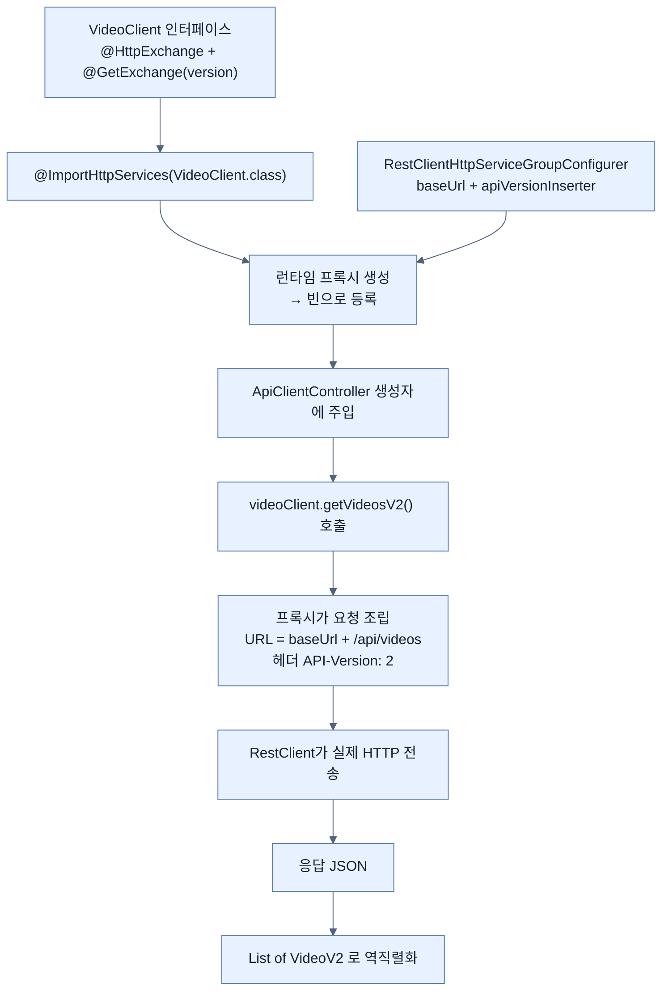

# 버전이 있는 API 호출하기 — HTTP Service Interface Client

## 한눈에 보기

| 질문 | 핵심 답 |
|---|---|
| 이 절의 관점 | [[08-versioning-apis-with-spring-boot-4]]가 제공자라면 여기는 **소비자**다. |
| 필요한 의존성 | `spring-boot-starter-restclient` |
| 클라이언트를 어떻게 쓰나 | **인터페이스만 선언한다.** 구현체는 런타임 프록시가 만들어진다. |
| 버전은 어디에 쓰나 | `@GetExchange(version = "2")` — URL에도 헤더에도 손대지 않는다. |
| 그 버전이 실제로 나가는 방식은? | `ApiVersionInserter`가 정한다. 헤더/경로/쿼리/미디어 타입 중 하나 |
| 왜 인터페이스와 전송을 나누나 | 계약은 타입으로, 전송 세부는 설정 한 곳에 모으기 위해 |

## 1. 왜 이게 필요한가

### 출발 장면: 버전이 있는 API를 호출하는 쪽

[[08-versioning-apis-with-spring-boot-4]]에서 `/api/videos`에 버전 1과 2를 만들었다. 책이 짚듯 "지금까지는 API 버전 관리를 **제공자의 관점**에서 봤다. 그러나 버전 관리는 거기서 끝나지 않는다 — 계약이 시간이 지나며 바뀌므로 **클라이언트도 자기가 어느 API 버전에 의존하는지 명시적이어야 한다.**"

### 여기서 뭐가 무너지나

Java에서 원격 API를 호출하는 순진한 방법은 이렇다.

```java
RestClient client = RestClient.create();
String json = client.get()
    .uri("http://localhost:8080/api/videos")
    .header("API-Version", "2")                      // 문자열
    .retrieve()
    .body(String.class);
// 그리고 json을 손으로 파싱한다
```

네 가지가 무너진다.

1. **버전이 문자열 리터럴로 호출부마다 흩어진다.** 헤더 이름을 `Api-Version`으로 오타 내면 컴파일러는 아무 말도 안 하고, 서버는 default 버전으로 응답한다.
2. **base URL이 호출부마다 반복된다.** 환경이 바뀌면 모든 호출 지점을 찾아야 한다.
3. **응답 타입이 없다.** `String`을 받아 직접 파싱하거나 매번 타입을 지정해야 한다.
4. **[[API-버전-관리]]**(= 여러 계약을 동시에 제공하며 요청마다 명시하게 하는 방식) **전략을 바꾸면 호출 코드를 전부 고쳐야 한다.** 서버가 헤더에서 쿼리 파라미터로 옮기면 클라이언트의 모든 `.header(...)`가 `.queryParam(...)`이 된다.

책의 표현대로 예전에는 "버전 관리가 암묵적이었고 컨트롤러 매핑과 **클라이언트 코드** 여기저기에 흩어져" 있었다. 4번이 그 클라이언트 쪽 절반이다.

### 그래서 나온 생각

**"무엇을 호출할지"의 계약만 Java 인터페이스로 선언하고, "어떻게 호출할지"의 절차는 프레임워크가 채운다.** 이것이 **[[HTTP-서비스-인터페이스]]**(= 원격 HTTP 호출을 Java 인터페이스의 메서드 선언으로 표현하는 Spring의 모델)이고, 이런 방식을 **[[선언적-클라이언트]]**(= 호출 절차 대신 계약만 적어 두면 나머지를 프레임워크가 채우는 클라이언트 방식)라 부른다.

비유하자면 식당의 **메뉴판**이다. 손님은 "3번 세트"라고만 말한다. 주방까지 걸어 들어가 재료를 꺼내고 불을 켜는 절차는 알 필요도 없고 알아서도 안 된다.

→ 비유가 깨지는 지점: 메뉴판에 없는 것을 주문하면 **그 자리에서 "없습니다"**라는 답이 온다. 하지만 인터페이스와 원격 계약이 어긋나도 **컴파일 시점에는 아무 오류가 없다.** `@HttpExchange("/api/vidoes")`처럼 경로에 오타를 내도 빌드는 통과하고, 실행해서 호출해 봐야 404로 드러난다. 여기서 말하는 "타입 안전"은 **내 코드 안에서만** 성립하며, 내 인터페이스와 상대 서버의 실제 계약이 맞는지는 아무도 검사해 주지 않는다.

## 2. 어떻게 동작하는가

### 2.1 의존성 더하기 — 같은 EXPLORE 절차

[[03-augmenting-an-existing-project-with-initializr]]의 절차를 그대로 다시 쓴다. start.spring.io에서 `ADD DEPENDENCIES` → `Http Client` 입력 → Return → `EXPLORE` 클릭 → `pom.xml`에서 조각을 찾아 복사한다.

```xml
<dependency>
    <groupId>org.springframework.boot</groupId>
    <artifactId>spring-boot-starter-restclient</artifactId>
</dependency>
```

또 하나의 **[[스타터]]**(= 기능 하나를 시작하는 데 필요한 의존성 묶음 아티팩트)다. 같은 절차가 이 장에서 두 번째로 반복되는 것은 우연이 아니다 — "새 기능이 필요하면 Initializr에서 조각을 가져온다"가 이 책이 가르치는 표준 동작이다.

책은 백엔드 선택도 짚는다 — "HTTP Service Interface Client는 **[[RestClient]]**(= Spring Framework 6.1에서 도입된 동기 방식 HTTP 클라이언트)나 **[[WebClient]]**(= 논블로킹·리액티브 방식의 HTTP 클라이언트) 둘 중 하나로 뒷받침될 수 있다. 이 절에서는 Spring Boot 4에서 **동기 HTTP 접근의 기본 선택**인 RestClient를 쓴다."

### 2.2 계약을 인터페이스로 선언한다

```java
@HttpExchange("/api/videos")
public interface VideoClient {

    @GetExchange(version = "1")
    List<Video> getVideosV1();

    @GetExchange(version = "2")
    List<VideoV2> getVideosV2();
}
```

**구현 클래스가 없다.** 인터페이스 하나가 전부다.

책의 항목별 설명이다.

- `@HttpExchange("/api/videos")`가 이 인터페이스를 HTTP 클라이언트로 표시하고 모든 요청에 쓰일 **기본 경로**를 정의한다.
- 각 `@GetExchange` 메서드가 `/api/videos` 엔드포인트로 가는 HTTP GET 호출에 매핑된다.
- `@GetExchange`의 `version` 속성은 클라이언트가 **어느 API 버전을 호출하는지** 나타낸다. 이 버전은 **URL에 박히지도 않고 헤더에 수동으로 설정되지도 않는다.** 클라이언트 설정이 처리하며, 구성된 전략에 따라 — 이 경우에는 `API-Version` 요청 헤더로 — 자동으로 전송된다.

세 번째 항목이 이 절의 핵심이다. [[08-versioning-apis-with-spring-boot-4]]에서 서버 쪽 `@GetMapping(version = "2")`가 "요청에서 버전을 어떻게 읽을지"를 몰랐던 것과 **정확히 대칭**이다. 여기서도 `@GetExchange(version = "2")`는 "버전 2를 부른다"만 말하고 "그걸 어디에 실을지"는 모른다.

`Exchange`라는 이름은 HTTP의 요청-응답 한 쌍(exchange)에서 왔다. 그래서 `@HttpExchange`는 "이 인터페이스의 메서드들은 HTTP 교환이다"라는 선언이 된다.

반환 타입이 `List<Video>`와 `List<VideoV2>`로 다르다는 점도 중요하다. **버전마다 계약이 다르므로 Java 타입도 달라야** 하고, 그것이 컴파일러가 지켜 주는 부분이다.

### 2.3 프록시를 만들고 전송 방식을 정한다

```java
@Configuration
@ImportHttpServices(VideoClient.class)
class VideoClientConfig {

    @Bean
    RestClientHttpServiceGroupConfigurer videoClientConfigurer() {
        return groups -> groups.forEachClient((name, builder) ->
             builder
                    .baseUrl("http://localhost:8080")
                    .apiVersionInserter(ApiVersionInserter.useHeader("API-Version"))
        );
    }
}
```

책의 항목별 설명이다.

- `@Configuration` 애노테이션이 이 클래스를 빈을 정의하는 Spring 구성 클래스로 표시한다.
- `@ImportHttpServices(VideoClient.class)` 애노테이션이 Spring에게 `VideoClient` 인터페이스를 감지해 **런타임 HTTP 클라이언트 프록시**를 생성하라고 지시한다. 이 프록시는 Spring 빈으로 등록되어, `VideoClient` 타입이 필요한 어디에나 주입될 수 있다.
- `videoClientConfigurer()` 메서드가 `RestClientHttpServiceGroupConfigurer`를 정의한다. 이것은 `@ImportHttpServices`로 등록된 HTTP Service Interface 클라이언트들이 쓰는 `RestClient`를 커스터마이즈한다. `VideoClient`만 import되었으므로 이 설정은 그 클라이언트에만 적용되며, 나중에 다른 클라이언트가 등록되면 그쪽으로도 확장된다.
- `forEachClient` 콜백이 API base URL을 설정하고, 클라이언트 메서드에 선언된 API 버전이 `API-Version` 요청 헤더로 전송되도록 보장한다.

두 번째 항목의 **[[프록시]]**(= 어떤 타입인 척하면서 호출을 가로채 실제 동작을 대신 수행하는 객체)가 이 구조가 성립하는 이유다. `VideoClient`는 인터페이스일 뿐이지만, 런타임에 그 타입을 구현한 객체가 만들어져 컨텍스트에 등록된다. 그 객체가 하는 일은 이렇다.

1. 메서드 호출을 가로챈다. — 인터페이스에 본문이 없으므로 누군가는 실제 동작을 해야 하기 때문이다.
2. `@HttpExchange`의 기본 경로와 `baseUrl`을 합쳐 최종 URL을 만든다. — 계약(경로)과 환경(호스트)을 분리해 두기 위해서다.
3. `@GetExchange(version = "…")`의 버전을 **[[ApiVersionInserter]]**(= 나가는 요청에 API 버전을 어떤 방식으로 실을지 정하는 전략 객체)에게 넘겨 요청에 싣게 한다. — 버전 전송 방식을 호출부가 아니라 설정 한 곳에서 정하기 위해서다.
4. HTTP 요청을 보내고 응답 본문을 메서드의 반환 타입으로 역직렬화한다. — 호출부가 JSON 파싱을 하지 않게 하기 위해서다.

책의 정리 — "이 구성은 클라이언트를 선언적이고 타입 안전하게 유지하면서, base URL과 버전 헤더 같은 **전송 세부 사항을 한곳에 모아** 재사용하기 쉽게 만든다."

> **공식 문서 기준 보강**: Spring Boot 4.1.0은 이 프로그래밍 방식 configurer 말고 **프로퍼티**로도 같은 설정을 지원한다. `spring.http.serviceclient.<그룹이름>.base-url=https://example.com` 형태다. 그리고 `@ImportHttpServices`에는 `group` 속성이 있어 클라이언트를 이름 붙은 그룹으로 나눌 수 있고(`@ImportHttpServices(group = "one", types = TestClientOne.class)`), 클래스를 하나씩 나열하는 대신 **패키지를 스캔**하게 할 수도 있다. 책의 `forEachClient`가 "모든 클라이언트"를 뜻하는 것은 지금 그룹이 하나뿐이기 때문이며, 그룹이 늘면 그룹별로 다른 base URL을 줄 수 있다.

### 2.4 전략을 바꾸려면 한 줄만 바꾼다

책은 다른 선택지를 나열한다 — "보다시피 우리는 `API-Version` 요청 헤더를 쓰고 있지만, 다른 `ApiVersionInserter`를 골라 다른 버전 전략으로 전환할 수 있다."

| 클라이언트 쪽 | 서버 쪽 대응 프로퍼티 |
|---|---|
| `ApiVersionInserter.useHeader("API-Version")` | `spring.mvc.apiversion.use.header=API-Version` |
| `ApiVersionInserter.usePathSegment(...)` | `spring.mvc.apiversion.use.path-segment=…` |
| `ApiVersionInserter.useQueryParam(...)` | `spring.mvc.apiversion.use.query-parameter=…` |
| `ApiVersionInserter.useMediaTypeParam(...)` | `spring.mvc.apiversion.use.media-type-parameter[…]=…` |

**두 열이 짝을 이뤄야 한다.** 서버가 헤더를 읽는데 클라이언트가 쿼리 파라미터로 보내면, 서버는 버전을 못 찾고 default(설정돼 있다면)로 처리하거나 실패한다. 이 짝맞춤이 어긋나면 컴파일도 시작도 문제없이 되고 **런타임에 조용히 잘못된 버전으로 응답**받는다.

책은 인프라 관점의 조언도 붙인다 — "헤더 기반, 미디어 타입, 쿼리 파라미터 버전 관리는 HTTP Service Interface Client와, 그리고 리버스 프록시나 API 게이트웨이 같은 흔한 인프라와 자연스럽게 맞물린다. 반면 **경로 기반 버전 관리는 버전이 요청 URL에 직접 인코딩되어야 한다.**"

경로 방식이 다른 취급을 받는 이유는 [[08-versioning-apis-with-spring-boot-4]]에서 default 버전이 안 되던 이유와 같다 — **URL 자체가 달라지기 때문**이다. 그래서 `@HttpExchange`의 기본 경로에 `{version}` 자리를 마련해 두어야 하고, 라우팅 규칙도 버전마다 달라질 수 있다.

### 2.5 클라이언트를 부르는 컨트롤러

책은 `ApiController`를 **외부 HTTP API인 것처럼** `VideoClient`를 통해 호출하는 컨트롤러를 만든다.

```java
@RestController
public class ApiClientController {
     private final VideoClient videoClient;

     public ApiClientController(VideoClient videoClient) {
         this.videoClient = videoClient;
     }

     @GetMapping(value = "/api/videos/client-test", version = "1")
     public List<Video> allV1() {
         return videoClient.getVideosV1();
     }

     @GetMapping(value = "/api/videos/client-test", version = "2")
     public List<VideoV2> allV2() {
         return videoClient.getVideosV2();
     }
}
```

(PDF의 리스팅에는 클래스 닫는 중괄호가 빠져 있다. 위 코드는 그 부분을 보완한 것이다.)

생성자에 `VideoClient`가 그냥 들어온다는 점을 눈여겨볼 만하다. [[04c-injecting-dependencies-through-constructor-calls]]의 생성자 주입과 완전히 같은 방식이고, **주입되는 것이 우리가 만든 클래스가 아니라 프레임워크가 만든 프록시**라는 것만 다르다. 주입받는 쪽은 그 차이를 몰라도 된다.

책이 짚는 핵심 — "이 컨트롤러의 결정적인 부분은 각 `@GetMapping` 애노테이션의 `version` 속성이다. 같은 `/api/videos/client-test` URI를 쓰지만 `version` 속성이 **어느 API 버전이 호출되는지**를 결정한다. 그리고 그 버전은 구성된 버전 전략에 따라 **바깥으로 나가는 `VideoClient` 요청에 전파된다.**"

여기서 `version`이 두 층에 걸쳐 나타난다는 점이 중요하다.

```text
  curl -H 'API-Version: 2'
        │
        ▼
  [들어오는 요청]  @GetMapping(value="/api/videos/client-test", version="2")
                    ← 서버 쪽 전략(use.header)이 헤더에서 2를 읽어 이 handler를 고른다
        │
        ▼
        allV2() 실행 → videoClient.getVideosV2() 호출
        │
        ▼
  [나가는 요청]   @GetExchange(version="2") + ApiVersionInserter.useHeader
                    ← 클라이언트 쪽 전략이 API-Version: 2 헤더를 붙여 내보낸다
        │
        ▼
  [다시 들어오는 요청] @GetMapping(value="/api/{version}/videos", version="2")
                    ← 원래 ApiController의 v2 handler에 도달
```

**같은 `version` 개념이 서버 라우팅과 클라이언트 전송 양쪽에서 같은 어휘로 쓰인다.** 이것이 "일급 개념"이 된다는 말의 실질적 의미다.

### 2.6 확인

```bash
curl 'http://localhost:8080/api/videos/client-test' -H 'API-Version: 1'
curl 'http://localhost:8080/api/videos/client-test' -H 'API-Version: 2'
```

책의 정리 — "이 구성으로 같은 엔드포인트를 `API-Version` HTTP 요청 헤더에 원하는 버전을 넣어 서로 다른 API 버전으로 호출할 수 있고, 서버가 요청을 올바른 버전 handler 메서드로 라우팅한다."

그리고 절 전체를 이렇게 닫는다 — "Spring Boot 4는 HTTP 계층에서 API 버전 관리에 **일급 인프라 지원**을 제공해, **URL을 바꾸거나 컨트롤러와 클라이언트에 버전 관리 로직을 중복시키지 않고** 버전이 있는 엔드포인트를 소비할 수 있게 한다."

## 3. 그림으로 보기

### 인터페이스 하나가 동작하는 객체가 되기까지



### 명령형 호출과 선언적 호출

| | 명령형 (`RestClient` 직접) | 선언적 (`HTTP Service Interface`) |
|---|---|---|
| 계약이 사는 곳 | 호출문 안 문자열 | **Java 인터페이스 타입** |
| base URL | 호출부마다 반복 | configurer 한 곳 |
| 버전 전송 방식 | 호출부마다 `.header(...)` | `ApiVersionInserter` 한 곳 |
| 응답 타입 | 매번 지정 | 메서드 반환 타입 |
| 전략 변경 비용 | 모든 호출부 | **한 줄** |
| 컴파일러가 잡아 주는 것 | 거의 없음 | 반환 타입·인자 타입 |
| 컴파일러가 **못** 잡는 것 | 경로·헤더 오타 | **경로 오타, 원격 계약 불일치** |

마지막 두 줄이 §1 비유의 깨지는 지점을 표로 옮긴 것이다. 선언적 방식도 **내 코드 안에서만** 타입 안전하다.

### 서버 전략과 클라이언트 전략의 짝맞춤

```text
  서버 (application.properties)              클라이언트 (configurer)
  ─────────────────────────────────          ────────────────────────────────────
  use.header=API-Version            ←─짝─→   ApiVersionInserter.useHeader("API-Version")
  use.query-parameter=version       ←─짝─→   ApiVersionInserter.useQueryParam("version")
  use.media-type-parameter[…]=…     ←─짝─→   ApiVersionInserter.useMediaTypeParam(…)
  use.path-segment=1                ←─짝─→   ApiVersionInserter.usePathSegment(1)
                                              + @HttpExchange 경로에 {version} 자리 필요

  ▶ 어긋나면 컴파일도 시작도 통과한다. 런타임에 default 버전으로 응답받거나
    MissingApiVersionException으로만 드러난다 — 통합 테스트가 필요한 이유다.
```

## 4. 이 노트에 나온 용어

| 용어 | 한 줄 풀이 | 자세히 |
|---|---|---|
| HTTP 서비스 인터페이스 | 원격 호출을 Java 인터페이스 선언으로 표현하는 모델 | [[_glossary#HTTP-서비스-인터페이스]] |
| 선언적 클라이언트 | 절차 대신 계약만 적으면 나머지를 프레임워크가 채우는 방식 | [[_glossary#선언적-클라이언트]] |
| 프록시 | 어떤 타입인 척하며 호출을 가로채 대신 수행하는 객체 | [[_glossary#프록시]] |
| RestClient | Spring의 동기 방식 HTTP 클라이언트 | [[_glossary#RestClient]] |
| WebClient | 논블로킹·리액티브 방식 HTTP 클라이언트 | [[_glossary#WebClient]] |
| ApiVersionInserter | 나가는 요청에 버전을 어떻게 실을지 정하는 전략 객체 | [[_glossary#ApiVersionInserter]] |
| API 버전 관리 | 여러 계약을 동시에 제공하며 요청마다 명시하게 하는 방식 | [[_glossary#API-버전-관리]] |
| 스타터 | 기능 하나를 시작하는 데 필요한 의존성 묶음 | [[_glossary#스타터]] |
| 요청 매핑 | HTTP 메서드·경로를 컨트롤러 메서드에 연결하는 선언 | [[_glossary#요청-매핑]] |

## 5. 자주 헷갈리는 것

### `@HttpExchange` vs `@RequestMapping`

생김새가 비슷하지만 **방향이 반대**다. `@RequestMapping` 계열(`@GetMapping`)은 **들어오는** 요청을 받는 선언이고, `@HttpExchange` 계열(`@GetExchange`)은 **나가는** 요청을 보내는 선언이다. `ApiClientController`에 둘이 함께 나오는 것이 그래서 혼란스러울 수 있다 — 그 클래스는 받는 쪽이자 보내는 쪽이다.

### `RestClient` vs `WebClient`

둘 다 같은 인터페이스를 받칠 수 있다. 차이는 **호출 모델**이다. RestClient는 응답이 올 때까지 스레드가 기다리고, WebClient는 기다리지 않는다. Boot 4의 동기 기본은 RestClient다.

### 프록시가 주입된다는 것

`VideoClient` 타입 빈이 컨텍스트에 있지만 그 클래스를 우리가 쓴 적은 없다. 주입받는 쪽 코드는 이 사실을 알 필요가 없다는 것이 요점이다. 다만 디버거에서 클래스 이름이 낯설게 보일 수 있다.

### "타입 안전"의 범위

인터페이스가 컴파일러의 검사를 받는다는 뜻이지, **원격 서버가 그 계약을 지킨다는 보장은 아니다.** 서버가 필드 이름을 바꾸면 역직렬화 시점에 조용히 `null`이 되거나 예외가 난다.

### 서버의 `version` vs 클라이언트의 `version`

같은 단어지만 하나는 **라우팅 조건**이고 하나는 **전송할 값**이다. `ApiClientController`에서 둘이 나란히 나올 때 이 구분을 놓치면 흐름을 못 읽는다.

## 6. 언제 안 쓰나 / 경계

- 책의 예제는 애플리케이션이 **자기 자신의 API**를 `localhost:8080`으로 호출한다. 학습용 장치이며, 실제로는 다른 서비스를 가리킨다. 자기 호출은 불필요한 네트워크 왕복과 스레드 점유를 만든다.
- `baseUrl`이 코드에 하드코딩되어 있다. 실제로는 프로퍼티(`spring.http.serviceclient.<group>.base-url`)나 서비스 디스커버리로 주입해야 환경마다 다른 주소를 쓸 수 있다.
- 타임아웃, 재시도, 회로 차단기, 인증 토큰은 이 절에 없다. 원격 호출이 실패하면 어떻게 되는지는 별도 설계가 필요하다.
- 인터페이스와 원격 계약의 일치는 **컴파일러가 검증하지 않는다.** 계약 테스트나 통합 테스트가 그 자리를 메워야 한다.
- 경로 기반 버전 전략을 쓰면 클라이언트 인터페이스의 경로에도 버전 자리가 필요해져, 다른 세 전략만큼 매끄럽지 않다.

## 7. 연결

- [[08-versioning-apis-with-spring-boot-4]] — 제공자 쪽 절반. 서버의 `use.*` 프로퍼티와 이 노트의 `ApiVersionInserter`는 반드시 짝을 이뤄야 한다.
- [[05-creating-json-based-apis]] — 이 클라이언트가 실제로 호출하는 대상이 그 절에서 만든 `ApiController`다.
- [[03-augmenting-an-existing-project-with-initializr]] — `spring-boot-starter-restclient`를 가져오는 절차가 그 노트의 EXPLORE 방식 그대로다.

## 8. 스스로 확인

1. `RestClient`로 직접 호출하는 코드가 무너지는 네 지점은 무엇인가?
2. `VideoClient`에 구현 클래스가 없는데도 동작하는 이유를 프록시로 설명할 수 있는가?
3. `@GetExchange(version = "2")`가 **말하지 않는** 것은 무엇인가?
4. 서버의 `@GetMapping(version=...)`과 클라이언트의 `@GetExchange(version=...)`이 대칭이라는 말은 무슨 뜻인가?
5. 서버 전략과 클라이언트 전략이 어긋나면 언제 어떻게 드러나는가?
6. "선언적이고 타입 안전하다"의 범위는 어디까지인가? 무엇은 보장되지 않는가?
7. 경로 기반 전략만 다른 취급을 받는 이유는?
8. `ApiClientController`에서 `version`이 두 층에 걸쳐 나타나는 흐름을 설명할 수 있는가?

<!-- ==== 아래는 내 영역 · 스킬 수정 금지 ==== -->

## 내 설명 시도


## 막혔던 지점


## 리뷰 이력
