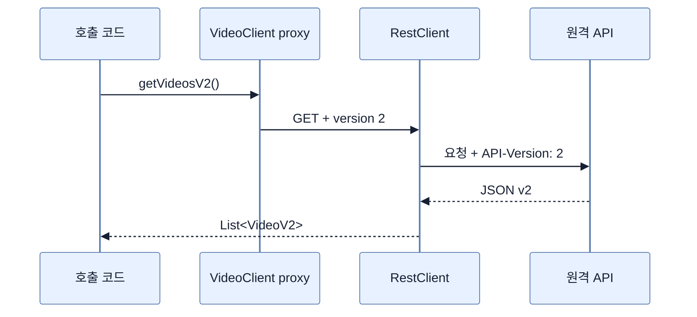

# HTTP Service Client로 버전 API 호출하기

## 한눈에 보기

`@HttpExchange` 인터페이스와 `@GetExchange(version="...")` 메서드가 원격 API 계약을 선언한다. `@ImportHttpServices`가 런타임 프록시를 Bean으로 만들고, `RestClientHttpServiceGroupConfigurer`가 base URL과 `ApiVersionInserter`를 중앙 설정한다.

## 1. 왜 이게 필요한가

서버만 버전을 구분해도 클라이언트가 헤더·쿼리 조립을 곳곳에서 반복하면 계약이 쉽게 어긋난다. 선언적 인터페이스는 호출 버전과 반환 타입을 메서드 서명에 드러내고 전송 세부사항을 공통 구성으로 모은다.

## 2. 어떻게 동작하는가

1. `spring-boot-starter-restclient`로 동기식 `RestClient` 기반을 추가한다.
2. `@HttpExchange("/api/videos")`가 공통 경로를, 각 교환 메서드가 HTTP 동사·버전·반환 타입을 선언한다.
3. `@ImportHttpServices(VideoClient.class)`가 인터페이스를 구현하는 프록시 Bean을 생성한다.
4. configurer가 base URL과 header/query/media/path용 버전 삽입기를 연결한다.
5. 호출자는 로컬 인터페이스 메서드처럼 사용하고 프록시가 HTTP 요청으로 변환한다.

프록시는 통역사다. 호출 문장을 전송 형식으로 바꾸지만 네트워크 실패, timeout, 재시도, 원격 오류 모델을 없애지는 않는다.

## 3. 그림으로 보기

## 4. 이 노트에 나온 용어

- **declarative client**: 전송 절차 대신 인터페이스 애노테이션으로 원격 호출을 기술하는 클라이언트.
- **client proxy**: 인터페이스 호출을 실제 HTTP 요청으로 바꾸는 런타임 객체.
- **ApiVersionInserter**: 선언된 논리 버전을 경로·헤더·쿼리·미디어 타입에 넣는 전략.

## 7. 연결

- [[08-versioning-apis-with-spring-boot-4]] — 서버 측 버전 추출 전략과 짝을 이룬다.
- [[chapter-11-virtual-threads-in-java-and-spring-boot/04-restclient-and-http-interface-proxies|RestClient와 HTTP 인터페이스 프록시]] — 동기 호출과 동시성 관점을 더 깊게 다룬다.

## 8. 스스로 확인

- 전체 1차 정리 후: 메서드의 `version`과 `ApiVersionInserter`가 각각 무엇을 결정하는지 설명한다.

<!-- ==== 아래는 내 영역 · 스킬 수정 금지 ==== -->

## 내 설명 시도

## 막혔던 지점

## 리뷰 이력

