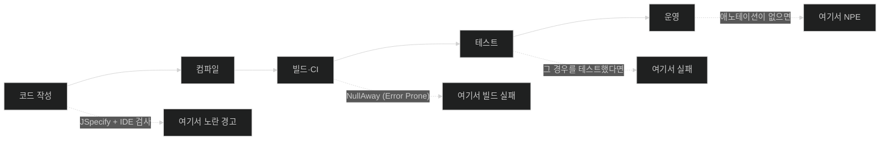

# JSpecify로 null 안전한 애플리케이션 쓰기

## 한눈에 보기

| 질문 | 핵심 답 |
|---|---|
| 지금까지 Java에서 nullability는? | **암묵적**이었다. 시그니처만 봐서는 null이 올 수 있는지 알 수 없다. |
| JSpecify가 푸는 문제 | 여러 라이브러리의 `@Nullable`이 제각각 다른 뜻이던 상황을 **표준화**한다. |
| 애노테이션은 몇 개인가 | 4개 — `@NullMarked`, `@NullUnmarked`, `@NonNull`, `@Nullable` |
| 전부 다 붙여야 하나? | 아니다. `@NullMarked`로 **기본값을 뒤집는다.** |
| 하위 패키지에도 적용되나 | **안 된다.** 하위 패키지마다 `package-info.java`가 따로 필요하다. |
| 컴파일 오류가 나나? | 아니다. IDE 경고와 정적 분석 도구가 잡는다. 빌드 실패는 NullAway로 강제한다. |
| `Optional`을 대체하나? | 아니다. **보완한다.** |

## 1. 왜 이게 필요한가

### 출발 장면: 시그니처가 아무 말도 안 해 준다

[[04b-building-our-app-with-a-better-design]]의 `VideoService`에 검색 기능을 붙인다고 하자.

```java
Video getFirstVideosByName(String name) { ... }
```

이 한 줄을 보고 답할 수 없는 질문이 두 개 있다.

- **`name`에 `null`을 넘겨도 되나?** 넘기면 `NullPointerException`이 날까, 아니면 "전체 검색"으로 처리될까?
- **반환값이 `null`일 수 있나?** 못 찾으면 `null`을 줄까, 예외를 던질까?

시그니처는 침묵한다. 답을 알려면 **구현을 읽거나, 문서를 찾거나, 실행해 봐야** 한다. 세 번째가 가장 흔하다.

### 여기서 뭐가 무너지나

책의 진단 — "Java와 Spring 애플리케이션에서 nullability는 **암묵적인 개념**이었다. 메서드 시그니처는 값이 null일 수 있는지를 거의 나타내지 않았고, 그래서 우리는 `NullPointerException` 같은 문제를 **런타임에 발견하는** 일을 떠맡게 됐다."

"런타임에 발견"이 실제로 어떤 모습인지가 중요하다.

```java
Video v = videoService.getFirstVideosByName(query);
System.out.println(v.name());          // 여기서 NPE
```

- 컴파일러는 아무 말도 안 했다.
- 테스트에 "못 찾는 경우"가 없었다면 통과했다.
- **운영에서 특정 검색어가 들어왔을 때** 처음 터진다.
- 스택 트레이스는 `v.name()` 줄을 가리키지만, **진짜 원인은 `orElse(null)`을 쓴 서비스 쪽**이다.

정보가 없었던 것이 아니라 **정보가 코드에 적힐 자리가 없었던 것**이다. 서비스를 쓴 사람은 "못 찾으면 null"이라는 사실을 알고 있었을 것이다. 그저 그것을 시그니처에 쓸 방법이 없었을 뿐이다.

### 그래서 나온 생각

"이 자리에 null이 올 수 있는가"를 **타입 수준에 적고**, 그 약속이 지켜지는지 도구가 검사하게 한다. 이 성질이 **[[널-안전성]]**(= 값이 없을 수 있는 자리와 없어서는 안 되는 자리를 코드에 명시하고 도구가 검사할 수 있게 하는 성질)이다.

책의 서술 — "Spring Boot 4는 이 모델을 더 밀고 나가, Spring Framework 자신의 API 전반에 **[[JSpecify]]**(= Java의 nullness 애노테이션에 하나의 표준 의미를 부여하려는 명세)를 제공해 nullability 개념을 명시적이고 검증 가능하게(타입 시스템, IDE 검사, 정적 분석 도구를 통해) 만든다."

### 왜 하필 JSpecify인가

책은 "Why JSpecify?"라는 소제목으로 별도 문단을 둔다 — "Java에는 수년간 서로 경쟁하는 `@Nullable` 애노테이션 변종이 많았다. **JSpecify의 목표는 nullness 애노테이션을 잘 정의된 의미론으로 표준화하는 것**이다."

이 문제가 실제로 얼마나 성가셨는지는 이름을 나열해 보면 안다 — `javax.annotation.Nullable`(JSR-305), `org.jetbrains.annotations.Nullable`, `androidx.annotation.Nullable`, `org.springframework.lang.Nullable`… **같은 이름의 애노테이션이 최소 대여섯 개** 있었고, 어떤 것은 "이 필드가 null일 수 있다"를, 어떤 것은 "이 타입 사용이 null일 수 있다"를 뜻해 미묘하게 달랐다. 도구마다 인식하는 것도 달랐다.

비유하자면 `@NullMarked`는 **건물 전체를 금연 구역으로 지정하는 것**이다. 예전에는 방마다 "금연" 스티커를 붙여야 했지만, 이제 건물이 기본 금연이고 **흡연실만 따로 표시**한다. 표시해야 할 것이 훨씬 줄어든다.

→ 비유가 깨지는 지점: 건물 금연 규정은 상식적으로 별관이나 부속 건물에도 적용될 것 같다. 하지만 `@NullMarked`는 **하위 패키지에 상속되지 않는다.** `com.learningspringboot4`를 표시해도 `com.learningspringboot4.api`는 여전히 무표시 상태다. "건물"이라 부르지만 실제로는 **층마다 따로 지정해야 하는** 규정에 가깝다. 이것이 실무에서 가장 자주 놓치는 지점이다.

## 2. 어떻게 동작하는가

### 2.1 네 개의 애노테이션

책은 JSpecify가 정의하는 작고 집중된 애노테이션 집합을 이렇게 설명한다. 이 애노테이션들은 Java 코드에 **[[널-계약]]**(= 어떤 반환값·파라미터·필드가 null일 수 있는지를 타입 수준에서 선언한 약속)을 명시적으로 선언하게 해, 이전까지 암묵적이던 동작을 타입 시스템과 개발 도구가 검증할 수 있는 정보로 바꾼다.

- **`@NullMarked`** — non-null-by-default 범위를 정의한다. 패키지·클래스·모듈에 적용하면 그 범위는 명시적으로 달리 애노테이션되지 않는 한 암묵적으로 not-null이다. **null을 기본적으로 거부하는 규칙 기반 규범**을 세워 애노테이션 잡음을 줄이고 nullability 규칙을 명확하고 구속력 있게 만든다.
- **`@NullUnmarked`** — non-null-by-default 범위를 제공하지 **않는다.** 참조 타입은 패키지·클래스·모듈 수준에서 명시적으로 애노테이션되지 않는 한 nullability가 **미지정**이다. 주로 마이그레이션과 상호운용을 위한 것으로, 레거시나 서드파티 코드를 애노테이션 없이 두면서 팀이 **점진적으로** JSpecify를 도입할 수 있게 한다.
- **`@NonNull`** — 어떤 요소가 절대 null이어서는 안 된다고 알린다. `@NullMarked` 범위 안에서는 자주 중복이지만, 이해를 돕고, `@NullUnmarked` 범위를 걷어낼 때, 그리고 특히 혼합 작업·마이그레이션·레거시 코드에서 개별 값을 애노테이션할 때 유용하다.
- **`@Nullable`** — 값이 null일 수 있으며 호출자가 그 null을 처리할 것으로 기대된다고 명시한다. non-null 규칙에 대한 **의도적인 예외**를 나타낸다. 애플리케이션 경계(데이터 접근, 선택적 입력, 외부 연동 등)에서 자주 쓰여, null 검사가 누락됐을 때 도구가 신호를 보낼 수 있게 한다.

네 개를 두 축으로 정리하면 관계가 분명해진다.

| | **범위 전체의 기본값**을 정한다 | **개별 요소**를 지정한다 |
|---|---|---|
| null을 **금지** | `@NullMarked` | `@NonNull` |
| null을 **허용/미지정** | `@NullUnmarked` (미지정) | `@Nullable` (허용) |

왼쪽 열은 패키지·클래스·모듈에 붙이고, 오른쪽 열은 반환 타입·파라미터·필드·제네릭 인자에 붙인다.

> **Note (책 p.66)**: JSpecify는 `Optional`을 **대체하지 않는다.** `Optional`은 Java의 반환 타입 추상화다. JSpecify는 그것을 **보완**하며, 우리가 가장 적절한 추상화를 고를 수 있게 한다.

이 Note가 중요한 이유는 둘의 적용 범위가 다르기 때문이다. `Optional`은 **반환 타입에만** 쓸 수 있고(필드나 파라미터에 쓰는 것은 권장되지 않는다), 런타임 객체를 하나 더 만든다. JSpecify는 **파라미터·필드·제네릭 인자까지** 표시할 수 있고, 런타임에는 아무 비용이 없다. "반환값 하나가 없을 수 있다"는 `Optional`로, "이 API 전반의 null 규칙"은 JSpecify로 표현하는 식이다.

### 2.2 계약을 어기는 코드 — 도구가 무엇을 잡아 주나

책은 `VideoService`에 검색 메서드를 더한다. 이름에 파라미터 값이 포함된 첫 비디오를 반환하는 API다.

```java
@NonNull Video getFirstVideosByName(@NonNull String name) {
       return videos.stream().filter(n ->
           n.name().contains(name)).findFirst().orElse(null);
}
```

책의 설명 — "`@NonNull` 애노테이션은 `getFirstVideosByName` 메서드가 **절대 null을 반환해서는 안 되고 파라미터로 null을 받아서도 안 된다**고 단언한다. 이 예에서 메서드는 `orElse(null)`을 통해 null을 반환함으로써 계약을 위반하며, 최신 IDE는 즉시 경고로 표시하고 해당 줄을 정확히 짚어 준다."

여기서 **핵심적으로 이해할 점**이 있다. 이 코드는 **컴파일된다.** `@NonNull`은 컴파일러에게 아무 강제력이 없다 — 그저 메타데이터일 뿐이다. 잡아 주는 것은 **[[정적-분석]]**(= 프로그램을 실행하지 않고 소스나 바이트코드만 읽어 문제를 찾아내는 검사)이다.

호출하는 쪽도 검사 대상이다. 책은 "null일 수 있는 파라미터로 같은 메서드를 호출하면 IDE가 역시 경고한다"고 하며 두 번째 화면을 보여 준다.

### 2.3 하나하나 다 붙여야 하나

책은 독자의 반응을 그대로 옮긴다 — "좋아, 그런데 메서드마다 반환값, 파라미터, 필드 등에 전부 애노테이션을 붙여야 하나? **그렇다. 하지만** `@NullMarked`를 써서 패키지, 모듈, 심지어 인터페이스와 클래스에 default-no-null을 설정할 수 있다."

`package-info.java` 파일에 이렇게 쓴다.

```java
@NullMarked
package com.learningspringboot4;

import org.jspecify.annotations.NullMarked;
```

책의 설명 — "`package-info.java`에 `@NullMarked`를 추가하면 `com.learningspringboot4` 패키지의 **모든 타입이 기본적으로 non-null**이 되고, `@Nullable`은 null이 계약의 명시적 일부인 곳에만 쓰인다."

`package-info.java`라는 파일 이름이 낯설 수 있는데, 이것은 **패키지 자체에 애노테이션과 Javadoc을 붙이기 위해 존재하는 Java의 특수 파일**이다. 클래스를 담지 않고 `package` 선언과 그 위의 애노테이션만 갖는다.

이 설정이 [[04b-building-our-app-with-a-better-design]]에서 본 **[[베이스-패키지]]**(= 컴포넌트 스캔이 시작되는 기준 패키지)와 같은 `com.learningspringboot4`라는 점도 우연이 아니다 — 애플리케이션 코드가 한 패키지에 모여 있으니 한 번 지정으로 전부 덮인다.

그리고 곧바로 함정을 경고한다 — "**패키지 수준 애노테이션은 하위 패키지에 상속되지 않으므로**, 같은 null 안전성 규칙을 원한다면 **각 하위 패키지가 자기 `package-info.java`를 정의해야 한다.**"

```text
com.learningspringboot4              ← package-info.java 에 @NullMarked  ✅ 적용됨
com.learningspringboot4.api          ← 별도 package-info.java 없음        ❌ 미지정 상태
com.learningspringboot4.service      ← 별도 package-info.java 없음        ❌ 미지정 상태

▶ 패키지를 나누는 순간 null 규칙이 조용히 사라진다.
▶ 오류도 경고도 나지 않는다 — 그냥 검사가 안 될 뿐이다. 가장 알아채기 어려운 형태의 누락이다.
```

### 2.4 제네릭 타입 인자까지

책은 "그럼 제네릭 타입에 대한 `@NullMarked`는?"이라는 질문을 던지고 답한다 — "JSpecify 애노테이션은 **[[제네릭-타입-인자]]**(= `List<Video>`의 `Video`처럼 각괄호 안에 들어가는 타입)에도 적용할 수 있어, 컬렉션 **자체**뿐 아니라 그 **원소**에 대해서도 nullability를 표현할 수 있다. 패키지가 `@NullMarked`로 애노테이션되어 있으므로, non-null-by-default 규칙이 `com.learningspringboot4` 패키지 안 `VideoService` 클래스의 `List<VideoV2>` 같은 제네릭 선언에도 자동으로 적용된다."

```java
private List<VideoV2> videosV2 = List.of(
     new VideoV2("MATRIX", "Matrix - Reload"),
     new VideoV2("Lord of the Rings", "The Fellowship"));
```

이 선언은 **목록 자체도, 그 원소들도 non-null이어야 함**을 나타낸다.

원소에 null을 허용하려면 제네릭 인자에 직접 붙인다.

```java
private List<@Nullable VideoV2> videosV2 = List.of(
     new VideoV2("MATRIX", "Matrix - Reload"),
     new VideoV2("Lord of the Rings", "The Fellowship"));
```

그리고 세 번째 층이 있다 — "컬렉션에 null 원소를 허용한다고 해서 **`VideoV2` 객체 내부의 null 값까지 자동으로 허용되는 것은 아니다.** 필드는 여전히 기본적으로 non-null이며, null이 허용되어야 하면 명시적으로 `@Nullable`을 붙여야 한다."

```java
record VideoV2(String name, @Nullable String description) {}
```

책이 짚듯 "속성 `description`에 `@Nullable`이 추가되면 그때 null 값을 가질 수 있다."

**세 층이 각각 독립적**이라는 것이 이 절의 요점이다.

```text
List<@Nullable VideoV2> videosV2

  ①  List  자체가 null 일 수 있는가?         → 패키지 @NullMarked → 아니오
  ②  List 의 원소가 null 일 수 있는가?        → @Nullable VideoV2 → 예
  ③  VideoV2 안의 description 이 null 일까?  → record 선언의 @Nullable → 예
      VideoV2 안의 name 이 null 일까?        → 표시 없음 → 아니오

  ▶ ②를 허용해도 ③은 여전히 금지다. 층을 건너뛰어 전파되지 않는다.
  ▶ 이 정밀함이 JSpecify가 "잘 정의된 의미론"을 목표로 한다는 말의 실체다.
```

`VideoV2`가 **[[레코드]]**(= 필드 목록만 선언하면 나머지를 컴파일러가 만드는 불변 데이터 클래스)라는 점도 [[08-versioning-apis-with-spring-boot-4]]와 이어진다 — 거기서 `version = "2"` handler가 반환하던 타입의 실제 정의가 이것이다. `Video`에 없던 `description` 필드가 있고, 그 필드가 null일 수 있다는 것까지 계약에 적혀 있다.

### 2.5 IDE 경고로는 부족하다

> **Note (책 p.68)**: IDE 검사는 코드를 쓰는 동안 즉각적인 피드백을 주지만, **나중에 nullability 위반이 도입되는 것을 막지는 못한다.** 더 엄격한 보장을 위해서는 **[[NullAway]]**(= Error Prone 위에서 도는 정적 분석 도구로 JSpecify 계약 위반 시 빌드를 실패시킨다) 같은 빌드 타임 강제 도구(Error Prone을 통해 통합)를 써서 JSpecify nullability 계약이 위반될 때 빌드를 실패시켜 전체 코드베이스에 일관성을 보장할 수 있다. `https://github.com/uber/NullAway`와 `https://errorprone.info`에서 더 알아볼 수 있다.

이 Note가 짚는 차이는 **"경고"와 "게이트"의 차이**다.

| | IDE 검사 | NullAway (빌드 강제) |
|---|---|---|
| 언제 | 타이핑하는 동안 | 빌드할 때 |
| 누구에게 | 그 IDE를 쓰는 사람만 | **모든 사람과 CI** |
| 무시할 수 있나 | 예 — 노란 줄을 지나치면 그만 | 아니오 — 빌드가 실패한다 |
| 팀 일관성 | IDE·설정마다 다르다 | 저장소 전체에 동일 |

즉 JSpecify 애노테이션만으로는 **아무것도 강제되지 않는다.** 애노테이션은 정보를 적을 자리를 만들 뿐이고, 그 정보를 강제로 만드는 것은 별도 도구의 몫이다.

### 2.6 무엇을 얻었나

책의 마무리 — "전체적으로 JSpecify는 Spring API 전반의 채택과 결합되어 `NullPointerException`을 만날 가능성을 크게 줄이고, 개발자가 미묘한 null 관련 문제를 일찍 표시할 수 있게 해 **디버깅 시간이 줄고 잠 못 이루는 밤이 줄어드는** 결과를 낳는다."

"Spring API 전반의 채택"이 특히 중요하다. 우리 코드에만 애노테이션을 붙이면 우리 코드 안에서만 검사되지만, **Spring Framework 자신의 API가 JSpecify로 표시되어 있으면** Spring 메서드를 호출하는 순간부터 검사가 작동한다. Boot 4의 기여는 애노테이션 네 개가 아니라 **프레임워크 API 전체에 계약이 적혀 있다**는 사실이다.

## 3. 그림으로 보기

### null이 문제로 드러나는 시점이 앞당겨진다



애노테이션이 하는 일은 오류를 없애는 것이 아니라 **발견 시점을 왼쪽으로 옮기는 것**이다.

### 애노테이션 네 개의 자리

```text
                범위 전체의 기본값               개별 요소
              ┌──────────────────────┐   ┌──────────────────────┐
  null 금지   │  @NullMarked         │   │  @NonNull            │
              │  package / class /   │   │  반환 · 파라미터 ·    │
              │  module 에 붙인다    │   │  필드 · 제네릭 인자   │
              └──────────────────────┘   └──────────────────────┘
              ┌──────────────────────┐   ┌──────────────────────┐
  null 허용   │  @NullUnmarked       │   │  @Nullable           │
  · 미지정    │  (미지정 상태로 둔다) │   │  (명시적 예외)        │
              │  레거시 · 점진 도입   │   │  경계 · 선택적 입력   │
              └──────────────────────┘   └──────────────────────┘

  ▶ @NullMarked 안에서는 @NonNull 이 대개 중복이다 — 이미 기본값이므로.
  ▶ 그래도 쓰는 이유: 읽는 사람에게 의도를 강조하거나,
    @NullUnmarked 영역 안에서 그 요소만 예외로 지정할 때.
```

### 계약 위반 — 반환값

![[_assets/lsb4-p92-fig2-12-jspecify-nonnull-return-warning.png]]
> 출처: *Learning Spring Boot 4*, p.67 (Figure 2.12)

IDE 메시지가 정확히 무엇을 지적하는지 읽어 볼 값이 있다 — "Expression `videos.stream().filter(...).findFirst().orElse(null)` might evaluate to null but is returned by the method declared as `@NonNull`". **"null이다"가 아니라 "null일 수 있다(might)"**라고 말한다. 정적 분석은 실행하지 않으므로 "가능성"까지만 판정한다.

### 계약 위반 — 파라미터

![[_assets/lsb4-p92-fig2-13-jspecify-nonnull-argument-warning.png]]
> 출처: *Learning Spring Boot 4*, p.67 (Figure 2.13)

`Argument 'name' might be null`이라는 경고와 함께 IDE가 `Assert 'name != null'` 같은 수정 액션을 제안한다. 화면 왼쪽의 `if(name.isBlank()) name = null;`이 그 근거다 — 호출 직전에 `null`이 대입될 수 있는 경로가 있다.

이 화면에는 책 본문 리스팅에 나오지 않는 컨트롤러 메서드가 함께 보인다.

```java
@GetMapping("/api/videos/get-first-by-name")
public Video getFirstByName(@RequestParam String name) { ... }
```

`getFirstVideosByName`을 실제로 호출하는 쪽이 이 API 엔드포인트라는 맥락을 스크린샷이 보충해 주는 셈이다.

## 4. 이 노트에 나온 용어

| 용어 | 한 줄 풀이 | 자세히 |
|---|---|---|
| 널 안전성 | null 가능 여부를 코드에 명시하고 도구가 검사하게 하는 성질 | [[_glossary#널-안전성]] |
| JSpecify | Java nullness 애노테이션에 표준 의미를 부여하는 명세 | [[_glossary#JSpecify]] |
| 널 계약 | 반환값·파라미터·필드의 null 가능 여부를 타입 수준에 선언한 약속 | [[_glossary#널-계약]] |
| 정적 분석 | 실행하지 않고 소스·바이트코드만 읽어 문제를 찾는 검사 | [[_glossary#정적-분석]] |
| NullAway | JSpecify 계약 위반 시 빌드를 실패시키는 정적 분석 도구 | [[_glossary#NullAway]] |
| 제네릭 타입 인자 | `List<Video>`의 `Video`처럼 각괄호 안에 들어가는 타입 | [[_glossary#제네릭-타입-인자]] |
| 레코드 | 필드 목록만 선언하면 나머지를 컴파일러가 만드는 불변 데이터 클래스 | [[_glossary#레코드]] |
| 베이스 패키지 | 컴포넌트 스캔이 시작되는 기준 패키지 | [[_glossary#베이스-패키지]] |

## 5. 자주 헷갈리는 것

### `@Nullable`과 `Optional`

둘 다 "없을 수 있음"을 말하지만 쓸 수 있는 자리가 다르다. `Optional`은 **반환 타입** 전용이고 런타임 객체를 만든다. `@Nullable`은 파라미터·필드·제네릭 인자까지 붙일 수 있고 런타임 비용이 없다. 책의 Note가 "대체가 아니라 보완"이라고 한 이유다.

### 애노테이션이 붙었다 vs 강제된다

`@NonNull`은 **컴파일 오류를 만들지 않는다.** 잡아 주는 것은 IDE 검사나 NullAway 같은 도구다. 애노테이션은 정보를 적을 자리이고, 강제는 별도 장치다.

### `@NullMarked`와 하위 패키지

가장 자주 놓치는 지점이다. 패키지 애노테이션은 **상속되지 않는다.** `com.example`에 붙여도 `com.example.service`는 무표시다. 그리고 무표시일 때 나는 것은 오류가 아니라 **아무 일도 안 일어남**이라 알아채기 어렵다.

### `@NullUnmarked`와 "애노테이션 안 붙임"

결과는 비슷하지만 의도가 다르다. 애노테이션을 안 붙인 것은 "아직 생각해 보지 않음"이고, `@NullUnmarked`는 **"여기는 의도적으로 미지정으로 둔다"**는 명시적 선언이다. 마이그레이션 중인 영역을 표시하는 데 쓴다.

### 컬렉션의 null vs 원소의 null vs 필드의 null

`List<@Nullable VideoV2>`는 **원소만** null을 허용한다. 목록 자체도, `VideoV2` 안의 필드도 여전히 non-null이다. 세 층이 각각 따로 표시된다.

## 6. 언제 안 쓰나 / 경계

- JSpecify는 **런타임 검사가 아니다.** 애노테이션이 붙어 있어도 리플렉션·역직렬화·외부 호출을 통해 실제 null이 들어올 수 있다. [[05-creating-json-based-apis]]의 `@RequestBody`로 들어온 JSON에 필드가 빠져 있으면 `@NonNull` 표시와 무관하게 null이 된다.
- 정적 분석은 "가능성"을 판정하므로 **거짓 양성**이 나올 수 있다. 실제로는 null이 아닌데 경고가 뜨는 경우가 생기고, 그때 무작정 `@SuppressWarnings`로 덮으면 검사 자체가 무의미해진다.
- 기존 코드베이스에 한 번에 `@NullMarked`를 적용하면 경고가 수백 개 뜬다. `@NullUnmarked`가 존재하는 이유가 이것이며, 패키지 단위로 점진 도입하는 것이 현실적이다.
- 서드파티 라이브러리가 JSpecify를 채택하지 않았다면 그 API 경계에서는 검사가 끊긴다. Boot 4의 값이 "Spring API 전반 채택"에 있는 것도 이 때문이다.
- IDE 검사만 켜 두고 빌드 강제를 넣지 않으면, 팀원마다 다른 IDE 설정에 따라 검사 결과가 달라진다. 일관성이 필요하면 NullAway를 CI에 넣어야 한다.

## 7. 연결

- [[08-versioning-apis-with-spring-boot-4]] — 거기서 이름만 나온 `VideoV2` record의 실제 정의가 이 노트에 있다. 버전 2 계약에 `description`이 추가되고 그것이 nullable이라는 사실까지 코드에 적힌다.
- [[05-creating-json-based-apis]] — 외부에서 들어온 JSON은 JSpecify 계약을 지켜 주지 않는다. 애플리케이션 경계에서 `@Nullable`이 자주 쓰이는 이유가 여기 있다.
- [[04b-building-our-app-with-a-better-design]] — `@NullMarked`를 붙이는 `package-info.java`의 패키지가 그 노트의 베이스 패키지와 같다. 애플리케이션 코드가 한 패키지에 모여 있다는 구조가 여기서 이득이 된다.

## 8. 스스로 확인

1. `Video getFirstVideosByName(String name)`라는 시그니처만 보고 답할 수 없는 두 가지 질문은 무엇인가?
2. NPE가 "런타임에 발견된다"는 말의 구체적 모습을 네 단계로 그릴 수 있는가?
3. JSpecify가 표준화하려는 대상은 무엇이었나? 왜 그것이 문제였나?
4. 애노테이션 네 개를 "범위/개별" × "금지/허용" 두 축으로 배치할 수 있는가?
5. `@NullMarked` 안에서 `@NonNull`이 대개 중복인데도 쓰는 이유는?
6. `@NonNull`을 붙인 메서드가 `orElse(null)`을 반환해도 **컴파일되는** 이유는?
7. `@NullMarked`를 붙였는데 하위 패키지에서 검사가 안 되는 상황이 왜 알아채기 어려운가?
8. `List<@Nullable VideoV2>`에서 null이 허용되는 것과 금지되는 것을 세 층으로 나눠 말할 수 있는가?
9. IDE 경고와 NullAway의 차이를 "경고"와 "게이트"로 설명할 수 있는가?
10. JSpecify가 `Optional`을 대체하지 않는 이유를 적용 범위로 설명할 수 있는가?

> 열 문항을 스스로 답한 **뒤에** [[_10-writing-null-safe-applications-with-jspecify]]에서 모범답안과 대조한다. 먼저 열면 이 문항들은 다시 인출 문제로 쓸 수 없다.

<!-- ==== 아래는 내 영역 · 스킬 수정 금지 ==== -->

## 내 설명 시도


## 막혔던 지점


## 리뷰 이력
