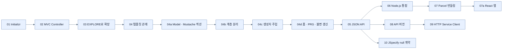
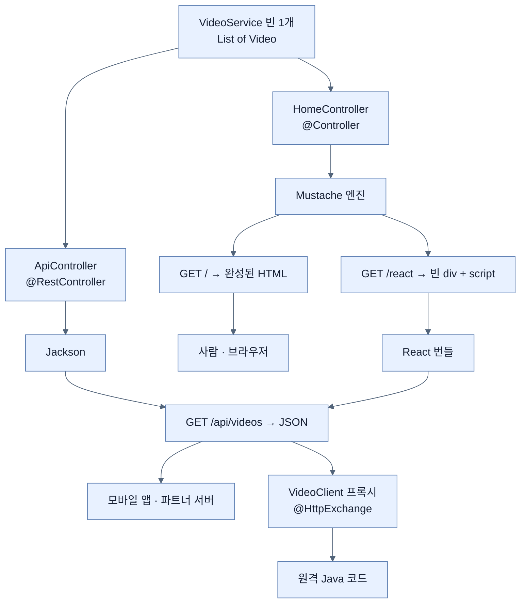

# Chapter 2 개념 지도 — Creating Web and API Applications with Spring Boot

> Chapter 2는 "웹 기능 목록"을 훑는 장이 아니다. **비디오 목록 하나**를 두고 `프로젝트 골격 → 컨트롤러 → 템플릿 → 계층 분리 → 폼 쓰기 → JSON API → JavaScript 프런트엔드 → 계약 버전 → null 계약`으로 같은 데이터를 여덟 번 다르게 다루면서, 매번 "이 표현을 늘리면 무엇이 함께 늘어나는가"를 묻는 장이다. 원문 누락 여부는 [[_coverage]]에서 추적한다.

## 읽는 순서



| 순서 | 노트 | 원문에서 답하는 질문 | 책 쪽 |
|---|---|---|---:|
| 01 | [[01-using-start-spring-io-to-build-apps]] | 버전이 서로 맞는 프로젝트 골격을 어떻게 얻나? | 26–29 |
| 02 | [[02-creating-a-spring-mvc-web-controller]] | HTTP 요청이 내 Java 메서드에 어떻게 도달하나? | 30–31 |
| 03 | [[03-augmenting-an-existing-project-with-initializr]] | 이미 굴러가는 프로젝트에 의존성을 어떻게 안전하게 더하나? | 31–33 |
| 04 | [[04-leveraging-templates-to-create-content]] | 뷰 이름 문자열이 어떻게 HTML 파일이 되나? | 33–35 |
| 04a | [[04a-adding-demo-data-to-a-template]] | 서버 데이터를 템플릿에 어떻게 넘기고 반복 출력하나? | 35–37 |
| 04b | [[04b-building-our-app-with-a-better-design]] | 컨트롤러가 데이터까지 들고 있으면 언제 무너지나? | 37–39 |
| 04c | [[04c-injecting-dependencies-through-constructor-calls]] | 아무도 `new`를 안 부르는데 객체가 어떻게 조립되나? | 39–40 |
| 04d | [[04d-changing-the-data-through-html-forms]] | 폼 제출을 받아 불변 목록을 어떻게 "바꾸나"? | 40–43 |
| 05 | [[05-creating-json-based-apis]] | 같은 데이터를 기계가 읽을 형식으로 어떻게 내보내나? | 43–48 |
| 06 | [[06-integrating-nodejs-with-a-spring-boot-web-app]] | Java 빌드가 JavaScript 도구를 어떻게 부리나? | 48–50 |
| 07 | [[07-bundling-javascript-with-nodejs]] | 흩어진 JS 모듈이 어떻게 브라우저용 파일 하나가 되나? | 50–52 |
| 07a | [[07a-creating-a-reactjs-app]] | 상태가 바뀌면 화면이 따라오는 구조는 어떻게 만드나? | 52–58 |
| 08 | [[08-versioning-apis-with-spring-boot-4]] | 공개한 계약을 깨지 않고 어떻게 바꾸나? | 59–62 |
| 09 | [[09-calling-versioned-apis-with-http-service-clients]] | 버전이 있는 API를 소비하는 쪽은 무엇을 선언하나? | 62–65 |
| 10 | [[10-writing-null-safe-applications-with-jspecify]] | "이 값이 null일 수 있다"를 코드에 어떻게 적나? | 65–69 |

## 축 1: 같은 데이터, 네 가지 소비자

이 축의 질문은 **"누가 이 비디오 목록을 읽는가, 그리고 그 소비자마다 무엇이 달라지는가?"**다. Chapter 2의 절반은 이 표를 채워 가는 과정이다.



| 소비자 | 진입 애노테이션 | 표현 변환기 | 계약이 깨지는 신호 | 핵심 노트 |
|---|---|---|---|---|
| 사람 (브라우저) | `@Controller` | Mustache | 화면이 빈다 (조용히) | [[04a-adding-demo-data-to-a-template]] |
| 기계 (모바일·파트너) | `@RestController` | Jackson | 파싱 오류·필드 누락 | [[05-creating-json-based-apis]] |
| 브라우저 안 JS | `@Controller` + `@RestController` 둘 다 | Mustache(부트스트랩) + Jackson(데이터) | 번들 로드 실패·fetch 오류 | [[07a-creating-a-reactjs-app]] |
| 원격 Java 코드 | `@HttpExchange` (나가는 쪽) | RestClient + Jackson | 컴파일은 통과, 런타임 404 | [[09-calling-versioned-apis-with-http-service-clients]] |

세 번째 줄이 이 장의 클라이맥스다 — `/react` 화면은 **서버 템플릿과 JSON API를 동시에** 쓴다. 템플릿은 빈 자리와 스크립트 태그만 주고, 내용은 브라우저가 API로 채운다.

## 축 2: 같은 결정이 어느 파일에 사는가

이 축의 질문은 **"이걸 바꾸려면 어느 파일을 열어야 하는가?"**다. Chapter 2는 같은 종류의 결정이 계속 다른 자리로 옮겨 다니는 장이라, 이 축이 없으면 "그 설정이 어디 있었더라"에서 막힌다.

| 결정 | 사는 곳 | 바꾸면 언제 반영되나 | 노트 |
|---|---|---|---|
| 어떤 기술을 쓸 것인가 | `pom.xml`의 스타터 | 빌드 시점 (클래스패스가 바뀐다) | [[03-augmenting-an-existing-project-with-initializr]] |
| 어떤 URL을 받을 것인가 | `@GetMapping`/`@PostMapping` | 시작 시점 (매핑 표가 만들어진다) | [[02-creating-a-spring-mvc-web-controller]] |
| 어떤 화면으로 보일 것인가 | `templates/*.mustache` | 요청 시점 (렌더링할 때) | [[04-leveraging-templates-to-create-content]] |
| 어떤 객체가 어디에 꽂히는가 | 생성자 시그니처 | 시작 시점 (컨텍스트 조립) | [[04c-injecting-dependencies-through-constructor-calls]] |
| JS를 어디서 읽고 어디로 낼 것인가 | `package.json`의 `source`·`distDir` | 빌드 시점 (`generate-resources`) | [[07-bundling-javascript-with-nodejs]] |
| 버전을 요청 어디에서 읽을 것인가 | `spring.mvc.apiversion.use.*` | 시작 시점 (전략 빈 구성) | [[08-versioning-apis-with-spring-boot-4]] |
| 버전을 요청 어디에 실을 것인가 | `ApiVersionInserter` | 시작 시점 (클라이언트 프록시 구성) | [[09-calling-versioned-apis-with-http-service-clients]] |
| null을 기본 금지할 것인가 | `package-info.java`의 `@NullMarked` | 검사 시점 (IDE·NullAway) | [[10-writing-null-safe-applications-with-jspecify]] |

**세 번째 열이 이 표의 핵심이다.** "빌드 시점"에 정해지는 것은 실행 중에 바꿀 수 없고, "요청 시점"에 정해지는 것은 재시작 없이 바뀐다. Chapter 1의 `빌드 시점 → 시작 시점 → 실행 객체` 축이 Chapter 2에서 실제 파일 목록으로 구체화된 것이다.

## 축 3: 화면을 누가 그리는가

이 축의 질문은 **"HTML이 만들어지는 장소가 어디로 옮겨 가면 무엇이 함께 옮겨 가는가?"**다. 04·04a·04d와 07a가 정확히 같은 기능(목록 보기 + 항목 추가)을 서로 다른 장소에서 구현하므로, 두 묶음을 나란히 놓으면 트레이드오프가 그대로 보인다.

| | 서버 렌더링 ([[04d-changing-the-data-through-html-forms]]) | 브라우저 렌더링 ([[07a-creating-a-reactjs-app]]) |
|---|---|---|
| HTML을 만드는 주체 | Mustache 엔진 (서버) | React 컴포넌트 (브라우저) |
| 데이터가 화면에 닿는 경로 | `Model` → 템플릿 | `fetch` → `setState` |
| 첫 화면까지 요청 수 | 1 | 최소 3 (HTML → 번들 → API) |
| 항목 추가 후 | 302 → 전체 페이지 재요청 | (책 코드에서는) 페이지 재로드 |
| 화면 상태가 사는 곳 | 서버 (요청마다 새로 계산) | 브라우저 (컴포넌트 state) |
| 빌드에 필요한 것 | 없음 | Node·npm·번들러 |
| 무엇이 깨지면 화면이 빈다 | 모델 속성 이름 오타 | 번들 로드 실패·`id="app"` 누락 |

두 방식은 **같은 `/api/videos`와 같은 `VideoService`를 공유한다.** 갈리는 것은 표현 계층뿐이라는 점이 [[04b-building-our-app-with-a-better-design]] 리팩터링이 이 장 전체를 지탱하는 이유다.

## 축 4: 무엇이 바뀌면 누가 깨지는가

이 축의 질문은 **"이 변경의 파급 범위는 어디까지인가?"**다. 계약과 결합도를 함께 보는 축이다.

```text
변경이 안전한 순서 (안쪽 → 바깥쪽)

  ┌─ VideoService 내부 구현 ──────────────────────── 아무도 안 깨진다
  │    인메모리 목록 → DB 로 교체해도 컨트롤러는 그대로     (04b)
  │
  ├─ Mustache 템플릿의 HTML ──────────────────────── 사람만 본다
  │    <ul> → <table> 로 바꿔도 API 소비자는 무사       (04a)
  │
  ├─ 컨트롤러 메서드 이름 · 클래스 이름 ─────────────── 아무도 안 깨진다
  │    애노테이션만 유지되면 기계는 이름을 안 본다        (02)
  │
  ├─ URL 경로 ────────────────────────────────────── 링크를 가진 모두
  │    북마크 · 외부 문서 · 클라이언트 코드              (08)
  │
  └─ record 의 필드 이름 · 타입 ─────────────────────── JSON 소비자 전원
       내부 리팩터링처럼 보이지만 공개 계약 변경이다      (05 → 08)

  ▶ 아래로 갈수록 파급이 크다. 버전 관리가 필요해지는 지점은 아래 두 칸이다.
  ▶ 그리고 그 두 칸의 변경은 코드만 보면 "필드 하나 추가"처럼 사소해 보인다 —
    이것이 API 버전 관리가 자동으로 떠오르지 않는 이유다.
```

## 축 5: 문제가 생겼을 때 어디를 먼저 보나

| 관찰된 증상 | 먼저 볼 곳 | 이유 |
|---|---|---|
| 404 — 컨트롤러는 썼는데 | 클래스가 베이스 패키지 안에 있는가 | 컴포넌트 스캔 범위 밖이면 애노테이션이 무의미하다 |
| 500 — 요청할 때만 | `templates/`에 그 이름의 파일이 있는가 | 뷰 이름 오타는 시작 시점에 안 잡힌다 |
| 화면은 뜨는데 목록이 빈다 | 모델 속성 이름과 `{{#이름}}`이 같은가 | Mustache는 이름을 못 찾아도 오류를 안 낸다 |
| 415 Unsupported Media Type | 요청의 `Content-Type` 헤더 | `@RequestBody`는 헤더로 변환기를 고른다 |
| `UnsupportedOperationException` | `List.of()`로 만든 목록에 `add()` | 컴파일은 되고 런타임에만 터진다 |
| POST 두 번 들어감 | PRG를 썼는가 (`redirect:`) | 새로고침이 POST를 재전송한다 |
| `/index.js` 404 | Parcel `distDir`이 `target/classes/static`인가 | 소스 쪽 `static/`이 아니라 산출물 쪽이어야 한다 |
| 항상 v1 응답만 온다 | 서버 `use.*`와 클라이언트 inserter가 짝인가 | 어긋나면 조용히 default로 처리된다 |
| 운영에서만 NPE | 그 패키지에 `@NullMarked`가 있는가 | 하위 패키지는 상속받지 않는다 |

## 이름으로 원리를 기억하기

| 이름 | 이름이 붙은 이유 | 기억할 경계 |
|---|---|---|
| Initializr | **초기화까지만** 해 준다 | 아키텍처·도메인은 만들어 주지 않는다 |
| Controller | 무엇을 할지 **통제**한다 | 직접 그리지 않는다 — 무엇을 그릴지만 정한다 |
| logical view name | **논리적**이라 물리 경로가 아니다 | 파일이 없어도 시작 시점에는 조용하다 |
| Mustache | `{{`가 누우면 **콧수염** | 로직이 없어서 오타가 오류가 아니라 침묵이 된다 |
| autowiring | 배선을 **자동으로** | 타입이 모호하면 자동으로 안 고르고 실패한다 |
| PRG | Post → **Redirect** → Get | 302여야 한다. 301이면 URL이 영구 이동으로 기억된다 |
| `@RestController` | REST + Controller | 강제하는 것은 REST 전체가 아니라 **본문 직렬화 하나** |
| Parcel | 흩어진 것을 하나로 **싸서** 보낸다 | 되돌아가지 않는다 — 모듈 경계가 사라진다 |
| React | 상태 변화에 **반응**해 다시 그린다 | `setState`를 불러야만 반응한다 |
| `@HttpExchange` | HTTP 요청-응답 **한 쌍** | 방향이 나가는 쪽이다 (`@GetMapping`은 들어오는 쪽) |
| ApiVersionInserter | 나가는 요청에 버전을 **끼워 넣는다** | 서버 쪽 전략과 짝이 맞아야 한다 |
| JSpecify | Java를 **명세한다** | 애노테이션은 정보일 뿐, 강제는 NullAway의 몫 |
| `@NullMarked` | null 규칙이 **표시된** 범위 | 하위 패키지에 상속되지 않는다 |

## 책과 공식 문서·표준 사이에서 주의할 네 지점

1. **`shadow DOM`이 아니라 `virtual DOM`이다.** 책은 React의 갱신 메커니즘을 "shadow DOM"이라 부르지만, Shadow DOM은 웹 컴포넌트의 **캡슐화**를 위한 별개의 브라우저 표준이다. 책이 설명하는 동작(가상 노드로 변경분 계산)은 virtual DOM이다 — [[07a-creating-a-reactjs-app]].
2. **`await fetch(...).json()`은 동작하지 않는다.** `fetch`는 `Promise<Response>`를 반환하므로 `.json()`이 없다. 응답을 먼저 `await`해야 한다 — [[07a-creating-a-reactjs-app]].
3. **`npm install`은 번들을 만들지 않는다.** 책이 두 단계를 붙여 서술하지만, 의존성 설치와 번들 빌드는 별개의 execution이다 — [[07-bundling-javascript-with-nodejs]].
4. **버전 프로퍼티는 책이 든 둘보다 많다.** Boot 4.1.0 공식 `WebMvcProperties.Apiversion`에는 `supported` 목록도 있고, 위반 시 `MissingApiVersionException`·`InvalidApiVersionException`이 난다 — [[08-versioning-apis-with-spring-boot-4]].

## 나의 취약 엣지

- 아직 Chapter 2 인출 연습을 시작하지 않았으므로 실제 stall 기반 취약 엣지는 기록하지 않았다.
- 이후 막힘은 [[../../_global/gaps|전역 gaps]]에 `chapter-2-creating-web-and-api-applications-with-spring-boot` 카테고리로 추가한다.
- 우선 확인 후보(현재 "약점"이 아니라 읽을 때 구분해야 할 경계): `@Controller` vs `@RestController`, `@ModelAttribute` vs `@RequestBody`, safe vs idempotent, state vs props, 불변 컬렉션 vs thread-safe, 서버 `version` vs 클라이언트 `version`, virtual DOM vs Shadow DOM, `templates/` vs `static/`.

## 관련 Chapter

- [[../../part-1-the-basics-of-spring-boot/chapter-1-core-features-of-spring-boot/_map|Chapter 1 · Core Features]] — 스타터·자동 구성·구성 프로퍼티·BOM이 이 장에서 실제 프로젝트로 구체화된다.
- [[../chapter-3-querying-for-data-with-spring-boot/01-adding-spring-data-to-an-existing-application|Chapter 3 · Spring Data 추가]] — `VideoService`의 인메모리 목록을 실제 저장소로 교체한다. [[04b-building-our-app-with-a-better-design]]의 계층 분리가 그때 값을 한다.
- [[../chapter-3-querying-for-data-with-spring-boot/02-dtos-entities-and-pojos|Chapter 3 · DTO·엔티티·POJO]] — [[05-creating-json-based-apis]]에서 드러난 "record 필드 추가 = 계약 변경" 문제를 타입 분리로 다룬다.
- [[../chapter-4-securing-an-application-with-spring-boot/08c-invoking-an-oauth-2-api-remotely|Chapter 4 · 외부 API 호출]] — [[09-calling-versioned-apis-with-http-service-clients]]의 HTTP Service Interface 모델을 실제 외부 서비스에 적용한다.
- [[../../part-4-scaling-an-application-with-spring-boot/chapter-9-writing-reactive-web-controllers/05-rendering-reactive-templates|Chapter 9 · 리액티브 템플릿]] — [[04-leveraging-templates-to-create-content]]의 명령형 서버 렌더링과 대비된다.
