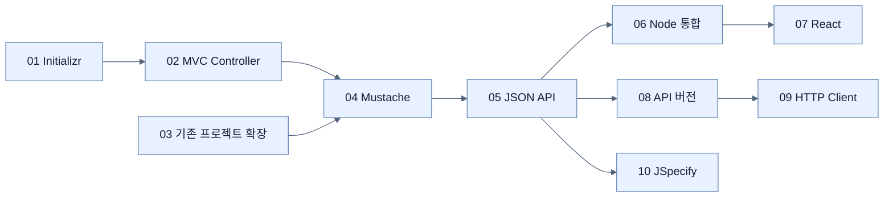

# Chapter 2 지도 — Web and API Applications

## 기능 성장 흐름

## 표현 경계 축

| 소비자 | 진입 애노테이션 | 표현 | 핵심 노트 |
|---|---|---|---|
| 브라우저 페이지 | `@Controller` | Mustache HTML | [[04-leveraging-templates-to-create-content]] |
| 기계·SPA | `@RestController` | Jackson JSON | [[05-creating-json-based-apis]] |
| 원격 Java 코드 | `@HttpExchange` | 타입 있는 HTTP client | [[09-calling-versioned-apis-with-http-service-clients]] |

## 변경 위험 축

`화면 상태 복잡성 → React`, `공개 계약 변화 → API versioning`, `값의 부재 → JSpecify`로 서로 다른 위험을 다룬다.

## 다음 Chapter로

현재 `VideoService`는 메모리 목록만 가진다. Chapter 3은 이를 엔티티와 Spring Data 저장소로 교체한다.

