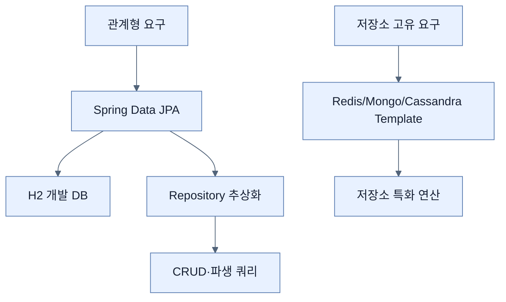

# 기존 애플리케이션에 Spring Data 추가하기

## 한눈에 보기

Spring Data는 모든 저장소를 하나의 최저 공통 API로 평준화하지 않고, 저장소별 template과 공통적인 repository 추상화를 함께 제공한다. 책은 관계형 저장소를 선택하고 Spring Data JPA, H2 드라이버·콘솔, JPA 테스트 지원을 기존 프로젝트에 추가한다.

## 1. 왜 이게 필요한가

메모리 목록은 재시작하면 사라지고 동시 접근·검색·트랜잭션을 제대로 처리하지 못한다. 관계형 DB는 스키마와 ACID가 강점이고, Redis·MongoDB·Cassandra 같은 NoSQL은 키/값, 문서, 분산 확장 등 서로 다른 장점이 있다. 데이터 모델과 일관성 요구에 맞는 저장소를 먼저 고르는 이유다.

## 2. 어떻게 동작하는가

1. 관계형 DB와 JPA를 선택한다.
2. Initializr EXPLORE로 `spring-boot-starter-data-jpa`, H2 관련 모듈, 테스트 지원을 확인한다.
3. 클래스패스를 감지한 Boot가 DataSource, JPA 공급자, 트랜잭션 인프라를 조건부 구성한다.
4. 개발 중에는 인프로세스 H2로 빠르게 시작하고 repository로 도메인 연산을 표현한다.

template은 저장소 고유 기능을 세밀하게 쓰는 조종석이고 repository는 반복 CRUD를 도메인 언어로 줄이는 자동 모드다. 둘은 경쟁 대안이 아니라 복잡도에 따라 함께 쓸 수 있다.

## 3. 그림으로 보기

## 4. 이 노트에 나온 용어

- **Spring Data**: 저장소별 특성을 살리면서 일관된 repository 모델도 제공하는 프로젝트군.
- **data template**: 특정 데이터 저장소의 자원 관리와 고유 연산을 감싼 API.
- **H2**: Java로 작성된 인메모리/파일 기반 관계형 데이터베이스.
- **JPA**: Java 객체와 관계형 데이터의 영속성 모델을 표준화한 명세.

## 7. 연결

- [[02-dtos-entities-and-pojos]] — 영속화할 타입과 외부 전송 타입을 구분한다.
- [[03-creating-repositories-and-declarative-queries]] — 추가한 모듈로 첫 repository를 정의한다.
- [[chapter-5-testing-with-spring-boot/06-adding-testcontainers|Testcontainers]] — 개발용 H2와 운영 DB 차이를 실제 컨테이너 테스트로 줄인다.

## 8. 스스로 확인

- 전체 1차 정리 후: Spring Data가 모든 저장소에 완전히 같은 API를 강제하지 않는 이유를 설명한다.

<!-- ==== 아래는 내 영역 · 스킬 수정 금지 ==== -->

## 내 설명 시도

## 막혔던 지점

## 리뷰 이력

