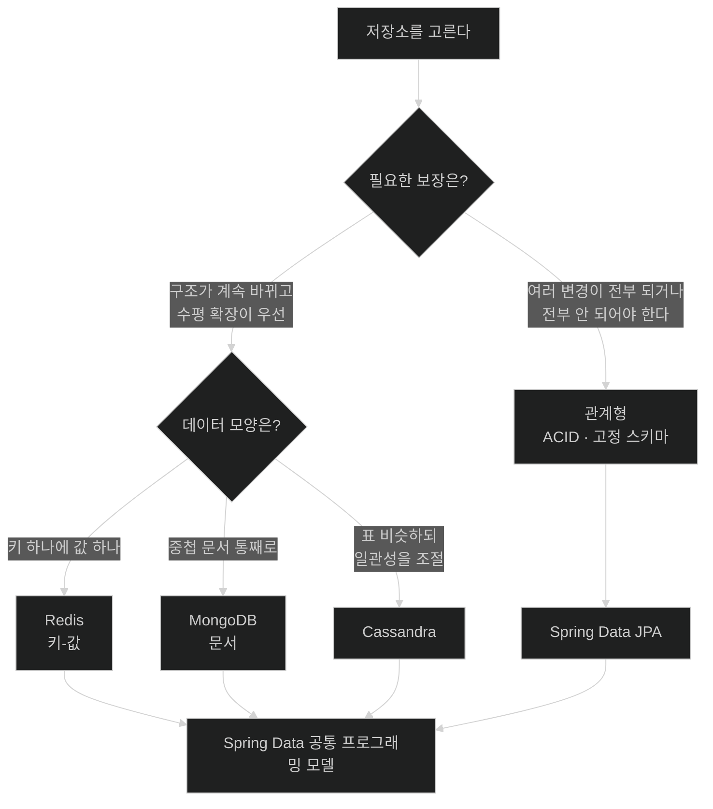

# 데이터 저장소 고르기 — 관계형과 NoSQL의 교환 조건

## 한눈에 보기

| 질문 | 핵심 답 |
|---|---|
| 코드를 쓰기 전에 정해야 할 것 | **어떤 저장소를 쓸 것인가.** 이 결정이 이후 모든 데이터 코드를 규정한다. |
| 관계형이 여전히 기본값인 이유 | 성숙도, ACID 보장, 도구 생태계. Initializr 프로젝트의 **약 80%**가 관계형이다. |
| NoSQL 세 갈래 | Redis(키/값), MongoDB(문서), Cassandra(표 비슷하지만 일관성을 조절) |
| NoSQL이 완화하는 것 | 사전 스키마, 고정 필드, 즉시 일관성 |
| 완화의 대가 | 완전한 트랜잭션 보장이 최적화 대상이 아니었다 |
| 이 장의 선택 | **관계형.** 다만 Spring Data의 프로그래밍 모델은 양쪽에 걸쳐 있다. |

## 1. 왜 이게 필요한가

### 출발 장면: 시연까지 시간이 없다

Chapter 2에서 만든 웹 페이지를 프로그램 매니저에게 보여 줬다. 반응은 좋았는데 요구가 하나 붙는다 — **피치에 쓰려면 지금 이 화면을 진짜 데이터에 빨리 연결해 달라**는 것이다.

지금 `VideoService`가 들고 있는 것은 [[../chapter-2-creating-web-and-api-applications-with-spring-boot/04b-building-our-app-with-a-better-design|Chapter 2에서 만든]] 메모리 위의 `List<Video>`뿐이다. 애플리케이션을 재시작하면 폼으로 추가한 비디오가 전부 사라진다. "진짜 데이터"란 그 목록이 프로세스보다 오래 사는 곳에 놓인다는 뜻이다.

### 여기서 뭐가 무너지나

당장 떠오르는 해법은 "그냥 데이터베이스에 넣자"다. 그런데 그 한마디를 실행에 옮기려면 **먼저 답해야 하는 질문**이 있다. 어떤 데이터베이스인가?

이 질문을 건너뛰고 아무거나 고르면 세 가지가 무너진다.

1. **데이터 모델이 저장소를 따라간다.** 문서 저장소를 고르면 중첩 구조가 자연스럽고, 관계형을 고르면 표로 쪼개 조인해야 한다. 나중에 바꾸면 도메인 클래스부터 다시 그린다.
2. **보장의 수준이 달라진다.** "결제와 재고 차감이 동시에 되거나 동시에 안 된다"를 저장소가 보장해 주는지 아닌지가 애플리케이션 코드의 복잡도를 결정한다.
3. **되돌리기가 가장 비싼 결정이다.** 웹 프레임워크는 바꿀 수 있고 템플릿 엔진도 바꿀 수 있다. 하지만 운영 중인 데이터를 다른 저장소로 옮기는 일은 별도 프로젝트가 된다.

### 그래서 나온 생각

**저장소마다 무엇을 포기하고 무엇을 얻는지를 먼저 본다.** 그 위에서 지금 만드는 애플리케이션에 필요한 보장이 무엇인지로 고른다.

비유하자면 **[[관계형-데이터베이스]]**(= 데이터를 행과 열의 표에 저장하고 표 사이의 관계를 키로 표현하는 저장소)는 **회계 장부**다. 칸이 정해져 있고, 한 거래는 차변과 대변이 함께 기록되거나 아예 기록되지 않는다. **[[NoSQL]]**(= 관계형 모델의 제약 일부를 완화한 저장소들을 묶어 부르는 말)은 **현장 메모지 묶음**이다. 아무 형식으로나 빨리 적을 수 있고, 여러 사람이 동시에 쌓아도 서로 막지 않는다.

→ 비유가 깨지는 지점: 회계 장부는 종이 한 권이라 한 사람만 쓸 수 있어 느릴 것 같지만, 현대 관계형 데이터베이스는 동시성 제어로 초당 수천 건의 트랜잭션을 병렬 처리한다. **관계형이 느린 것이 아니다.** 비싼 것은 "여러 대의 기계에 데이터를 흩어 놓고도 즉시 일치를 보장하는 일"이며, 그건 장부가 한 권일 때는 아예 생기지 않는 문제다. 비유의 "종이 한 장"은 단일 노드 이야기일 뿐이라 여기서 멈춘다.

`NoSQL`이라는 이름도 그래서 오해를 부른다. 처음에는 문자 그대로 "SQL을 쓰지 않는다"는 뜻으로 붙었지만, 지금은 대개 **"Not only SQL"**(SQL만이 답은 아니다)로 다시 읽힌다. 실제로 많은 NoSQL 제품이 SQL 비슷한 질의 언어를 갖고 있다.

## 2. 어떻게 동작하는가

### 2.1 관계형이 기본 선택인 근거

책은 숫자를 하나 든다. SpringOne 기조연설에서 언급된 바로, **Spring Initializr로 만들어지는 프로젝트의 약 80%가 관계형 데이터베이스를 쓴다.**

이 숫자가 말하는 것은 "관계형이 우월하다"가 아니라 **"기본값을 벗어나려면 이유가 있어야 한다"**에 가깝다. 책이 드는 근거는 넷이다.

| 근거 | 실제로 무엇을 뜻하나 |
|---|---|
| 성숙도 | 수십 년간 쌓인 운영 경험, 알려진 실패 모드, 튜닝 방법 |
| 강한 **[[ACID]]**(= 원자성·일관성·격리성·지속성) 보장 | "절반만 반영된 상태"를 애플리케이션이 처리하지 않아도 된다 |
| 풍부한 도구 | 마이그레이션·백업·모니터링·GUI 클라이언트가 이미 있다 |
| 약 80%의 채택률 | 팀에 아는 사람이 있고, 문제를 검색하면 답이 나온다 |

두 번째가 특히 코드에 직접 영향을 준다. ACID가 없으면 "결제는 됐는데 재고는 안 줄었다"는 상태를 애플리케이션이 스스로 감지하고 보정해야 한다. 그 보정 로직이 곧 복잡도다.

### 2.2 NoSQL 세 갈래가 각각 잘하는 일

책은 탐색해 볼 만한 세 가지를 든다. 셋이 서로 다른 문제를 푼다는 점이 중요하다.

| 저장소 | 모델 | 책이 강조한 강점 | 이 강점이 나오는 이유 |
|---|---|---|---|
| **Redis** | **[[키-값-저장소]]**(= 키 하나에 값 하나를 대응시키는 저장 모델) | 매우 빠르고 대량의 키-값에 효과적. TTL, 원자적 연산, 집계·카운터용 풍부한 자료구조 | 조회 경로가 "키 → 값" 한 단계뿐이라 인덱스 탐색과 조인이 아예 없다 |
| **MongoDB** | **[[문서-저장소]]**(= 중첩 구조 문서를 통째로 한 레코드로 저장하는 모델) | 여러 단계 중첩 문서 저장, 문서를 처리해 집계 데이터를 만드는 파이프라인 | 함께 읽을 데이터가 한 문서 안에 있어 조인 없이 한 번에 읽힌다 |
| **Apache Cassandra** | 표 비슷한 구조 | **일관성을 성능과 맞바꿀 수 있는** 제어권 | 데이터가 여러 노드에 복제되어 있어, 몇 개에게 물어볼지를 요청마다 고를 수 있다 |

Cassandra의 예를 책이 구체적으로 든다 — 정족수(quorum) 노드에서 읽는 것은 모든 복제본을 기다리는 것보다 **빠르면서도** 단일 노드 읽기보다는 **강한 보장**을 준다. 즉 일관성이 켜짐/꺼짐의 이분법이 아니라 **눈금**이 된다.

### 2.3 SQL의 제약이 실제로 하는 일

책의 서술 — SQL 데이터 저장소는 역사적으로 데이터 구조를 미리 정의하고, 키를 강제하고, 그 밖의 제약을 두는 **강한 요구**를 가져 유연성의 여지가 거의 없었다.

여기서 **[[스키마]]**(= 저장할 데이터의 구조를 미리 정의해 둔 것)를 "번거로운 절차"로만 읽으면 절반만 이해한 것이다. 스키마가 실제로 하는 일은 이렇다.

1. **읽는 쪽이 구조를 가정할 수 있게 한다.** — `name` 컬럼이 항상 있으니 조회 코드가 `null` 검사를 덜 한다.
2. **잘못된 쓰기를 데이터베이스가 거부한다.** — 애플리케이션 버그가 데이터를 오염시키는 경로를 하나 막는다.
3. **최적화의 근거가 된다.** — 타입과 제약을 알아야 인덱스와 실행 계획을 제대로 세운다.

즉 제약은 **비용이자 동시에 보장의 출처**다. 이 점을 잡아야 다음 절의 트레이드오프가 보인다.

### 2.4 NoSQL이 완화하는 것과 그 대가

책이 정리하는 완화는 셋이다.

- 상당수가 **사전 스키마 설계를 요구하지 않는다.**
- **선택적 속성**을 가질 수 있어, 같은 keyspace나 컬렉션 안의 한 레코드가 다른 레코드와 다른 필드를 가질 수 있다.
- 확장성, **[[최종적-일관성]]**(= 시간이 지나면 모든 복제본이 같은 값으로 수렴한다는 보장), 내결함성에서 더 많은 유연성을 준다.

그리고 대가를 분명히 적는다 — NoSQL 저장소는 **완전한 트랜잭션 보장을 목표로 최적화된 것이 아니었고**, 트랜잭션 성능이 주된 최적화 초점이 아니었다. 현대 NoSQL 시스템 대부분이 지금은 트랜잭션을 지원하지만 **범위·일관성 수준·성능에 제약이 따른다.**

책의 마지막 문장이 이 절 전체의 요지다.

> 일반적으로, NoSQL 저장소가 관계형 저장소의 모든 기능(일관성, 트랜잭션, 고정 구조)을 흉내 내려 든다면, 아마도 그것들을 더 빠르고 확장성 있게 만들어 준 바로 그 특징을 잃게 될 것이다.

**빠름은 기능을 더 넣어서 얻은 것이 아니라 빼서 얻은 것**이라는 말이다. 그래서 다시 넣으면 사라진다.

### 2.5 이 장의 선택과 그 경계

책은 관계형을 고른다. 근거는 §2.1의 넷이고, 표현은 "데이터 접근을 배우기 시작하기에 자연스러운 출발점"이다.

다만 곧바로 경계를 그어 둔다 — **이 장의 예제는 관계형을 쓰지만, 다루는 기능은 SQL 기반 시스템에 국한되지 않는다.** **[[Spring-Data]]**(= 저장소별 모듈과 repository 추상화를 제공하는 Spring 프로젝트군)가 관계형과 비관계형을 아우르는 **일관된 프로그래밍 모델**을 제공하기 때문이다.

이 문장이 그냥 홍보 문구가 아니라 실제로 어떤 구조에서 나오는 것인지가 다음 노트의 주제다 — [[01a-using-spring-data-to-easily-manage-data]].

## 3. 그림으로 보기

### 무엇을 포기하고 무엇을 얻는가



마지막 합류 지점이 이 장의 전제다 — 어느 쪽을 골라도 repository라는 같은 모양의 코드를 쓰게 된다.

### 제약과 보장은 같은 것의 앞뒤다

```text
        [제약을 건다]                          [보장을 받는다]

  구조를 미리 정의한다        ────────▶   읽는 쪽이 필드 존재를 가정할 수 있다
  키와 제약을 강제한다        ────────▶   잘못된 쓰기를 DB가 거부한다
  타입을 고정한다             ────────▶   인덱스와 실행 계획을 세울 수 있다
  모든 복제본의 일치를 기다린다 ───────▶   방금 쓴 값을 방금 읽을 수 있다

        [제약을 푼다]                          [보장을 놓는다]

  스키마 없이 쓴다            ────────▶   레코드마다 필드가 달라 읽는 쪽이 방어해야 한다
  선택적 속성을 허용한다      ────────▶   "없는 필드"와 "빈 값"의 구분이 흐려진다
  정족수만 확인한다           ────────▶   방금 쓴 값을 못 읽을 수 있다 (최종적 일관성)

  ▶ NoSQL이 빠른 것은 기능을 더해서가 아니라 위 오른쪽 열을 일부 포기해서다.
  ▶ 그래서 그 보장을 다시 요구하면 속도 이점도 함께 줄어든다.
```

## 4. 이 노트에 나온 용어

| 용어 | 한 줄 풀이 | 자세히 |
|---|---|---|
| Spring Data | 저장소별 모듈과 repository 추상화를 제공하는 Spring 프로젝트군 | [[_glossary#Spring-Data]] |
| 관계형 데이터베이스 | 데이터를 표에 저장하고 관계를 키로 표현하는 저장소 | [[_glossary#관계형-데이터베이스]] |
| NoSQL | 관계형 모델의 제약 일부를 완화한 저장소들 | [[_glossary#NoSQL]] |
| 키-값 저장소 | 키 하나에 값 하나를 대응시키는 저장 모델 | [[_glossary#키-값-저장소]] |
| 문서 저장소 | 중첩 구조 문서를 통째로 한 레코드로 저장하는 모델 | [[_glossary#문서-저장소]] |
| 최종적 일관성 | 시간이 지나면 모든 복제본이 같은 값으로 수렴한다는 보장 | [[_glossary#최종적-일관성]] |
| ACID | 원자성·일관성·격리성·지속성 네 성질 | [[_glossary#ACID]] |
| 스키마 | 저장할 데이터의 구조를 미리 정의해 둔 것 | [[_glossary#스키마]] |

## 5. 자주 헷갈리는 것

### "NoSQL은 스키마가 없다"

정확히는 **데이터베이스가 스키마를 강제하지 않는다**는 뜻이지 스키마가 없다는 뜻이 아니다. 읽는 코드는 여전히 어떤 필드가 있을 것이라 가정하고 동작한다. 스키마가 데이터베이스에서 애플리케이션 코드로 **옮겨 갔을 뿐**이며, 그래서 "스키마리스"보다 "schema-on-read"라는 표현이 더 정확하다.

### 최종적 일관성 vs 데이터 손실

최종적 일관성은 "값이 사라진다"가 아니라 **"지금 이 노드에서는 아직 안 보일 수 있다"**이다. 시간이 지나면 수렴한다. 반면 [[../chapter-2-creating-web-and-api-applications-with-spring-boot/04d-changing-the-data-through-html-forms|Chapter 2에서 본]] 경쟁 상태는 변경이 **영영 사라지는** 문제라 성격이 다르다.

### NoSQL이 빠르다

무엇에 대해 빠른지를 빼고 말하면 틀린다. Redis가 빠른 것은 **키로 하나 꺼내는 일**에 대해서다. 여러 조건으로 검색하고 집계하는 작업이라면 잘 인덱싱된 관계형 데이터베이스가 더 빠를 수 있다.

### 저장소 선택 vs 접근 방식 선택

이 노트는 "어디에 저장하나"를 다뤘다. "어떻게 접근하나"(template이냐 repository냐)는 별개의 결정이며 [[01a-using-spring-data-to-easily-manage-data]]의 주제다.

## 6. 언제 안 쓰나 / 경계

- 이 절의 논의는 **한 애플리케이션이 저장소 하나를 고른다**는 전제 위에 있다. 실제로는 주 저장소는 관계형, 캐시는 Redis, 검색은 Elasticsearch처럼 섞어 쓰는 구성이 흔하다. 그때는 "무엇을 어디에 두는가"가 새 질문이 된다.
- "약 80%"는 Initializr로 프로젝트를 만든 시점의 선택 비율이지 성공률이나 적합도가 아니다. 근거로 쓸 때 범위를 넘기지 않는 것이 좋다.
- 이 장은 저장소 **선택**만 다루고 운영(백업, 마이그레이션, 이중화)은 다루지 않는다. 실무에서 저장소 결정의 무게는 대부분 운영 쪽에 있다.
- 관계형을 고른다고 ACID가 자동으로 따라오지 않는다. 트랜잭션 경계를 코드에서 열어야 하고, 그 경계가 어디인지는 [[02b-pojos-and-the-spring-programming-model]]에서 다룬다.

## 7. 연결

- [[01a-using-spring-data-to-easily-manage-data]] — 저장소를 골랐다면 그다음은 "그 저장소에 어떻게 접근하는가"다. Spring Data가 저장소마다 다른 모듈을 두는 이유가 이 노트의 트레이드오프에서 나온다.
- [[01b-adding-spring-data-jpa-to-our-project]] — 이 노트에서 내린 "관계형" 결정을 실제 의존성으로 옮긴다.
- [[02-dtos-entities-and-pojos]] — 저장소가 정해지면 그 저장소에 맞는 타입(엔티티)과 외부에 내보낼 타입(DTO)을 구분해야 한다.

## 8. 스스로 확인

1. 저장소 결정을 건너뛰고 아무거나 고르면 무너지는 세 지점은 무엇인가?
2. 관계형이 기본 선택인 네 가지 근거 중, **애플리케이션 코드 복잡도에 직접 영향을 주는 것**은 무엇인가?
3. Redis·MongoDB·Cassandra가 각각 잘하는 일이 다른 이유를 데이터 모델로 설명할 수 있는가?
4. Cassandra의 정족수 읽기가 "일관성은 눈금"이라는 말을 어떻게 보여 주는가?
5. 스키마를 "번거로운 절차"가 아니라 "보장의 출처"로 설명할 수 있는가? 세 가지를 들어 보라.
6. "NoSQL이 관계형의 모든 기능을 흉내 내면 장점을 잃는다"는 말의 논리는 무엇인가?
7. "NoSQL은 스키마가 없다"는 표현이 왜 부정확한가?
8. 관계형을 골랐는데도 이 장의 내용이 NoSQL에도 통한다고 말할 수 있는 근거는 무엇인가?

> 여덟 문항을 스스로 답한 **뒤에** [[_01-adding-spring-data-to-an-existing-application]]에서 모범답안과 대조한다. 먼저 열면 이 문항들은 다시 인출 문제로 쓸 수 없다.

<!-- ==== 아래는 내 영역 · 스킬 수정 금지 ==== -->

## 내 설명 시도


## 막혔던 지점


## 리뷰 이력
