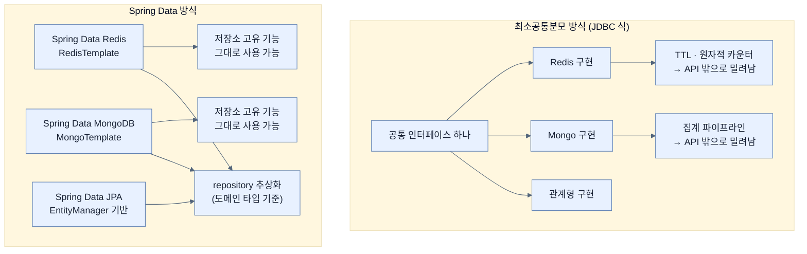

# Spring Data의 설계 방침 — 공통 API를 만들지 않는다

## 한눈에 보기

| 질문 | 핵심 답 |
|---|---|
| Spring Data가 **하지 않은** 선택 | 모든 저장소를 덮는 **하나의 범용 API**를 만드는 것 |
| 왜 안 했나 | 그러면 모든 저장소가 공통으로 가진 기능만 남는다. 그런데 우리가 그 저장소를 고른 이유는 대개 **공통이 아닌 기능** 때문이다. |
| 대신 무엇을 하나 | 저장소마다 **전용 모듈**을 둔다. |
| 저수준 진입점 | `RedisTemplate`, `MongoTemplate` 등. 공통 상위 타입이 **없다.** |
| 고수준 추상화 | repository — 도메인 타입만으로 조회·수정·삭제를 정의 |
| 그 사이와 그 위 | Query By Example, Querydsl, 그리고 필요하면 손으로 쓴 쿼리 |

## 1. 왜 이게 필요한가

### 출발 장면: JDBC로 Redis를 쓸 수 있는가

[[01-adding-spring-data-to-an-existing-application]]에서 저장소를 골랐다. 이제 그 저장소에 접근할 API가 필요하다.

Java에는 이미 익숙한 모범 사례가 있다. **[[JDBC]]**(= Java에서 관계형 데이터베이스에 접속해 SQL을 실행하기 위한 표준 API) 방식이다. 인터페이스를 하나 정의하고, 데이터베이스마다 그 인터페이스를 구현한 드라이버를 제공한다. 그래서 MySQL에서 PostgreSQL로 바꿔도 `Connection`·`Statement`·`ResultSet`을 쓰는 코드는 그대로다.

그러면 Spring Data도 그렇게 하면 되지 않을까? `DataStore`라는 인터페이스를 하나 만들고 Redis·MongoDB·JPA 구현을 각각 제공하면?

### 여기서 뭐가 무너지나

책의 진단은 짧고 결정적이다.

> 이 전술은 **모든 데이터 저장소가 공유하는 기능으로만** 접근을 줄이는 경향이 있다. 모든 저장소가 서로 다른 기능을 제공하므로, 우리가 어떤 저장소를 쓰고 싶게 만든 바로 그 예리한 특징들은 대개 그 공유 API에 없다!

구체적으로 무슨 일이 벌어지는지 보자. `DataStore` 인터페이스에 넣을 수 있는 연산은 **네 저장소 모두가 할 수 있는 것**뿐이다.

| 넣을 수 있는 것 | 넣을 수 **없는** 것 | 왜 못 넣나 |
|---|---|---|
| `save(id, value)` | Redis의 TTL(만료 시간) 설정 | 관계형 표에는 행 만료 개념이 없다 |
| `findById(id)` | MongoDB의 집계 파이프라인 | 키-값 저장소에는 파이프라인이 없다 |
| `delete(id)` | Cassandra의 요청별 일관성 수준 | 단일 노드 저장소에는 정족수가 없다 |
| | 관계형의 조인 | 문서 저장소는 조인을 전제하지 않는다 |

오른쪽 열이 **각 저장소를 고른 이유** 그 자체다. Redis를 고른 것은 TTL과 원자적 카운터 때문이고, MongoDB를 고른 것은 집계 파이프라인 때문이다. 공통 API를 만들면 그것들이 전부 API 밖으로 밀려나고, 결국 개발자는 인터페이스를 캐스팅해 벗겨 내거나 별도 경로로 우회한다. **추상화가 있으나 마나 해진다.**

이 실패 패턴이 **[[최소공통분모-API]]**(= 여러 구현체를 하나의 인터페이스로 덮을 때 모든 구현이 공통으로 지원하는 기능만 노출하게 되는 설계)다.

### 그래서 나온 생각

**공통 API를 아예 만들지 않는다.** 대신 저장소마다 그 저장소의 성격에 맞춘 모듈을 따로 둔다. 책의 표현대로 "**[[Spring-Data]]**(= 저장소별 모듈과 repository 추상화를 제공하는 Spring 프로젝트군)는 데이터 접근을 단순화하는 데 독특한 접근을 취한다. 모든 데이터베이스에 대해 하나의 범용 API를 노출하는 대신, **각 Spring Data 모듈이 그 아래에 있는 저장소의 강점과 특징에 맞춰 재단된다.**"

비유하자면 최소공통분모 API는 **만국 공용 여행 어댑터**다. 어느 나라 콘센트에도 꽂히지만, 그 나라 전용 고속 충전 규격은 못 쓴다. Spring Data는 나라마다 전용 어댑터를 따로 준다.

→ 비유가 깨지는 지점: 전용 어댑터는 나라를 옮기면 통째로 새로 사야 한다. 하지만 Spring Data는 그렇지 않다 — **어댑터가 두 층으로 되어 있기 때문**이다. 저장소 전용 template 층은 확실히 갈리지만, 그 위의 repository 층은 저장소를 바꿔도 코드 모양이 상당히 유지된다. 이 이중 구조가 §2.3의 핵심이며, 실제 어댑터에는 대응물이 없다.

## 2. 어떻게 동작하는가

### 2.1 저장소별 template — 공통 조상이 없다

책은 거의 모든 Spring Data 모듈이 template을 갖는다고 하며 넷을 든다.

- `RedisTemplate`
- `CassandraTemplate`
- `MongoTemplate`
- `CouchbaseTemplate`

그리고 곧바로 결정적인 한 문장을 덧붙인다 — **"이 template 클래스들은 어떤 공통 API의 자손이 아니다."**

이 문장을 흘려보내면 안 된다. 보통 이런 이름들이 나란히 있으면 `Template`이라는 공통 인터페이스가 있을 것 같지만, **없다.** 각 모듈이 자기 저장소의 강점과 특징을 중심으로 자기만의 핵심 template을 갖는다.

그렇다면 이름이 왜 다 `Template`으로 끝나는가? 그건 상속 관계 때문이 아니라 **Spring의 오래된 명명 관례** 때문이다. `JdbcTemplate`, `RestTemplate`, `TransactionTemplate`이 모두 같은 계열의 이름이며, 공통점은 타입이 아니라 **역할**이다 — 반복되는 자원 관리 절차(연결 열기, 오류 변환, 닫기)를 틀로 고정해 두고 달라지는 부분만 채워 넣게 한다.

**[[템플릿]]**(= 특정 저장소의 기능을 직접 다루기 위한 Spring Data의 저수준 진입점)들이 서로 독립적이면서도 비슷하게 느껴지는 이유를 책은 이렇게 설명한다 — 이 template들은 독립적이지만 **비슷한 생명주기를 공유하고 자원 관리 같은 공통 관심사를 처리한다.** 동시에 각각은 그 아래 저장소에 **특화된** 데이터 접근 연산과 기능을 제공한다.

정리하면 이렇다.

| | 공유되는 것 | 갈리는 것 |
|---|---|---|
| 무엇 | 생명주기, 자원 관리, 예외 처리 방식 | 실제 연산과 기능 |
| 형태 | 관례(같은 이름·같은 사용감) | 타입(공통 상위 인터페이스 없음) |
| 결과 | 새 저장소를 배울 때 **감이 온다** | 그 저장소의 고유 기능을 **다 쓸 수 있다** |

**관례로 묶고 타입으로는 묶지 않는다** — 이것이 §1의 딜레마에 대한 Spring Data의 답이다.

### 2.2 template 위의 층 — repository

template은 완전하고 세밀한 제어를 준다. 그런데 대부분의 코드는 그렇게까지 세밀한 제어가 필요 없다. "이름으로 비디오 찾기" 같은 흔한 연산을 하려고 매번 저장소 API를 직접 다루는 것은 과하다.

그래서 Spring Data는 더 높은 추상화도 함께 제공한다. 책의 서술 — 많은 Spring Data 모듈이 **repository 지원을 포함하며**, 그 덕분에 조회·수정·삭제를 **순전히 도메인 타입만 가지고** 정의할 수 있게 된다. 아래 저장소의 API를 직접 건드리지 않고서 말이다.

**[[리포지토리]]**(= 한 도메인 타입에 대한 데이터 연산을 한곳에 모으는 패턴이자 그 인터페이스)가 하는 일을 단계로 보면 이렇다.

1. 개발자가 **[[도메인-타입]]**(= 리포지토리가 다루는 대상 클래스)을 기준으로 인터페이스를 선언한다. — 저장소의 표 이름·컬럼 이름을 코드에 넣지 않기 위해서다.
2. Spring Data가 그 선언과 저장소 메타데이터를 읽는다. — 도메인 필드가 저장소의 무엇에 대응하는지 알아야 하기 때문이다.
3. 실제 쿼리를 만들어 실행하는 구현을 런타임에 제공한다. — 개발자가 저장소별 API를 배우지 않아도 되게 하기 위해서다.

이 세 단계 덕분에 repository를 쓰는 코드는 **저장소가 무엇인지 몰라도 읽힌다.** [[01-adding-spring-data-to-an-existing-application]]에서 "관계형을 골랐지만 이 장의 내용은 SQL 기반에 국한되지 않는다"고 한 근거가 여기다. 자세한 동작은 [[03-creating-repositories-and-declarative-queries]]에서 본다.

### 2.3 그래서 접근 방법이 층으로 쌓인다

책은 repository 너머의 선택지도 나열한다.

- **[[Query-By-Example]]**(= 조건을 도메인 객체에 부분적으로 채워 넣고 그 객체를 그대로 조회 조건으로 쓰는 방식)
- **[[Querydsl]]**(= Java 코드로 타입 안전한 쿼리를 조립하게 해 주는 외부 라이브러리) 통합

이 둘의 공통 설계 의도를 책이 명시한다 — **도메인 타입에 이미 존재하는 정보를 재사용해서** 쿼리를 쓰고 유지하는 수고를 줄이도록 설계됐다는 것이다. 그리고 그 결과를 이렇게 정리한다.

> 데이터 접근을 저수준 쿼리 문법에서 **도메인 객체 쪽으로** 옮김으로써, 개발자는 비즈니스 로직에 더 집중할 수 있다.

마지막으로 탈출구를 열어 둔다 — 더 복잡한 시나리오가 생기면 Spring Data는 여전히 **손으로 쓴 쿼리**를 허용한다.

이 네 가지를 늘어놓으면 **사다리**가 된다. 위로 갈수록 편하고 아래로 갈수록 자유롭다.

| 층 | 무엇으로 표현하나 | 얻는 것 | 잃는 것 | 이 장의 노트 |
|---|---|---|---|---|
| repository 파생 쿼리 | 메서드 **이름** | 쿼리를 아예 안 쓴다 | 조건이 작성 시점에 고정된다 | [[03-creating-repositories-and-declarative-queries]] |
| Query By Example | 부분적으로 채운 **객체** | 조건을 런타임에 조립 | 동등·문자열 비교 위주로 제한 | [[05-query-by-example-for-dynamic-search]] |
| Querydsl | 타입 안전한 **DSL 코드** | 복잡한 조건도 컴파일 검사 | 별도 라이브러리와 코드 생성 필요 | (이 책 범위 밖) |
| 손으로 쓴 쿼리 | JPQL / SQL **문자열** | 완전한 제어 | 타입 검사·방언 독립성 상실 | [[06-writing-custom-jpa-queries]] |

**이 사다리를 위에서부터 내려오며 필요한 만큼만 내려가는 것**이 Chapter 3 전체의 서술 순서이기도 하다.

## 3. 그림으로 보기

### 두 가지 설계와 그 결과



왼쪽은 타입으로 묶어서 기능을 잃고, 오른쪽은 **아래는 갈라 두고 위에서만 묶어** 둘 다 얻는다.

### 접근 방법의 사다리

```text
  편하다 ▲
        │  ┌──────────────────────────────────────────────┐
        │  │ repository 파생 쿼리                          │  findByNameContains(...)
        │  │ "메서드 이름이 곧 쿼리"                        │  → 쿼리를 안 쓴다
        │  └──────────────────────────────────────────────┘
        │  ┌──────────────────────────────────────────────┐
        │  │ Query By Example                              │  Example.of(probe, matcher)
        │  │ "부분적으로 채운 도메인 객체가 곧 조건"          │  → 조건을 런타임에 조립
        │  └──────────────────────────────────────────────┘
        │  ┌──────────────────────────────────────────────┐
        │  │ Querydsl                                      │  QVideo.video.name.contains(x)
        │  │ "타입 안전한 코드가 곧 쿼리"                    │  → 복잡해도 컴파일이 검사
        │  └──────────────────────────────────────────────┘
        │  ┌──────────────────────────────────────────────┐
        │  │ 손으로 쓴 JPQL / SQL                           │  @Query("select v from ...")
        │  │ "문자열이 곧 쿼리"                             │  → 완전한 제어, 검사는 없음
        │  └──────────────────────────────────────────────┘
  자유롭다▼
        └─ 그리고 그 아래에 template 층이 있다 (저장소 고유 기능 직접 호출)

  ▶ 위 칸일수록 "도메인 타입에 이미 있는 정보"를 더 많이 재사용한다.
  ▶ 아래로 내려가는 것은 실패가 아니라, 위 칸이 표현하지 못하는 것을 만났다는 신호다.
```

## 4. 이 노트에 나온 용어

| 용어 | 한 줄 풀이 | 자세히 |
|---|---|---|
| Spring Data | 저장소별 모듈과 repository 추상화를 제공하는 프로젝트군 | [[_glossary#Spring-Data]] |
| 최소공통분모 API | 공통 기능만 노출하게 되는 단일 인터페이스 설계 | [[_glossary#최소공통분모-API]] |
| JDBC | 관계형 DB 접속과 SQL 실행을 위한 Java 표준 API | [[_glossary#JDBC]] |
| 템플릿 | 저장소 고유 기능을 직접 다루는 저수준 진입점 | [[_glossary#템플릿]] |
| 리포지토리 | 한 도메인 타입의 데이터 연산을 한곳에 모으는 인터페이스 | [[_glossary#리포지토리]] |
| Query By Example | 부분적으로 채운 도메인 객체를 조회 조건으로 쓰는 방식 | [[_glossary#Query-By-Example]] |
| Querydsl | 타입 안전한 쿼리를 Java 코드로 조립하는 라이브러리 | [[_glossary#Querydsl]] |
| 도메인 타입 | 리포지토리가 다루는 대상 클래스 | [[_glossary#도메인-타입]] |

## 5. 자주 헷갈리는 것

### template vs repository

같은 저장소에 대한 **두 층**이지 경쟁 관계가 아니다. 판별 질문 — "이 저장소만의 기능을 써야 하는가?" 그렇다면 template, 도메인 타입 기준의 흔한 연산이면 repository다. 한 애플리케이션에서 둘을 함께 써도 된다.

### `Template`이라는 이름이 같다 vs 타입이 같다

`RedisTemplate`과 `MongoTemplate`은 이름만 닮았을 뿐 **공통 상위 타입이 없다.** 그래서 `Template t = condition ? redisTemplate : mongoTemplate;` 같은 코드는 성립하지 않는다. 이름의 공통점은 역할이지 계약이 아니다.

### "저장소를 바꿔도 코드가 그대로다"

repository 층에 한정된 이야기다. template을 쓴 코드, 저장소 고유 애노테이션(`@Entity` 등), 트랜잭션 의미론은 함께 옮겨 가지 않는다. Spring Data가 주는 것은 **이식성이 아니라 일관된 학습 곡선**에 가깝다.

### JDBC 방식이 나쁘다

아니다. JDBC의 목표는 **관계형 데이터베이스들 사이의** 이식성이었고 그 안에서는 성공했다. 문제는 그 방식을 관계형·키-값·문서·컬럼 저장소처럼 **모델 자체가 다른** 것들에 확장하려 할 때 생긴다.

## 6. 언제 안 쓰나 / 경계

- 저장소를 하나만 쓰고 그 저장소의 고유 기능을 깊게 쓴다면, repository 추상화가 오히려 한 겹 더 얹는 것이 될 수 있다. template을 직접 쓰는 편이 단순한 경우가 있다.
- repository로 표현되지 않는 연산은 결국 아래 층으로 내려가야 한다. 사다리의 존재 자체가 "repository만으로 다 된다"는 뜻이 아니라는 신호다.
- Querydsl은 이 책에서 이름만 언급되고 다루지 않는다. 코드 생성 단계가 빌드에 추가된다는 비용이 있다.
- 모듈이 저장소마다 따로라는 말은 **버전과 기능 지원도 저장소마다 따로**라는 뜻이다. 어떤 Spring Data 모듈에 있는 기능이 다른 모듈에는 없을 수 있다.

## 7. 연결

- [[01-adding-spring-data-to-an-existing-application]] — 저장소를 고르는 결정이 먼저 있고, 이 노트는 "고른 저장소에 어떻게 접근하는가"를 다룬다.
- [[01b-adding-spring-data-jpa-to-our-project]] — 이 방침이 실제 의존성으로 나타나면 `spring-boot-starter-data-jpa`라는 **JPA 전용 모듈**이 된다.
- [[03-creating-repositories-and-declarative-queries]] — 사다리의 맨 위 칸을 실제 코드로 확인한다.

## 8. 스스로 확인

1. 모든 저장소를 덮는 공통 인터페이스를 만들면 무엇이 API 밖으로 밀려나는가? 예를 두 개 들어 보라.
2. 그 밀려난 것들이 왜 하필 "그 저장소를 고른 이유"인가?
3. `RedisTemplate`과 `MongoTemplate`이 공통 상위 타입을 갖지 않는데도 비슷하게 느껴지는 이유는?
4. Spring Data가 "관례로 묶고 타입으로는 안 묶는다"는 말을 구체적으로 설명할 수 있는가?
5. repository가 도메인 타입만으로 동작할 수 있는 세 단계를 말할 수 있는가?
6. 접근 방법 사다리 네 칸을 "무엇으로 쿼리를 표현하는가" 기준으로 나열할 수 있는가?
7. 아래 칸으로 내려가는 것이 왜 실패가 아닌가?
8. "저장소를 바꿔도 코드가 그대로"라는 말의 실제 적용 범위는 어디까지인가?

<!-- ==== 아래는 내 영역 · 스킬 수정 금지 ==== -->

## 내 설명 시도


## 막혔던 지점


## 리뷰 이력
