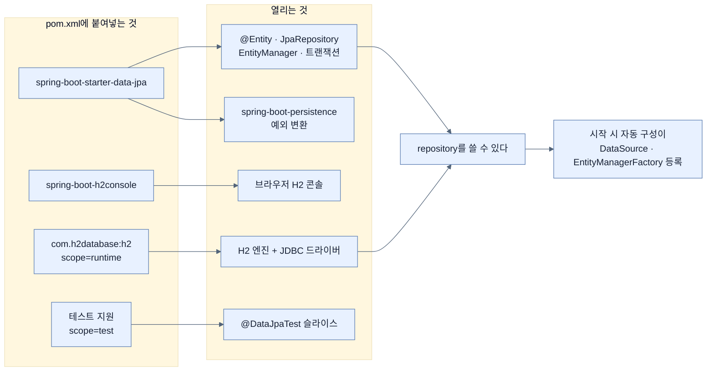

# Spring Data JPA와 H2 넣기 — Boot 4의 모듈 세분화

## 한눈에 보기

| 질문 | 핵심 답 |
|---|---|
| 넣는 방법 | Chapter 2와 **똑같은 EXPLORE 전술.** 새로 배울 절차가 없다. |
| 넣는 것 | `spring-boot-starter-data-jpa`, `spring-boot-h2console`, `h2`, 테스트 지원 |
| 왜 H2인가 | Java로 쓰인 JDBC 기반 관계형 DB. 설치 없이 프로세스 안에서 뜬다 → 프로토타이핑용 |
| Boot 4가 바꾼 것 ① | JPA를 넣으면 **테스트 지원 의존성이 자동 포함**된다 (빼도 된다) |
| Boot 4가 바꾼 것 ② | H2가 **드라이버와 콘솔로 분리**됐다 |
| Boot 4가 바꾼 것 ③ | 영속성 기반이 `spring-boot-persistence` 모듈로 옮겨졌다 |
| 공통 방향 | 숨은 기본 동작을 줄이고 **명시적 선택**으로 밀어낸다 |

## 1. 왜 이게 필요한가

### 출발 장면: 결정은 했는데 클래스패스에는 아무것도 없다

[[01-adding-spring-data-to-an-existing-application]]에서 **[[관계형-데이터베이스]]**(= 데이터를 표에 저장하고 관계를 키로 표현하는 저장소)를 쓰기로 정했고, [[01a-using-spring-data-to-easily-manage-data]]에서 접근 방식의 지형도를 봤다. 그런데 지금 프로젝트에는 `spring-boot-starter-webmvc`와 `spring-boot-starter-mustache`밖에 없다. `@Entity`도 `JpaRepository`도 컴파일되지 않는다.

게다가 데이터베이스 자체도 없다. 시연이 급한 상황에서 PostgreSQL 서버를 설치하고 계정을 만들고 스키마를 잡는 일부터 시작할 수는 없다.

### 여기서 뭐가 무너지나

의존성 좌표를 직접 찾아 쓰려 하면 [[../chapter-2-creating-web-and-api-applications-with-spring-boot/03-augmenting-an-existing-project-with-initializr|Chapter 2에서 본]] 그 문제가 그대로 돌아온다. 다만 이번에는 더 나쁘다.

1. **한 개가 아니라 네 개다.** 넷의 groupId·artifactId·scope를 전부 맞혀야 한다.
2. **Boot 4에서 이름이 바뀌었다.** Boot 3에서 통했던 좌표를 그대로 쓰면 없는 아티팩트가 된다. 이 장의 `spring-boot-h2console`이 정확히 그런 경우다.
3. **scope를 틀리면 조용히 잘못된다.** `h2`를 `runtime`이 아니라 기본 scope로 넣으면 컴파일도 되고 실행도 되지만, 애플리케이션 코드가 H2 클래스를 직접 참조할 수 있게 되어 나중에 다른 DB로 옮길 때 발목을 잡는다.

### 그래서 나온 생각

**좌표 계산은 다시 Initializr에 맡긴다.** 책의 표현대로 "이미 초안이 잡힌 앱에 Spring Data JPA와 H2를 추가하려면, Chapter 2에서 쓴 것과 같은 전술을 쉽게 쓸 수 있다."

여기서 저장소로는 **[[H2]]**(= Java로 작성된 JDBC 기반 관계형 데이터베이스)를 고른다. 책의 설명 — 이것은 Java로 쓰인 **[[JDBC]]**(= Java에서 관계형 DB에 접속해 SQL을 실행하기 위한 표준 API) 기반 관계형 데이터베이스이며, **프로토타이핑 작업에 효과적**이다.

비유하자면 Boot 3의 스타터는 **한 상자에 다 담긴 세트 상품**이었고, Boot 4는 그 세트를 **구성 부품으로 쪼개 놓고 필요한 것만 고르게** 한다. H2가 드라이버와 콘솔로 갈린 것이 정확히 그 예다.

→ 비유가 깨지는 지점: 부품을 고르는 자유는 **조립 책임도 함께** 준다. 세트 상품은 뜯으면 다 들어 있지만, 부품 방식에서는 콘솔을 안 넣으면 콘솔이 안 뜬다. 그래서 이 변화는 순수한 개선이 아니라 **책임 이전**이고, 업그레이드할 때 "Boot 3에서 되던 게 Boot 4에서 안 된다"는 형태로 드러난다. 부품 상자를 사면서 "당연히 다 들어 있겠지" 하는 순간 비유가 깨진다.

## 2. 어떻게 동작하는가

### 2.1 열 단계 절차

책은 절차를 열 단계로 적는다. 앞의 일곱은 브라우저에서, 뒤의 셋은 IDE에서 한다.

| 단계 | 하는 일 | 이 단계가 필요한 이유 |
|---:|---|---|
| 1 | `start.spring.io` 방문 | 좌표 계산의 근거를 Spring 팀 쪽에 둔다 |
| 2 | **같은** 프로젝트 artifact 정보 입력 | 지금 내 프로젝트와 같은 전제(Boot 버전·Java 버전) 위에서 계산되게 한다 |
| 3 | `DEPENDENCIES` 클릭 | 모듈 선택 화면을 연다 |
| 4 | **Spring Data JPA**와 **H2** 선택 | 이 장에서 필요한 두 축을 고른다 |
| 5 | `EXPLORE` 클릭 | ZIP을 받지 않고 결과만 본다 — 기존 프로젝트를 덮어쓰지 않기 위해서다 |
| 6 | `pom.xml` 찾아 클릭 | 계산된 좌표가 들어 있는 파일을 연다 |
| 7 | 의존성 네 개 복사 | 이름·버전·scope를 손으로 옮겨 적지 않기 위해서다 |
| 8 | IDE에서 기존 프로젝트 열기 | — |
| 9 | `pom.xml`의 dependencies 절에 붙여넣기 | — |
| 10 | IDE의 새로고침 버튼 | 클래스패스를 다시 계산해 새 타입이 보이게 한다 |

5단계가 이 절차의 핵심이라는 점은 Chapter 2와 같다. `GENERATE`를 눌렀다면 별개의 새 프로젝트가 내려왔을 것이다.

### 2.2 붙여넣는 네 개가 각각 무엇인가

```xml
<dependency>
    <groupId>org.springframework.boot</groupId>
    <artifactId>spring-boot-starter-data-jpa</artifactId>
</dependency>
<dependency>
    <groupId>org.springframework.boot</groupId>
    <artifactId>spring-boot-h2console</artifactId>
</dependency>
<dependency>
    <groupId>com.h2database</groupId>
    <artifactId>h2</artifactId>
    <scope>runtime</scope>
</dependency>
<dependency>
    <groupId>org.springframework.boot</groupId>
    <artifactId>spring-boot-starter-data-jpa-test</artifactId>
    <scope>test</scope>
</dependency>
```

| 의존성 | 무엇을 여는가 | scope |
|---|---|---|
| `spring-boot-starter-data-jpa` | **[[Spring-Data-JPA]]**(= JPA를 대상으로 하는 Spring Data 모듈)와 그 아래의 **[[JPA]]**(= Java 객체와 관계형 표를 대응시키는 표준 명세) 구현, 트랜잭션 기반 | 기본(compile) |
| `spring-boot-h2console` | 브라우저에서 H2 내용을 들여다보는 웹 콘솔 | 기본 |
| `com.h2database:h2` | H2 데이터베이스 엔진과 JDBC 드라이버 | **`runtime`** |
| 테스트 지원 | `@DataJpaTest` 같은 테스트 슬라이스 | **`test`** |

**[[의존성-scope]]**(= 어떤 의존성이 컴파일·테스트·실행 중 어느 단계에 필요한지 표시하는 값)가 왜 중요한지가 세 번째 줄에 드러난다. `runtime`은 **컴파일할 때는 안 보이고 실행할 때만 있다**는 뜻이다. 그래서 애플리케이션 코드가 실수로 `org.h2.*` 클래스를 직접 import하는 일이 원천적으로 막힌다. 데이터베이스를 교체할 수 있는 상태를 컴파일러가 지켜 주는 셈이다.

**[[스타터]]**(= 기능 하나를 시작하는 데 필요한 의존성 묶음 아티팩트)는 첫 번째 하나뿐이고 나머지 셋은 스타터가 아니라는 점도 눈여겨볼 만하다. Boot 4에서는 "스타터"와 "모듈"의 구분이 더 또렷해졌다.

### 2.3 Boot 4가 바꾼 것 ① — 테스트 지원이 따라온다

책이 7단계 아래에 붙인 서술이다.

> Spring Boot 4에서는 Spring Data JPA를 추가하면 **관련 테스트 지원 의존성이 새 자동 구성 모듈화의 일부로 자동 포함된다.** 필요 없으면 제거해도 된다.

즉 네 번째 의존성은 우리가 고른 것이 아니라 **Initializr가 함께 내준 것**이다. 이 변화의 의도는 "테스트는 나중에 생각할 것"이라는 기본값을 뒤집는 데 있다. 예전에는 테스트 슬라이스를 쓰려면 별도로 의존성을 찾아 넣어야 했고, 그 마찰이 곧 "테스트를 안 쓰는" 경로가 됐다.

> **공식 문서 기준 보강**: 책은 이 아티팩트를 `spring-boot-starter-data-jpa-test`로 적는다. Spring Boot 4.1.0 공식 테스트 문서는 `@DataJpaTest`가 **`spring-boot-data-jpa-test` 모듈**에서 온다고 설명하며, 문서는 이 계열을 `spring-boot-*-test` **모듈**로 부른다. 이름이 미묘하게 다르므로 **Initializr가 내주는 좌표를 그대로 복사하는 것**이 확실하다 — 이 절차가 EXPLORE로 시작하는 이유가 여기에도 있다.

### 2.4 Boot 4가 바꾼 것 ② — H2가 둘로 갈렸다

같은 서술의 뒷부분이다.

> 마찬가지로 H2 지원도 이제 더 세분화됐다. **데이터베이스 드라이버와 H2 콘솔이 별도 의존성으로 제공되어**, 내장 데이터베이스만 원하는지 아니면 선택적인 웹 기반 콘솔까지 원하는지 고를 수 있다.

**[[내장-데이터베이스]]**(= 별도 서버 프로세스 없이 애플리케이션 안에서 함께 뜨는 데이터베이스)만 필요한 상황과, 개발 중 데이터를 눈으로 확인하고 싶은 상황이 갈린다. 후자에만 웹 콘솔이 필요하다. 특히 **운영 배포물에 웹 콘솔이 딸려 들어가는 것은 보안 표면을 늘리는 일**이라 이 분리는 실질적인 의미가 있다.

> **공식 문서 기준 보강**: Spring Boot 4.1.0의 `spring-boot-h2console` 모듈은 실제로 `com.h2database:h2`를 자기 api 의존성으로 이미 갖고 있다. 그러면 책이 `h2`를 **따로 또** 넣는 것은 왜인가? 두 가지 이유로 읽는 것이 맞다 — (1) 콘솔을 뺐을 때도 드라이버는 남아야 하므로 의도를 명시적으로 적어 두는 것이고, (2) `runtime` scope를 직접 지정해 컴파일 경로에서 H2를 밀어내기 위해서다. 콘솔 모듈을 통해 전이로 들어온 `h2`는 이 scope 제어를 받지 않는다.

### 2.5 Boot 4가 바꾼 것 ③ — 영속성 기반의 이사

> **Note (책 p.76)**: Spring Boot 4에서 일반 영속성 인프라가 새 **`spring-boot-persistence` 모듈**로 옮겨져 영속성 구성이 더 명시적이고 모듈화됐다. 일부 영속성 전용 기본값과 프로퍼티 이름이 바뀌었는데, 특히 **MongoDB와 예외 변환**에 관련된 것들이 그렇다. **숨은 동작에 대한 의존을 줄이기 위해서**다. 또 일부 기본 모드가 더 이상 자동 적용되지 않아, 이런 종류의 애플리케이션에서는 명시적으로 설정해 줘야 한다(예: MongoDB가 UUID와 BigDecimal 값을 매핑하는 방식). 자세한 내용은 Spring Boot 4.0 마이그레이션 가이드를 참고하라.

이 Note의 핵심 단어는 **"숨은 동작에 대한 의존을 줄인다"**이다. 세 가지 변화가 전부 같은 방향을 가리킨다.

| 변화 | 이전 | Boot 4 |
|---|---|---|
| 테스트 지원 | 알아서 찾아 넣어야 함 | 기본으로 따라옴 (빼는 것이 선택) |
| H2 콘솔 | 드라이버를 넣으면 딸려 옴 | 명시적으로 골라야 함 |
| 영속성 기본값 | 자동 적용 | 일부는 명시적 설정 필요 |

방향이 일관되지 않아 보이지만 실제로는 하나다 — **"흔히 원하는 것은 기본으로, 사람마다 다른 것은 명시적으로."** 테스트 지원은 거의 항상 원하고, 웹 콘솔과 매핑 규칙은 상황마다 다르다.

> **공식 문서 기준 보강**: 책은 `spring-boot-persistence`의 이름과 성격만 말하고 내용물은 다루지 않는다. Spring Boot 4.1.0에서 이 모듈에는 `PersistenceExceptionTranslationAutoConfiguration`이 들어 있고, `@Repository`가 붙은 빈의 저수준 예외를 Spring 공통 예외 계층으로 바꿔 주는 후처리기를 등록한다. `spring.persistence.exceptiontranslation.enabled` 프로퍼티로 끌 수 있다. Note가 말한 "예외 변환 관련 프로퍼티 이름 변경"의 실체가 이것이다.

## 3. 그림으로 보기

### 네 의존성이 여는 것



`runtime`과 `test` scope 덕분에 **애플리케이션 코드가 컴파일 시점에 볼 수 있는 것은 왼쪽 위 하나뿐**이라는 점이 이 그림의 요지다.

### 세트에서 부품으로

```text
[Boot 3까지 — 세트]

  spring-boot-starter-data-jpa  ─┬─▶ JPA · Hibernate · 트랜잭션
                                 ├─▶ (H2가 있으면) 콘솔까지 자동 노출
                                 └─▶ 영속성 기본값들 자동 적용
  ▶ 넣으면 다 된다. 무엇이 왜 켜졌는지는 잘 안 보인다.


[Boot 4 — 부품]

  spring-boot-starter-data-jpa  ──▶ JPA · 트랜잭션
  spring-boot-h2console         ──▶ 콘솔 (원할 때만)
  com.h2database:h2 (runtime)   ──▶ 엔진·드라이버
  spring-boot-data-jpa-test     ──▶ 테스트 슬라이스 (기본 포함, 뺄 수 있음)
  spring-boot-persistence       ──▶ 예외 변환 등 공통 영속성 인프라
  ▶ 무엇이 왜 켜졌는지 pom.xml만 봐도 읽힌다.
  ▶ 대신 안 넣은 것은 안 켜진다 — 업그레이드 때 "되던 게 안 된다"로 드러난다.

  ▶ 공통 방향: 숨은 기본 동작 ↓, 명시적 선택 ↑
```

## 4. 이 노트에 나온 용어

| 용어 | 한 줄 풀이 | 자세히 |
|---|---|---|
| Spring Data JPA | JPA를 대상으로 하는 Spring Data 모듈 | [[_glossary#Spring-Data-JPA]] |
| JPA | Java 객체와 관계형 표를 대응시키는 표준 명세 | [[_glossary#JPA]] |
| H2 | Java로 작성된 JDBC 기반 관계형 데이터베이스 | [[_glossary#H2]] |
| JDBC | 관계형 DB 접속과 SQL 실행을 위한 Java 표준 API | [[_glossary#JDBC]] |
| 내장 데이터베이스 | 애플리케이션 안에서 함께 뜨는 데이터베이스 | [[_glossary#내장-데이터베이스]] |
| 의존성 scope | 의존성이 어느 단계에 필요한지 표시하는 Maven 값 | [[_glossary#의존성-scope]] |
| 스타터 | 기능 하나를 시작하는 데 필요한 의존성 묶음 | [[_glossary#스타터]] |
| 관계형 데이터베이스 | 데이터를 표에 저장하고 관계를 키로 표현하는 저장소 | [[_glossary#관계형-데이터베이스]] |

## 5. 자주 헷갈리는 것

### JPA vs Spring Data JPA vs Hibernate

세 층이다. **JPA**는 명세(무엇을 해야 하는지), **Hibernate**는 그 명세의 구현(실제로 하는 것), **Spring Data JPA**는 그 위에 얹힌 repository 추상화(덜 쓰게 해 주는 것)다. 판별 질문 — "이 타입이 어느 패키지에 있는가?" `jakarta.persistence.*`면 JPA, `org.hibernate.*`면 Hibernate, `org.springframework.data.*`면 Spring Data다.

이름의 유래도 여기서 갈린다. JPA는 원래 **Java** Persistence API였지만, Java EE가 Eclipse 재단으로 옮겨 **Jakarta** EE가 되면서 명세 이름도 Jakarta Persistence로 바뀌었다. Boot 4가 `jakarta.persistence` 패키지를 쓰는 이유이며, 책이 `@Entity`를 설명할 때 "JPA"라고 부르는 것은 관용적 표기다.

### `runtime` scope vs 기본 scope

`runtime`은 **컴파일 경로에서 제외**한다. H2를 `runtime`으로 넣으면 코드에서 `org.h2` 타입을 쓸 수 없고, 그것이 의도다. 반대로 컴파일에 필요한 것(예: `@Entity` 애노테이션)은 기본 scope여야 한다.

### 내장 데이터베이스 vs 인메모리 데이터베이스

H2는 내장으로 돌면서 **메모리에도, 파일에도** 저장할 수 있다. "내장"은 실행 위치(같은 프로세스), "인메모리"는 저장 위치(디스크가 아닌 RAM)를 말한다. 흔히 함께 쓰여 섞이지만 서로 다른 축이다.

### H2 콘솔이 안 뜬다

Boot 3까지의 기억으로 드라이버만 넣고 콘솔을 기대하면 이 일이 생긴다. Boot 4에서는 `spring-boot-h2console`을 **명시적으로** 넣어야 한다.

## 6. 언제 안 쓰나 / 경계

- **H2는 프로토타이핑용이다.** 책도 그렇게 못 박는다. 운영에서 H2를 쓰는 것은 별개의 판단이며, 개발에서 H2로 통과한 쿼리가 PostgreSQL에서 다르게 동작하는 일은 흔하다. 실제 DB로 검증하는 방법은 Chapter 5의 Testcontainers에서 다룬다.
- **책은 표가 어떻게 만들어지는지 말하지 않는다.** 예제가 도는 것은 내장 데이터베이스일 때 JPA 구현이 스키마를 자동 생성해 주기 때문이다. 실제 데이터베이스에서는 이 가정이 성립하지 않으며, 스키마 관리(Flyway·Liquibase 같은 마이그레이션 도구)가 별도로 필요해진다.
- H2 웹 콘솔은 데이터베이스 내용을 그대로 노출한다. 개발 프로파일에서만 켜지도록 관리하지 않으면 위험하다.
- Boot 3 → 4 업그레이드에서 이 절의 세 변화는 전부 **"조용히 안 되는"** 형태로 나타날 수 있다. 마이그레이션 가이드를 훑는 것이 이 장에서 가장 실용적인 조언이다.

## 7. 연결

- [[01a-using-spring-data-to-easily-manage-data]] — "저장소마다 전용 모듈"이라는 방침이 실제 좌표 `spring-boot-starter-data-jpa`로 나타난 것이 이 노트다.
- [[02a-entities-in-jpa]] — 여기서 들어온 `@Entity`·`@Id`를 실제로 쓰기 시작한다.
- [[03-creating-repositories-and-declarative-queries]] — `JpaRepository`를 쓸 수 있게 된 것이 이 의존성 덕분이다.

## 8. 스스로 확인

1. 의존성 좌표를 손으로 쓰려 할 때 이번에 특히 어려운 이유 세 가지는?
2. 10단계 중 5단계(`EXPLORE`)를 `GENERATE`로 바꾸면 무슨 일이 벌어지는가?
3. `h2`에 `runtime` scope를 주는 것이 실제로 무엇을 막는가?
4. Boot 4에서 테스트 지원이 자동 포함되도록 바꾼 의도는 무엇인가?
5. H2를 드라이버와 콘솔로 나눈 것이 왜 보안과 관계있는가?
6. 세 가지 변화(테스트 자동 포함 / 콘솔 분리 / 기본값 명시화)의 방향이 하나라고 말할 수 있는가?
7. JPA·Hibernate·Spring Data JPA를 패키지 이름으로 구별할 수 있는가?
8. 이 절차대로 하면 예제가 도는데, 책이 말하지 않은 전제는 무엇인가?

<!-- ==== 아래는 내 영역 · 스킬 수정 금지 ==== -->

## 내 설명 시도


## 막혔던 지점


## 리뷰 이력
