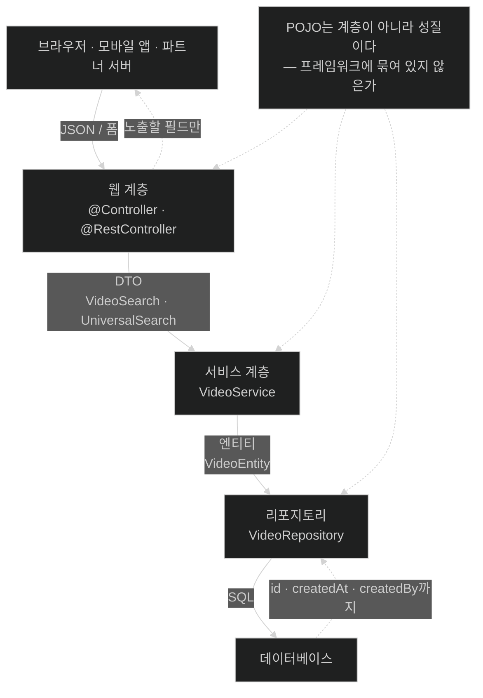

# DTO·엔티티·POJO — 도구가 강제하지 않는 구분

## 한눈에 보기

| 질문 | 핵심 답 |
|---|---|
| 셋을 가르는 기준 | **무엇을 위해 존재하는가**(목적). 생김새가 아니다. |
| DTO | 데이터를 **옮기는** 것이 목적. 보통 서버↔클라이언트 |
| 엔티티 | 데이터를 저장소에 **넣고 빼는** 것이 목적 |
| POJO | 프레임워크를 상속하지도, 제약을 품지도 않은 그냥 Java 객체 |
| 누가 강제하나 | **아무도 안 한다.** 그래서 "패러다임"이지 코딩 구조가 아니다. |
| 왜 나눠야 하나 | 단일 책임 원칙. 한 클래스에 **이해관계자가 둘**이면 오래 못 간다. |
| 언제 합쳐도 되나 | 오래 유지할 것이 아닌 **단기 데모** |

## 1. 왜 이게 필요한가

### 출발 장면: `Video` 하나로 다 되지 않나

[[01b-adding-spring-data-jpa-to-our-project]]까지 오면 이제 코드를 쓸 차례다. 그런데 Chapter 2에서 이미 `Video`라는 타입을 만들어 뒀다.

```java
record Video(String name) {}
```

여기에 `@Entity`와 `@Id`만 붙이면 저장까지 되지 않을까? 그러면 클래스 하나로 화면 렌더링, JSON 응답, 데이터베이스 저장을 전부 처리할 수 있다. 파일도 적고 변환 코드도 없다.

실제로 **동작한다.** 그리고 그게 함정이다.

### 여기서 뭐가 무너지나

그 클래스를 계속 쓰다 보면 요구가 양쪽에서 들어온다.

**저장소 쪽에서:**
- 기본 키 `id`가 필요하다.
- 생성 시각 `createdAt`, 생성자 `createdBy`를 남겨야 한다.
- JPA가 관리하려면 인자 없는 생성자가 필요하고 필드가 바뀔 수 있어야 한다 → **record로는 안 된다.**

**웹 쪽에서:**
- `id`와 `createdBy`는 외부에 노출하고 싶지 않다.
- JSON 키 이름을 `video_name`처럼 바꿔 달라는 요구가 온다.
- 화면에는 없는 계산 필드(`durationText`)가 필요하다.

이 두 목록은 **서로 밀어낸다.** `createdBy`를 넣으면 API 응답에 새 필드가 생기고, JSON 키 이름을 바꾸면 컬럼 매핑을 건드릴 위험이 생긴다. 책이 이 상황을 정확히 짚는다.

> DTO이면서 동시에 엔티티이려고 하는 클래스는 길게 보면 관리하기 더 어렵다. 왜인가? **이해관계자가 둘이기 때문이다** — 웹 계층과 **[[영속성-계층]]**(= 데이터 저장소와의 대화를 담당하는 계층).

### 그래서 나온 생각

**목적별로 클래스를 나눈다.** 그 근거를 책은 이름 있는 원칙으로 부른다.

> 최근 몇 년간 얻은 예리한 교훈은, 클래스가 **딱 한 가지 일에 집중하려 할 때** 유지하고 갱신하기 쉬워진다는 것이다. 사실 이 개념에는 이름이 있다 — **[[단일-책임-원칙]]**(= 한 클래스는 한 가지 일에 집중할 때 유지·변경이 쉬워진다는 설계 원칙, SRP).

그렇게 나눈 결과가 셋이다.

- **[[DTO]]**(= 데이터를 옮기는 것이 목적인 클래스) — 서버에서 클라이언트로, 또는 그 반대로
- **[[엔티티]]**(= 데이터를 저장소에 넣고 빼는 것이 목적인 클래스)
- **[[POJO]]**(= 프레임워크 클래스를 상속하지도 제약을 품지도 않은 평범한 Java 객체)

비유하자면 **주민등록 원부와 여권과 사람**의 관계다. 원부(엔티티)는 관청이 관리하는 원본 기록이고 식별번호가 있으며 계속 갱신된다. 여권(DTO)은 밖으로 내보이는 발췌본이라 필요한 것만 담고 발급 시점에 고정된다. 사람(POJO)은 어느 제도에도 매이지 않은 그 자체다.

→ 비유가 깨지는 지점: 여권과 원부는 **발급 기관이 물리적으로 구분을 강제한다.** 여권에 원부의 모든 항목을 적어 넣을 수 없다. 하지만 DTO와 엔티티는 **아무 도구도 강제하지 않는다.** 같은 클래스에 `@Entity`와 Jackson 애노테이션을 함께 붙여도 컴파일되고 실행된다. 책이 "이 셋의 차이는 어떤 도구도 직접 강제하지 않으며, 그래서 **패러다임이지 코딩 구조가 아니다**"라고 못 박는 지점이 정확히 여기다. 지키는 것은 사람이다.

## 2. 어떻게 동작하는가

### 2.1 셋의 정의를 목적으로 읽기

책의 세 정의를 그대로 옮기면 이렇다.

- **DTO**: 데이터를 전송하는 것이 목적인 클래스다. 보통 서버에서 클라이언트로(또는 그 반대로) 옮긴다. 최신 Java에서는 **record로 구현하는 경우가 많다.** 간결하고 불변인 데이터 표현을 주기 때문이다.
- **Entity**: 데이터를 저장소에 저장하고 저장소에서 꺼내는 것이 목적인 클래스다. JPA를 쓸 때 엔티티는 영속성 계층이 관리하며 **식별자와 가변성에 의존한다.** 그래서 record는 이 역할에 잘 맞지 않는다.
- **POJO**: 어떤 프레임워크 코드도 상속하지 않고, 어떤 종류의 제약도 내부에 박혀 있지 않은 클래스다.

세 정의가 전부 **"목적"**으로 시작한다는 점이 중요하다. 생김새로 구분하려 들면 실패한다 — 필드 두 개짜리 클래스는 셋 중 무엇이든 될 수 있다.

record에 대한 서술이 DTO와 엔티티에서 정확히 반대인 것도 눈여겨볼 만하다. [[../chapter-2-creating-web-and-api-applications-with-spring-boot/04a-adding-demo-data-to-a-template|Chapter 2에서 쓴 record]]가 DTO로는 이상적이었던 바로 그 성질 — **불변** — 이 엔티티에는 결격 사유가 된다. 같은 언어 기능이 목적에 따라 장점도 되고 단점도 된다.

### 2.2 DTO가 실제로 하는 일

책은 DTO를 웹 계층의 것으로 위치시킨다.

> DTO는 보통 애플리케이션의 **웹 계층**에서 쓰인다. 이 클래스들은 데이터를 받아 HTML 생성이나 JSON 처리에 맞게 **제대로 형식이 갖춰지도록** 하는 데 더 관심이 있다.

그리고 그 형식 조정에 쓰는 도구를 든다 — Spring Boot의 기본 JSON 직렬화/역직렬화 라이브러리인 [[../chapter-2-creating-web-and-api-applications-with-spring-boot/05-creating-json-based-apis|Jackson]]은 JSON 렌더링을 커스터마이즈하는 애노테이션을 한 움큼 갖고 있다.

> **Note (책 p.78)**: DTO가 JSON에만 국한된 것은 아니다. XML이든 다른 어떤 데이터 교환 형식이든 데이터의 형식을 제대로 갖춰야 할 필요는 똑같다. JSON이 오늘날 업계에서 가장 인기 있는 형식일 뿐이며, 그래서 Spring Web을 고르면 Spring Boot가 Jackson을 기본으로 클래스패스에 올려 두는 것이다.

이 Note가 하는 일은 **DTO의 정의를 형식에서 떼어 놓는 것**이다. DTO는 "JSON을 위한 클래스"가 아니라 "경계를 넘기 위한 클래스"이며, 그 경계 너머가 JSON이든 XML이든 HTML이든 상관없다.

### 2.3 엔티티와 DTO가 실제로 갈라지는 지점

책이 드는 예가 구체적이다.

> 예를 들어 엔티티는 `id`, `createdAt`, `createdBy` 같은 **데이터베이스가 관리하는 필드**를 담을 수 있지만, DTO는 **API 소비자가 실제로 필요로 하는 필드만** 노출한다.

이 한 문장에 세 가지 이유가 압축돼 있다.

| 엔티티에만 있는 것 | 왜 DTO에 없어야 하나 |
|---|---|
| `id` (기본 키) | 내부 식별자를 노출하면 그것이 곧 API 계약이 된다. 저장소를 바꾸면 깨진다 |
| `createdAt`·`createdBy` (감사 필드) | 저장소 운영의 관심사이지 소비자의 관심사가 아니다 |
| **[[스키마]]**(= 저장할 데이터의 구조를 미리 정의해 둔 것) 제약을 반영한 타입 | 소비자에게는 컬럼 길이나 nullable 여부가 의미 없다 |

반대 방향도 성립한다. DTO에는 있어도 엔티티에는 없어야 하는 것 — 예를 들어 여러 엔티티를 합쳐 만든 요약 필드나, 표시용으로 가공한 문자열이다. 그것을 엔티티에 넣으면 데이터베이스에 저장할 것도 아닌 필드가 매핑 대상으로 끼어든다.

[[../chapter-2-creating-web-and-api-applications-with-spring-boot/05-creating-json-based-apis|Chapter 2]]에서 "record 필드를 하나 더하면 JSON 응답이 조용히 바뀐다"는 경계를 짚었는데, **그 문제의 해법이 바로 이 분리**다. 엔티티에 필드를 더해도 DTO를 안 건드리면 계약은 그대로다.

### 2.4 그런데 항상 나눠야 하는가

> **Tip (책 p.79)**: 단기 목표 대 장기 목표. DTO이면서 엔티티이려는 클래스가 **길게 보면** 관리하기 어렵다고 했다. 그건 사실이다. 그런데 Spring Boot를 제안하려고 CTO에게 보여 주는 그 데모는 어떤가? 그건 요점을 전달해야 하는 **단기 시나리오**다. 오래 갈 앱을 만드는 게 아니라 빠른 데모를 만드는 것이다. 그런 상황에서는 한 클래스가 DTO와 엔티티를 겸해도 괜찮다. 하지만 운영에 올릴 것이라면 두 개념을 분리해 두는 편이 길게 보아 더 잘 유지될 것이다.

이 Tip이 중요한 이유는, 원칙을 **적용 조건과 함께** 주기 때문이다. "항상 나눠라"는 조언은 지키기도 어렵고 왜 지키는지도 흐려진다. 대신 판단 기준은 하나다 — **이 코드가 오래 살 것인가?**

이 장 자체가 그 예다. 이후 절들은 `VideoEntity`(엔티티)와 `VideoSearch`·`UniversalSearch`(DTO)를 실제로 나눠 쓴다 — [[04-using-custom-finders]], [[05-query-by-example-for-dynamic-search]]. 데모라도 나누는 편이 설명에 유리하기 때문이다.

### 2.5 POJO는 어디에 끼는가

책은 DTO와 엔티티를 설명한 뒤 "그럼 POJO는 이 모든 것의 어디에 들어가는가?"라고 묻고 다음 절로 넘어간다.

미리 답의 방향만 잡아 두면 이렇다. DTO와 엔티티는 **역할**의 구분이고, POJO는 **속박 여부**의 구분이라 축이 다르다. DTO는 대개 POJO이고, JPA 엔티티는 애노테이션과 생성자 요구가 붙는다는 점에서 순수한 POJO에서 한 걸음 벗어나 있다. 자세한 이야기는 [[02b-pojos-and-the-spring-programming-model]]에 있다.

## 3. 그림으로 보기

### 세 이름이 놓이는 자리



DTO와 엔티티는 **계층 경계**에 놓이고, POJO는 어느 계층에나 걸치는 **성질**이라는 것이 이 그림의 요지다.

### 한 클래스가 둘을 겸할 때 벌어지는 일

```text
[분리했을 때]

  VideoEntity          VideoDto
  ├ id                 ├ name
  ├ name        ─매핑─▶ └ description
  ├ description
  ├ createdAt
  └ createdBy
  ▶ 엔티티에 컬럼을 더해도 API 계약은 그대로다
  ▶ JSON 키 이름을 바꿔도 컬럼 매핑은 그대로다


[겸했을 때]

              Video
              ├ id          ← 저장소가 요구
              ├ name
              ├ description
              ├ createdAt   ← 저장소가 요구
              └ createdBy   ← 저장소가 요구
                 ▲     ▲
       웹 계층 ──┘     └── 영속성 계층
       "id는 숨겨 줘"      "id 없이는 못 저장해"
       "키 이름 바꿔 줘"   "컬럼 이름 건드리지 마"

  ▶ 한 파일에 요구가 둘이면, 한쪽을 만족시킬 때마다 다른 쪽을 확인해야 한다
  ▶ 그 확인 비용이 "길게 보면 관리하기 어렵다"의 실체다
  ▶ 단, 오래 살 코드가 아니라면 이 비용은 발생하지 않는다 — 그래서 데모는 예외다
```

## 4. 이 노트에 나온 용어

| 용어 | 한 줄 풀이 | 자세히 |
|---|---|---|
| DTO | 데이터를 옮기는 것이 목적인 클래스 | [[_glossary#DTO]] |
| 엔티티 | 데이터를 저장소에 넣고 빼는 것이 목적인 클래스 | [[_glossary#엔티티]] |
| POJO | 프레임워크에 묶이지 않은 평범한 Java 객체 | [[_glossary#POJO]] |
| 단일 책임 원칙 | 한 클래스는 한 가지 일에 집중해야 한다는 설계 원칙 | [[_glossary#단일-책임-원칙]] |
| 영속성 계층 | 데이터 저장소와의 대화를 담당하는 계층 | [[_glossary#영속성-계층]] |
| 스키마 | 저장할 데이터의 구조를 미리 정의해 둔 것 | [[_glossary#스키마]] |

## 5. 자주 헷갈리는 것

### 셋을 생김새로 구분하려는 시도

필드 두 개짜리 클래스는 셋 중 무엇이든 될 수 있다. 판별 질문은 언제나 **"이 클래스는 무엇을 위해 존재하는가?"**다. 옮기려고면 DTO, 저장하려고면 엔티티, 그리고 POJO 여부는 그와 별개로 "프레임워크에 묶여 있는가"로 답한다.

### DTO vs 엔티티 vs POJO가 배타적이다

배타적이지 않다. DTO는 대개 POJO이고, POJO가 아닌 DTO도 있을 수 있다. 축이 두 개(역할 / 속박)라서 그렇다.

### record는 DTO에 좋다 vs 엔티티에 나쁘다

같은 성질(불변, 인자 없는 생성자 없음, 접근자만 있음)이 원인이다. 옮기는 데이터는 도중에 바뀌면 안 되니 불변이 장점이고, 저장소가 추적하며 갱신해야 하는 데이터는 불변이면 곤란하다. **성질이 좋고 나쁜 게 아니라 목적이 다른 것이다.**

### "패러다임이지 코딩 구조가 아니다"

컴파일러도 프레임워크도 이 구분을 강제하지 않는다는 뜻이다. `@Entity`가 붙은 클래스를 그대로 `@RestController`에서 반환해도 아무 오류가 없다. 그래서 이 구분은 코드 리뷰와 팀 합의로만 유지된다.

## 6. 언제 안 쓰나 / 경계

- **단기 데모에서는 나누지 않아도 된다.** 책이 명시적으로 허용한다. 판단 기준은 "이 코드가 오래 살 것인가"다.
- 분리에는 **매핑 비용**이 따른다. 엔티티 → DTO 변환 코드를 손으로 쓰거나 매핑 라이브러리를 도입해야 하며, 필드가 늘 때마다 두 곳을 고쳐야 한다. 이 비용이 얻는 것보다 큰 규모가 실제로 있다.
- 이 장은 분리의 **근거**만 제시하고 실제 매핑 전략(수동 매핑, MapStruct 같은 도구, 프로젝션)은 다루지 않는다.
- 엔티티를 그대로 JSON으로 내보내면 지연 로딩된 연관 관계까지 직렬화하려다 예상 밖의 쿼리나 순환 참조가 생길 수 있다. 이 책의 범위 밖이지만 "겸하면 안 되는" 이유 중 실무에서 가장 자주 부딪히는 것이다.

## 7. 연결

- [[02a-entities-in-jpa]] — 셋 중 엔티티가 JPA 아래에서 실제로 어떤 요구를 받는지 본다. record가 왜 안 되는지의 근거가 거기 있다.
- [[02b-pojos-and-the-spring-programming-model]] — POJO가 왜 Spring의 설계에서 중요한 개념이 되었는지, 그리고 애노테이션이 붙은 클래스도 POJO인지의 논쟁을 다룬다.
- [[01b-adding-spring-data-jpa-to-our-project]] — 여기서 들어온 JPA가 엔티티에 요구를 걸기 시작한다.

## 8. 스스로 확인

1. `Video` 하나로 화면·JSON·저장을 전부 처리하면 처음에는 잘 돌아간다. 그런데 왜 오래 못 가는가?
2. 웹 쪽 요구와 저장소 쪽 요구가 서로 밀어내는 구체적인 예를 두 개 들 수 있는가?
3. 셋의 정의가 전부 "목적"으로 시작하는 것이 왜 중요한가?
4. 같은 record가 DTO에는 이상적이고 엔티티에는 부적합한 이유를 한 문장으로 말할 수 있는가?
5. DTO가 "JSON을 위한 클래스"가 아니라는 Note의 요지는 무엇인가?
6. 엔티티에만 있고 DTO에는 없어야 할 필드 세 종류와 각각의 이유는?
7. "패러다임이지 코딩 구조가 아니다"라는 말이 실무에서 뜻하는 바는?
8. 분리하지 않아도 되는 상황의 판단 기준은 무엇인가?

> 여덟 문항을 스스로 답한 **뒤에** [[_02-dtos-entities-and-pojos]]에서 모범답안과 대조한다. 먼저 열면 이 문항들은 다시 인출 문제로 쓸 수 없다.

<!-- ==== 아래는 내 영역 · 스킬 수정 금지 ==== -->

## 내 설명 시도


## 막혔던 지점


## 리뷰 이력
