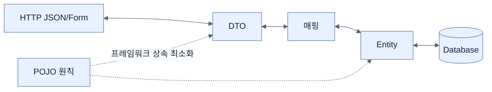

# DTO, Entity, POJO 구분하기

## 한눈에 보기

DTO는 계층·프로세스 사이 데이터 전송을, Entity는 저장소의 식별성과 영속 상태를, POJO는 프레임워크 상속에 묶이지 않은 일반 객체라는 성격을 나타낸다. 짧은 데모에서는 하나의 타입을 겸용할 수 있지만 운영 코드에서는 웹 계약과 영속성 모델을 분리하는 편이 변화에 강하다.

## 1. 왜 이게 필요한가

DB가 요구하는 `id`, 감사 필드, lazy 관계를 그대로 JSON에 노출하면 API 계약이 저장 구조에 종속된다. 반대로 불변 record DTO를 JPA Entity로 쓰면 프록시·변경 추적·기본 생성자 요구와 충돌한다. 각 타입의 이해관계자를 하나로 제한해야 독립적으로 바꿀 수 있다.

## 2. 어떻게 동작하는가

JPA Entity는 `@Entity`, `@Id`, 보통 `@GeneratedValue`, public/protected 기본 생성자를 갖고 persistence context가 상태 변화를 추적한다. 새 객체의 null ID는 아직 저장되지 않은 행이라는 신호가 된다. DTO는 API에 필요한 필드와 표현만 담아 record가 잘 어울린다. POJO는 특정 프레임워크 부모 클래스를 상속하지 않아 단독 테스트가 쉽고, Spring은 외부 프록시로 트랜잭션 같은 횡단 관심사를 적용한다.

Entity와 DTO는 창고 재고 카드와 고객 영수증에 비유할 수 있다. 같은 상품을 가리켜도 필요한 필드와 변경 주체가 다르다. 다만 단순한 프로토타입에서는 변환 계층 비용이 이득보다 클 수 있다.

## 3. 그림으로 보기

## 4. 이 노트에 나온 용어

- **DTO**: 외부 계약이나 계층 간 전송에 맞춘 데이터 객체.
- **Entity**: 저장소에서 식별되고 영속성 도구가 상태를 관리하는 객체.
- **POJO**: 특정 프레임워크 기반 클래스를 상속하지 않는 일반 Java 객체.
- **persistence context**: Entity identity와 변경을 추적하는 JPA 관리 범위.

## 7. 연결

- [[03-creating-repositories-and-declarative-queries]] — repository의 도메인 타입은 Entity다.
- [[chapter-2-creating-web-and-api-applications-with-spring-boot/05-creating-json-based-apis|JSON API]] — DTO가 보호하는 외부 계약 경계다.

## 8. 스스로 확인

- 전체 1차 정리 후: Java record가 DTO에는 잘 맞고 JPA Entity에는 불편한 이유를 설명한다.

<!-- ==== 아래는 내 영역 · 스킬 수정 금지 ==== -->

## 내 설명 시도

## 막혔던 지점

## 리뷰 이력

