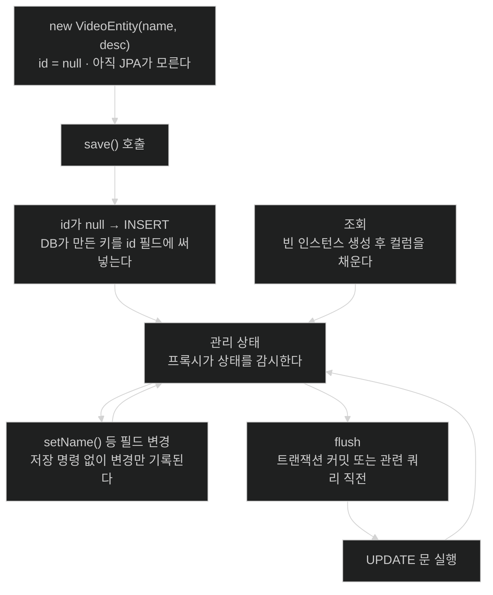

# JPA 엔티티 — 프레임워크가 거는 요구와 그 이유

## 한눈에 보기

| 질문 | 핵심 답 |
|---|---|
| 엔티티란 | 데이터 접근에 **직접 참여하는** 클래스. JPA가 이 개념을 표준으로 만들었다. |
| JPA에서 필수인 것 | `@Entity` 애노테이션. **예외 없이** 붙여야 한다. |
| JPA만의 개념인가 | 아니다. MongoDB용 클래스도 애노테이션은 달라도 엔티티다. |
| 왜 요구가 붙나 | 프레임워크가 **관리**하기 때문이다. 관리하려면 만들 수 있어야 하고 감시할 수 있어야 한다. |
| 인자 없는 생성자 | `public` 또는 `protected`여야 한다 |
| `id`가 `null`이면 | JPA에게 "새 행을 만들라"는 뜻이다 |
| 조회 결과의 정체 | 대개 **프록시로 감싼** 객체다. 그래서 변경 추적과 flush가 가능하다. |

## 1. 왜 이게 필요한가

### 출발 장면: record에 `@Entity`를 붙여 봤다

[[02-dtos-entities-and-pojos]]에서 엔티티는 "저장소에 넣고 빼는 것이 목적인 클래스"라고 했다. 그러면 Chapter 2의 record에 애노테이션만 붙이면 될 것 같다.

```java
@Entity
record Video(@Id @GeneratedValue Long id, String name) {}
```

컴파일은 된다. 그런데 애플리케이션을 띄우면 시작 시점에 실패한다. JPA 구현이 이 타입을 관리 대상으로 받아들이지 못하기 때문이다.

### 여기서 뭐가 무너지나

이유는 세 가지가 겹친다.

1. **인자 없는 생성자가 없다.** record는 모든 컴포넌트를 받는 생성자만 만든다. 그런데 JPA는 데이터베이스에서 행을 읽어 올 때 **먼저 빈 객체를 만들고 나서 값을 채운다.** 채울 대상이 없으면 시작조차 못 한다.
2. **필드를 바꿀 수 없다.** record의 필드는 `final`이다. 그런데 JPA는 조회한 객체의 상태 변화를 추적해서 데이터베이스에 반영하는 것이 일이다. 바뀌지 않는 객체에는 추적할 것이 없다.
3. **`id`를 나중에 채울 수 없다.** 새 행을 만들 때 키는 데이터베이스가 정한다. 즉 객체를 만들 때는 `id`가 없고, 저장한 뒤에 생긴다. record는 그 "나중에 채우기"를 허용하지 않는다.

[[02-dtos-entities-and-pojos]]에서 "record는 엔티티 역할에 잘 맞지 않는다"고 한 말의 실체가 이 셋이다. 그리고 셋 다 같은 뿌리에서 나온다 — **프레임워크가 이 객체를 관리하기 때문**이다.

### 그래서 나온 생각

**관리받는 대가로 요구를 받아들인다.** 책의 서술이 이 인과를 정확히 적는다.

> **[[엔티티]]**(= 데이터를 저장소에 넣고 빼는 것이 목적인 클래스)는 데이터 접근 프레임워크가 **관리하기 때문에**, 그 아래 저장소가 부과하는 특정 요구사항을 함께 갖는 경우가 많다.

그 관리가 실제로 어떻게 이뤄지는지도 이어서 말한다 — JPA에서 쿼리가 돌려주는 엔티티는 대개 **[[프록시]]**(= 어떤 타입인 척하면서 호출을 가로채 부가 동작을 수행하는 객체)로 감싸인다. 이것이 **[[JPA]]**(= Java 객체와 관계형 표를 대응시키는 표준 명세) 제공자로 하여금 엔티티 상태의 변경을 추적하고, 갱신을 언제 데이터베이스에 되돌려 써야 할지 판단하고(이 과정을 **[[플러시]]**(= 추적하던 변경을 실제 데이터베이스 문장으로 내보내는 일)라 한다), 캐싱 같은 기능을 더 효과적으로 관리하게 해 준다.

비유하자면 관리받는 엔티티는 **자동 저장되는 문서 편집기 안의 문서**다. 내가 저장 버튼을 누르지 않아도 편집기가 변경을 감지해 두었다가 정해진 시점에 디스크에 쓴다.

→ 비유가 깨지는 지점: 편집기의 자동 저장은 "몇 시 몇 분에 저장됨"이 화면에 표시라도 된다. 하지만 JPA의 flush는 **아무 흔적 없이** 일어나고, 시점도 내가 정하지 않는다 — 트랜잭션이 커밋될 때, 또는 그 변경에 영향받는 쿼리가 실행되기 직전에 알아서 나간다. 그래서 "`setName()`만 불렀는데 `UPDATE` 문이 나갔다"가 JPA를 처음 쓸 때 가장 놀라운 지점이 된다. 편집기와 달리 **저장을 내가 지시하지 않았다는 사실 자체를 잊게 된다.**

## 2. 어떻게 동작하는가

### 2.1 엔티티라는 말의 범위

책은 먼저 이름의 유래를 짚는다 — 데이터베이스에서 데이터를 조회하는 코드를 쓸 때 **그 데이터가 최종적으로 담기는 클래스**를 흔히 엔티티라고 부르며, 이 개념은 JPA가 나오면서 **표준이 되었다.**

그리고 JPA 안에서는 예외가 없다고 못 박는다 — 문자 그대로, JPA를 통해 저장·조회에 관여하는 **모든** 클래스는 `@Entity`가 붙어야 한다.

그런데 곧바로 범위를 넓힌다.

> 하지만 엔티티라는 개념이 JPA에서 끝나는 것은 아니다. MongoDB 같은 다른 저장소에서 읽고 쓰는 데 쓰이는 클래스들도, **같은 애노테이션을 요구하지는 않지만** 역시 영속화된 도메인 데이터를 나타낸다. 실무적으로, **데이터 접근에 직접 참여하는 어떤 클래스든** 엔티티로 볼 수 있다.

즉 `@Entity`는 **JPA가 엔티티를 알아보는 방법**이지 엔티티의 정의가 아니다. [[01a-using-spring-data-to-easily-manage-data]]에서 본 "저장소마다 전용 모듈"이라는 방침이 여기서도 반복된다 — 개념은 공통이고 표시 방법은 저장소마다 다르다.

### 2.2 코드 한 장

```java
@Entity
class VideoEntity {
    private @Id @GeneratedValue Long id;
    private String name;
    private String description;

    protected VideoEntity() {
          this(null, null);
    }

    VideoEntity(String name, String description) {
          this.id = null;
          this.description = description;
          this.name = name;
    }
    // getters and setters
}
```

책이 드는 다섯 가지 특징을 하나씩, **왜 그래야 하는지**와 함께 본다.

1. **`@Entity`** — 이것이 JPA가 관리하는 타입임을 알리는 JPA 애노테이션이다. — 프레임워크가 시작 시점에 관리 대상 목록을 만들려면 표시가 필요하기 때문이다. 이 표시가 있어야 매핑 메타데이터가 만들어지고, [[03-creating-repositories-and-declarative-queries]]의 쿼리 파생도 그 메타데이터를 근거로 동작한다.
2. **`@Id`** — **[[기본-키]]**(= 표에서 각 행을 유일하게 식별하는 열)를 표시하는 JPA 애노테이션이다. — 프레임워크가 "이 객체와 저 행이 같은 것"이라고 판단할 근거가 필요하기 때문이다. 키가 없으면 변경을 어느 행에 반영할지 알 수 없다.
3. **`@GeneratedValue`** — 키 생성을 JPA 제공자에게 넘기는 JPA 애노테이션이다. — 키를 애플리케이션이 정하면 동시 삽입 때 충돌을 스스로 처리해야 하기 때문이다. 이 **[[키-생성-전략]]**(= 기본 키 값을 누가 어떻게 만들지에 대한 정책)을 넘기면 데이터베이스의 시퀀스나 자동 증가 컬럼이 그 일을 맡는다.
4. **인자 없는 생성자가 필요하며 `public`이거나 `protected`여야 한다.** — JPA가 조회 결과로 객체를 만들 때 **어떤 값을 넣을지 모르는 상태에서 먼저 인스턴스를 만들기** 때문이다. 여기서 `protected`를 고른 이유가 중요하다. `private`이면 프레임워크가 못 만들고, `public`이면 애플리케이션 코드가 **필드가 다 비어 있는 엔티티**를 아무 데서나 만들 수 있다. `protected`는 프레임워크에는 열어 주고 일반 코드에는 닫는 절충이다.
5. **`id`를 받지 않는 생성자** — 데이터베이스에 새 항목을 만들기 위해 설계된 생성자다. **`id` 필드가 `null`이면 JPA에게 표에 새 행을 만들고 싶다는 뜻**이 된다.

다섯 번째가 이 코드에서 가장 중요한 규칙이다. `repository.save(entity)`가 INSERT를 낼지 UPDATE를 낼지가 **`id`의 `null` 여부 하나로** 갈린다. 그래서 `this.id = null;`을 명시적으로 써 둔 것이 우연이 아니다.

### 2.3 관리받는 객체의 일생

앞의 요구들이 어떻게 맞물리는지는 객체의 상태 변화를 따라가면 보인다.

1. `new VideoEntity("제목", "설명")` — 아직 JPA가 모르는 평범한 객체다. `id`는 `null`이다. — 5번 생성자가 필요한 지점.
2. `repository.save(...)` — `id`가 `null`이므로 INSERT가 나간다. 데이터베이스가 키를 만들고, JPA가 그 값을 객체의 `id` 필드에 **써넣는다.** — 3번(`@GeneratedValue`)과 "필드가 가변이어야 한다"가 함께 필요한 지점.
3. 이후 이 객체는 **관리 상태**가 된다. **[[영속성-계층]]**(= 데이터 저장소와의 대화를 담당하는 계층)이 이 인스턴스를 영속성 컨텍스트에 넣고, 그때의 **필드 값을 한 벌 더 복사해 둔다.**
4. `entity.setName("새 제목")` — **이 시점에는 아무 일도 일어나지 않는다.** 엔티티는 평범한 자바 객체라 값이 바뀌었다고 알려 줄 방법이 없다.
5. 트랜잭션이 끝나거나 관련 쿼리가 나가기 직전 **flush**가 일어난다. 이때 관리 중인 엔티티를 **전부 순회하며 3번에서 떠 둔 복사본과 현재 값을 필드 단위로 비교**하고, 달라진 것이 있으면 UPDATE를 만든다. — 2번(`@Id`)이 "어느 행을 고칠지"를 정하는 지점.
6. 조회로 다시 꺼낼 때는 JPA가 빈 인스턴스를 만들고 컬럼 값을 채운다. — 4번(인자 없는 생성자)이 필요한 지점.

**요구 다섯 개가 전부 이 일생의 어느 한 단계에 대응한다.** 임의의 제약이 아니라는 뜻이다.

> **2026-08-29 정정 — 이 절의 이전 판이 틀렸던 곳.** 3번을 *"영속성 계층이 **프록시로 감싸 상태를 감시**한다"*로, 4번을 *"변경이 **기록된다**"*로 적고 있었다. **둘 다 사실과 다르다.**
>
> **관리 상태의 엔티티는 프록시가 아니다.** `save()`나 `findById()`로 얻은 것은 원본 객체 그대로이며, JPA는 그것을 감시하지 않는다. 변경 감지는 **플러시 시점의 스냅숏 비교**로 이뤄진다 — 조회 시점에 값을 한 벌 복사해 두었다가, 플러시할 때 현재 값과 비교해 달라진 것을 찾는다. 그래서 `setName()`을 부르는 순간에는 정말로 아무 일도 일어나지 않는다.
>
> **프록시는 다른 일에 쓰인다** — **지연 로딩**이다. `LAZY` 연관의 getter가 돌려주는 것, `getReference()`가 SELECT 없이 돌려주는 것이 프록시다. 관리 상태와는 별개의 메커니즘이다.
>
> 두 메커니즘을 섞으면 실무 판단이 어긋난다. 스냅숏 방식이라서 **관리 엔티티가 많을수록 플러시 비용이 는다**(전부 순회해 비교한다). 프록시 감시 모델을 믿으면 그 비용이 왜 생기는지 설명할 수 없다. 자세한 내용은 `part-0-jpa-foundations`의 `chapter-j1-persistence-context/03-dirty-checking-and-snapshots`와 `chapter-j2-associations-and-proxies/04-proxies-and-lazy-loading`에 있다.

### 2.4 이 책이 다루지 않는 것

> **Note (책 p.78)**: JPA로 엔티티를 모델링하는 이야기에는 많은 시간을 쓰지 않을 것이다. 엔티티 모델링의 세부에 통째로 바쳐진 책들이 있다. 더 깊이 탐구하고 싶다면 Catalin Tudose, Christian Bauer, Gavin King, Gary Gregory의 *Java Persistence with Spring Data and Hibernate*가 널리 추천되는 자료다.

이 Note는 책의 범위를 정직하게 긋는 것이면서, 동시에 **이 장의 노트를 읽을 때의 기대치**를 정해 준다. 연관 관계 매핑, 지연 로딩, 영속성 컨텍스트의 생명주기, N+1 문제 같은 것들은 이 책에 없다. 이 장에서 얻는 것은 "엔티티가 무엇이고 왜 요구가 붙는가"까지다.

## 3. 그림으로 보기

### 엔티티의 상태와 요구가 대응하는 자리



### 다섯 가지 요구가 각각 무엇을 위한 것인가

```text
  요구                              없으면 무엇이 깨지나
  ────────────────────────────      ──────────────────────────────────────────
  @Entity                     ───▶  프레임워크가 이 타입을 아예 모른다
                                    → 매핑도 쿼리 파생도 성립하지 않는다

  @Id                         ───▶  객체와 행을 짝지을 근거가 없다
                                    → 변경을 어느 행에 반영할지 모른다

  @GeneratedValue             ───▶  키를 애플리케이션이 정해야 한다
                                    → 동시 삽입 충돌을 직접 처리해야 한다

  인자 없는 생성자(protected)  ───▶  조회 시 빈 인스턴스를 만들 수 없다
                                    → 행을 읽어 와도 객체로 만들지 못한다
                                    (public이면? 반쯤 빈 엔티티가 코드 곳곳에 생긴다)

  가변 필드 + id를 안 받는 생성자 ─▶  저장 후 생성된 키를 써넣을 수 없다
                                    → 변경 추적 대상이 없다 (record가 막히는 지점)

  ▶ 다섯 요구가 전부 "관리한다"는 한 가지 사실에서 나온다.
  ▶ 관리를 포기하면(= 그냥 DTO로 쓰면) 요구도 사라진다.
```

### JPA와 다른 저장소의 엔티티

| | JPA (관계형) | Spring Data MongoDB |
|---|---|---|
| 표시 방법 | `@Entity` **필수** | `@Document` (관례로 충분한 경우도 있음) |
| 키 표시 | `@Id` (jakarta.persistence) | `@Id` (org.springframework.data) |
| 관리 방식 | 프록시로 감싸 변경 추적 | 대개 명시적 저장 |
| **[[스키마]]**(= 데이터 구조를 미리 정의한 것) | 표 정의와 대응해야 함 | 문서 구조가 유연 |
| 엔티티인가 | 예 | **예** — 표시 방법만 다르다 |

## 4. 이 노트에 나온 용어

| 용어 | 한 줄 풀이 | 자세히 |
|---|---|---|
| 엔티티 | 데이터 접근에 직접 참여하는 클래스 | [[_glossary#엔티티]] |
| JPA | Java 객체와 관계형 표를 대응시키는 표준 명세 | [[_glossary#JPA]] |
| 영속성 계층 | 데이터 저장소와의 대화를 담당하는 계층 | [[_glossary#영속성-계층]] |
| 프록시 | 타입인 척하며 호출을 가로채 부가 동작을 하는 객체 | [[_glossary#프록시]] |
| 플러시 | 추적하던 변경을 실제 DB 문장으로 내보내는 일 | [[_glossary#플러시]] |
| 기본 키 | 표에서 각 행을 유일하게 식별하는 열 | [[_glossary#기본-키]] |
| 키 생성 전략 | 기본 키 값을 누가 어떻게 만들지에 대한 정책 | [[_glossary#키-생성-전략]] |
| 스키마 | 저장할 데이터의 구조를 미리 정의해 둔 것 | [[_glossary#스키마]] |

## 5. 자주 헷갈리는 것

### `@Entity`가 엔티티의 정의다

아니다. `@Entity`는 **JPA가 엔티티를 알아보는 방법**이다. MongoDB용 클래스는 이 애노테이션 없이도 엔티티다. 판별 질문 — "이 클래스가 데이터 접근에 직접 참여하는가?"

### `save()`가 INSERT인지 UPDATE인지

메서드 이름이 아니라 **`id`의 `null` 여부**가 정한다. 그래서 `id`를 직접 채운 객체를 `save()`하면 UPDATE가 되고, 그 키의 행이 없으면 의도와 다른 결과가 난다.

### 조회한 객체가 내 클래스의 인스턴스다

대개는 그 클래스를 **상속한 프록시**다. 그래서 디버거에서 클래스 이름이 낯설게 보이고, `getClass()` 비교나 `equals` 구현이 예상과 다르게 동작할 수 있다.

### `setName()`은 메모리만 바꾼다

관리 상태의 엔티티라면 그렇지 않다. 저장 명령을 부르지 않아도 flush 시점에 UPDATE가 나간다. **"저장을 안 했으니 안 바뀌었겠지"가 성립하지 않는다.**

### `protected` 생성자를 `public`으로 바꿔도 되나

JPA는 동작한다. 다만 애플리케이션 코드가 필드가 다 비어 있는 엔티티를 만들 수 있게 되고, 그런 객체가 저장 경로에 흘러 들어가면 원인을 찾기 어려운 데이터가 생긴다.

## 6. 언제 안 쓰나 / 경계

- 이 장은 **단일 엔티티**만 다룬다. 연관 관계 매핑, 지연 로딩, 영속성 컨텍스트의 범위, N+1 문제는 다루지 않는다. 책의 Note가 그 사실을 명시하고 별도 자료를 안내한다.
- 엔티티를 웹 계층까지 그대로 내보내면 프록시가 직렬화 대상이 되어 예상 밖의 쿼리나 순환 참조가 생길 수 있다. [[02-dtos-entities-and-pojos]]의 분리가 그래서 실무적으로도 값을 한다.
- `@GeneratedValue`는 전략(IDENTITY, SEQUENCE 등)에 따라 삽입 시점과 배치 동작이 달라지지만, 이 장은 전략을 지정하지 않은 기본 상태만 쓴다.
- 이 예제가 도는 것은 내장 데이터베이스에서 스키마가 자동 생성되기 때문이다. 실제 데이터베이스에서는 `@Entity` 선언과 실제 표 정의가 일치하는지를 별도로 관리해야 한다.

## 7. 연결

- [[02-dtos-entities-and-pojos]] — "record는 엔티티에 맞지 않는다"는 그 노트의 결론이 이 노트의 세 가지 이유로 뒷받침된다.
- [[02b-pojos-and-the-spring-programming-model]] — 애노테이션과 생성자 요구가 붙은 엔티티는 순수한 POJO에서 한 걸음 벗어나 있다. 그 경계 논의가 그쪽에 있다.
- [[03-creating-repositories-and-declarative-queries]] — `@Entity`가 만든 매핑 메타데이터가 쿼리 파생의 근거가 된다.

## 8. 스스로 확인

1. record에 `@Entity`를 붙여도 안 되는 세 가지 이유를 말할 수 있는가?
2. 그 세 이유가 전부 하나의 사실에서 나온다면, 그 사실은 무엇인가?
3. `@Entity`가 엔티티의 정의가 아니라면 무엇인가?
4. 인자 없는 생성자를 `private`도 `public`도 아닌 `protected`로 두는 이유는?
5. `save()`가 INSERT를 낼지 UPDATE를 낼지 무엇이 결정하는가?
6. 저장 명령을 부르지 않았는데 UPDATE가 나가는 메커니즘을 설명할 수 있는가?
7. 자동 저장 편집기 비유가 깨지는 지점은 어디인가?
8. 다섯 가지 요구를 엔티티의 일생 단계에 각각 대응시킬 수 있는가?

> 여덟 문항을 스스로 답한 **뒤에** [[_02a-entities-in-jpa]]에서 모범답안과 대조한다. 먼저 열면 이 문항들은 다시 인출 문제로 쓸 수 없다.

<!-- ==== 아래는 내 영역 · 스킬 수정 금지 ==== -->

## 내 설명 시도


## 막혔던 지점


## 리뷰 이력
