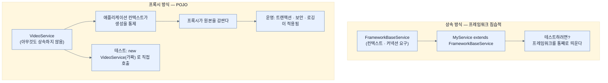

# POJO와 Spring의 프로그래밍 모델 — 상속 대신 감싸기

## 한눈에 보기

| 질문 | 핵심 답 |
|---|---|
| Spring 이전의 방식 | 프레임워크 클래스를 **상속**해야 기능을 얻었다 |
| 그래서 무엇이 어려웠나 | **테스트.** 내 코드를 확인하려면 프레임워크를 통째로 띄워야 했다 |
| POJO 방식이란 | 프레임워크 코드를 **상속하지 않고** 쓰는 것 |
| Spring이 그것을 가능하게 한 장치 | 빈을 컨텍스트에 등록하고 **프록시로 감싼다** |
| 최초의 대표 사례 | 트랜잭션. `TransactionTemplate`을 프록시가 대신 적용했다 |
| Java 5 이후 | `@Transactional` 하나로 줄었다 |
| 남는 논쟁 | 애노테이션만 붙은 클래스는 정말 POJO인가? |

## 1. 왜 이게 필요한가

### 출발 장면: 테스트를 쓰려는데 프레임워크가 딸려 온다

[[02-dtos-entities-and-pojos]]에서 셋 중 둘(DTO, 엔티티)을 봤고 이제 **[[POJO]]**(= 프레임워크 클래스를 상속하지도 제약을 품지도 않은 평범한 Java 객체)가 남았다. 그런데 POJO는 앞의 둘과 성격이 다르다 — 역할이 아니라 **속박 여부**를 말하기 때문이다.

이 개념이 왜 이름까지 얻었는지는 그 이전 세계를 보면 안다. 책의 서술이다.

> Spring 이전에는 많은(대부분이라 해도 좋을) Java 기반 프레임워크가 개발자에게 **여러 클래스를 상속하라고 요구했다.**

구체적으로 말하면, 서비스를 하나 만들려면 프레임워크가 정한 기반 클래스를 `extends` 해야 했고, 그 순간부터 그 클래스는 프레임워크 없이는 존재할 수 없는 물건이 됐다.

### 여기서 뭐가 무너지나

책이 드는 결과가 셋이다.

> 이런 종류의 클래스들은 다루기 어려웠다. **프레임워크에서 상속받은 요구사항 때문에 테스트 케이스를 쓰기에 적합하지 않았다.** 사용자가 만든 코드가 제대로 도는지 확인하려면 **모든 것을 다 띄워야 하는** 경우가 잦았다. 전체적으로 무겁고 손이 많이 가는 코딩 경험이었다.

가운데 문장이 핵심이다. 왜 상속이 테스트를 막는지 풀어 보면 이렇다.

1. **`new MyService()`가 성립하지 않는다.** 상위 클래스의 생성자가 프레임워크 컨텍스트, 설정 객체, 커넥션 따위를 요구한다.
2. **상위 클래스의 동작을 끊을 수 없다.** 내 메서드가 상위의 `protected` 메서드를 부르는데, 그것이 실제 데이터베이스나 네트워크를 건드린다.
3. **결국 프레임워크를 띄운다.** 테스트 하나에 컨테이너 기동 시간이 붙고, 그러면 테스트를 자주 안 돌리게 되고, 그러면 테스트를 안 쓰게 된다.

세 번째가 진짜 비용이다. 느린 테스트는 **안 쓰는 테스트**가 된다.

### 그래서 나온 생각

**내 클래스는 아무것도 상속하지 않게 두고, 필요한 기능은 바깥에서 붙인다.** 책의 정의 — POJO 기반 접근이란 **어떤 프레임워크 코드도 상속할 필요가 없는** 사용자 코드를 쓴다는 뜻이다.

이 이름 자체가 반어적으로 붙었다는 점도 알아 둘 만하다. `POJO`는 Martin Fowler와 동료들이 2000년경 만든 말인데, "평범한 옛날 Java 객체"에는 그럴듯한 이름이 없어서 사람들이 그것을 쓰기를 꺼린다고 보고 **일부러 거창한 약어를 붙인 것**이다. 즉 이 용어는 새 기술의 이름이 아니라, **아무것도 안 하는 것에 이름을 붙여 선택지로 만든 것**이다.

비유하자면 상속 강제는 **특정 회사 공구로만 풀리는 나사**를 쓴 가구다. 조립은 되지만, 그 회사 공구 없이는 분해도 점검도 못 한다. Spring의 방식은 나사를 표준 규격으로 두고, 필요한 기능은 **바깥에서 감싸는 케이스**로 붙이는 것이다.

→ 비유가 깨지는 지점: 케이스는 눈에 보이고 손으로 떼어낼 수 있다. 하지만 Spring의 **[[프록시]]**(= 타입인 척하며 호출을 가로채 부가 동작을 수행하는 객체)는 **호출하는 쪽이 그 존재를 모른다.** 그래서 함정이 하나 생긴다 — 같은 객체 안에서 자기 메서드를 직접 부르면(`this.otherMethod()`) 그 호출은 프록시를 거치지 않아 `@Transactional`이 **적용되지 않는다.** 케이스 비유로는 설명되지 않는, 프록시 방식 고유의 경계다.

## 2. 어떻게 동작하는가

### 2.1 빈 등록이 프록시를 가능하게 한다

책의 인과가 두 문장에 담겨 있다.

> 빈을 **[[애플리케이션-컨텍스트]]**(= Spring이 빈을 만들고 연결하고 생명주기를 관리하는 컨테이너)에 등록한다는 Spring의 개념이 이 프레임워크 침습적인 스타일을 피할 수 있게 한다. 내장된 생명주기로 빈을 관리함으로써, Spring은 POJO 기반 객체를 **프록시로 감싸 횡단 서비스를 적용할 수 있다.**

이 인과를 단계로 풀면 이렇다.

1. 개발자가 아무것도 상속하지 않은 클래스를 쓴다. — 테스트에서 `new`로 만들 수 있게 하기 위해서다.
2. 그 클래스를 컨테이너에 빈으로 등록한다. — 컨테이너가 **인스턴스 생성 시점을 통제**해야 그 자리에 다른 것을 끼워 넣을 수 있기 때문이다.
3. 컨테이너가 원본 대신 **프록시**를 만들어 등록한다. — 호출을 가로챌 지점이 필요하기 때문이다.
4. 프록시가 메서드 호출 전후에 부가 동작을 수행하고 원본에 위임한다. — 원본 코드를 건드리지 않고 기능을 더하기 위해서다.
5. 주입받는 쪽은 원래 타입으로 받는다. — 호출하는 코드가 이 구조를 몰라도 되게 하기 위해서다.

2단계가 열쇠다. **내가 `new`로 만들면 아무도 감쌀 수 없다.** [[../chapter-2-creating-web-and-api-applications-with-spring-boot/04c-injecting-dependencies-through-constructor-calls|Chapter 2의 생성자 주입]]에서 "누가 `new`를 부르는가"가 중요하다고 한 이유가 여기서 회수된다 — 컨테이너가 생성을 통제하기 때문에 그 자리에 프록시를 놓을 수 있다.

이렇게 바깥에서 붙이는 기능을 **[[횡단-관심사]]**(= 여러 클래스에 공통으로 필요하지만 그 클래스들의 본업은 아닌 기능)라 한다. 트랜잭션, 보안, 로깅, 캐시가 여기 속한다.

### 2.2 최초의 사례 — 트랜잭션

책은 Spring의 가장 이른 기능 중 하나로 트랜잭션 지원을 든다.

> `VideoService` 같은 것을 애플리케이션 컨텍스트에 등록한다는 Spring의 혁신적인 성격 덕분에, **바깥 호출자가 부르는 모든 메서드 호출에** Spring의 `TransactionTemplate`을 적용하는 프록시로 빈을 감싸는 일이 쉬워졌다.

여기서 [[../chapter-2-creating-web-and-api-applications-with-spring-boot/04b-building-our-app-with-a-better-design|Chapter 2에서 만든]] **[[서비스-계층]]**(= 바깥 기술에 매이지 않고 업무 동작을 담당하는 계층) `VideoService`가 예로 등장하는 것이 우연이 아니다. 그 클래스는 지금도 아무것도 상속하지 않았고 `@Service` 애노테이션 하나만 붙어 있다.

그리고 그 결과를 책이 명시한다.

> 이것이 `VideoService`를 **단위 테스트하기 쉽게** 만들었다. 서비스가 제 일을 하는지 확인하면서도, **트랜잭션 지원은 서비스가 알 필요조차 없는 구성 단계**가 되었다.

"알 필요조차 없다"가 정확한 표현이다. `VideoService`의 소스 어디에도 트랜잭션이라는 말이 없는데 운영에서는 트랜잭션 안에서 돈다. 테스트에서는 그냥 `new VideoService(fakeRepository)`로 만들어 메서드를 부르면 된다.

### 2.3 Java 5 이후 — 애노테이션으로 줄어들다

> Java 5가 애노테이션 지원과 함께 등장하면서 적용이 더욱 쉬워졌다. 트랜잭션 지원은 단순한 `@Transactional` 애노테이션으로 적용할 수 있게 됐다.

이 변화가 무엇을 줄였는지 비교하면 이렇다.

| | XML 시대 | 애노테이션 시대 |
|---|---|---|
| **[[트랜잭션]]**(= 여러 변경을 하나의 단위로 묶는 장치) 선언 위치 | 별도 XML에 클래스·메서드 패턴으로 | 클래스나 메서드 바로 위 |
| 대상 확인 | XML과 코드를 오가며 대조 | 코드를 읽으면 보인다 |
| 오타의 결과 | 클래스 이름이 틀려도 조용히 미적용 | 컴파일러가 잡거나 IDE가 표시 |
| POJO 순수성 | 코드에 흔적 없음 (**더 순수**) | 애노테이션이 코드에 남음 |

마지막 줄이 다음 절의 논쟁거리가 된다.

### 2.4 애노테이션만 붙은 클래스는 POJO인가

책은 이 질문을 던지고 답을 열어 둔다.

> 서비스를 가볍고 POJO 지향으로 유지함으로써 Spring은 개발의 경량화를 이뤄냈다. **애노테이션만 붙인 것(다른 건 아무것도 없이)이 정말 POJO인지는 아마 논쟁의 여지가 있을 것이다.** 하지만 POJO로 쌓아 올린 애플리케이션을 검증한다는 발상은 우리 시스템에 대한 확신을 더 빨리 쌓게 해 준다.

양쪽 논리를 정리하면 이렇다.

- **POJO가 아니다** — `@Transactional`은 결국 프레임워크의 타입이다. 그것이 import되어 있으면 이 클래스는 Spring 없이 의미가 없다.
- **POJO다** — 애노테이션은 **동작을 바꾸지 않는 메타데이터**다. 그것이 붙어 있어도 `new`로 만들 수 있고, 메서드를 직접 불러 테스트할 수 있고, 상위 클래스의 생성자 요구도 없다.

책이 결론 대신 **판단 기준**을 준다는 점이 중요하다 — "POJO로 쌓아 올린 애플리케이션을 검증할 수 있는가"다. 이 기준으로 보면 애노테이션이 붙은 클래스는 여전히 POJO 쪽이다. 상속과 결정적으로 다른 점은 **테스트에서 프레임워크를 띄우지 않아도 된다**는 것이기 때문이다.

이 기준은 [[02a-entities-in-jpa]]의 **[[엔티티]]**(= 데이터 접근에 직접 참여하는 클래스)에도 그대로 적용해 볼 수 있다. `VideoEntity`는 `@Entity`와 `protected` 생성자 요구를 받지만 아무것도 상속하지 않으므로 `new VideoEntity("a", "b")`로 만들어 테스트할 수 있다. 애노테이션과 생성자 규칙만큼 순수성에서 한 걸음 물러났을 뿐, 상속 강제와는 여전히 성격이 다르다.

## 3. 그림으로 보기

### 상속으로 붙이기와 감싸서 붙이기



같은 클래스가 **운영에서는 감싸이고 테스트에서는 벌거벗은 채로** 쓰인다는 것이 이 구조의 핵심이다.

### 호출이 프록시를 거치는 경로와 거치지 않는 경로

```text
[바깥에서 부를 때 — 프록시를 거친다]

  HomeController
        │  videoService.search(...)
        ▼
  ┌─────────────────────────────┐
  │ 프록시                       │  ① 트랜잭션 시작
  │   └─▶ VideoService (원본)    │  ② 원본 메서드 실행
  │                             │  ③ 커밋 또는 롤백
  └─────────────────────────────┘
  ▶ @Transactional 이 적용된다


[같은 객체 안에서 자기를 부를 때 — 프록시를 못 거친다]

  ┌─────────────────────────────┐
  │ 프록시                       │
  │   └─▶ VideoService (원본)    │
  │         methodA()           │
  │           │ this.methodB()  │  ← 프록시를 지나지 않는다
  │           ▼                 │
  │         methodB()           │  @Transactional 이 붙어 있어도 무시된다
  └─────────────────────────────┘

  ▶ "감싸는" 방식이기 때문에 생기는 경계다.
  ▶ 상속 방식에는 이 함정이 없다 — 대신 테스트 비용을 치른다.
```

### 무엇이 어떻게 줄었나

| 시기 | 기능을 붙이는 방법 | 내 클래스에 남는 흔적 | 테스트 비용 |
|---|---|---|---|
| Spring 이전 | 프레임워크 클래스 상속 | `extends FrameworkBase` | 프레임워크 기동 필요 |
| 초기 Spring | 컨텍스트 등록 + XML 설정 | **없음** | `new`로 가능 |
| Java 5 이후 | 애노테이션 | `@Transactional` 한 줄 | `new`로 가능 |

## 4. 이 노트에 나온 용어

| 용어 | 한 줄 풀이 | 자세히 |
|---|---|---|
| POJO | 프레임워크에 묶이지 않은 평범한 Java 객체 | [[_glossary#POJO]] |
| 애플리케이션 컨텍스트 | 빈을 만들고 연결하고 생명주기를 관리하는 컨테이너 | [[_glossary#애플리케이션-컨텍스트]] |
| 프록시 | 타입인 척하며 호출을 가로채 부가 동작을 하는 객체 | [[_glossary#프록시]] |
| 횡단 관심사 | 여러 클래스에 공통이지만 그들의 본업은 아닌 기능 | [[_glossary#횡단-관심사]] |
| 트랜잭션 | 여러 변경을 하나의 단위로 묶는 장치 | [[_glossary#트랜잭션]] |
| 서비스 계층 | 바깥 기술에 매이지 않고 업무 동작을 담당하는 계층 | [[_glossary#서비스-계층]] |
| 엔티티 | 데이터 접근에 직접 참여하는 클래스 | [[_glossary#엔티티]] |

## 5. 자주 헷갈리는 것

### POJO vs DTO·엔티티

**축이 다르다.** DTO와 엔티티는 "무엇을 위해 존재하는가"(역할)이고, POJO는 "프레임워크에 묶여 있는가"(속박)다. 그래서 DTO이면서 POJO일 수 있고, 엔티티이면서 거의 POJO일 수도 있다.

### 프록시가 붙었으니 POJO가 아니다

프록시는 **런타임에 컨테이너가 만드는 것**이지 내 클래스의 성질이 아니다. 소스 코드에는 아무 흔적이 없고, 테스트에서는 프록시 없이 그대로 쓴다. POJO 여부는 소스를 보고 판단한다.

### `@Transactional`을 붙였는데 트랜잭션이 안 걸린다

가장 흔한 원인이 §3의 self-invocation이다. 같은 클래스 안에서 `this.method()`로 부르면 프록시를 지나지 않는다. 프록시로 감싸는 방식 자체에서 나오는 경계이므로, 메서드를 다른 빈으로 옮기거나 호출 경로를 바깥으로 돌려야 한다.

### 애노테이션이 동작을 바꾼다

애노테이션 자체는 **아무것도 하지 않는다.** 그것을 읽고 프록시를 만드는 컨테이너가 동작을 만든다. 그래서 컨테이너 밖에서 `new`로 만든 객체에 `@Transactional`이 붙어 있어도 아무 일도 일어나지 않는다 — 이것이 테스트가 쉬운 이유이자 self-invocation이 실패하는 이유다.

## 6. 언제 안 쓰나 / 경계

- 프록시 방식은 **바깥에서 들어오는 호출**만 가로챈다. self-invocation, `private` 메서드, `final` 클래스·메서드는 감싸지지 않는다.
- "테스트가 쉽다"는 **단위 테스트**에 대한 이야기다. 트랜잭션 경계가 의도대로 걸리는지는 컨테이너를 띄운 통합 테스트로만 확인할 수 있다.
- 이 절은 트랜잭션을 **예시로만** 든다. 전파 속성, 격리 수준, 롤백 규칙 같은 실제 사용 지식은 이 책에서 다루지 않는다.
- 애노테이션이 늘어나면 "코드를 읽어도 무슨 일이 일어나는지 모르는" 상태가 다시 온다. 상속을 없앤 대가로 얻은 명시성이 애노테이션 과다로 다시 흐려질 수 있다.

## 7. 연결

- [[02-dtos-entities-and-pojos]] — 그 노트가 남겨 둔 "POJO는 어디에 끼는가"라는 질문에 이 노트가 답한다. 축이 다르다는 것이 답이다.
- [[02a-entities-in-jpa]] — 엔티티가 받는 요구(애노테이션·생성자)를 이 노트의 판단 기준("테스트에 프레임워크가 필요한가")으로 재평가할 수 있다.
- [[03-creating-repositories-and-declarative-queries]] — 리포지토리는 한 걸음 더 나간다. 구현조차 쓰지 않고 인터페이스만 선언하며, 그 자리를 채우는 것도 역시 런타임 프록시다.

## 8. 스스로 확인

1. 프레임워크 클래스를 상속하는 방식이 테스트를 막는 이유 세 가지를 말할 수 있는가?
2. 그중 "결국 프레임워크를 띄운다"가 왜 진짜 비용인가?
3. POJO라는 이름이 반어적으로 붙었다는 말은 무슨 뜻인가?
4. 빈을 컨테이너에 등록하는 것이 왜 프록시의 **전제 조건**인가?
5. `VideoService`가 "트랜잭션을 알 필요조차 없다"는 말을 코드 수준에서 설명할 수 있는가?
6. 같은 객체 안에서 자기 메서드를 부르면 `@Transactional`이 안 걸리는 이유는?
7. 애노테이션만 붙은 클래스가 POJO인지에 대해, 책이 제시한 **판단 기준**은 무엇인가?
8. 애노테이션 자체는 아무것도 하지 않는다는 말이 테스트 용이성과 어떻게 연결되는가?

<!-- ==== 아래는 내 영역 · 스킬 수정 금지 ==== -->

## 내 설명 시도


## 막혔던 지점


## 리뷰 이력
