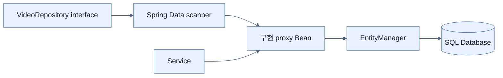

# Repository와 선언적 쿼리 만들기

## 한눈에 보기

`VideoRepository extends JpaRepository<VideoEntity, Long>`만 선언해도 Spring Data가 구현 프록시를 만들고 CRUD, 정렬, 페이지, Query by Example 연산을 제공한다. 첫 제네릭은 도메인 타입, 둘째는 식별자 타입이다.

## 1. 왜 이게 필요한가

도메인마다 반복되는 연결 획득, SQL 실행, 행 매핑, 예외·트랜잭션 처리를 직접 작성하면 핵심 규칙이 저장소 세부사항에 묻힌다. Repository pattern은 애플리케이션이 `save`, `findById` 같은 도메인 중심 연산을 사용하고 구현은 데이터 접근 계층에 숨기게 한다.

## 2. 어떻게 동작하는가

Boot가 `Repository` 하위 인터페이스를 스캔하면 Spring Data가 메타데이터에서 Entity·ID 타입을 읽고 런타임 구현을 등록한다. `JpaRepository`는 `ListCrudRepository`, paging/sorting, `QueryByExampleExecutor` 등의 계약을 조합해 `findAll`, `save`, `delete`, `count`, `exists` 등을 제공한다. 애플리케이션은 인터페이스를 주입받고 JPA의 `EntityManager`와 트랜잭션 처리는 내부에 위임한다.

자동 구현은 상용구를 없애지만 데이터 접근 비용까지 없애지는 않는다. 무심코 `findAll()`을 대용량 테이블에 호출하면 그대로 큰 쿼리가 실행된다.

## 3. 그림으로 보기

## 4. 이 노트에 나온 용어

- **repository pattern**: 도메인 객체 집합처럼 데이터 접근을 추상화하는 패턴.
- **marker interface**: 동작보다 프레임워크 탐지·분류 의미를 주는 인터페이스.
- **CRUD**: Create, Read, Update, Delete 기본 데이터 연산.
- **query derivation**: 메서드 서명 같은 메타데이터에서 쿼리를 생성하는 과정.

## 7. 연결

- [[04-using-custom-finders-sorting-and-limits]] — 기본 CRUD를 필드 조건 쿼리로 확장한다.
- [[05-query-by-example-for-dynamic-search]] — 상속된 Example 실행 기능을 사용한다.
- [[06-writing-custom-jpa-queries]] — 파생이 부적절할 때 쿼리를 직접 제공한다.

## 8. 스스로 확인

- 전체 1차 정리 후: 구현 클래스가 없는 repository가 주입 가능한 Bean이 되는 과정을 설명한다.

<!-- ==== 아래는 내 영역 · 스킬 수정 금지 ==== -->

## 내 설명 시도

## 막혔던 지점

## 리뷰 이력

