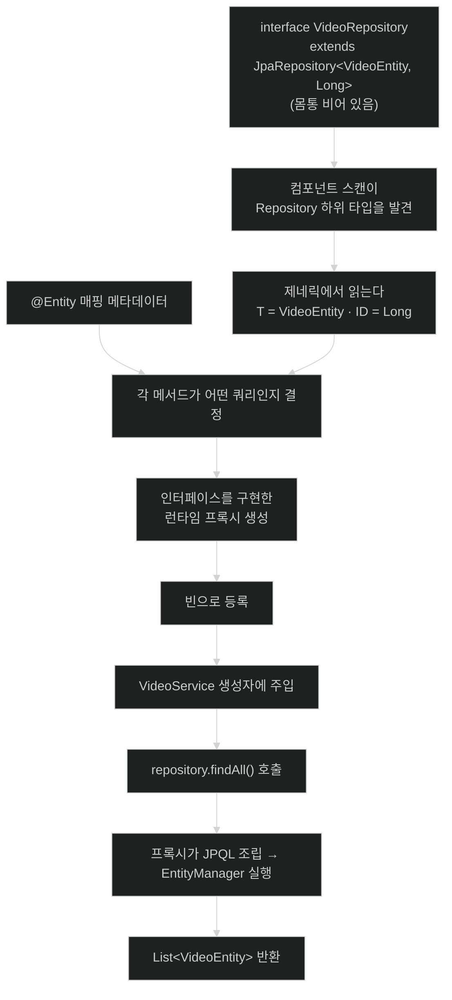

# 리포지토리 만들기 — 쓰지 않은 쿼리가 도는 이유

## 한눈에 보기

| 질문 | 핵심 답 |
|---|---|
| 최고의 쿼리는? | **쓰지 않아도 되는 쿼리.** |
| 리포지토리가 하는 일 | 애플리케이션의 **도메인 말**을 저장소의 **쿼리 말**로 옮긴다 |
| 우리가 쓰는 코드 | 인터페이스 선언 **한 줄.** 구현 클래스가 없다. |
| 두 제네릭 인자 | 도메인 타입과 기본 키 타입 |
| 그런데 어떻게 도나 | `Repository` 마커 인터페이스를 보고 Spring Data가 **런타임 구현을 만든다** |
| 공짜로 딸려 오는 것 | 조회·삭제·저장·집계 연산 한 묶음 |
| 아직 못 하는 것 | **더 구체적인 조건**으로 찾기 |

## 1. 왜 이게 필요한가

### 출발 장면: 엔티티는 있는데 꺼낼 방법이 없다

[[02a-entities-in-jpa]]에서 `VideoEntity`를 만들었다. 이제 이걸 저장하고 꺼내야 한다. JPA 표준 방식대로 쓰면 이렇게 된다.

```java
public List<VideoEntity> findAll() {
    EntityManager em = entityManagerFactory.createEntityManager();
    try {
        return em.createQuery("select v from VideoEntity v", VideoEntity.class)
                 .getResultList();
    } finally {
        em.close();
    }
}
```

이름 하나로 찾는 메서드, 저장하는 메서드, 삭제하는 메서드를 각각 이렇게 쓴다. 그리고 **엔티티 타입마다 이 클래스를 통째로 하나씩** 만든다.

### 여기서 뭐가 무너지나

세 가지가 반복된다.

1. **배관 코드가 전부 같다.** `EntityManager` 얻고, 쿼리 만들고, 실행하고, 닫는다. 엔티티가 열 개면 이 뼈대가 열 번 복사된다.
2. **쿼리 문자열이 코드 안에 흩어진다.** `"select v from VideoEntity v"`에서 엔티티 이름을 바꾸면 컴파일러가 잡아 주지 않는다. 실행해 봐야 안다.
3. **타입 안전성이 두 번 무너진다.** 쿼리 문자열은 검사되지 않고, 결과 타입도 `getResultList()`가 돌려주는 것을 믿어야 한다.

가장 아픈 것은 1번이다. 서로 다른 것은 쿼리 한 줄인데 **같은 것이 열 줄**이다.

### 그래서 나온 생각

책은 이 절을 도발적인 질문으로 연다.

> 최고의 쿼리는 무엇인가? **우리가 쓰지 않아도 되는 쿼리다!**

그리고 그것을 가능하게 하는 가장 단순한 방법이 **[[리포지토리]]**(= 한 도메인 타입에 대한 데이터 연산을 한곳에 모으는 패턴이자 그 인터페이스)라고 한다. 책은 출처까지 밝힌다 — 이 패턴은 원래 Martin Fowler의 *Patterns of Enterprise Application Architecture*(Addison-Wesley)에서 발표됐다.

리포지토리가 하는 일을 책이 한 문장으로 요약한다.

> 애플리케이션은 리포지토리에 **도메인 말(domain speak)**로 이야기하고, 리포지토리는 다시 데이터 저장소에 **쿼리 말(query speak)**로 이야기한다.

비유하자면 리포지토리는 **도서관 사서**다. 나는 "『자바의 정석』 있나요?"라고 내 말로 묻고, 사서가 그것을 청구기호와 서가 번호라는 도서관의 말로 옮겨 찾아온다. 나는 청구기호 체계를 몰라도 된다.

→ 비유가 깨지는 지점: 사서는 내가 제목을 애매하게 대도 **되묻고 추론한다.** 하지만 다음 노트에서 볼 파생 finder는 메서드 이름의 **철자 그대로만** 해석한다. 필드 이름을 하나 틀리면 되묻지 않고 애플리케이션 **시작 시점에 실패**한다. 이 융통성 없음이 결함처럼 보이지만 실은 안전장치다 — 오타가 런타임까지 살아남지 않는다.

`repository`라는 이름 자체가 "보관소"라는 뜻인 것도 이 역할과 맞물린다. 데이터를 담아 두는 곳이 아니라, **그 데이터에 이르는 모든 경로를 한곳에 모아 둔 곳**이다.

## 2. 어떻게 동작하는가

### 2.1 우리가 쓰는 것은 인터페이스 한 줄

책의 설명 — Spring Data 이전에는 이 동작의 번역을 **손으로** 써야 했다. 하지만 Spring Data는 데이터 저장소의 **메타데이터를 읽어 [[쿼리-파생]]**(= 메타데이터와 메서드 이름을 읽어 쿼리를 자동으로 만들어 내는 동작)을 수행하는 수단을 제공한다.

`VideoRepository.java`를 만들고 이렇게 쓴다.

```java
public interface VideoRepository extends JpaRepository<VideoEntity, Long> {
}
```

책의 항목별 설명이다.

- **[[Spring-Data-JPA]]**(= JPA를 대상으로 하는 Spring Data 모듈)의 인터페이스 `JpaRepository`를 두 개의 제네릭 인자와 함께 상속한다 — `VideoEntity`와 `Long`, 즉 **[[도메인-타입]]**(= 리포지토리가 다루는 대상 클래스)과 **[[기본-키]]**(= 각 행을 유일하게 식별하는 열) 타입이다.
- `JpaRepository`에는 이미 지원되는 **[[CRUD]]**(= 생성·조회·수정·삭제 네 가지 기본 연산) 연산 한 묶음이 들어 있다.

그리고 한 문장을 덧붙인다 — **"믿기 어렵겠지만, 시작하는 데 필요한 건 이게 전부다."**

몸통이 비어 있다는 점을 다시 보자. 메서드도 없고 구현 클래스도 없다. **그런데 이걸 주입받아 `findAll()`을 부르면 실제로 SQL이 나간다.**

### 2.2 구현이 없는데 동작하는 이유

책이 그 비밀을 짚는다.

> 가장 중요하게 이해할 것 중 하나는, IDE로 `JpaRepository` 안을 들여다보면 이 클래스 계층이 **`Repository`에서 끝난다**는 것을 발견하게 된다는 점이다. 이것은 **안에 아무것도 없는 [[마커-인터페이스]]**(= 메서드를 갖지 않고, 그 타입을 구현했다는 사실 자체로 의미를 전달하는 인터페이스)다.
>
> Spring Data는 모든 `Repository` 인스턴스를 찾아 다양한 쿼리 파생 전술을 적용하도록 코딩돼 있다. 즉 `Repository`나 그 하위 인터페이스를 상속하는 어떤 인터페이스든 Spring Boot의 컴포넌트 스캔에 잡혀 **자동으로 등록되어** 우리가 쓸 수 있게 된다.

단계로 풀면 이렇다.

1. 컴포넌트 스캔이 `Repository`를 상속한 인터페이스를 찾는다. — 마커가 있어야 "이건 리포지토리다"를 기계가 판별할 수 있기 때문이다.
2. 제네릭 인자에서 도메인 타입과 키 타입을 읽는다. — 어떤 엔티티를 다루는지 알아야 매핑 메타데이터를 찾을 수 있기 때문이다.
3. `@Entity` 매핑 메타데이터를 참조해 각 메서드가 어떤 쿼리가 되어야 하는지 결정한다. — 필드 이름과 컬럼 이름의 대응이 필요하기 때문이다.
4. 그 인터페이스를 구현한 **[[프록시]]**(= 타입인 척하며 호출을 가로채 실제 동작을 대신 수행하는 객체)를 런타임에 만들어 빈으로 등록한다. — 인터페이스에는 몸통이 없으므로 누군가 실제 실행을 맡아야 하기 때문이다.
5. 주입받는 쪽은 `VideoRepository` 타입으로 받는다. — 쓰는 코드가 이 모든 과정을 몰라도 되게 하기 위해서다.

4단계가 [[02b-pojos-and-the-spring-programming-model]]에서 본 그 프록시와 같은 발상이다. 거기서는 **있는 클래스를 감쌌고**, 여기서는 **없는 구현을 만들어 낸다.** 둘 다 "컨테이너가 생성을 통제하기 때문에 가능한 일"이라는 점은 같다.

`Repository`가 **비어 있다**는 사실도 우연이 아니다. 메서드가 하나라도 있으면 모든 리포지토리가 그 메서드를 갖게 되고, [[01a-using-spring-data-to-easily-manage-data]]에서 본 최소공통분모 문제가 재현된다. 아무것도 넣지 않았기 때문에 저장소별 하위 인터페이스가 자유롭게 갈릴 수 있다.

### 2.3 공짜로 딸려 오는 연산들

책은 `JpaRepository`가 제공하는 연산을 나열한다. 기능별로 묶어 보면 이렇다.

| 묶음 | 연산 | 무엇을 위한 것인가 |
|---|---|---|
| 조회 | `findAll()`, `findAll(Sort)`, `findAll(Pageable)`, `findById(ID)`, `findAllById(Iterable<ID>)` | 전체·정렬·페이지·단건 조회 |
| Example 기반 조회 | `findAll(Example<S>)`, `findAll(Example<S>, Sort)`, `findAll(Example<S>, Pageable)`, `findBy(Example<S>)`, `findBy(Example<S>, Pageable)`, `findBy(Example<S>, Sort)`, `findOne(Example<S>)` | **[[Query-By-Example]]**(= 부분적으로 채운 도메인 객체를 조회 조건으로 쓰는 방식)용 |
| 삭제 | `deleteById(ID)`, `deleteAll(Iterable<T>)`, `deleteAllById(Iterable<ID>)`, `deleteAllByIdInBatch(Iterable<ID>)`, `deleteAllInBatch()` | 단건·다건·배치 삭제 |
| 저장 | `save(S)`, `saveAll(Iterable<S>)`, `saveAndFlush(S)`, `saveAllAndFlush(Iterable<S>)` | 저장과 즉시 flush |
| 집계 | `count()`, `count(Example<S>)`, `existsById(ID)` | 개수와 존재 여부 |

그리고 중요한 단서를 붙인다 — **이것들이 전부 `JpaRepository`에 직접 있는 것은 아니다.** 일부는 계층 위쪽의 다른 Spring Data 리포지토리 인터페이스에 있으며, 여기에는 `ListPagingAndSortingRepository`, `ListCrudRepository`, `QueryByExampleExecutor`가 포함된다.

이 사실이 실무에서 의미를 갖는 순간이 있다. [[05-query-by-example-for-dynamic-search]]에서 보듯, `Repository`를 직접 상속해 자기 인터페이스를 만들면 **어떤 상위 인터페이스를 함께 상속하느냐에 따라 쓸 수 있는 연산이 달라진다.**

### 2.4 시그니처에 나오는 기호 읽기

책은 제네릭 기호와 컨테이너 타입도 정리한다.

| 기호 | 뜻 | 예 |
|---|---|---|
| `ID` | 리포지토리의 기본 키 타입 | `Long` |
| `T` | 리포지토리의 **직접적인** 도메인 타입 | `VideoEntity` |
| `S` | `T`를 상속하는 하위 타입. 때로 **projection 타입**에 쓰인다 | `VideoEntity` 또는 그 부분 뷰 |
| `Iterable` | 모든 원소가 메모리에 완전히 실체화되어 있을 것을 요구하지 않는 순회 가능 타입 | `deleteAllById(Iterable<ID>)` |
| `Example` | Query By Example을 위해 쓰이는 객체 | `findAll(Example<S>)` |

`Iterable`에 대한 설명이 특히 눈여겨볼 만하다. `List`가 아니라 `Iterable`을 받는 이유는 **호출자가 전부를 한 번에 메모리에 올리지 않아도 되게** 하기 위해서다. 큰 데이터를 다룰 때 이 차이가 실제로 드러난다.

`S`의 projection 언급도 이 장 밖으로 이어지는 실마리다 — 도메인 타입 전체가 아니라 필요한 필드만 담은 타입으로 결과를 받을 수 있다는 뜻이며, [[02-dtos-entities-and-pojos]]의 DTO 분리와 맞닿는다.

### 2.5 그래도 못 하는 것

책은 이 절을 이렇게 닫는다.

> 이 모든 연산이 엄청난 힘을 주지만, 한 가지 빠진 것이 있다 — **더 구체적인 기준으로 질의하는 능력**이다.

`findAll()`은 전부 가져오고 `findById()`는 키로 하나 가져온다. 그런데 "이름에 `SPRING`이 들어간 비디오"를 찾으려면? `JpaRepository`의 어떤 메서드도 그걸 못 한다. **[[페이징]]**(= 결과를 정해진 크기의 페이지 단위로 나눠 요청하는 방식)과 정렬은 되지만 **조건**은 안 된다.

그 빈자리를 채우는 것이 다음 노트다 — [[04-using-custom-finders]].

## 3. 그림으로 보기

### 빈 인터페이스가 동작하는 객체가 되기까지



### 도메인 말과 쿼리 말

```text
  [애플리케이션이 쓰는 말 — 도메인 말]

      videoRepository.findById(42L)
      videoRepository.save(newVideo)
             │
             │  리포지토리가 번역한다
             ▼
  [저장소가 쓰는 말 — 쿼리 말]

      select v.id, v.name, v.description from video_entity v where v.id = ?
      insert into video_entity (name, description) values (?, ?)

  ▶ 왼쪽에는 표 이름도 컬럼 이름도 SQL도 없다
  ▶ 저장소를 바꾸면 오른쪽만 바뀐다 — 이것이 리포지토리를 두는 값이다
  ▶ 단, 번역 규칙(엔티티 매핑)은 여전히 우리가 @Entity로 제공한 것이다
```

### 상속 계층과 그 의미

```text
  Repository<T, ID>                      ← 마커. 안이 비어 있다
       ▲                                    "이건 리포지토리다"만 말한다
       │
  CrudRepository / ListCrudRepository    ← 저장 · 삭제 · 단건 조회
       ▲
       │
  PagingAndSortingRepository /
  ListPagingAndSortingRepository         ← 정렬 · 페이징
       ▲
       │  + QueryByExampleExecutor       ← Example 기반 조회
       │
  JpaRepository<T, ID>                   ← JPA 전용 추가 (flush · 배치 삭제)
       ▲
       │
  VideoRepository                        ← 우리가 쓰는 것

  ▶ 마커가 비어 있는 이유: 여기에 메서드를 넣으면 모든 저장소가 그것을 갖게 되어
    "최소공통분모 API" 문제가 재현된다. 비워 뒀기 때문에 아래 계층이 자유롭게 갈린다.
  ▶ 내려올수록 기능이 늘고, 대신 특정 저장소에 묶인다.
```

## 4. 이 노트에 나온 용어

| 용어 | 한 줄 풀이 | 자세히 |
|---|---|---|
| 리포지토리 | 한 도메인 타입의 데이터 연산을 한곳에 모으는 인터페이스 | [[_glossary#리포지토리]] |
| 쿼리 파생 | 메타데이터와 메서드 이름으로 쿼리를 자동 생성하는 동작 | [[_glossary#쿼리-파생]] |
| 마커 인터페이스 | 메서드 없이 타입 자체로 의미를 전달하는 인터페이스 | [[_glossary#마커-인터페이스]] |
| CRUD | 생성·조회·수정·삭제 네 가지 기본 연산 | [[_glossary#CRUD]] |
| 도메인 타입 | 리포지토리가 다루는 대상 클래스 | [[_glossary#도메인-타입]] |
| 기본 키 | 각 행을 유일하게 식별하는 열 | [[_glossary#기본-키]] |
| Spring Data JPA | JPA를 대상으로 하는 Spring Data 모듈 | [[_glossary#Spring-Data-JPA]] |
| 프록시 | 타입인 척하며 호출을 가로채 대신 수행하는 객체 | [[_glossary#프록시]] |
| Query By Example | 부분적으로 채운 도메인 객체를 조회 조건으로 쓰는 방식 | [[_glossary#Query-By-Example]] |
| 페이징 | 결과를 정해진 크기의 페이지로 나눠 요청하는 방식 | [[_glossary#페이징]] |

## 5. 자주 헷갈리는 것

### 리포지토리 = DAO

겹치지만 강조점이 다르다. DAO는 "데이터 접근 코드를 모아 둔 객체"이고, 리포지토리는 **"도메인 관점의 집합처럼 보이게 하는 것"**에 방점이 있다. 그래서 리포지토리 메서드 이름에는 SQL 냄새가 나지 않는 편이 좋다.

### 인터페이스에 구현이 없다 vs 구현이 안 만들어진다

구현은 **있다.** 다만 우리가 쓰지 않고 런타임 프록시가 그 자리를 채운다. 그래서 디버거에서 클래스 이름이 낯설고, 그 클래스에 중단점을 걸 수 없다.

### `JpaRepository`가 모든 메서드의 출처다

아니다. 상당수가 상위 인터페이스(`ListCrudRepository`, `ListPagingAndSortingRepository`, `QueryByExampleExecutor`)에서 온다. 직접 인터페이스를 조립할 때 이 구분이 실제로 중요해진다.

### `save()`가 UPDATE만 한다 / INSERT만 한다

[[02a-entities-in-jpa]]에서 본 대로 **`id`의 `null` 여부**로 갈린다. 메서드 이름이 `save` 하나인 것은 호출하는 쪽이 그 구분을 신경 쓰지 않게 하려는 설계다.

### `Iterable`과 `List`

`Iterable`을 요구하는 시그니처는 "전부 메모리에 올려 놓지 않아도 된다"는 여지를 남긴 것이다. 물론 `List`를 넘겨도 되지만, 왜 굳이 상위 타입을 썼는지는 이 의도에 있다.

## 6. 언제 안 쓰나 / 경계

- 리포지토리로 표현하기 어색한 연산이 있다. 여러 엔티티에 걸친 통계, 대량 배치 갱신 같은 것은 [[06-writing-custom-jpa-queries]]나 더 아래 층으로 내려가는 편이 낫다.
- `findAll()`은 **표 전체를 메모리에 올린다.** 데모에서는 편하지만 행이 많아지면 그대로 사고가 된다 — [[04b-limiting-query-results]]가 이 문제를 다룬다.
- 인터페이스만 쓴다는 것은 **구현을 검사할 수 없다**는 뜻이기도 하다. 어떤 쿼리가 나가는지는 로그로 확인해야 한다.
- 리포지토리를 상속으로 조립할 때 어떤 상위 인터페이스를 넣을지에 따라 기능이 달라진다. "왜 이 메서드가 없지?"는 대개 상속 계층 문제다.

## 7. 연결

- [[02a-entities-in-jpa]] — `@Entity`가 만든 매핑 메타데이터가 이 노트의 쿼리 파생이 참조하는 근거다.
- [[04-using-custom-finders]] — 이 노트가 남긴 "구체적인 조건으로 못 찾는다"는 한계를 메서드 이름으로 푼다.
- [[01a-using-spring-data-to-easily-manage-data]] — 접근 방법 사다리의 맨 위 칸이 이 노트의 내용이며, `Repository`가 비어 있는 이유도 그 노트의 최소공통분모 논의와 이어진다.

## 8. 스스로 확인

1. `EntityManager`로 직접 쓸 때 반복되는 세 가지 문제는 무엇인가? 그중 가장 아픈 것은?
2. "도메인 말"과 "쿼리 말"의 구체적인 예를 각각 들 수 있는가?
3. 몸통이 빈 인터페이스가 동작하는 과정을 다섯 단계로 설명할 수 있는가?
4. `Repository` 마커 인터페이스가 **비어 있어야 하는** 이유는 무엇인가?
5. [[02b-pojos-and-the-spring-programming-model]]의 프록시와 이 노트의 프록시는 무엇이 같고 무엇이 다른가?
6. `ID`, `T`, `S`가 각각 무엇을 가리키는가?
7. 시그니처가 `List`가 아니라 `Iterable`을 요구하는 의도는?
8. `JpaRepository`가 주는 연산으로 "이름에 SPRING이 들어간 비디오"를 못 찾는 이유는?

> 여덟 문항을 스스로 답한 **뒤에** [[_03-creating-repositories-and-declarative-queries]]에서 모범답안과 대조한다. 먼저 열면 이 문항들은 다시 인출 문제로 쓸 수 없다.

<!-- ==== 아래는 내 영역 · 스킬 수정 금지 ==== -->

## 내 설명 시도


## 막혔던 지점


## 리뷰 이력
