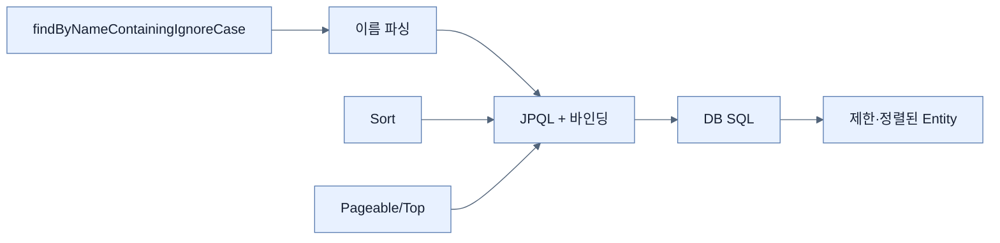

# Custom Finder, 정렬, 결과 제한

## 한눈에 보기

`findByNameContainingIgnoreCase`처럼 repository 메서드 이름을 주어·속성·조건 키워드로 쓰면 Spring Data가 JPQL/SQL을 생성한다. `Sort`, `Pageable`, `First/Top`, `Distinct`로 순서와 결과 크기를 제어하고 `countBy`, `existsBy`, `deleteBy`도 같은 문법을 쓴다.

## 1. 왜 이게 필요한가

단순 필드 조건마다 쿼리 문자열을 작성하면 의도보다 문법이 앞선다. 파생 쿼리는 Entity 속성에 맞춘 이름 자체를 실행 가능한 명세로 사용하고 값은 바인딩하여 SQL injection 위험을 줄인다.

## 2. 어떻게 동작하는가

Spring Data는 `findBy` 뒤의 속성 경로와 `And/Or`, `LessThan`, `Containing`, `IgnoreCase`, `OrderBy` 같은 키워드를 파싱해 JPQL을 만들고 JPA가 DB 방언의 SQL로 변환한다. 중첩 속성도 탐색하며 모호하면 `_`로 경계를 표시할 수 있다. `Sort`는 호출 시점 순서를, `Pageable`은 페이지 번호·크기·정렬을 전달한다.

고정된 조회에는 읽기 쉽지만 입력 필드 조합이 늘면 메서드와 `if` 분기가 조합 폭발한다. 이름이 비즈니스 의도보다 파서 문법을 설명하기 시작하면 QBE나 `@Query`로 전환할 신호다.

## 3. 그림으로 보기

## 4. 이 노트에 나온 용어

- **property expression**: 메서드 이름에서 Entity 속성 경로를 표현한 부분.
- **argument binding**: 입력값을 쿼리 문자열 연결이 아닌 파라미터로 안전하게 전달하는 것.
- **Pageable**: 페이지 번호·크기·정렬 조건을 담는 요청 객체.
- **limiting**: 조회 결과의 최대 행 수를 제한하는 것.

## 7. 연결

- [[03-creating-repositories-and-declarative-queries]] — 파생 finder가 추가되는 기본 repository다.
- [[05-query-by-example-for-dynamic-search]] — 선택적 필드 조합이 많아질 때 대안이다.
- [[06-writing-custom-jpa-queries]] — 복잡한 JOIN과 조건을 명시적으로 작성한다.

## 8. 스스로 확인

- 전체 1차 정리 후: 파생 쿼리가 적합하지 않아지는 신호를 두 가지 설명한다.

<!-- ==== 아래는 내 영역 · 스킬 수정 금지 ==== -->

## 내 설명 시도

## 막혔던 지점

## 리뷰 이력

