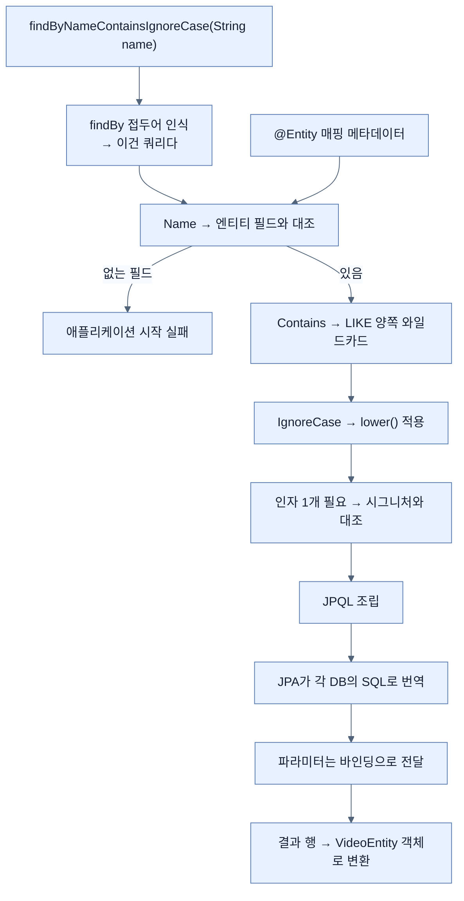

# 커스텀 finder — 메서드 이름이 곧 쿼리다

## 한눈에 보기

| 질문 | 핵심 답 |
|---|---|
| 쿼리를 쓰는 방법 | 인터페이스에 **메서드 이름만** 선언한다. 구현하지 않는다. |
| 파싱 순서 | `findBy` 접두어 → 필드 이름 → 선택적 한정어 → 인자로 값 공급 |
| 파라미터 이름이 쿼리에 영향? | **없다.** 쿼리는 **메서드 이름**에서만 파생된다. |
| 보안 | 인자를 바인딩하므로 SQL 인젝션이 막힌다 |
| 방언 | JPQL이 각 DB의 SQL로 번역되므로 신경 쓰지 않아도 된다 |
| 한계 | 조건 조합이 **작성 시점에 고정**된다 |
| 그 한계가 드러나는 곳 | 두 필드짜리 검색 상자 하나에 `if` 세 개 |

## 1. 왜 이게 필요한가

### 출발 장면: 이름으로 찾고 싶다

[[03-creating-repositories-and-declarative-queries]]에서 `VideoRepository`를 만들었다. `findAll()`도 되고 `findById()`도 된다. 그런데 화면에 검색 상자를 붙이려고 보니 정작 필요한 것이 없다.

> "이름에 `SPRING`이 들어간 비디오를 찾아 줘."

`JpaRepository`의 어떤 메서드도 이걸 못 한다.

### 여기서 뭐가 무너지나

손으로 해결하려면 두 갈래인데 둘 다 문제가 있다.

**갈래 1 — 전부 가져와서 Java로 거른다.**

```java
return repository.findAll().stream()
        .filter(v -> v.getName().contains("SPRING"))
        .toList();
```

표에 행이 열 건이면 잘 돈다. 10만 건이면 **10만 건을 전부 메모리에 올린 뒤 아홉 건을 남긴다.** 데이터베이스가 인덱스로 0.001초에 할 일을 애플리케이션이 몇 초에 걸쳐 한다.

**갈래 2 — 쿼리를 직접 쓴다.**

```java
em.createQuery("select v from VideoEntity v where v.name like '%" + keyword + "%'", VideoEntity.class)
```

이건 더 나쁘다. 사용자가 입력한 문자열을 쿼리에 **이어 붙였기** 때문이다. 누군가 검색어에 따옴표와 SQL 조각을 넣으면 쿼리의 의미 자체가 바뀐다.

### 그래서 나온 생각

**메서드 이름 자체를 쿼리로 읽는다.** `VideoRepository`에 이 한 줄을 더한다.

```java
List<VideoEntity> findByName (String name);
```

책의 설명이다.

- `findByName(String name)` 메서드를 **[[파생-finder]]**(= 리포지토리 인터페이스에 이름만 선언하면 Spring Data가 그 이름을 파싱해 쿼리를 만들어 주는 메서드)라고 부른다. 우리는 **이 메서드를 구현할 필요가 전혀 없다.**
- 반환 타입은 `List<VideoEntity>`이며, 리포지토리의 도메인 타입 목록을 반환해야 함을 나타낸다.

비유하자면 파생 finder는 **독일어의 합성어**다. `findByNameContainsIgnoreCase`는 단어를 이어 붙여 하나의 뜻을 만든다. 규칙을 알면 처음 보는 조합도 읽히고, 새 뜻이 필요하면 새 단어를 조립해 낼 수 있다.

→ 비유가 깨지는 지점: 독일어 합성어는 아무리 길어도 **사람이 읽어 낸다.** 하지만 파생 finder는 길이가 늘수록 **사람이 못 읽는 지점이 기계보다 먼저 온다.** `findByMetricsActivityViewsLessThanOrEngagementLikesLessThan` 같은 이름을 파서는 아무 문제 없이 처리하지만 사람은 세 번 읽어야 한다. **기계는 되는데 사람이 안 되는** 이 비대칭이 이 방식의 실질적 한계이며, [[06-writing-custom-jpa-queries]]로 넘어가는 이유가 된다.

## 2. 어떻게 동작하는가

### 2.1 이름이 파싱되는 순서

책이 파싱 규칙을 순서대로 설명한다.

> 이 인터페이스 메서드가 쿼리를 쓰는 데 필요한 전부다. Spring Data의 마법은 **메서드 이름을 파싱한다**는 것이다.
>
> 1. `findBy`로 시작하는 모든 리포지토리 메서드가 쿼리로 표시된다.
> 2. 그다음 **필드 이름**(`Name`)을 찾는다. 선택적 한정어(`Containing` 그리고/또는 `IgnoreCase`)가 붙을 수 있다.
> 3. 이것이 필드이므로, 대응하는 **인자**(`String name`)가 있을 것으로 기대한다.
>
> Spring Data는 쿼리를 **메서드 이름**에서 파생하며, **파라미터 이름에서 파생하지 않는다.** 파라미터 이름은 런타임에 값을 공급하는 데만 쓰인다.

마지막 문장이 가장 자주 오해되는 지점이다. 다음 두 선언은 **완전히 같은 쿼리**를 만든다.

```java
List<VideoEntity> findByName(String name);
List<VideoEntity> findByName(String 아무거나);
```

파라미터 이름은 **값을 나르는 통로일 뿐** 의미를 갖지 않는다. 반대로 메서드 이름의 `Name`을 `Titel`로 바꾸면 `VideoEntity`에 그런 필드가 없으므로 **애플리케이션이 시작조차 하지 않는다.** [[03-creating-repositories-and-declarative-queries]]에서 "사서 비유가 깨지는 지점"이라고 한 그 융통성 없음이 여기서 안전장치로 작동한다 — 오타가 런타임까지 살아남지 않는다.

각 단계가 왜 필요한지 붙여 보면 이렇다.

1. **`findBy` 접두어 인식** — 리포지토리에 있는 모든 메서드를 쿼리로 볼 수는 없기 때문이다. 파싱을 시작할 표식이 필요하다.
2. **필드 이름 대조** — `@Entity` 매핑 메타데이터에 그 이름의 필드가 실제로 있는지 확인해야 하기 때문이다. 이 단계가 오타를 시작 시점에 잡는다.
3. **한정어 해석** — 같은 필드에 대해 정확히 일치인지, 부분 일치인지, 대소문자를 볼지를 정해야 하기 때문이다.
4. **인자 개수·타입 대조** — 조건 하나에 값 하나가 필요하기 때문이다. 개수가 안 맞으면 역시 시작 시점에 실패한다.

### 2.2 무엇으로 번역되는가

책의 서술 — Spring Data JPA는 이 메서드 시그니처를 문자 그대로 다음으로 번역한다.

```sql
select video.* from VideoEntity video where video.name = ?1
```

그리고 세 가지를 덧붙인다.

- **보너스로 들어오는 인자에 대해 제대로 된 바인딩을 수행해 SQL 인젝션 공격을 피한다.**
- 돌아오는 **모든 행을 `VideoEntity` 객체로 변환한다.**
- 우리는 **표 이름이나 컬럼 이름을 다룰 필요가 없다.** Spring Data가 내장 메타데이터를 전부 활용해 관계형 데이터베이스와 대화할 SQL을 만든다.

여기서 `?1`이 **[[파라미터-바인딩]]**(= 입력을 쿼리 문자열에 이어 붙이지 않고 자리표시자에 값으로 따로 전달하는 방식)이다. §1의 갈래 2에서 문자열을 이어 붙였던 것과 결정적으로 다르다.

> **Tip (책 p.82)**: **[[SQL-인젝션]]**(= 사용자 입력에 SQL 조각을 섞어 쿼리의 의미 자체를 바꾸는 공격) 공격이란 무엇인가? 시스템 사용자에게 데이터를 입력하게 하고 그것을 쿼리에 이어 붙일 기회를 줄 때마다, 누군가 SQL 조각을 넣어 시스템을 악의적으로 공격할 위험이 생긴다. 일반적으로 사용자 입력을 운영 쿼리에 그대로 복사·붙여넣기 하는 것은 위험한 행동이다. **인자 바인딩은 훨씬 안전한 접근**을 제공하며, 모든 사용자 입력이 데이터 저장소의 정문으로 들어와 쿼리 생성에 제대로 적용되도록 강제한다.

Tip의 마지막 표현이 정확하다. 바인딩은 값을 **문법이 아니라 데이터로** 취급하게 만든다. 검색어에 `' OR 1=1 --`을 넣어도 그것은 "그런 이름의 비디오를 찾아라"라는 뜻이 될 뿐이다.

책은 방언 문제도 짚는다 — 이것이 JPA이기 때문에 **[[데이터베이스-방언]]**(= 제품마다 다른 SQL 문법·함수·타입의 차이)조차 신경 쓸 필요가 없다. MySQL이든 PostgreSQL이든 다른 무엇이든, JPA가 그 특이점들을 대체로 처리해 준다.

### 2.3 한정어 어휘

파생 finder를 실제로 쓰려면 조립할 단어를 알아야 한다. 책이 네 묶음으로 제시한다.

| 묶음 | 한정어 | 푸는 문제 |
|---|---|---|
| 결합·비교 | `And`, `Or` / `Between`, `LessThan`, `GreaterThan` | 조건을 여러 개 묶고 범위를 표현한다 |
| 문자열 부분 일치 | `IsStartingWith`, `StartingWith`, `StartsWith` / `IsEndingWith`, `EndingWith`, `EndsWith` / `IsContaining`, `Containing` / `Like` / `IsNotContaining`, `NotContaining`, `NotContains` | 정확히 일치가 아닌 검색을 표현한다 |
| 대소문자 | 필드 하나에 `IgnoreCase`, 전체에 끝에서 `AllIgnoreCase` | 사용자 입력의 대소문자를 무시한다 |
| 정렬 | `OrderBy` + `Asc` / `Desc` | 순서를 **미리 알 때** 이름에 고정한다 |

같은 뜻에 이름이 세 개씩 있는 것(`StartingWith`/`StartsWith`/`IsStartingWith`)은 **읽기 자연스러운 쪽을 고르라는 배려**다. 파서는 셋 다 같게 처리한다.

> **Note (책 p.83)**: **[[JPQL]]**(= 표·컬럼이 아니라 엔티티와 그 필드를 대상으로 쓰는 질의 언어)에서 쿼리는 데이터베이스 컬럼이 아니라 **엔티티 필드**로 표현된다. **[[와일드카드]]**(= "여기에는 아무 문자열이 와도 된다"를 뜻하는 기호)인 `%`는 `LIKE`와 함께 쓰여 부분 일치를 선언적으로 정의하게 해 준다.
> 직접 적용하려면 finder에 `Like`를 붙이면 된다. 예: `findByNameLike()`. 하지만 와일드카드를 앞에 붙이는 정도의 단순한 작업이라면 `StartsWith`를 쓰고 부분 토큰을 넘기면 된다 — Spring Data가 와일드카드를 대신 넣어 준다. `EndsWith`는 뒤에, `Containing`은 양쪽에 넣는다. 더 복잡한 것이 필요하면 `Like`가 제어권을 준다. 예: `%firstthis%thenthis%`.

이 Note가 알려 주는 실용적 규칙은 하나다 — **`%`를 직접 쓰기 시작하면 `Like`로 내려가고, 그렇지 않으면 한정어에 맡긴다.**

### 2.4 관계를 타고 넘어가기

책은 파생 finder가 관계도 탐색할 수 있다고 한다.

> 예를 들어 리포지토리의 도메인 타입이 `Person`이고 그 안에 `ZipCode`를 가진 `Address` 필드가 있다면, `findByAddressZipCode(ZipCode zipCode)`라는 커스텀 finder를 쓸 수 있다. 이것은 올바른 결과를 찾기 위해 **join을 생성한다.**

그런데 여기에 모호함이 생길 수 있다.

> Spring Data가 모호한 상황을 만나면 해결할 방법이 있다. 예를 들어 방금 말한 `Person` 객체가 `addressZip` 필드도 갖고 있다면, Spring Data는 관계를 타고 넘어가는 것보다 **그 필드를 자연스럽게 우선한다.** 제대로 탐색하도록 강제하려면 **밑줄(`_`)**을 쓴다. `findByAddress_ZipCode(ZipCode zipCode)`처럼.

파싱기가 왜 그런 선택을 하는지 생각해 보면 규칙이 이해된다. `findByAddressZipCode`를 쪼갤 방법은 둘이다.

```text
  후보 A:  addressZipCode  (필드 하나)      → 그런 필드는 없다
  후보 B:  addressZip + Code                → addressZip 필드가 있다면 여기서 멈춘다
  후보 C:  address → zipCode  (관계 탐색)    → 후보 B가 맞으면 여기까지 안 온다

  ▶ 파서는 "가장 긴 필드 이름부터" 맞춰 보고 맞으면 멈춘다.
  ▶ 밑줄은 "여기서 끊어라"를 사람이 직접 지시하는 것이다.
```

밑줄은 문법 장식이 아니라 **파싱 경계를 명시하는 기호**다.

### 2.5 실제로 붙여 보기 — 두 필드 검색 상자

책은 여기서 [[../chapter-2-creating-web-and-api-applications-with-spring-boot/04d-changing-the-data-through-html-forms|Chapter 2에서 만든]] 화면으로 돌아간다. 참고로 이 데이터 접근 코드를 어떻게 테스트하는지, 특히 Testcontainers로 실제 데이터베이스와 통합 테스트하는 방법은 [[../chapter-5-testing-with-spring-boot/07-testing-repositories-with-testcontainers|Chapter 5]]에서 다룬다고 예고한다.

**① 템플릿에 검색 폼을 더한다**

```html
<form action="/multi-field-search" method="post">
     <label for="name">Name:</label>
     <input type="text" name="name">
     <label for="description">Description:</label>
     <input type="text" name="description">
     <button type="submit">Search</button>
</form>
```

`POST /multi-field-search`로 가고, `name`과 `description` 두 입력이 있으며, Search 버튼이 전체를 발동시킨다.

**② 폼을 받을 [[DTO]]**(= 데이터를 옮기는 것이 목적인 클래스)**를 만든다**

```java
record VideoSearch(String name, String description) {
}
```

책이 짚듯 이 record의 두 `String` 필드가 **HTML 폼에 정의한 이름과 정확히 맞아떨어진다.** Chapter 2에서 본 폼 바인딩 규칙이 그대로 적용된다.

**③ 컨트롤러 메서드를 더한다**

```java
@PostMapping("/multi-field-search")
public String multiFieldSearch(
     @ModelAttribute VideoSearch search,
     Model model) {
     List<VideoEntity> searchResults =
         videoService.search(search);
     model.addAttribute("videos", searchResults);
     return "index";
}
```

여기서 모델에 담기는 것이 이제 `Video`가 아니라 **[[엔티티]]**(= 데이터 접근에 직접 참여하는 클래스)인 `VideoEntity`라는 점을 눈여겨볼 만하다. [[02-dtos-entities-and-pojos]]의 기준으로 보면 엔티티가 화면까지 올라온 셈이고, 책이 허용한 "단기" 범위의 단순화다.

**④ 서비스에서 조건을 조합한다**

여기서 문제가 시작된다. 책의 서술 — 이제 요청을 실제로 만들 차례인데 **온갖 일이 벌어질 수 있다.**

- 사용자가 name과 description을 **둘 다** 입력했을 수 있다
- **name만** 입력했을 수 있다
- **description만** 입력했을 수 있다

그리고 결정적인 지적을 한다 — 예를 들어 name 필드가 비어 있다면 **빈 문자열과 매칭을 시도해서는 안 된다.** 그러면 **전부 매칭되기 때문**이다.

세 경우를 `if`로 나눈다.

```java
if (StringUtils.hasText(videoSearch.name())
     && StringUtils.hasText(videoSearch.description())) {
     return repository
         .findByNameContainsOrDescriptionContainsAllIgnoreCase(
                 videoSearch.name(), videoSearch.description());
}
if (StringUtils.hasText(videoSearch.name())) {
     return repository.findByNameContainsIgnoreCase(videoSearch.name());
}
if (StringUtils.hasText(videoSearch.description())) {
     return repository.findByDescriptionContainsIgnoreCase(videoSearch.description());
}
return Collections.emptyList();
```

- `StringUtils`는 Spring Framework의 유틸리티로, record의 두 필드가 실제로 텍스트를 갖고 있으며 비어 있지도 `null`도 아님을 확인하게 해 준다.
- 둘 다 채워져 있으면 `Contains` 한정어와 `AllIgnoreCase` 수정자를 붙인 finder를 호출한다. 두 필드 모두 부분 일치를 찾되 대소문자는 문제 삼지 않겠다는 뜻이다.
- 한쪽만 있으면 그 필드용 finder를 쓴다.
- 둘 다 비었다면 돌려줄 것은 하나뿐이다. 마지막 상태이므로 `if`조차 필요 없다.

### 2.6 저자가 스스로 인정하는 투박함

책은 이 코드를 보여 준 직후 이렇게 쓴다.

> 이 일련의 `if` 절이 좀 투박하다고 느꼈다면, **동의한다!**

무엇이 투박한지 정확히 짚어 두면 다음 노트들이 왜 필요한지가 분명해진다.

```text
  필드 2개 → 채워질 수 있는 조합 = 2² = 4가지 (둘다 / name만 / desc만 / 없음)
                                    → if 3개 + finder 3개

  필드 3개 → 조합 = 2³ = 8가지
                                    → if 7개 + finder 7개

  필드 4개 → 조합 = 2⁴ = 16가지
                                    → if 15개 + finder 15개

  ▶ 필드 하나를 더할 때마다 필요한 finder와 분기가 두 배가 된다.
  ▶ 게다가 각 finder는 이름이 계속 길어진다:
    findByNameContainsOrDescriptionContainsOrTagsContainsAllIgnoreCase...
  ▶ 이것이 "조합 폭발"이며, 근본 원인은 §1의 비유가 깨지던 그 지점이다 —
    finder의 조건 조합이 작성 시점에 고정되기 때문이다.
```

이 한계에 대한 정면 대응이 [[05-query-by-example-for-dynamic-search]]이고, 그 전에 결과를 다듬는 두 가지 축을 [[04a-sorting-the-results]]와 [[04b-limiting-query-results]]에서 먼저 본다.

## 3. 그림으로 보기

### 이름 하나가 SQL이 되기까지



### 문자열을 잇는 것과 바인딩하는 것

```text
[문자열 결합 — 위험]

  검색어: SPRING
  "... where v.name like '%" + 검색어 + "%'"
  → ... where v.name like '%SPRING%'          정상

  검색어: ' OR 1=1 --
  "... where v.name like '%" + 검색어 + "%'"
  → ... where v.name like '%' OR 1=1 --%'     전부 반환된다
                            ▲ 입력이 문법이 되어 버렸다


[파라미터 바인딩 — 안전]

  JPQL:  ... where lower(v.name) like ?1
  값  :  "%' OR 1=1 --%"

  → 데이터베이스는 ?1 을 "찾을 문자열"로만 취급한다
  → 그런 이름의 비디오가 없으므로 결과는 0건
                            ▲ 입력이 끝까지 데이터로 남는다

  ▶ 파생 finder는 이 바인딩을 자동으로 한다. 안 하는 선택지가 없다.
```

### 조건 조합이 늘어나는 방식

| 검색 필드 수 | 가능한 입력 조합 | 필요한 finder | 필요한 `if` | finder 이름 길이 |
|---:|---:|---:|---:|---|
| 1 | 2 | 1 | 1 | `findByNameContainsIgnoreCase` |
| 2 | 4 | 3 | 3 | `...OrDescriptionContains...` |
| 3 | 8 | 7 | 7 | `...OrTagsContains...` |
| 4 | 16 | 15 | 15 | 읽기 어려워진다 |

**기계가 아니라 사람이 먼저 한계에 닿는다**는 것이 이 표의 요지다.

## 4. 이 노트에 나온 용어

| 용어 | 한 줄 풀이 | 자세히 |
|---|---|---|
| 파생 finder | 이름만 선언하면 Spring Data가 쿼리를 만들어 주는 메서드 | [[_glossary#파생-finder]] |
| 쿼리 파생 | 메타데이터와 메서드 이름으로 쿼리를 자동 생성하는 동작 | [[_glossary#쿼리-파생]] |
| JPQL | 엔티티와 그 필드를 대상으로 쓰는 질의 언어 | [[_glossary#JPQL]] |
| 파라미터 바인딩 | 값을 자리표시자에 따로 전달하는 방식 | [[_glossary#파라미터-바인딩]] |
| SQL 인젝션 | 입력에 SQL을 섞어 쿼리 의미를 바꾸는 공격 | [[_glossary#SQL-인젝션]] |
| 와일드카드 | 임의 문자열을 뜻하는 기호(`%`) | [[_glossary#와일드카드]] |
| 데이터베이스 방언 | 제품마다 다른 SQL 문법·함수·타입의 차이 | [[_glossary#데이터베이스-방언]] |
| 엔티티 | 데이터 접근에 직접 참여하는 클래스 | [[_glossary#엔티티]] |
| DTO | 데이터를 옮기는 것이 목적인 클래스 | [[_glossary#DTO]] |
| 리포지토리 | 한 도메인 타입의 데이터 연산을 모으는 인터페이스 | [[_glossary#리포지토리]] |

## 5. 자주 헷갈리는 것

### 메서드 이름 vs 파라미터 이름

쿼리는 **메서드 이름에서만** 파생된다. 파라미터 이름은 값을 나르는 통로일 뿐이다. 그래서 파라미터 이름을 바꿔도 아무 일이 없고, 메서드 이름의 필드 부분을 바꾸면 시작 시점에 실패한다.

### `Containing` vs `Like`

`Containing`은 와일드카드를 **양쪽에 대신 넣어 준다**. `Like`는 와일드카드를 **내가 값에 직접 넣는다**. 판별 질문 — "`%`를 내가 어디에 놓을지 정해야 하는가?" 그렇다면 `Like`다.

### `IgnoreCase` vs `AllIgnoreCase`

앞의 것은 **바로 앞 필드 하나**에, 뒤의 것은 메서드 **끝에 붙여 전체 필드**에 적용된다. 두 필드짜리 finder에서 한쪽만 대소문자를 무시하고 싶다면 `IgnoreCase`를 그 필드 뒤에 붙인다.

### `findByAddressZipCode` vs `findByAddress_ZipCode`

밑줄이 없으면 파서가 **가장 긴 필드 이름부터** 맞춰 본다. `addressZip` 같은 필드가 있으면 그쪽으로 붙어 버린다. 밑줄은 "여기서 끊으라"는 명시적 지시다.

### 빈 문자열로 검색하면 아무것도 안 나온다

반대다. `Containing`에 빈 문자열을 주면 `%%`가 되어 **전부 매칭된다.** 책이 `StringUtils.hasText`로 먼저 거르는 이유가 정확히 이것이다.

## 6. 언제 안 쓰나 / 경계

- 조건 조합이 **런타임에 달라지는** 검색에는 맞지 않는다. 필드가 늘수록 finder와 `if`가 지수로 늘어난다 — [[05-query-by-example-for-dynamic-search]].
- 메서드 이름이 길어지면 **읽을 수 없게 된다.** 기계가 아니라 사람이 먼저 한계에 닿는다 — [[06-writing-custom-jpa-queries]].
- 복잡한 JOIN, 서브쿼리, 집계는 이름으로 표현할 수 없다.
- 이 절의 예제는 검색 결과로 `VideoEntity`를 화면까지 그대로 올린다. [[02-dtos-entities-and-pojos]]의 기준으로는 분리해야 할 자리이며, 책이 허용한 단기 단순화로 읽어야 한다.
- 반환 타입이 `List`이므로 **결과 전부를 메모리에 올린다.** 매칭이 많으면 §1의 갈래 1과 같은 문제가 다시 생긴다 — [[04b-limiting-query-results]].

## 7. 연결

- [[03-creating-repositories-and-declarative-queries]] — 그 노트가 남긴 "구체적인 조건으로 못 찾는다"는 한계를 이 노트가 푼다. 매핑 메타데이터를 쓰는 것도 같은 구조다.
- [[04a-sorting-the-results]] — 같은 finder에 정렬을 얹는 두 가지 방법을 다룬다. 이 노트의 `OrderBy` 한정어가 그중 정적인 쪽이다.
- [[05-query-by-example-for-dynamic-search]] — 이 노트가 만든 `if` 세 개의 투박함이 그 노트의 출발점이다.

## 8. 스스로 확인

1. 전부 가져와서 Java로 거르는 방식이 왜 나쁜가? 숫자로 설명할 수 있는가?
2. 파생 finder의 이름 파싱 네 단계와 각 단계가 필요한 이유를 말할 수 있는가?
3. 파라미터 이름을 바꿔도 되고 메서드 이름의 필드는 못 바꾸는 이유는?
4. 바인딩이 SQL 인젝션을 막는 원리를 "문법과 데이터"로 설명할 수 있는가?
5. `Containing`과 `Like` 중 어느 쪽을 언제 고르는가?
6. `findByAddressZipCode`가 관계 탐색이 아닌 다른 뜻으로 해석될 수 있는 경우는? 밑줄은 무엇을 지시하는가?
7. 검색어가 비어 있을 때 `hasText`로 거르지 않으면 무엇이 나오는가? 왜인가?
8. 검색 필드가 4개로 늘면 finder와 `if`가 각각 몇 개 필요한가? 그 증가의 근본 원인은?

<!-- ==== 아래는 내 영역 · 스킬 수정 금지 ==== -->

## 내 설명 시도


## 막혔던 지점


## 리뷰 이력
