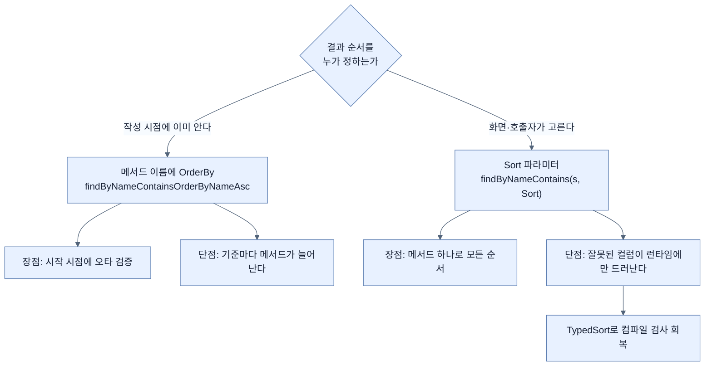

# 결과 정렬하기 — 순서를 누가 정하는가

## 한눈에 보기

| 질문 | 핵심 답 |
|---|---|
| 정렬 방법 두 가지 | 메서드 이름에 `OrderBy`로 **박기** / `Sort` 파라미터로 **받기** |
| 결정적 차이 | 순서를 **작성자**가 정하는가, **호출자**가 정하는가 |
| `OrderBy`가 맞는 때 | 순서를 **미리 알 때** |
| `Sort`가 맞는 때 | 화면이나 호출자가 순서를 고를 때 |
| 여러 컬럼 | `and()`로 잇는다. **선언한 순서대로** 적용된다 |
| 문자열 컬럼명이 불안하면 | `TypedSort` — 메서드 참조로 컴파일 검사를 받는다 |

## 1. 왜 이게 필요한가

### 출발 장면: 검색 결과가 뒤죽박죽이다

[[04-using-custom-finders]]의 검색 상자가 동작한다. 그런데 결과 목록의 순서가 매번 다르다. 데이터베이스는 `ORDER BY`가 없으면 **어떤 순서로든 돌려줄 수 있기 때문**이다. 같은 쿼리를 두 번 실행해도 순서가 같다는 보장이 없다.

화면에는 이름순으로 나와야 한다.

### 여기서 뭐가 무너지나

가장 쉬운 해법은 받아서 Java로 정렬하는 것이다.

```java
return repository.findByNameContainsIgnoreCase(keyword).stream()
        .sorted(Comparator.comparing(VideoEntity::getName))
        .toList();
```

동작하지만 세 가지가 걸린다.

1. **정렬을 위해 전부 가져와야 한다.** 상위 20건만 필요해도 매칭된 전부를 애플리케이션으로 끌어온 뒤 정렬한다. 데이터베이스가 인덱스로 이미 정렬된 순서를 알고 있을 수도 있는데 그 정보를 버린다.
2. **[[페이징]]**(= 결과를 정해진 크기의 페이지로 나눠 요청하는 방식)**과 결합되지 않는다.** "이름순 3페이지"를 요청하려면 정렬이 데이터베이스 쪽에서 일어나야 한다.
3. **정렬 기준이 코드에 고정된다.** 사용자가 "조회수순으로 보기"를 누르면 다른 `Comparator`를 골라 주는 분기가 또 생긴다.

### 그래서 나온 생각

**정렬을 데이터베이스에 시키되, 무엇을 기준으로 할지는 상황에 따라 정한다.** 책은 방법이 여럿이라며 두 가지를 대비시킨다.

> 데이터를 정렬하는 방법에는 여러 가지가 있다. 앞에서 `OrderBy` 절을 붙이는 것을 언급했다. 이것은 **정적인 접근**이지만, 이 일을 **호출자에게 위임하는 것도 가능하다.**

비유하자면 `OrderBy`를 이름에 박는 것은 **메뉴판에 "매운맛"이 고정된 요리**이고, `Sort` 파라미터를 받는 것은 **주문할 때 맵기를 고르는 요리**다. 후자가 메뉴 수를 줄인다 — 맵기 세 단계짜리 요리 하나가 메뉴 세 줄을 대신한다.

→ 비유가 깨지는 지점: 식당은 맵기 선택지가 늘어도 주방 일이 조금 늘 뿐이다. 하지만 `Sort`는 **호출자가 아무 컬럼이나 넣을 수 있게** 열어 준다. 인덱스가 없는 컬럼으로 정렬을 요청받으면 데이터베이스가 전체 정렬(full sort)을 하게 되어 응답이 무너진다. **선택지를 열어 준다는 것은 나쁜 선택지까지 열어 준다는 뜻**이며, 그래서 웹 요청에서 온 정렬 컬럼 이름을 그대로 넘기는 것은 위험하다. 메뉴판에는 없는 요리를 손님이 주문할 수 없지만, `Sort`에는 그런 방어가 기본으로 없다.

## 2. 어떻게 동작하는가

### 2.1 두 가지 방법과 결정권의 위치

| | `OrderBy` (이름에 박기) | `Sort` 파라미터 (받기) |
|---|---|---|
| 어디에 쓰나 | `findByNameContainsOrderByNameAsc(...)` | `findByNameContains(String s, Sort sort)` |
| 순서를 정하는 주체 | 리포지토리 **작성자** | **호출자** |
| 바꾸려면 | 메서드를 새로 만든다 | 인자만 다르게 넘긴다 |
| 정렬 기준이 여럿이면 | 메서드가 기준 수만큼 생긴다 | 메서드는 하나 |
| 잘못된 컬럼 | 시작 시점에 실패 | **런타임에 실패** |
| 적합한 때 | 순서를 미리 알 때 | 화면이 순서를 고를 때 |

마지막에서 두 번째 줄이 중요한 교환 조건이다. `OrderBy`는 [[04-using-custom-finders]]에서 본 이름 파싱을 거치므로 **오타가 시작 시점에 걸린다.** `Sort`는 문자열을 런타임에 받으므로 그 방어가 없다.

### 2.2 `Sort`를 조립하는 법

책의 예제다.

```java
Sort sort = Sort.by("name").ascending()
    .and(Sort.by("description").descending());
```

이렇게 만든 **[[정렬-기준]]**(= 어떤 컬럼으로 어떤 방향으로 정렬할지 담은 Spring Data 객체)을 파생 finder의 파라미터로 넘기면, 책의 설명대로 **어떤 커스텀 finder든 `Sort` 파라미터를 가질 수 있어 호출자가 결과 정렬 방식을 결정하게** 된다.

책이 이 API를 "fluent"라고 부르는 것도 이유가 있다. 각 메서드가 다시 `Sort`를 돌려주기 때문에 점으로 계속 이어 붙일 수 있고, 그래서 코드가 문장처럼 **흐르듯** 읽힌다. `Sort.by(...).ascending().and(...)`를 소리 내어 읽으면 그대로 "이름으로, 오름차순으로, 그리고 설명으로" 가 된다.

조립 단계와 그 이유를 붙이면 이렇다.

1. `Sort.by("name")` — 정렬 대상 컬럼을 지정한다. — 무엇을 기준으로 줄 세울지 먼저 정해야 하기 때문이다.
2. `.ascending()` — 방향을 정한다. — 같은 컬럼이라도 오름·내림이 다른 결과를 주기 때문이다.
3. `.and(Sort.by("description").descending())` — 두 번째 기준을 잇는다. — 첫 기준이 같은 행들 사이의 순서를 정해야 하기 때문이다.

책이 짚는 마지막 문장이 3단계의 의미를 확정한다 — 이 fluent API는 컬럼들의 연쇄를 만들게 해 주고 각각의 오름·내림을 고르게 해 주며, **이것이 곧 정렬이 적용되는 순서이기도 하다.**

즉 선언 순서가 우선순위다.

```text
  Sort.by("name").ascending().and(Sort.by("description").descending())

  → ORDER BY name ASC, description DESC

  name 이 같은 행들끼리만 description 으로 다시 줄 세운다.
  순서를 바꾸면 완전히 다른 결과가 된다.
```

### 2.3 문자열 컬럼명이 불안할 때

여기까지의 예제에는 약점이 있다. `"name"`과 `"description"`이 **그냥 문자열**이라는 점이다. `"nmae"`라고 써도 컴파일러는 아무 말도 하지 않고, 실행해서 그 코드가 돌 때에야 실패한다.

책이 대안을 제시한다.

> 컬럼을 표현하는 데 문자열 값을 쓰는 것이 걱정된다면, Java 8 시절 이후로 Spring Data는 **강타입 정렬 기준**도 지원해 왔다.

```java
TypedSort<Video> video = Sort.sort(Video.class);
Sort sort = video.by(Video::getName).ascending()
    .and(video.by(Video::getDescription).descending());
```

`Video::getName`은 메서드 참조다. 그런 메서드가 없으면 **컴파일이 안 된다.** 이것이 **[[타입-안전성]]**(= 잘못된 조합을 컴파일러가 미리 잡아 주는 성질)을 얻는 방식이다.

| | 문자열 방식 | `TypedSort` 방식 |
|---|---|---|
| 오타 발견 시점 | 그 코드가 실행될 때 | **컴파일할 때** |
| 필드 이름 변경 | 문자열을 찾아 고쳐야 한다 | IDE 리팩터링이 함께 바꾼다 |
| 코드 길이 | 짧다 | 준비 줄(`Sort.sort(...)`)이 하나 더 필요 |
| 읽기 | 간단하다 | 익숙해지면 의도가 더 분명하다 |

> **책의 예제에 대한 주의**: 이 `TypedSort` 코드는 **[[도메인-타입]]**(= 리포지토리가 다루는 대상 클래스)으로 `Video`를 쓰고 `Video::getName`을 호출한다. 그런데 이 장에서 만든 **[[엔티티]]**(= 데이터 접근에 직접 참여하는 클래스)는 `VideoEntity`이고, [[../chapter-2-creating-web-and-api-applications-with-spring-boot/04a-adding-demo-data-to-a-template|Chapter 2의 `Video`]]는 getter가 없는 record다. record는 `getName()`이 아니라 `name()`을 만들기 때문에 이 코드가 그대로 컴파일되지 않는다. **JavaBean 관례를 따르는 엔티티를 가정한 예시로 읽는 것이 맞다.** 실제로 쓴다면 `Sort.sort(VideoEntity.class)`와 `VideoEntity::getName`이 된다 — [[02a-entities-in-jpa]]의 `VideoEntity`에는 getter/setter가 있다.

## 3. 그림으로 보기

### 결정권이 어디에 있는가



### 선언 순서가 곧 우선순위

```text
  Sort.by("name").ascending()
      .and(Sort.by("description").descending())

  ┌──────────────┬───────────────────┐        ORDER BY name ASC, description DESC
  │ name         │ description       │
  ├──────────────┼───────────────────┤        1순위: name 오름차순
  │ Alpha        │ zebra             │  ①     2순위: name 이 같을 때만 description 내림차순
  │ Alpha        │ apple             │  ②
  │ Beta         │ mango             │  ③
  └──────────────┴───────────────────┘

  ① 과 ② 는 name 이 같으므로 description 으로 갈린다 (zebra > apple, 내림차순)
  ③ 은 name 이 다르므로 description 은 보지도 않는다

  ▶ .and() 로 이은 순서를 바꾸면 완전히 다른 결과가 나온다
```

### 문자열과 메서드 참조

```text
[문자열]                              [TypedSort]

  Sort.by("nmae")                      video.by(Video::getNmae)
        ▲                                            ▲
        │ 오타                                        │ 오타
        │                                            │
  컴파일 통과 ✅                        컴파일 실패 ❌ ← 여기서 멈춘다
  실행 → 그 코드가 도는 순간 예외        (그런 메서드가 없다)

  ▶ 같은 실수의 발견 시점이 "운영 중 특정 화면"에서 "빌드"로 앞당겨진다
  ▶ 대가는 준비 줄 하나: TypedSort<Video> video = Sort.sort(Video.class);
```

## 4. 이 노트에 나온 용어

| 용어 | 한 줄 풀이 | 자세히 |
|---|---|---|
| 정렬 기준 | 어떤 컬럼을 어떤 방향으로 정렬할지 담은 객체 | [[_glossary#정렬-기준]] |
| 타입 안전성 | 잘못된 조합을 컴파일러가 미리 잡아 주는 성질 | [[_glossary#타입-안전성]] |
| 파생 finder | 이름만 선언하면 쿼리가 만들어지는 메서드 | [[_glossary#파생-finder]] |
| 도메인 타입 | 리포지토리가 다루는 대상 클래스 | [[_glossary#도메인-타입]] |
| 페이징 | 결과를 정해진 크기의 페이지로 나눠 요청하는 방식 | [[_glossary#페이징]] |
| 엔티티 | 데이터 접근에 직접 참여하는 클래스 | [[_glossary#엔티티]] |

## 5. 자주 헷갈리는 것

### `OrderBy`와 `Sort`는 배타적이다

배타적이지 않지만 **함께 쓰면 혼란스럽다.** 이름에 `OrderBy`가 있는 finder에 `Sort`를 또 넘기면 어느 것이 이기는지 코드만 보고 알기 어렵다. 하나를 고르는 편이 낫다.

### 정렬은 공짜다

아니다. 인덱스가 있는 컬럼이면 데이터베이스가 이미 정렬된 순서를 읽어 오지만, 인덱스가 없으면 **결과 전체를 정렬**해야 한다. `Sort`로 아무 컬럼이나 받게 열어 두면 이 비용이 호출자 마음대로 발생한다.

### `ORDER BY`가 없으면 삽입 순서로 나온다

보장되지 않는다. 우연히 그렇게 보이다가 실행 계획이 바뀌는 순간 달라진다. 순서가 의미 있다면 **반드시 명시**해야 한다.

### `TypedSort`가 문자열 방식보다 항상 낫다

얻는 것(컴파일 검사, 리팩터링 안전)이 분명하지만 준비 줄이 늘고 코드가 길어진다. 정렬 기준이 하나로 고정된 짧은 코드라면 문자열이 읽기 쉬울 수 있다.

## 6. 언제 안 쓰나 / 경계

- **웹 요청에서 온 정렬 컬럼 이름을 그대로 `Sort`에 넣지 않는다.** 허용 목록으로 거르지 않으면 인덱스 없는 컬럼 정렬로 응답이 무너질 수 있고, 노출할 의도가 없던 컬럼 이름이 드러나기도 한다.
- 네이티브 SQL 쿼리에는 동적 정렬이 적용되지 않는다 — [[06-writing-custom-jpa-queries]]에서 다루는 제약이다.
- 이 절은 정렬만 다룬다. 결과 **개수**를 줄이는 것은 별개의 축이다 — [[04b-limiting-query-results]].
- `TypedSort` 예제는 JavaBean 관례(getter)를 전제한다. record를 도메인 타입으로 쓰면 그대로 적용되지 않는다.

## 7. 연결

- [[04-using-custom-finders]] — 이 노트의 두 방법 중 `OrderBy`는 그 노트의 한정어 목록에 이미 나왔다. `Sort`는 같은 finder에 파라미터로 얹는 방식이다.
- [[04b-limiting-query-results]] — 순서를 정하는 것과 개수를 줄이는 것은 함께 쓰일 때 의미가 커진다. "이름순 상위 5건"이 그 예다.
- [[03-creating-repositories-and-declarative-queries]] — `JpaRepository`가 이미 `findAll(Sort)`를 제공한다는 사실이 이 노트의 전제다.

## 8. 스스로 확인

1. `ORDER BY` 없이 조회하면 순서가 어떻게 되는가? 왜 그런가?
2. 받아서 Java로 정렬하는 방식이 걸리는 세 지점은 무엇인가?
3. `OrderBy`와 `Sort` 파라미터의 결정적 차이를 한 문장으로 말할 수 있는가?
4. 그 둘 중 오타가 **더 일찍** 잡히는 쪽은 어느 쪽이고 왜인가?
5. `.and()`로 이은 순서가 결과에 어떤 영향을 주는가? 예로 설명할 수 있는가?
6. `TypedSort`가 얻는 것과 치르는 대가는 각각 무엇인가?
7. 웹 요청의 정렬 컬럼을 그대로 `Sort`에 넣으면 무엇이 위험한가?
8. 책의 `TypedSort` 예제를 이 장의 코드에 그대로 옮기면 왜 컴파일되지 않는가?

<!-- ==== 아래는 내 영역 · 스킬 수정 금지 ==== -->

## 내 설명 시도


## 막혔던 지점


## 리뷰 이력
