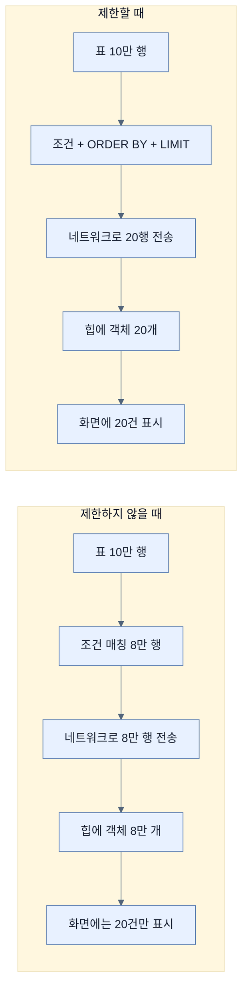

# 결과 줄이기와 SELECT가 아닌 파생 연산 — 그리고 finder의 한계

## 한눈에 보기

| 질문 | 핵심 답 |
|---|---|
| 왜 결과를 줄이나 | 10만 행짜리 표를 통째로 가져올 수는 없기 때문이다 |
| 개수 제한 | `First` / `Top`, `FirstNNN` / `TopNNN` |
| 중복 제거 | `Distinct` (저장소가 지원할 때) |
| 페이지 단위 | `Pageable` — `PageRequest.of(0, 20)` |
| SELECT 말고도 | `countBy`, `existsBy`, `deleteBy` — 같은 조건 문법을 쓴다 |
| 실제로 나가는 것 | Spring Data가 JPQL을 만들고 `EntityManager`가 SQL로 바꾼다 |
| finder의 근본 한계 | 조건과 결합 방식이 **작성 시점에 고정**된다 |

## 1. 왜 이게 필요한가

### 출발 장면: 10만 행

책이 드는 장면이 직설적이다.

> 결과를 제한하는 방법에는 여러 가지가 있는데, 왜 이게 필요한지 의아할 수도 있다. **10만 행짜리 표에 질의한다고 상상해 보라.** 그걸 전부 가져오고 싶지는 않을 것이다, 그렇지 않은가?

[[04-using-custom-finders]]에서 만든 `findByNameContainsIgnoreCase("a")`를 그대로 실행하면 어떻게 되는가. 이름에 `a`가 들어간 비디오가 8만 건이라면 **8만 개의 `VideoEntity` 객체**가 애플리케이션 힙에 올라온다. 화면에는 20건만 보여 줄 것인데도.

### 여기서 뭐가 무너지나

이 상황에서 무너지는 것은 하나가 아니다.

1. **메모리.** 객체 8만 개가 동시에 살아 있다. 요청이 몇 개만 겹쳐도 힙이 찬다.
2. **네트워크와 직렬화.** 데이터베이스에서 애플리케이션으로 8만 행이 흘러온다.
3. **응답 시간.** 첫 화면을 그리기 전에 8만 건을 다 받아야 한다.
4. **예측 불가능성.** 데이터가 늘어날수록 조용히 느려진다. 어제 되던 것이 오늘 안 된다.

네 번째가 가장 위험하다. 코드는 그대로인데 **데이터 증가만으로 장애가 난다.**

### 그래서 나온 생각

**필요한 만큼만 데이터베이스에서 가져온다.** 자르는 일을 애플리케이션이 아니라 데이터베이스가 하게 한다.

비유하자면 이것은 **소방 호스에 밸브를 다는 일**이다. 데이터베이스라는 수원은 사실상 무한하고 애플리케이션의 메모리는 컵 하나다. 밸브 없이 연결하면 컵이 아니라 방이 젖는다.

→ 비유가 깨지는 지점: 밸브는 잠그면 물이 덜 나올 뿐 **어느 물인지는 문제되지 않는다.** 하지만 `Top5`는 **"어느 5건인가"를 정하지 않으면 무의미하다.** 정렬을 지정하지 않은 상위 5건은 실행할 때마다 다른 5건일 수 있다 — [[04a-sorting-the-results]]에서 본 대로 `ORDER BY`가 없으면 순서가 보장되지 않기 때문이다. **개수 제한은 정렬과 짝을 이룰 때만 의미를 갖는다.** 밸브 비유에는 "어느 물인가"라는 개념 자체가 없어서 여기서 멈춘다.

## 2. 어떻게 동작하는가

### 2.1 **[[결과-집합]]**(= 쿼리 하나가 돌려주는 행들의 모음)을 줄이는 네 가지

책이 커스텀 finder에 적용할 수 있는 선택지를 든다.

| 한정어 | 예 | 하는 일 | 언제 쓰나 |
|---|---|---|---|
| `First` / `Top` | `findFirstByName(String name)`, `findTopByDescription(String desc)` | 결과 집합의 **첫 항목** 하나 | "가장 최근 것 하나" 같은 단건 조회 |
| `FirstNNN` / `TopNNN` | `findFirst5ByName(String name)`, `findTop3ByDescription(String desc)` | 첫 **NNN**개 | "인기 상위 5개" 같은 고정 개수 |
| `Distinct` | `findDistinctByName(String name)` | 중복 제거 (저장소가 지원할 때) | 조인 때문에 같은 행이 여러 번 나올 때 |
| `Pageable` | `PageRequest.of(0, 20)` | 한 **페이지**를 요청 | 사용자가 페이지를 넘길 때 |

`First`와 `Top`은 **완전히 같은 뜻**이다. [[04-using-custom-finders]]에서 본 `StartingWith`/`StartsWith`처럼, 읽기 자연스러운 쪽을 고르라는 배려다.

**[[페이징]]**(= 결과를 정해진 크기의 페이지 단위로 나눠 요청하는 방식)에 대해 책이 덧붙이는 두 가지가 실무에서 자주 걸린다.

- `PageRequest.of(0, 20)`은 **0번이 첫 페이지**이고 크기가 20인 페이지를 찾는다. 1이 아니라 0에서 시작한다.
- **`Pageable`에 [[정렬-기준]]**(= 어떤 컬럼을 어떤 방향으로 정렬할지 담은 객체)**을 함께 줄 수 있다.** §1에서 짚은 "어느 N건인가" 문제를 여기서 해결한다.

`Top5`와 `Pageable`의 차이도 분명히 해 둘 값이 있다.

```text
  findTop5ByName(name)          → 항상 앞의 5건. 6번째부터는 볼 방법이 없다.
                                   "이 조건의 대표 5개"

  findByName(name, PageRequest.of(2, 5))
                                → 5건씩 끊었을 때의 3번째 묶음(11~15번째)
                                   "전체를 훑어 나가는 중"

  ▶ 고정된 상위 N개가 필요한가, 전체를 나눠 보고 싶은가로 갈린다.
```

### 2.2 SELECT가 아닌 파생 연산

책이 범위를 넓힌다.

> 커스텀 finder를 쓸 수 있을 뿐 아니라, 커스텀 **`countBy`, `existsBy`, `deleteBy`**도 쓸 수 있다는 점을 짚어 두는 것이 중요하다. 이들은 **이 절에서 설명한 것과 같은 조건들을 전부 지원한다.**

| 예 | 나가는 것 | 돌려주는 것 |
|---|---|---|
| `countByName(String name)` | `COUNT` 연산자가 적용된 쿼리 | 도메인 타입이 아니라 **정수** |
| `existsByDescription(String description)` | 결과가 비었는지 확인하는 쿼리 | **참/거짓** |
| `deleteByTag(String tag)` | `SELECT`가 아니라 **`DELETE`** | 조건에 맞는 엔티티들이 제거된다 |

"같은 조건 문법을 전부 지원한다"는 말이 이 세 줄의 값을 결정한다. `findByNameContainsIgnoreCase`가 가능하면 `countByNameContainsIgnoreCase`도, `deleteByNameContainsIgnoreCase`도 그대로 가능하다. **접두어만 바뀌고 뒤쪽 문법은 하나**다.

`existsBy`가 특히 유용한 이유가 있다. "이 이름의 비디오가 있는가?"를 확인하려고 `findByName(...)`을 부르면 **엔티티 객체를 만들어 돌려준다.** 존재 여부만 알면 되는데 객체 생성 비용을 치르는 것이다. `existsBy`는 그 비용을 없앤다. 마찬가지로 `countBy`는 **[[CRUD]]**(= 생성·조회·수정·삭제 네 기본 연산) 중 조회에 속하지만 엔티티를 하나도 만들지 않는다.

### 2.3 실제로 나가는 것은 무엇인가

> **Tip (책 p.88)**: Spring Data JPA가 실제로 쓰는 쿼리는 무엇인가? JPA는 쿼리를 조립하는 구조를 제공하는데 이를 **[[EntityManager]]**(= JPA가 정의한 영속성 진입점)라 한다. `EntityManager`는 **[[JPQL]]**(= 엔티티와 그 필드를 대상으로 쓰는 질의 언어)을 사용해 쿼리를 조립하는 API를 제공한다. Spring Data JPA는 리포지토리 메서드로부터 메서드를 파싱해 우리를 대신해 `EntityManager`와 대화한다. 그 아래에서 **JPA가 JPQL을 SQL로 변환하는 책임**을 진다. SQL은 관계형 데이터 저장소가 쓰는 언어다. 인젝션 공격 같은 개념은 JPQL이든 SQL이든 별로 상관없다. 하지만 실제 쿼리를 이야기할 때는 **우리가 무엇을 말하고 있는지 분명히 하는 것이 중요하다.**

이 Tip이 정리하는 것은 **번역이 두 번 일어난다**는 사실이다.

```text
  메서드 이름              Spring Data가 파싱
  findByNameContains  ──────────────────────▶  JPQL
                                               select v from VideoEntity v
                                               where v.name like ?1
                                                      ▲
                                                      │ 엔티티 필드 이름
                        JPA(Hibernate 등)가 번역
                      ──────────────────────▶  SQL
                                               select v.id, v.name, v.description
                                               from video_entity v
                                               where v.name like ?
                                                      ▲
                                                      │ 실제 표·컬럼 이름

  ▶ 로그에서 쿼리를 볼 때 어느 단계의 것인지 구분해야 원인을 제대로 짚는다.
```

[[04-using-custom-finders]]에서 "표 이름·컬럼 이름을 몰라도 된다"고 한 이유가 이 두 단계의 번역이다.

Tip의 마지막 문장이 실무적으로 중요하다. "쿼리가 이상하다"고 할 때 **JPQL이 이상한 것**(파생이 잘못됨)과 **SQL이 이상한 것**(방언·매핑 문제)은 원인도 해법도 다르다.

### 2.4 그런데 finder에는 근본적인 한계가 있다

책은 **[[파생-finder]]**(= 이름만 선언하면 쿼리가 만들어지는 메서드)를 높이 평가한 직후 한계를 짚는다.

> 보다시피 커스텀 finder는 엄청나게 강력하다. 쿼리를 쓰느라 씨름하지 않고 **비즈니스 개념을 빠르게 포착**할 수 있게 해 준다.
>
> 하지만 모든 상황에 이상적이지는 않게 만드는 **근본적인 교환 조건**이 있다.
>
> 커스텀 finder는 **거의 완전히 고정돼 있다.** 인자를 통해 커스텀 기준을 줄 수 있고, 정렬과 페이징은 동적으로 조정할 수 있는 것도 사실이다. 그러나 **기준으로 삼을 컬럼과 그것들을 결합하는 방식**(`IgnoreCase`, `Distinct` 등)은 **우리가 쓰는 시점에 고정된다.**

무엇이 동적이고 무엇이 정적인지를 갈라 두면 이 한계가 정확히 보인다.

| 요소 | 런타임에 바꿀 수 있나 | 근거 |
|---|---|---|
| 조건의 **값** (`"SPRING"`) | **예** | 인자로 전달된다 |
| **[[정렬-기준]]** | **예** | `Sort` 파라미터 — [[04a-sorting-the-results]] |
| **[[페이징]]** | **예** | `Pageable` 파라미터 |
| 조건으로 쓸 **컬럼** | **아니오** | 메서드 이름에 박혀 있다 |
| 조건들의 **결합 방식** (`And`/`Or`) | **아니오** | 메서드 이름에 박혀 있다 |
| **한정어** (`Containing`, `IgnoreCase`) | **아니오** | 메서드 이름에 박혀 있다 |

**값은 유연하고 구조는 고정**이다. 그래서 "이름으로 찾기"와 "이름 또는 설명으로 찾기"는 서로 다른 메서드여야 한다.

### 2.5 그 한계가 이미 드러났던 곳

책은 앞 절의 코드를 다시 가리킨다.

> 앞의 검색 상자 시나리오에서 이 한계를 이미 봤다. 단지 `name`과 `description` 두 개의 파라미터를 갖는 것만으로도, 올바른 커스텀 finder를 고르기 위해 **일련의 `if` 절을 쓰는 길로** 들어섰다.
>
> 선택지를 점점 더 추가하면 이것이 어떻게 폭발할지 상상해 보라. 요점을 말하자면, 이 접근은 그것을 다 감당하기 위한 **finder 메서드의 조합 폭발**로 이어지고 `if` 문은 금세 장황하고 이해하기 어려워진다. 필드를 하나 더 추가하면 어떻게 되겠는가?
>
> 문제는, 말한 대로 **커스텀 finder가 적용할 수 있는 기준 면에서 상당히 정적**이라는 것이다.

[[04-using-custom-finders]]에서 표로 정리한 그 증가가 여기서 명시적인 문제 선언이 된다. 그리고 책이 출구를 예고한다 — 고맙게도 Spring Data는 이런 유동적인 상황에서 빠져나갈 길을 제공하며, 그것이 다음 절 [[05-query-by-example-for-dynamic-search]]다.

## 3. 그림으로 보기

### 어디서 자르는가



자르는 위치가 왼쪽에서 오른쪽으로 옮겨 가는 것이 전부이지만, 그 사이의 모든 비용이 사라진다.

### 무엇이 동적이고 무엇이 정적인가

```text
  findByNameContainsIgnoreCase( "SPRING" , Sort.by("name") , PageRequest.of(0,20) )
  └──────────────┬──────────┘   └───┬──┘   └──────┬──────┘   └────────┬────────┘
                 │                  │             │                   │
          메서드 이름에 박힘      인자        인자                 인자
          ─────────────────      ─────       ─────               ─────
          어떤 컬럼을 볼지        찾을 값     정렬 기준            페이지
          어떻게 결합할지(And/Or)
          부분 일치인지
          대소문자 무시인지
                 │                  │             │                   │
              ❌ 고정              ✅ 동적       ✅ 동적            ✅ 동적

  ▶ 값·정렬·페이징은 요청마다 달라질 수 있다
  ▶ 그러나 "무엇을 조건으로 삼는가"의 구조는 컴파일 시점에 결정된다
  ▶ 이 비대칭이 조합 폭발의 원인이며, Query By Example이 겨냥하는 지점이다
```

### 접두어만 바뀌는 파생 연산

| 접두어 | 나가는 문장 | 반환 | 엔티티 객체를 만드나 |
|---|---|---|---|
| `findBy…` | `SELECT` | 도메인 타입 (목록/단건) | **예** |
| `countBy…` | `SELECT COUNT` | 정수 | 아니오 |
| `existsBy…` | 존재 확인 | 참/거짓 | 아니오 |
| `deleteBy…` | `DELETE` | 없음 또는 삭제 건수 | (구현에 따라) |

뒤쪽 조건 문법(`NameContainsIgnoreCase`)은 **네 경우에 완전히 동일하다.**

## 4. 이 노트에 나온 용어

| 용어 | 한 줄 풀이 | 자세히 |
|---|---|---|
| 결과 집합 | 쿼리 하나가 돌려주는 행들의 모음 | [[_glossary#결과-집합]] |
| 페이징 | 결과를 정해진 크기의 페이지로 나눠 요청하는 방식 | [[_glossary#페이징]] |
| 정렬 기준 | 어떤 컬럼을 어떤 방향으로 정렬할지 담은 객체 | [[_glossary#정렬-기준]] |
| 파생 finder | 이름만 선언하면 쿼리가 만들어지는 메서드 | [[_glossary#파생-finder]] |
| EntityManager | JPA가 정의한 영속성 진입점 | [[_glossary#EntityManager]] |
| JPQL | 엔티티와 그 필드를 대상으로 쓰는 질의 언어 | [[_glossary#JPQL]] |
| CRUD | 생성·조회·수정·삭제 네 가지 기본 연산 | [[_glossary#CRUD]] |
| 쿼리 파생 | 메타데이터와 메서드 이름으로 쿼리를 만드는 동작 | [[_glossary#쿼리-파생]] |

## 5. 자주 헷갈리는 것

### `Top5`와 `Pageable`

`Top5`는 **항상 앞의 5건**이고 6번째부터는 볼 수 없다. `Pageable`은 **전체를 나눠 훑는** 도구다. "대표 5개"인지 "전체를 넘겨 보는 중"인지로 갈린다.

### 정렬 없는 `Top5`

**의미가 불확실하다.** `ORDER BY`가 없으면 어느 5건이 나올지 보장되지 않는다. `First`/`Top` 계열은 `OrderBy`나 `Sort`와 함께 써야 한다.

### `PageRequest.of(1, 20)`이 첫 페이지다

아니다. **0이 첫 페이지**다. 사용자에게 "1페이지"로 보여 주려면 화면 쪽에서 1을 빼 줘야 한다. 흔한 off-by-one 원인이다.

### `existsBy`와 `findBy` + `isEmpty()`

결과는 같지만 비용이 다르다. 후자는 엔티티 객체를 만들어 놓고 버린다. 존재 여부만 필요하면 `existsBy`가 맞다.

### JPQL과 SQL

로그에 보이는 쿼리가 어느 것인지 구분해야 한다. **JPQL은 엔티티 필드 이름**, **SQL은 표·컬럼 이름**을 쓴다. 문제의 원인이 파생에 있는지 매핑에 있는지가 여기서 갈린다.

## 6. 언제 안 쓰나 / 경계

- 결과 제한은 **읽는 양**만 줄인다. 조건에 맞는 행을 찾는 비용(인덱스 유무)은 그대로다. `Top5`를 붙였는데도 느리다면 인덱스를 봐야 한다.
- `deleteBy…`는 **조건에 맞는 것을 전부 지운다.** 조건을 잘못 쓰면 되돌릴 방법이 없다. `countBy…`로 먼저 확인하는 습관이 안전하다.
- `Distinct`는 저장소가 지원할 때만 의미가 있고, JPA에서는 조인 결과의 중복 제거가 기대와 다르게 동작하는 경우가 있다.
- 이 절의 결과 제한과 [[04a-sorting-the-results]]의 정렬은 **함께 쓰일 때만** 온전하다. 둘 중 하나만 쓰면 "어느 N건인지 모른 채 N건을 가져오는" 상태가 된다.
- finder의 정적 한계는 이 절에서 **문제로 선언될 뿐 해결되지 않는다.** 해법은 다음 노트에 있다.

## 7. 연결

- [[04a-sorting-the-results]] — 개수를 줄이는 것과 순서를 정하는 것은 짝이다. 정렬 없는 `Top5`는 매번 다른 5건일 수 있다.
- [[04-using-custom-finders]] — 이 노트의 한정어들은 그 노트의 이름 파싱 규칙 위에 그대로 얹힌다. `countBy`·`deleteBy`도 같은 문법을 쓴다.
- [[05-query-by-example-for-dynamic-search]] — 이 노트가 선언한 "기준이 작성 시점에 고정된다"는 문제를 정면으로 푼다.

## 8. 스스로 확인

1. 10만 행을 다 가져올 때 무너지는 네 지점은 무엇인가? 그중 가장 위험한 것과 이유는?
2. 소방 호스 비유가 깨지는 지점은 어디인가?
3. `Top5`와 `Pageable`을 각각 언제 고르는가?
4. `PageRequest.of(0, 20)`에서 0은 무엇인가? 흔한 실수는?
5. `existsBy`가 `findBy` + 비어 있는지 확인보다 나은 이유는?
6. 메서드 이름 하나가 SQL이 되기까지 번역이 몇 번 일어나는가? 각 단계에서 이름이 어떻게 달라지는가?
7. 파생 finder에서 **동적인 것 셋**과 **정적인 것 셋**을 나눌 수 있는가?
8. 그 비대칭이 왜 조합 폭발로 이어지는가?

<!-- ==== 아래는 내 영역 · 스킬 수정 금지 ==== -->

## 내 설명 시도


## 막혔던 지점


## 리뷰 이력
