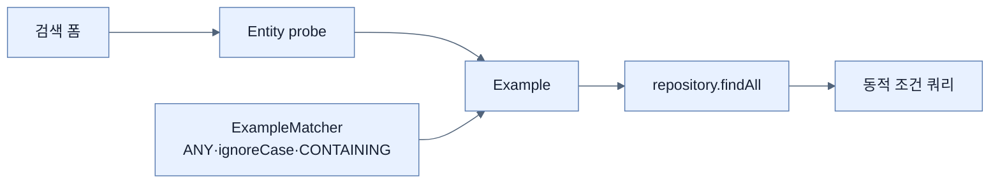

# Query by Example로 동적 검색하기

## 한눈에 보기

QBE는 Entity 모양의 **probe**에 검색할 필드만 채우고 이를 `Example`과 `ExampleMatcher`로 감싸 실행한다. null 필드는 기본적으로 무시하므로 사용자가 입력한 필드 조합이 매번 달라지는 검색 폼에 적합하다.

## 1. 왜 이게 필요한가

이름·설명·태그 중 선택적으로 입력하는 검색에서 파생 finder를 쓰면 가능한 조합마다 메서드와 분기가 필요하다. QBE는 이미 가진 도메인 타입을 검색 조건 그릇으로 재사용해 조합 수를 흡수한다.

## 2. 어떻게 동작하는가

1. 빈 `VideoEntity` probe를 만들고 입력이 있는 속성만 채운다.
2. `ExampleMatcher.matchingAll()`은 채운 모든 필드의 AND, `matchingAny()`는 OR 의미를 준다.
3. `withIgnoreCase()`와 `StringMatcher.CONTAINING`으로 문자열 비교 정책을 공통 적용한다.
4. `repository.findAll(example)`이 저장소별 쿼리로 변환해 실행한다.

QBE는 검색용 견본을 카운터에 보여주는 방식과 비슷하다. 단순 동등·부분 문자열 조합에는 자연스럽지만 범위 비교, 복잡한 그룹, JOIN 조건을 정밀하게 표현하는 범용 쿼리 언어는 아니다. 또한 일반 쿼리에서 null은 “무시”가 아니라 `IS NULL` 여부가 별도 의미임을 구분해야 한다.

## 3. 그림으로 보기

## 4. 이 노트에 나온 용어

- **probe**: 검색할 값이 채워진 도메인 객체 견본.
- **Example**: probe와 매칭 정책을 repository에 전달하는 값 객체.
- **ExampleMatcher**: AND/OR, 대소문자, 문자열 일치 방식 등을 정하는 정책.

## 7. 연결

- [[04-using-custom-finders-sorting-and-limits]] — 고정 finder의 조합 폭발을 해결한다.
- [[06-writing-custom-jpa-queries]] — QBE로 표현하기 힘든 관계·집계 쿼리의 대안이다.

## 8. 스스로 확인

- 전체 1차 정리 후: QBE의 null 필드 무시와 SQL의 `IS NULL` 조건이 왜 다른지 설명한다.

<!-- ==== 아래는 내 영역 · 스킬 수정 금지 ==== -->

## 내 설명 시도

## 막혔던 지점

## 리뷰 이력

