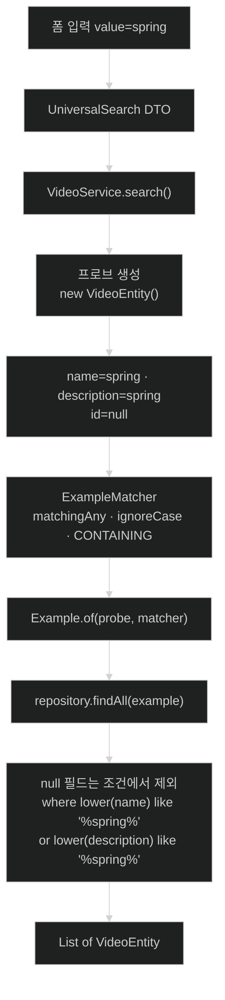

# Query By Example — 조건을 객체로 넘기기

## 한눈에 보기

| 질문 | 핵심 답 |
|---|---|
| 푸는 문제 | 조건 **조합**이 요청마다 달라질 때 finder가 폭발하는 것 |
| 방법 | 도메인 객체를 **부분적으로 채워** 그대로 조건으로 넘긴다 |
| 그 객체의 이름 | **프로브(probe).** 채운 필드만 조건이 되고 `null`은 무시된다 |
| 비교 정책 | `ExampleMatcher` — AND/OR, 대소문자, 부분 일치를 지정 |
| 실행 | `repository.findAll(example)` — `JpaRepository`가 이미 갖고 있다 |
| 결과 | `if` 세 개가 **사라진다** |
| 함정 | 관계형 DB에서 `null`은 `null`과 같지 않다 |

## 1. 왜 이게 필요한가

### 출발 장면: 필드를 하나 더 넣어 달라는 요청

[[04-using-custom-finders]]에서 만든 검색은 `name`과 `description` 두 필드를 받는다. 그리고 그 두 필드를 처리하는 데 `if`가 세 개, finder가 세 개 필요했다.

이제 `tags` 필드를 하나 더 넣어 달라는 요청이 온다. [[04b-limiting-query-results]]에서 계산한 대로 필요한 것은 **`if` 7개와 finder 7개**다. 그리고 finder 이름은 이렇게 된다.

```java
findByNameContainsOrDescriptionContainsOrTagsContainsAllIgnoreCase(String, String, String);
```

필드를 하나만 더 넣으면 15개가 된다.

### 여기서 뭐가 무너지나

책이 문제를 한 문장으로 정리한다.

> 문제는 커스텀 finder가 적용할 수 있는 **기준 면에서 상당히 정적**이라는 것이다.

무엇이 정적인지는 [[04b-limiting-query-results]]에서 표로 봤다. 값·정렬·페이징은 인자로 바뀌지만 **어떤 컬럼을 조건으로 삼을지, 그것들을 AND로 묶을지 OR로 묶을지**는 메서드 이름에 박혀 있다.

그런데 지금 필요한 것은 정확히 그 부분이 **요청마다 달라지는** 검색이다.

- 사용자가 name만 입력 → name 조건만 필요
- description만 입력 → description 조건만 필요
- 셋 다 입력 → 세 조건 필요

**조건의 개수 자체가 런타임에 정해진다.** 컴파일 시점에 고정되는 도구로는 표현할 수 없는 요구다.

### 그래서 나온 생각

책이 질문을 다시 던지고 답한다.

> 쿼리의 정확한 기준이 요청마다 달라지면 어떻게 되는가? 요컨대, **관심 있는 필드는 담고 관심 없는 필드는 무시하는 객체**를 Spring Data에 먹여 줄 방법이 필요하다.
>
> 답은 **[[Query-By-Example]]**(= 조건을 도메인 객체에 부분적으로 채워 넣고 그 객체를 그대로 조회 조건으로 쓰는 방식)이다.

핵심 전환은 이것이다. **조건을 "이름"이 아니라 "값이 있는 객체"로 표현한다.** 이름은 컴파일 시점에 고정되지만 객체는 런타임에 만들어진다.

비유하자면 프로브는 **수배 전단**이다. "키 180cm 내외, 안경 착용" — 아는 특징만 적고 모르는 항목은 빈칸으로 둔다. 빈칸은 "이 항목은 안 따진다"는 뜻이다.

→ 비유가 깨지는 지점: 수배 전단의 빈칸은 **사람이 보고 알아서** "이건 조건이 아니구나"라고 해석한다. 그런데 관계형 데이터베이스에서 `null`은 **"아무거나"가 아니라 "모른다"**이고, `where name = null`은 아무것도 찾지 못한다. QBE가 `null` 필드를 조건에서 **빼 버리는 것**은 프레임워크가 대신 해 주는 일이지 SQL의 자연스러운 동작이 아니다. 책이 이 절 마지막 Tip에서 경고하는 지점이 정확히 여기다(§2.6).

## 2. 어떻게 동작하는가

### 2.1 프로브 만들기

책의 설명 — Query By Example은 **[[프로브]]**(= 조건을 담는 도메인 객체 인스턴스)를 만들게 해 준다. 프로브는 도메인 객체의 인스턴스다. 적용하고 싶은 기준으로 필드를 채우고, 관심 없는 필드는 비워(`null`) 둔다. 그런 다음 프로브를 감싸 `Example`을 만든다.

```java
VideoEntity probe = new VideoEntity();
probe.setName(partialName);
probe.setDescription(partialDescription);
probe.setTags(partialTags);
Example<VideoEntity> example = Example.of(probe);
```

책의 분해다.

- 앞의 몇 줄이 프로브를 만드는 부분으로, 아마도 Spring MVC 웹 메서드에서 전달된 필드들을 가져온 것이다. **일부는 채워져 있고 일부는 `null`이다.**
- 마지막 줄이 `Example<VideoEntity>`로 프로브를 감싸며, **`null`이 아닌 필드만 정확히 일치시키는** 정책을 적용한다.

여기서 조용히 지나가기 쉬운 두 가지가 있다.

**첫째, `new VideoEntity()`가 가능한 이유.** [[02a-entities-in-jpa]]에서 본 대로 이 인자 없는 생성자는 `protected`다. 즉 **같은 패키지의 코드만** 부를 수 있다. `VideoService`가 같은 패키지에 있어서 동작한다. JPA가 조회 결과를 만들기 위해 요구한 그 생성자가, 여기서는 **프로브를 만드는 통로**로 재사용된다.

**둘째, `probe.setTags(...)`는 이 장의 `VideoEntity`에 없는 필드다.** [[02a-entities-in-jpa]]에서 만든 **[[엔티티]]**(= 데이터 접근에 직접 참여하는 클래스)는 `id`·`name`·`description` 셋뿐이다. 이 코드는 필드가 더 많은 엔티티를 가정한 **설명용 예시**로 읽어야 한다. 실제 이 장의 코드는 §2.4에 나온다.

### 2.2 비교 정책 바꾸기

기본 `Example.of(probe)`는 채워진 필드를 **정확히 일치**시킨다. 그런데 검색 상자에는 부분 일치와 대소문자 무시가 필요하다. [[04-using-custom-finders]]에서 `Contains`와 `AllIgnoreCase` 한정어로 하던 일이다.

QBE에서 같은 것을 하려면 정책 객체를 함께 넘긴다.

```java
Example<VideoEntity> example = Example.of(probe,
    ExampleMatcher.matchingAll()
      .withIgnoreCase()
      .withStringMatcher(StringMatcher.CONTAINING));
```

**[[ExampleMatcher]]**(= 프로브의 값들을 어떻게 비교할지 정하는 정책 객체)가 바꾸는 세 가지를 책이 설명한다.

| 설정 | 하는 일 | SQL로는 무엇이 되나 | 이 설정이 필요한 이유 |
|---|---|---|---|
| `matchingAll()` (기본) | 프로브에 채워진 모든 필드로 매칭하며 **`And`로 결합** | `where name like ? and description like ?` | 조건을 좁혀 갈 때 |
| `matchingAny()` | 대신 **`Or` 의미**로 결합 | `where name like ? or description like ?` | 어느 필드에든 걸리면 되는 통합 검색 |
| `withIgnoreCase()` | 쿼리를 대소문자 구분 없게 만든다. **모든 컬럼에 `lower()` 연산을 적용**하는 셈 | `where lower(name) like ?` | 사용자 입력의 대소문자를 문제 삼지 않기 위해 |
| `withStringMatcher(CONTAINING)` | `null`이 아닌 모든 컬럼에 부분 일치 필터를 적용. 내부적으로 각 컬럼을 **[[와일드카드]]**(= 임의 문자열을 뜻하는 기호)로 감싸고 `LIKE`를 적용 | `like '%값%'` | 정확히 일치가 아닌 검색을 위해 |

`withIgnoreCase()`에 대해 책이 괄호로 덧붙인 경고가 실무적으로 중요하다 — **"(그러니 인덱스를 적절히 조정하라!)"**. 컬럼에 `lower()`를 씌우면 그 컬럼의 일반 인덱스를 쓸 수 없다. 데이터가 많다면 함수 기반 인덱스가 별도로 필요해진다.

### 2.3 실행하기

책의 설명 — `Example<VideoEntity>`를 만들고 나면 `JpaRepository`가 제공하는 리포지토리 메서드, 예를 들어 `findOne(Example<S> example)`이나 `findAll(Example<S> example)`에 **그대로 넘겨** Query By Example을 실행할 수 있다.

즉 [[03-creating-repositories-and-declarative-queries]]에서 나열했던 그 Example 계열 메서드들이 여기서 쓰인다. **리포지토리에 아무것도 새로 선언하지 않는다** — 이것이 finder 방식과의 결정적 차이다.

> **Tip (책 p.90)**: `JpaRepository`는 이 Example 기반 연산들을 **`QueryByExampleExecutor`에서 상속받는다.** `Repository`를 직접 확장해 자기 것을 만든다면, `QueryByExampleExecutor`를 함께 상속하거나 `findAll(Example<S>)` 메서드를 손으로 추가하면 된다. 어느 쪽이든 **메서드 시그니처만 있으면** Spring Data가 기꺼이 Query By Example을 실행해 준다.

이 Tip은 [[03-creating-repositories-and-declarative-queries]]에서 본 상속 계층 이야기의 실전판이다. "왜 이 메서드가 없지?"의 답이 대개 상속 계층에 있다는 그 이야기다.

### 2.4 통합 검색 상자로 다시 만들기

책은 UI 자체를 바꿔 QBE의 값을 보여 준다. 다중 필드 검색 상자를 **입력 하나짜리 통합 검색**으로 바꾼다.

**① 폼**

```html
<form action="/universal-search" method="post">
    <label for="value">Search:</label>
    <input type="text" name="value">
    <button type="submit">Search</button>
</form>
```

앞의 폼과 다른 점은 둘뿐이다 — 대상 URL이 `/universal-search`이고, 입력이 `value` 하나다.

**② [[DTO]]**(= 데이터를 옮기는 것이 목적인 클래스)

```java
record UniversalSearch(String value) {
}
```

**③ 컨트롤러**

```java
@PostMapping("/universal-search")
public String universalSearch(
    @ModelAttribute UniversalSearch search, Model model) {
          List<VideoEntity> searchResults =
                           videoService.search(search);
    model.addAttribute("videos", searchResults);
    return "index";
}
```

앞의 handler와 다른 점 네 가지 — `/universal-search`에 응답하고, 폼이 단일 값 `UniversalSearch` 타입에 담기고, 다른 `search()` 메서드로 넘어가고, 결과는 같은 `index` 템플릿이 렌더링할 `Model`에 저장된다.

**④ 서비스 — 여기가 핵심이다**

```java
public List<VideoEntity> search(UniversalSearch search) {
       VideoEntity probe = new VideoEntity();
       if (StringUtils.hasText(search.value())) {
                          probe.setName(search.value());
                          probe.setDescription(search.value());
       }
       Example<VideoEntity> example = Example.of(probe,
                          ExampleMatcher.matchingAny()
                              .withIgnoreCase()
                              .withStringMatcher(StringMatcher.CONTAINING));
       return repository.findAll(example);
}
```

책의 분해다.

- `UniversalSearch` DTO를 받는다.
- 리포지토리와 **같은 도메인 타입**으로 프로브를 만들고 `value` 속성을 프로브의 `Name`과 `Description` 필드에 복사한다. **단, 텍스트가 있을 때만.** `value`가 비어 있으면 필드들은 `null`로 남는다.
- `Example.of` 정적 메서드로 `Example<VideoEntity>`를 조립한다. 프로브뿐 아니라 **대소문자 무시와 `CONTAINING` 매칭**이라는 추가 기준도 함께 준다. 후자는 모든 입력의 양쪽에 와일드카드를 붙인다.
- 같은 기준을 모든 필드에 넣고 있으므로 **`matchingAny()`, 즉 `Or` 연산으로 바꿔야 한다.**

마지막 항목이 이 코드에서 가장 중요한 결정이다. `matchingAll()`이었다면 `name`에도 있고 `description`에도 있는 비디오만 나온다. 통합 검색은 **어느 한쪽에만 걸려도** 찾아야 하므로 `Or`가 맞다.

그리고 **`if`가 하나만 남았다는 점**을 눈여겨볼 만하다. 그 하나도 조건 분기가 아니라 [[04-using-custom-finders]]에서 본 "빈 문자열은 전부 매칭한다"를 막는 방어다.

책의 평가 — UI 설계를 한 번 바꾸고 Query By Example로 전환한 것만으로 백엔드를 조정해 결과를 찾을 수 있었다. **효과적이고 유지 가능할 뿐 아니라 무슨 일이 일어나는지 읽고 이해하기도 꽤 쉽다.** 이 비디오 구조에 속성을 더 추가하기 시작해도 조정이 어려워 보이지 않는다.

"속성을 더 추가해도 어렵지 않다"가 §1의 문제에 대한 답이다. 필드를 하나 더하면 `probe.setTags(...)` **한 줄**이 늘 뿐이다.

### 2.5 finder 방식과 나란히 놓고 보기

| | 파생 finder | Query By Example |
|---|---|---|
| 조건을 표현하는 것 | 메서드 **이름** | 부분적으로 채운 **객체** |
| 조건 개수가 정해지는 시점 | 컴파일 시점 | **런타임** |
| 필드 하나 추가 비용 | finder와 `if`가 두 배 | `set` 호출 **한 줄** |
| 리포지토리 선언 | 조합마다 메서드 필요 | **없음** (상속으로 이미 있음) |
| 표현할 수 있는 조건 | And/Or, 범위, 부분 일치, 관계 탐색 | **동등·문자열 비교 위주** |
| 오타 검증 | 시작 시점 | 컴파일 시점 (setter라서) |
| 범위 조건(`LessThan`) | 가능 | **불가** |

마지막 두 줄이 QBE의 대가다. 프로브는 "이 필드가 이 값이다"만 표현할 수 있으므로 **"조회수가 100 미만"** 같은 조건은 담을 수 없다. [[01a-using-spring-data-to-easily-manage-data]]의 사다리에서 QBE가 finder 아래이면서도 손으로 쓴 쿼리 위에 있는 이유다.

### 2.6 `null`에 대한 경고

> **Tip (책 pp. 92–93)**: 혹시 **모든 필드에 매칭하는 finder를 하나 만들고 무시하고 싶은 컬럼에 `null`을 주면 되겠다**고 생각한다면, 그렇게는 안 된다. 관계형 데이터베이스에서 **`null`은 `null`과 같지 않다**는 것을 다시 일러 주는 것이다. 그래서 Spring Data에는 `IsNull`과 `IsNotNull`이라는 한정어도 있다. 예를 들어 `findByNameIsNull`은 `name` 필드가 `null`인 항목들을 찾는다.

이 Tip이 왜 중요한지는 §1의 비유가 깨지던 지점과 정확히 같다. SQL은 **[[삼치-논리]]**(= 비교 결과가 참·거짓 외에 `UNKNOWN`도 될 수 있는 논리 체계)를 쓴다.

```text
  SQL에서 비교의 결과는 세 가지다:  TRUE  /  FALSE  /  UNKNOWN

    where name = 'SPRING'   →  TRUE 또는 FALSE
    where name = null       →  항상 UNKNOWN     ← FALSE 가 아니다
    where null = null       →  UNKNOWN          ← "모르는 값끼리 같은가?"는 모른다

  그리고 WHERE 절은 TRUE 인 행만 남긴다.
  UNKNOWN 은 통과하지 못한다 → 결과 0건

  ▶ 그래서 "무시하고 싶은 필드에 null 을 넣는다"는 발상은
    "그 조건을 빼 달라"가 아니라 "그 컬럼이 null 인 행을 찾아 달라"도 아니고,
    "아무것도 찾지 말라"가 되어 버린다.
  ▶ null 인 행을 진짜로 찾으려면 = 가 아니라 IS NULL 을 써야 한다.
    그것이 Spring Data 의 IsNull / IsNotNull 한정어다.
```

QBE는 이 문제를 **`null` 필드를 조건 목록에서 아예 제외**하는 방식으로 우회한다. `where` 절에 그 컬럼이 등장하지 않으므로 삼치 논리에 걸릴 일이 없다. 프레임워크가 대신 해 주는 이 한 가지가 QBE의 실질적 내용이다.

## 3. 그림으로 보기

### 프로브가 조건이 되는 경로



### 같은 요구, 두 가지 표현

```text
[파생 finder — 조건 구조가 이름에 박힌다]

  if (hasText(name) && hasText(desc)) {
      return repo.findByNameContainsOrDescriptionContainsAllIgnoreCase(name, desc);
  }
  if (hasText(name))  return repo.findByNameContainsIgnoreCase(name);
  if (hasText(desc))  return repo.findByDescriptionContainsIgnoreCase(desc);
  return Collections.emptyList();

  ▶ 필드 3개 → if 7개 · finder 7개
  ▶ 필드 4개 → if 15개 · finder 15개


[Query By Example — 조건 구조가 객체에 담긴다]

  VideoEntity probe = new VideoEntity();
  if (hasText(search.value())) {
      probe.setName(search.value());
      probe.setDescription(search.value());
      // 필드가 늘면 여기에 한 줄씩만 는다
  }
  return repo.findAll(Example.of(probe,
      ExampleMatcher.matchingAny().withIgnoreCase()
          .withStringMatcher(CONTAINING)));

  ▶ 필드 3개 → set 호출 3줄
  ▶ 필드 4개 → set 호출 4줄
  ▶ 리포지토리에는 아무것도 추가하지 않는다
```

### `null`이 조건에서 빠지는 것과 `= null`의 차이

| 프로브의 `description` | QBE가 만드는 `where` | 결과 |
|---|---|---|
| `"spring"` | `... or lower(description) like '%spring%'` | 부분 일치하는 행 |
| `null` | **그 컬럼이 아예 등장하지 않는다** | 다른 조건만으로 판단 |
| (직접 쓴 SQL) `where description = null` | 항상 `UNKNOWN` | **0건** |
| (직접 쓴 SQL) `where description is null` | 참/거짓 | `null`인 행 |

## 4. 이 노트에 나온 용어

| 용어 | 한 줄 풀이 | 자세히 |
|---|---|---|
| Query By Example | 부분적으로 채운 도메인 객체를 조회 조건으로 쓰는 방식 | [[_glossary#Query-By-Example]] |
| 프로브 | 조건을 담는 도메인 객체 인스턴스 | [[_glossary#프로브]] |
| ExampleMatcher | 프로브 값들의 비교 정책을 정하는 객체 | [[_glossary#ExampleMatcher]] |
| 삼치 논리 | 비교 결과가 참·거짓 외에 `UNKNOWN`도 되는 논리 | [[_glossary#삼치-논리]] |
| 와일드카드 | 임의 문자열을 뜻하는 기호(`%`) | [[_glossary#와일드카드]] |
| 파생 finder | 이름만 선언하면 쿼리가 만들어지는 메서드 | [[_glossary#파생-finder]] |
| 엔티티 | 데이터 접근에 직접 참여하는 클래스 | [[_glossary#엔티티]] |
| DTO | 데이터를 옮기는 것이 목적인 클래스 | [[_glossary#DTO]] |
| 리포지토리 | 한 도메인 타입의 데이터 연산을 모으는 인터페이스 | [[_glossary#리포지토리]] |

## 5. 자주 헷갈리는 것

### `matchingAll()` vs `matchingAny()`

`All`은 채워진 필드를 **전부 만족**해야 하고(AND), `Any`는 **하나만 걸려도** 된다(OR). 통합 검색처럼 같은 값을 여러 필드에 넣었다면 반드시 `Any`여야 한다. `All`로 두면 모든 필드에 그 값이 다 들어 있는 행만 나온다.

### 프로브의 `null` vs SQL의 `= null`

프로브의 `null`은 **조건에서 제외**된다. SQL의 `= null`은 **`UNKNOWN`이 되어 아무것도 못 찾는다.** 둘은 완전히 다르다. QBE가 편한 것은 프레임워크가 이 변환을 대신 해 주기 때문이다.

### QBE가 finder보다 항상 낫다

아니다. QBE는 **동등·문자열 비교 위주**라 범위 조건(`LessThan`, `Between`)이나 복잡한 결합을 표현할 수 없다. 조건 구조가 고정된 조회라면 finder가 더 명확하고 더 강력하다.

### 리포지토리에 메서드를 추가해야 한다

추가하지 않는다. `findAll(Example<S>)`은 `QueryByExampleExecutor`를 통해 `JpaRepository`가 이미 갖고 있다. 직접 `Repository`를 확장할 때만 이 상속을 신경 쓴다.

### `withIgnoreCase()`는 공짜다

아니다. 모든 대상 컬럼에 `lower()`가 씌워지므로 **일반 인덱스를 못 쓴다.** 책이 괄호로 "인덱스를 적절히 조정하라"고 경고한 이유다.

## 6. 언제 안 쓰나 / 경계

- **범위·비교 조건을 표현할 수 없다.** "조회수 100 미만"은 프로브에 담기지 않는다. 그런 조건이 섞이면 finder나 [[06-writing-custom-jpa-queries]]로 가야 한다.
- 프로브는 **도메인 타입 그대로**이므로, 검색에 쓰지 않는 필드(예: `id`)에 값이 실수로 들어가면 조건이 되어 버린다. 새로 만든 인스턴스를 쓰는 이유가 여기 있다.
- `withIgnoreCase()`와 `CONTAINING`을 함께 쓰면 `like '%…%'`가 되어 **인덱스를 거의 쓸 수 없다.** 데이터가 커지면 전문 검색(full-text search)을 검토해야 한다.
- 이 절의 예제는 `VideoEntity`를 화면까지 그대로 올린다. [[02-dtos-entities-and-pojos]]의 기준으로는 분리 대상이며 단기 단순화다.
- 프로브를 만들 때 `protected` 생성자에 의존하므로 **같은 패키지 안에서만** 이 코드가 성립한다. 서비스를 다른 패키지로 옮기면 컴파일되지 않는다.

## 7. 연결

- [[04b-limiting-query-results]] — 그 노트가 선언한 "조건 구조가 작성 시점에 고정된다"는 문제를 이 노트가 푼다.
- [[04-using-custom-finders]] — `Contains`·`AllIgnoreCase` 한정어가 여기서는 `ExampleMatcher`의 설정으로 옮겨 온다. 같은 개념의 다른 표현이다.
- [[06-writing-custom-jpa-queries]] — QBE로도 표현할 수 없는 범위 조건·JOIN·집계가 필요할 때 내려가는 다음 층이다.

## 8. 스스로 확인

1. 검색 필드를 하나 더 추가할 때 finder 방식과 QBE 방식의 비용 차이는?
2. "조건의 개수 자체가 런타임에 정해진다"가 왜 finder로는 표현 불가능한 요구인가?
3. 프로브를 수배 전단에 비유했을 때 깨지는 지점은 어디인가?
4. `new VideoEntity()`가 `VideoService`에서 가능한 이유를 [[02a-entities-in-jpa]]와 연결해 설명할 수 있는가?
5. 통합 검색에서 `matchingAll()`을 쓰면 무엇이 잘못되는가?
6. `withIgnoreCase()`가 인덱스에 미치는 영향은?
7. SQL에서 `where name = null`이 0건을 돌려주는 이유를 삼치 논리로 설명할 수 있는가?
8. QBE가 표현할 수 **없는** 조건 종류를 두 개 들 수 있는가?

> 여덟 문항을 스스로 답한 **뒤에** [[_05-query-by-example-for-dynamic-search]]에서 모범답안과 대조한다. 먼저 열면 이 문항들은 다시 인출 문제로 쓸 수 없다.

<!-- ==== 아래는 내 영역 · 스킬 수정 금지 ==== -->

## 내 설명 시도


## 막혔던 지점


## 리뷰 이력
