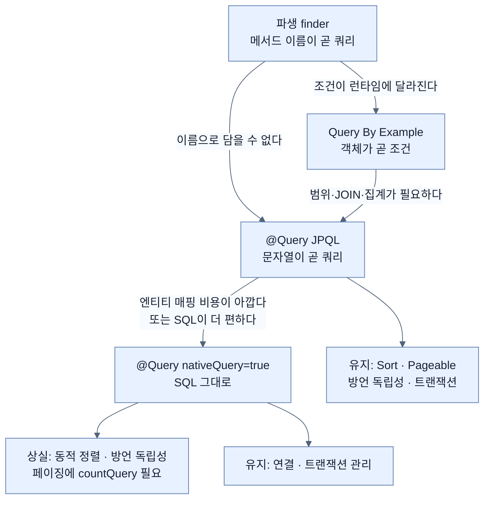

# @Query로 직접 쓰기 — JPQL과 네이티브 SQL

## 한눈에 보기

| 질문 | 핵심 답 |
|---|---|
| 언제 쓰나 | 파생과 QBE로 **구부러지지 않을 때** |
| 무엇을 쓰나 | `@Query`에 JPQL 문자열. 필요하면 네이티브 SQL |
| 메서드 이름은? | **아무 상관 없다.** 처음으로 이름을 의도대로 지을 수 있다 |
| 파라미터 | `?1` 위치 방식, 또는 `:name` + `@Param` 이름 방식 |
| 여전히 자동인 것 | 정렬과 페이징, 그리고 연결·트랜잭션 관리 |
| 네이티브로 내려가면 | 동적 정렬 불가, 페이징에 `countQuery` 필요, 방언 독립성 상실 |
| 판단 기준 | `WHERE` 절 개수와 복잡한 `JOIN` 개수. **이름으로 담기 어려울수록** 직접 쓴다 |

## 1. 왜 이게 필요한가

### 출발 장면: 이름으로도 프로브로도 담기지 않는 요구

지금까지 사다리를 두 칸 내려왔다. [[04-using-custom-finders]]의 파생 finder는 조건 구조가 고정되는 문제가 있었고, [[05-query-by-example-for-dynamic-search]]의 QBE가 그것을 풀었다. 그런데 QBE에도 한계가 있었다 — **동등·문자열 비교밖에 못 한다.**

이제 이런 요구가 온다.

> "조회수가 기준 미만이거나 좋아요가 기준 미만인, **인기 없는 비디오**를 찾아 줘. 조회수는 활동 지표 표에, 좋아요는 참여 지표 표에 있어."

- 범위 비교(`<`)가 필요하다 → QBE로는 안 된다.
- 표 네 개를 조인해야 한다 → 프로브에 담을 수 없다.
- 파생 finder로 쓰면 이름이 이렇게 된다.

```java
findByMetricsActivityViewsLessThanOrEngagementLikesLessThan(Long minimumViews, Long minimumLikes);
```

### 여기서 뭐가 무너지나

위 메서드 이름은 **문법적으로는 완벽하다.** [[04-using-custom-finders]]의 규칙대로 파서가 정확히 해석하고 올바른 조인을 만든다. 무너지는 것은 기계가 아니라 사람이다.

책이 그 지점을 정확히 표현한다.

> 앞 쿼리에 대응하는 파생 finder는 `findByMetricsActivityViewsLessThanOrEngagementLikesLessThan(Long minimumViews, Long minimumLikes)`가 될 것인데, 이는 쿼리 복잡도가 올라갈수록 **메서드 이름이 얼마나 빠르게 길어지고 읽기 어려워지는지**를 보여 준다.

[[04-using-custom-finders]]에서 독일어 합성어 비유가 깨지던 그 지점이다 — **기계는 되는데 사람이 안 된다.**

### 그래서 나온 생각

책의 도입이 담백하다.

> 다른 모든 것이 실패하고 Spring Data의 쿼리 파생 전술을 우리 필요에 맞게 구부릴 수 없을 것 같으면, **JPQL을 우리가 직접 쓰는 것도 가능하다.**

**[[JPQL]]**(= 표·컬럼이 아니라 엔티티와 그 필드를 대상으로 쓰는 질의 언어)을 리포지토리 메서드에 애노테이션으로 붙인다.

비유하자면 이것은 **자동 변속기에서 수동 모드로 바꾸는 것**이다. 평소에는 기어를 차에 맡기다가, 언덕길처럼 판단이 필요한 구간에서만 직접 고른다.

→ 비유가 깨지는 지점: 수동 모드로 바꿔도 브레이크·조향·ABS는 그대로 작동한다. `@Query`도 대부분 그렇다 — 연결과 **[[트랜잭션]]**(= 여러 변경을 하나의 단위로 묶는 장치) 관리, 정렬과 페이징이 유지된다. 그런데 **네이티브 SQL까지 내려가면 안전장치 일부가 실제로 꺼진다.** 동적 정렬이 안 되고, 페이징에는 count 쿼리를 손으로 줘야 하고, 방언 독립성이 사라진다. 자동차에서는 수동 모드로 바꿨다고 ABS가 꺼지지 않으므로, 비유는 여기서 멈춘다(§2.5).

## 2. 어떻게 동작하는가

### 2.1 `@Query`로 JPQL 주기

리포지토리 인터페이스에 이렇게 쓴다.

```java
@Query("select v from VideoEntity v where v.name = ?1")
List<VideoEntity> findCustomerReport(String name);
```

책의 항목별 설명이다.

- `@Query`는 Spring Data JPA가 **커스텀 JPQL 문장을 공급받는 방법**이다.
- `?1`을 써서 **[[위치-파라미터]]**(= 쿼리 안에서 순번으로 가리키는 바인딩 자리)를 포함할 수 있고, 이것이 `name` 인자와 묶인다.
- **우리가 JPQL을 제공하므로 메서드의 이름은 더 이상 중요하지 않다.** 이것은 필드 이름이나 finder 키워드에 제약받는 대신, **연산의 의도를 반영하는 이름**을 고를 기회다 — `findCustomerReport()`처럼.
- 반환 타입이 `List<VideoEntity>`이므로 Spring Data가 컬렉션을 만들어 준다.

세 번째가 이 절에서 가장 중요한 전환이다. [[04-using-custom-finders]]에서 메서드 이름은 **쿼리 그 자체**였다. 이름을 바꾸면 쿼리가 바뀌었다. 여기서는 이름이 **문서**가 된다. `findVideosThatArentPopular`처럼 **무엇을 하는지가 아니라 왜 하는지**를 이름에 담을 수 있다.

`?1`이 하는 일은 [[04-using-custom-finders]]에서 본 **[[파라미터-바인딩]]**(= 값을 자리표시자에 따로 전달하는 방식)과 같다. 직접 쓴 쿼리라고 해서 문자열 결합으로 돌아가는 것이 아니다 — 오히려 `@Query`에서도 바인딩을 쓰는 것이 필수다.

### 2.2 그래도 Spring Data가 계속 해 주는 것

책이 예외를 하나 짚는다.

> `@Query`를 쓰면 Spring Data가 하는 쿼리 작성을 사실상 우회하고 사용자가 제공한 쿼리를 쓰게 되는데, **한 가지 예외가 있다 — Spring Data JPA는 여전히 정렬과 페이징을 적용한다.** `SORT` 절은 쿼리 끝에 덧붙일 수 있으므로, Spring Data JPA는 `Sort` 인자를 제공하면 그것을 적용하게 해 준다.

즉 [[04a-sorting-the-results]]의 **[[정렬-기준]]**(= 어떤 컬럼을 어떤 방향으로 정렬할지 담은 객체)과 [[04b-limiting-query-results]]의 **[[페이징]]**(= 결과를 페이지 단위로 나눠 요청하는 방식)은 `@Query`와 함께 그대로 쓸 수 있다.

왜 가능한지도 이유가 명시돼 있다 — **`ORDER BY`는 쿼리 맨 뒤에 붙이면 되기 때문**이다. 프레임워크가 우리 쿼리를 해석할 필요 없이 문자열 뒤에 이어 붙이기만 하면 된다. 이 사실이 §2.5에서 네이티브 쿼리가 왜 다른 취급을 받는지의 복선이 된다.

책은 다른 저장소 이야기도 덧붙인다 — 우리가 JPQL 같은 Spring Data JPA의 세부에 집중하고 있지만, **거의 모든 다른 Spring Data 모듈에도 대응하는 `@Query` 애노테이션이 있다.** 각 저장소는 그 저장소의 질의 언어로 커스텀 쿼리를 쓰게 해 준다 — MongoQL, Cassandra Query Language(CQL), 또는 Nickel/Couchbase Query Language(N1QL) 같은 것들이다.

[[01a-using-spring-data-to-easily-manage-data]]의 방침이 여기서도 반복된다. **애노테이션 이름은 공통이고 안에 들어가는 언어는 저장소마다 다르다.**

### 2.3 복잡한 쿼리와 이름 있는 파라미터

책은 진짜 필요한 상황의 예를 든다.

```java
@Query("select v FROM VideoEntity v "
      + "JOIN v.metrics m "
      + "JOIN m.activity a "
      + "JOIN v.engagement e "
      + "WHERE a.views < :minimumViews "
      + "OR e.likes < :minimumLikes")
List<VideoEntity> findVideosThatArentPopular(
      @Param("minimumViews") Long minimumViews,
      @Param("minimumLikes") Long minimumLikes);
```

책의 설명이다.

- 이 `@Query`는 **표준 내부 조인(inner join)으로 네 개의 서로 다른 표를 조인하는** JPQL 문장을 보여 준다.
- `:minimumViews`와 `:minimumLikes`는 (기본인 위치 파라미터 대신) **[[이름-있는-파라미터]]**(= `:이름` 형태로 가리키는 바인딩 자리)다. Spring Data의 `@Param("minimumViews")`과 `@Param("minimumLikes")` 애노테이션으로 메서드 인자와 묶인다.

두 가지 파라미터 방식을 언제 고르는지는 인자 개수가 갈라 준다.

| | 위치 `?1` | 이름 `:minimumViews` |
|---|---|---|
| 쓰는 법 | 인자 순서대로 `?1`, `?2` | `@Param`으로 이름을 붙인다 |
| 짧다 | **예** | 아니오 (`@Param` 한 줄씩 추가) |
| 인자가 3개 이상일 때 | 순서를 세어야 한다 | **이름으로 읽힌다** |
| 순서를 바꾸면 | **조용히 잘못된 결과** | 영향 없음 |
| 쿼리만 봐서 뜻이 통하나 | `?1`이 무엇인지 모른다 | **`:minimumViews`가 설명한다** |

네 번째 줄이 실무에서 가장 아프다. 인자 두 개가 같은 타입(`Long`, `Long`)이면 순서를 바꿔도 **컴파일이 되고 실행도 된다.** 결과만 틀린다.

> **참고**: 이 예제의 `v.metrics`, `m.activity`, `v.engagement`는 [[02a-entities-in-jpa]]에서 만든 `VideoEntity`에 없는 연관 필드다. 이 장의 엔티티는 `id`·`name`·`description` 셋뿐이므로, 이 코드는 **연관 관계를 갖춘 더 풍부한 엔티티를 가정한 설명용 예시**다. 실제로 이 쿼리를 쓰려면 그 연관 관계를 먼저 매핑해야 하고, 그 매핑은 책이 [[02a-entities-in-jpa]]의 Note에서 범위 밖이라고 밝힌 영역이다.

### 2.4 그래서 언제 finder를 버리는가

> **Tip (책 p.94)**: 커스텀 finder와 `@Query` 사이에서 고르는 것은 어렵다. 솔직히 말해 표 네 개를 조인하는 이 예제에서는 **나라면 여전히 커스텀 finder를 쓰겠다.** 그게 맞을 것이라고 알기 때문이다. 하지만 그 finder 메서드가 점점 더 길어지면 저울이 **손으로 쿼리를 쓰는 쪽으로** 기울기 시작한다. 핵심 요인은 **`WHERE` 절의 개수**와 **복잡한(즉 외부) `JOIN` 절의 개수**다. 본질적으로, **단순한 이름으로 담아내기 어려워질수록 쿼리 전체를 직접 통제하는 편이 나아진다.**

이 Tip이 좋은 이유는 **저자가 자기 예제에 대해 반대 결론을 내린다**는 점이다. 네 개 조인짜리 예제조차 finder로 충분하다고 말한다. 즉 `@Query`는 "복잡하면 쓰는 것"이 아니라 **"이름으로 담을 수 없을 때 쓰는 것"**이다.

판단 기준을 정리하면 이렇다.

| 신호 | finder 쪽 | `@Query` 쪽 |
|---|---|---|
| `WHERE` 조건 개수 | 1~2개 | 3개 이상 |
| `JOIN` 종류 | 내부 조인 위주 | **외부 조인**이 섞임 |
| 메서드 이름 | 소리 내어 읽을 수 있다 | 세 번 읽어야 한다 |
| 서브쿼리·집계 | 없음 | 있음 |
| 확신 | "이게 맞을 것이라 안다" | "직접 보고 확인해야겠다" |

### 2.5 JPQL로도 부족할 때 — 네이티브 SQL

책이 한 층 더 내려간다.

> 어떤 경우에는 JPQL조차 제약으로 느껴진다. 그럴 때 Spring Data JPA는 한 걸음 더 나아가 `@Query` 애노테이션에 **`nativeQuery = true`**를 설정해 **네이티브 SQL**을 쓰게 해 준다. 내부적으로 Spring Data JPA는 **[[JSqlParser]]**(= SQL 문자열을 구문 트리로 파싱하는 Java 라이브러리)를 사용해 이 SQL 문장들을 처리한다.

```java
@Query(value="select * from VIDEO_ENTITY where NAME = ?1", nativeQuery=true)
List<VideoEntity> findCustomWithPureSql(String name);
```

앞의 JPQL과 나란히 놓으면 차이가 분명하다.

```text
  JPQL   : select v from VideoEntity v where v.name = ?1
                        ▲                    ▲
                        엔티티 이름           엔티티 필드 이름

  네이티브: select * from VIDEO_ENTITY where NAME = ?1
                        ▲                   ▲
                        실제 표 이름          실제 컬럼 이름

  ▶ JPQL은 JPA가 각 DB의 SQL로 번역한다 → 방언 독립적
  ▶ 네이티브는 번역 없이 그대로 나간다 → 그 DB에 묶인다
```

**[[네이티브-쿼리]]**(= 데이터베이스가 직접 이해하는 SQL을 그대로 쓰는 쿼리)를 쓰는 이유를 책이 둘 든다.

- 고객 리포트가 필요한데 **관련 표들이 나머지 finder들이 다루는 것들과 잘 연결되지 않는** 경우가 있다. 리포트 하나를 위해 엔티티 타입 무더기를 설정하는 수고를 감수할 가치가 있는가? 그 리포트를 위해 순수 SQL을 쓰는 편이 더 쉬울 수 있다.
- 저자는 **20개 표를 복잡한 left outer join과 상관 서브쿼리로 조인하는** 리포트를 본 적이 있다고 한다. JPA를 쓴다는 명목으로 그것을 JPQL로 옮기는 것은 말이 되지 않았다.

첫 번째 이유가 특히 실용적이다. 엔티티는 **[[데이터베이스-방언]]**(= 제품마다 다른 SQL 문법의 차이) 독립성을 주는 대신 매핑 비용을 요구한다. 한 번 쓰고 마는 리포트에 그 비용을 치를 이유가 없다.

책은 선택 기준을 개인의 숙련도로도 설명한다 — 커스텀 finder를 네이티브 SQL로 바꾸는 기준은 커스텀 JPQL로 바꾸는 기준과 거의 같으며, 결국 **JPQL과 SQL 중 어느 쪽이 더 편한가**에 달렸다. 저자 자신은 `@Query`를 쓴다면 JPQL이 아니라 순수 SQL로 가겠다고 하는데, SQL 경험이 훨씬 길기 때문이다.

### 2.6 네이티브로 내려갈 때 꺼지는 것

책이 제약을 명시한다.

> 고려할 또 다른 요인은, Spring Data JPA가 **네이티브 쿼리를 할 때 동적 정렬을 지원하지 않는다**는 점이다. 그렇게 하려면 `SORT` 절을 붙이기 위해 SQL을 조작해야 할 것이다. `Pageable` 인자로 페이징 요청을 지원하는 것은 가능하다. 하지만 그러려면 **`@Query`의 `countQuery` 항목도 채워** 개수를 세는 SQL 문장을 제공해야 한다. (Spring Data JPA가 결과 집합을 순회하며 페이지를 제공할 수 있다.)

§2.2의 복선이 여기서 회수된다. JPQL에서는 프레임워크가 쿼리를 **이해하기 때문에** 끝에 `ORDER BY`를 안전하게 붙일 수 있었다. 네이티브 SQL은 임의의 문자열이라 그 조작이 위험해진다.

| | JPQL `@Query` | 네이티브 `@Query` |
|---|---|---|
| `Sort` 인자 | **적용된다** | 적용되지 않는다 |
| `Pageable` | 적용된다 | 가능하되 **`countQuery`를 직접 제공**해야 한다 |
| 방언 독립성 | 있다 | **없다** |
| 표·컬럼 이름 | 몰라도 된다 | 알아야 한다 |
| 연결·트랜잭션 관리 | 유지 | **유지** |

마지막 줄에 대해 책이 이 절을 이렇게 닫는다 — 이런 제약이 있어도 **Spring Data JPA는 우리를 위해 연결과 트랜잭션을 계속 관리하며**, 네이티브 쿼리도 여전히 Spring이 관리하는 데이터 접근 인프라 안에서 실행되도록 보장한다.

즉 수동 모드로 내려가도 **완전히 맨손이 되지는 않는다.** 커넥션 풀, 트랜잭션 경계, 예외 변환은 그대로다.

### 2.7 성능이 걱정될 때 — AOT 리포지토리

> **Tip (책 p.95)**: 성능이 걱정된다면 Spring Data는 **[[AOT]]**(= 실행 전 빌드 시점에 미리 처리하는 방식) 리포지토리 생성을 지원한다. 리포지토리 구현이 런타임이 아니라 **빌드 시점에 생성**되므로, 애플리케이션 시작 시간을 줄이고 디버깅 가능성을 높일 수 있다. AOT 모드는 `spring.aot.enabled=true`로 켤 수 있다. 집필 시점 기준으로 AOT 리포지토리는 Spring Data JPA, JDBC, MongoDB, Cassandra에서 지원된다.

[[03-creating-repositories-and-declarative-queries]]에서 본 "런타임 프록시 생성"이 이 Tip의 배경이다. 시작할 때마다 인터페이스를 읽고 구현을 만드는 그 작업을 미리 해 두자는 것이다. "디버깅 가능성이 높아진다"는 것도 같은 이유다 — 생성된 코드가 파일로 존재하면 들여다볼 수 있다.

> **공식 문서 기준 보강**: 책은 "`spring.aot.enabled=true`로 켠다"고만 적는데, 이는 절반이다. Spring Boot 4.1.0 공식 문서 기준으로 **AOT 코드 생성은 빌드 시점에 일어나며**, Maven은 `-Pnative` 프로파일로, Gradle은 `org.springframework.boot.aot` 플러그인으로 수행한다. `spring.aot.enabled`는 그렇게 만들어진 JAR을 **실행할 때** 주는 시스템 프로퍼티다 — `java -Dspring.aot.enabled=true -jar myapplication.jar`. 즉 **빌드를 먼저 바꿔야 하고**, 프로퍼티만 켠다고 없는 코드가 생기지는 않는다.

## 3. 그림으로 보기

### 사다리의 마지막 두 칸



### 이름의 역할이 뒤집힌다

```text
[파생 finder]

  List<VideoEntity> findByNameContainsIgnoreCase(String name);
                    └──────────────┬──────────────┘
                            이름이 곧 명세다
                   이름을 바꾸면 쿼리가 바뀐다
                   → 의도를 담을 자리가 없다


[@Query]

  @Query("select v FROM VideoEntity v JOIN v.metrics m ... WHERE a.views < :minimumViews")
  List<VideoEntity> findVideosThatArentPopular(@Param("minimumViews") Long minimumViews);
                    └───────────┬───────────┘
                          이름은 문서다
                   이름을 바꿔도 쿼리는 그대로
                   → "무엇을 하는가"가 아니라 "왜 하는가"를 적는다

  ▶ findByMetricsActivityViewsLessThanOrEngagementLikesLessThan (기계용)
    findVideosThatArentPopular                                   (사람용)
    같은 쿼리를 가리키지만 읽는 사람에게 주는 정보가 다르다
```

### 위치 파라미터와 이름 있는 파라미터

```text
[위치 — 인자가 적을 때]

  @Query("... where v.name = ?1")
  List<VideoEntity> find(String name);
         ▲
         └── ?1 = 첫 번째 인자


[이름 — 인자가 늘 때]

  @Query("... WHERE a.views < :minimumViews OR e.likes < :minimumLikes")
  List<VideoEntity> find(@Param("minimumViews") Long minimumViews,
                         @Param("minimumLikes") Long minimumLikes);

  ▶ 두 인자가 같은 타입(Long, Long)이면 위치 방식에서 순서를 바꿔도
    컴파일도 되고 실행도 된다 — 결과만 틀린다
  ▶ 이름 방식은 그 실수가 애초에 성립하지 않는다
```

## 4. 이 노트에 나온 용어

| 용어 | 한 줄 풀이 | 자세히 |
|---|---|---|
| JPQL | 엔티티와 그 필드를 대상으로 쓰는 질의 언어 | [[_glossary#JPQL]] |
| 네이티브 쿼리 | DB가 직접 이해하는 SQL을 그대로 쓰는 쿼리 | [[_glossary#네이티브-쿼리]] |
| 위치 파라미터 | `?1`처럼 순번으로 가리키는 바인딩 자리 | [[_glossary#위치-파라미터]] |
| 이름 있는 파라미터 | `:name`처럼 이름으로 가리키는 바인딩 자리 | [[_glossary#이름-있는-파라미터]] |
| 파라미터 바인딩 | 값을 자리표시자에 따로 전달하는 방식 | [[_glossary#파라미터-바인딩]] |
| JSqlParser | SQL을 구문 트리로 파싱하는 Java 라이브러리 | [[_glossary#JSqlParser]] |
| AOT | 실행 전 빌드 시점에 미리 처리하는 방식 | [[_glossary#AOT]] |
| 데이터베이스 방언 | 제품마다 다른 SQL 문법·함수·타입의 차이 | [[_glossary#데이터베이스-방언]] |
| 정렬 기준 | 어떤 컬럼을 어떤 방향으로 정렬할지 담은 객체 | [[_glossary#정렬-기준]] |
| 페이징 | 결과를 페이지 단위로 나눠 요청하는 방식 | [[_glossary#페이징]] |
| 파생 finder | 이름만 선언하면 쿼리가 만들어지는 메서드 | [[_glossary#파생-finder]] |
| 트랜잭션 | 여러 변경을 하나의 단위로 묶는 장치 | [[_glossary#트랜잭션]] |

## 5. 자주 헷갈리는 것

### JPQL과 SQL

**JPQL은 엔티티 이름과 필드 이름**을, **SQL은 표 이름과 컬럼 이름**을 쓴다. `@Query`에 무엇을 넣느냐가 `nativeQuery` 값과 반드시 맞아야 한다. 엔티티 이름을 넣고 `nativeQuery=true`를 주면 그런 표가 없다는 오류가 난다.

### `@Query`를 쓰면 Spring Data가 손을 뗀다

떼지 않는다. JPQL이면 정렬·페이징이 계속 적용되고, 네이티브라도 **연결과 트랜잭션 관리는 유지된다.** 완전히 맨손이 되는 것이 아니다.

### `?1`과 `:name`은 취향 차이다

인자가 하나면 그렇다. 같은 타입 인자가 둘 이상이면 위치 방식은 **순서 실수가 조용히 통과한다.** 이름 방식이 안전하다.

### 복잡하면 `@Query`를 쓴다

책의 Tip은 반대를 말한다. 표 네 개 조인짜리 예제도 저자는 finder를 쓰겠다고 한다. 기준은 복잡도 자체가 아니라 **"단순한 이름으로 담을 수 있는가"**다.

### `spring.aot.enabled=true`만 켜면 된다

아니다. **빌드 시점의 AOT 처리가 먼저** 있어야 하고, 이 프로퍼티는 그렇게 만든 JAR을 실행할 때 주는 것이다.

## 6. 언제 안 쓰나 / 경계

- **네이티브 쿼리는 동적 정렬을 지원하지 않는다.** 화면에서 정렬 컬럼을 고르게 하려면 JPQL 이상에 머물러야 한다.
- 네이티브 쿼리로 페이징하려면 `countQuery`를 직접 써야 한다. 두 쿼리가 서로 어긋나면 페이지 수가 틀린다.
- 네이티브 SQL은 **그 데이터베이스에 묶인다.** 개발은 H2, 운영은 PostgreSQL 같은 구성에서 특히 위험하다 — [[01b-adding-spring-data-jpa-to-our-project]]에서 짚은 H2의 경계와 같은 문제다.
- `@Query` 문자열은 **컴파일러가 검사하지 않는다.** 엔티티 이름 오타는 시작 시점에, SQL 문법 오류는 실행 시점에 드러난다. 파생 finder가 주던 시작 시점 검증이 약해진다.
- 이 절의 4-JOIN 예제는 이 장에 없는 연관 관계를 전제한다. 연관 매핑 자체는 책의 범위 밖이다.
- AOT 리포지토리는 집필 시점 기준 JPA·JDBC·MongoDB·Cassandra만 지원한다. 그리고 빌드 파이프라인 변경을 요구한다.

## 7. 연결

- [[05-query-by-example-for-dynamic-search]] — QBE가 표현할 수 없는 범위 조건·JOIN·집계가 이 노트가 존재하는 이유다.
- [[04-using-custom-finders]] — 이름 파싱 규칙이 만든 긴 메서드 이름이 여기서 `@Query`로 대체된다. 바인딩 원칙은 그대로 이어진다.
- [[01a-using-spring-data-to-easily-manage-data]] — 접근 방법 사다리의 맨 아래 칸이 이 노트이며, "아래로 내려가는 것은 실패가 아니다"라는 그 노트의 판단이 여기서 확인된다.

## 8. 스스로 확인

1. `findByMetricsActivityViewsLessThanOrEngagementLikesLessThan`은 문법적으로 완벽한데 왜 문제인가?
2. `@Query`를 쓰면 메서드 이름의 역할이 어떻게 뒤집히는가?
3. JPQL `@Query`에서도 `Sort`가 적용되는 이유는 무엇인가?
4. 같은 타입 인자가 둘일 때 위치 파라미터가 위험한 이유는?
5. 책의 Tip은 4-JOIN 예제에 대해 어떤 결론을 내리는가? 그 판단 기준은?
6. 네이티브 SQL로 내려갈 때 **꺼지는 것 셋**과 **유지되는 것 둘**을 말할 수 있는가?
7. JPQL에서는 되던 동적 정렬이 네이티브에서 안 되는 이유는?
8. `spring.aot.enabled=true`만으로 AOT 리포지토리가 생기지 않는 이유는?

<!-- ==== 아래는 내 영역 · 스킬 수정 금지 ==== -->

## 내 설명 시도


## 막혔던 지점


## 리뷰 이력
