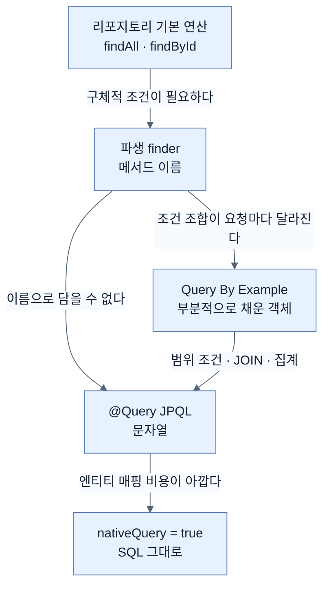
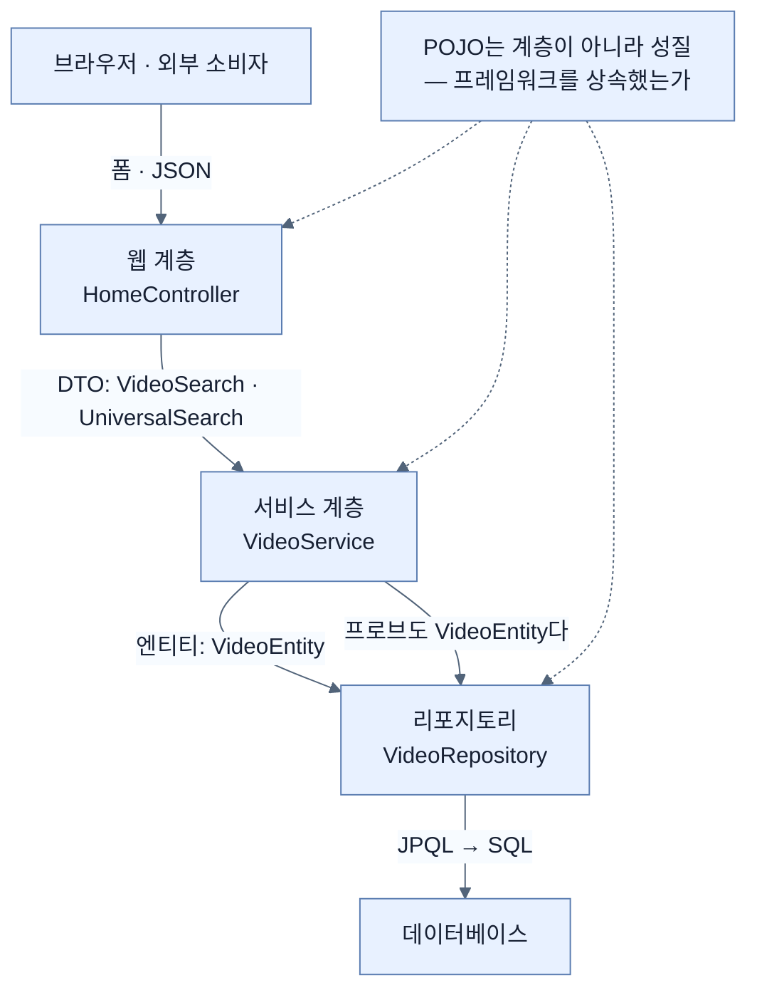

# Chapter 3 개념 지도 — Querying for Data with Spring Boot

> Chapter 3은 "Spring Data 기능 목록"이 아니다. **같은 검색 요구 하나**를 두고 `저장소 선택 → 접근 방식 선택 → 타입 분리 → 리포지토리 → 이름으로 쿼리 → 객체로 쿼리 → 문자열로 쿼리`까지 내려가면서, **매번 무엇을 얻고 무엇을 잃는지**를 묻는 장이다. 원문 누락 여부는 [[_coverage]]에서 추적한다.

## 읽는 순서


| 순서 | 노트 | 원문에서 답하는 질문 | 책 쪽 |
|---|---|---|---:|
| 01 | [[01-adding-spring-data-to-an-existing-application]] | 어떤 저장소를 고르고, 그 선택으로 무엇을 얻고 잃는가? | 72–73 |
| 01a | [[01a-using-spring-data-to-easily-manage-data]] | Spring Data는 왜 공통 API를 만들지 않았나? | 73–74 |
| 01b | [[01b-adding-spring-data-jpa-to-our-project]] | JPA와 H2를 어떻게 넣고, Boot 4는 무엇을 바꿨나? | 74–76 |
| 02 | [[02-dtos-entities-and-pojos]] | 왜 클래스를 목적별로 나눠야 하나? 언제는 안 나눠도 되나? | 76–79 |
| 02a | [[02a-entities-in-jpa]] | JPA는 엔티티에 왜 그런 요구를 거는가? | 77–78 |
| 02b | [[02b-pojos-and-the-spring-programming-model]] | 상속 대신 감싸는 방식이 무엇을 가능하게 했나? | 79–80 |
| 03 | [[03-creating-repositories-and-declarative-queries]] | 몸통 없는 인터페이스가 어떻게 쿼리를 실행하나? | 80–82 |
| 04 | [[04-using-custom-finders]] | 메서드 이름이 어떻게 SQL이 되나? 그 한계는? | 82–87 |
| 04a | [[04a-sorting-the-results]] | 결과 순서를 누가 정하게 할 것인가? | 87 |
| 04b | [[04b-limiting-query-results]] | 결과를 어디서 자르고, finder는 왜 막히는가? | 87–89 |
| 05 | [[05-query-by-example-for-dynamic-search]] | 조건 개수가 런타임에 정해질 때 어떻게 하나? | 89–93 |
| 06 | [[06-writing-custom-jpa-queries]] | 이름으로도 객체로도 담기지 않으면? | 93–96 |

## 축 1: 쿼리를 표현하는 네 가지 방법 — 사다리

이 축의 질문은 **"이 쿼리를 무엇으로 표현할 것인가, 그리고 그 선택으로 무엇을 잃는가?"**다. Chapter 3의 절반이 이 사다리를 위에서 아래로 내려가는 과정이다.



| 층 | 무엇으로 표현 | 조건 구조가 정해지는 시점 | 잃는 것 | 노트 |
|---|---|---|---|---|
| 기본 연산 | 없음 (이미 있음) | — | 조건 자체를 못 준다 | [[03-creating-repositories-and-declarative-queries]] |
| 파생 finder | 메서드 **이름** | **컴파일 시점** | 조합이 고정 → 필드마다 2배 증가 | [[04-using-custom-finders]] |
| Query By Example | **객체** | **런타임** | 범위 비교·JOIN·집계 불가 | [[05-query-by-example-for-dynamic-search]] |
| `@Query` JPQL | **문자열** | 런타임(문자열은 고정) | 시작 시점 이름 검증이 약해진다 | [[06-writing-custom-jpa-queries]] |
| 네이티브 SQL | **문자열** | 런타임 | 방언 독립성 · 동적 정렬 · 자동 페이징 | [[06-writing-custom-jpa-queries]] |

**아래로 내려가는 것은 실패가 아니다.** [[01a-using-spring-data-to-easily-manage-data]]가 미리 말하듯, 위 칸이 표현하지 못하는 것을 만났다는 신호일 뿐이다.

## 축 2: 무엇이 동적이고 무엇이 정적인가

이 축의 질문은 **"이 결정은 컴파일 시점에 굳는가, 런타임에 정해지는가?"**다. Chapter 3의 거의 모든 한계가 이 구분에서 나온다.

```text
  findByNameContainsIgnoreCase( "SPRING" , Sort.by("name") , PageRequest.of(0,20) )
  └──────────────┬──────────┘   └───┬──┘   └──────┬──────┘   └────────┬────────┘
       컴파일 시점에 고정            런타임        런타임             런타임

   ❌ 어떤 컬럼을 조건으로 삼는가      ✅ 찾을 값
   ❌ And 로 묶는가 Or 로 묶는가       ✅ 정렬 기준      (04a)
   ❌ 부분 일치인가 정확 일치인가       ✅ 페이지 번호·크기 (04b)
   ❌ 대소문자를 무시하는가

  ▶ 값·정렬·페이징은 유연하고 "조건의 구조"만 굳는다.
  ▶ 이 비대칭이 04b의 조합 폭발을 낳고, 05의 Query By Example이 겨냥하는 지점이 된다.
  ▶ QBE는 구조를 객체로 옮겨 런타임 쪽으로 넘긴다 — 대신 표현력을 줄인다.
```

## 축 3: 세 종류의 클래스가 놓이는 자리

이 축의 질문은 **"이 클래스는 무엇을 위해 존재하고, 어느 계층에 사는가?"**다. 축이 둘이라는 점이 핵심이다 — **역할**(DTO/엔티티)과 **속박 여부**(POJO)는 서로 직교한다.



| | DTO | 엔티티 | POJO |
|---|---|---|---|
| 묻는 것 | 무엇을 위해? | 무엇을 위해? | 무엇에 묶였나? |
| 답 | 옮기려고 | 저장하려고 | (역할과 무관) |
| record가 맞나 | **잘 맞는다** | 맞지 않는다 | 무관 |
| 이 장의 예 | `VideoSearch`, `UniversalSearch` | `VideoEntity` | 셋 다 대체로 POJO다 |
| 강제하는 주체 | **없음 — 패러다임** | JPA (`@Entity` 등) | 없음 |
| 노트 | [[02-dtos-entities-and-pojos]] | [[02a-entities-in-jpa]] | [[02b-pojos-and-the-spring-programming-model]] |

## 축 4: 같은 프록시가 세 번 나온다

이 축의 질문은 **"Spring이 반복해서 쓰는 한 가지 장치는 무엇인가?"**다. Chapter 2부터 이어지는 관통 개념이다.

| 어디서 | 무엇을 감싸나 | 목적 | 노트 |
|---|---|---|---|
| 서비스 빈 | **있는 클래스**를 감싼다 | 트랜잭션 등 횡단 관심사 적용 | [[02b-pojos-and-the-spring-programming-model]] |
| 리포지토리 | **없는 구현**을 만들어 낸다 | 인터페이스 선언만으로 동작 | [[03-creating-repositories-and-declarative-queries]] |
| 조회한 엔티티 | **결과 객체**를 감싼다 | 변경 추적과 flush | [[02a-entities-in-jpa]] |

셋 다 전제가 같다 — **컨테이너가 객체 생성을 통제하기 때문에** 그 자리에 다른 것을 끼워 넣을 수 있다. [[../chapter-2-creating-web-and-api-applications-with-spring-boot/04c-injecting-dependencies-through-constructor-calls|Chapter 2의 생성자 주입]]에서 "누가 `new`를 부르는가"가 중요하다고 한 이유가 여기서 세 번 회수된다.

## 축 5: 문제가 생겼을 때 어디를 먼저 보나

| 관찰된 증상 | 먼저 볼 곳 | 이유 |
|---|---|---|
| 시작 시점에 리포지토리 오류 | finder 이름의 필드 철자 | 이름 파싱이 매핑 메타데이터와 대조된다 |
| 검색어를 비웠는데 전부 나온다 | `StringUtils.hasText` 방어 | `Containing`에 빈 문자열은 `%%`가 된다 |
| `save()`가 UPDATE가 아니라 INSERT | 엔티티의 `id`가 `null`인지 | `id == null`이 새 행 신호다 |
| 저장 명령을 안 했는데 UPDATE가 나감 | 관리 상태 엔티티의 flush | 변경 추적이 커밋 시점에 반영된다 |
| 목록이 매번 다른 순서 | `ORDER BY`가 있는가 | 없으면 순서가 보장되지 않는다 |
| `Top5`인데 결과가 매번 다름 | 정렬을 함께 줬는가 | 개수 제한은 정렬과 짝이어야 한다 |
| 페이지 번호가 하나씩 어긋남 | `PageRequest.of(0, …)` | 0이 첫 페이지다 |
| QBE인데 아무것도 안 나옴 | `matchingAll` vs `matchingAny` | 같은 값을 여러 필드에 넣었다면 `Any`여야 한다 |
| 검색이 갑자기 느려짐 | `withIgnoreCase` + `CONTAINING` | `lower()`와 `%…%`는 인덱스를 못 쓴다 |
| 네이티브 쿼리에 정렬이 안 먹음 | `nativeQuery = true` | 동적 정렬이 지원되지 않는다 |
| H2에서 되던 쿼리가 운영에서 실패 | 네이티브 SQL 방언 | JPQL과 달리 번역되지 않는다 |

## 이름으로 원리를 기억하기

| 이름 | 이름이 붙은 이유 | 기억할 경계 |
|---|---|---|
| NoSQL | 원래 "SQL을 안 쓴다", 지금은 "Not only SQL" | 스키마가 없는 게 아니라 **DB가 강제하지 않는** 것이다 |
| Template | 반복 절차를 틀로 잡고 달라지는 부분만 채운다 | 이름만 같고 **공통 상위 타입은 없다** |
| Repository | 데이터에 이르는 **모든 경로를 모아 둔 보관소** | 마커 인터페이스는 **비어 있어야** 한다 |
| POJO | "평범한 옛날 Java 객체"에 일부러 붙인 거창한 이름 | 애노테이션이 붙어도 **테스트에 컨테이너가 필요 없으면** POJO 쪽 |
| flush | 모아 둔 것을 한꺼번에 흘려보낸다 | **내가 지시하지 않아도** 일어난다 |
| finder | `findBy`가 파싱의 시작점 | 파라미터 **이름**은 쿼리에 영향이 없다 |
| probe | 조사하려고 찔러 넣는 탐침 | 빈칸(`null`)은 "아무거나"가 아니라 **조건에서 제외** |
| Example | "이런 것을 찾아 달라"는 견본 | 동등·문자열 비교까지만 표현된다 |
| JPQL | Jakarta **Persistence** Query Language | 표·컬럼이 아니라 **엔티티·필드**를 쓴다 |
| AOT | Ahead-of-Time — 미리 | 빌드를 바꿔야 하고, 프로퍼티만으로는 안 생긴다 |

## 책과 공식 문서·표준 사이에서 주의할 다섯 지점

1. **`spring.aot.enabled=true`만으로는 AOT 리포지토리가 생기지 않는다.** 빌드 시점 AOT 처리(`-Pnative` 또는 Gradle AOT 플러그인)가 먼저이고, 이 프로퍼티는 실행 시 주는 것이다 — [[06-writing-custom-jpa-queries]].
2. **테스트 지원 아티팩트 이름.** 책은 `spring-boot-starter-data-jpa-test`로 적지만 공식 테스트 문서는 `@DataJpaTest`가 **`spring-boot-data-jpa-test` 모듈**에서 온다고 설명한다. Initializr가 내주는 좌표를 그대로 쓰는 편이 안전하다 — [[01b-adding-spring-data-jpa-to-our-project]].
3. **`spring-boot-h2console`은 이미 `h2`에 의존한다.** 그런데도 `h2`를 따로 넣는 것은 콘솔을 뺐을 때를 대비하고 `runtime` scope를 직접 지정하기 위해서다 — [[01b-adding-spring-data-jpa-to-our-project]].
4. **`TypedSort` 예제는 이 장의 코드에 그대로 안 맞는다.** 책은 `Video`와 `Video::getName`을 쓰지만 이 장의 엔티티는 `VideoEntity`이고 Chapter 2의 `Video`는 getter가 없는 record다 — [[04a-sorting-the-results]].
5. **프로브 예제의 `setTags(...)`와 4-JOIN 예제의 연관 필드는 이 장의 `VideoEntity`에 없다.** 더 풍부한 엔티티를 가정한 설명용 코드로 읽어야 한다 — [[05-query-by-example-for-dynamic-search]], [[06-writing-custom-jpa-queries]].

## 이 장이 말하지 않는 것

책 스스로 [[02a-entities-in-jpa]]의 Note에서 범위를 긋는다. 다음은 이 Chapter에 **없다.**

- 연관 관계 매핑(`@OneToMany` 등)과 지연 로딩
- 영속성 컨텍스트의 생명주기, N+1 문제
- `@Transactional`의 전파 속성·격리 수준·롤백 규칙
- 스키마 생성과 마이그레이션 (예제가 도는 것은 내장 DB의 자동 DDL 덕분이다)
- 락과 동시성 제어

이 층은 별도 보강 트랙(`part-0-jpa-foundations/`)이 Spring Data JPA·Hibernate 공식 문서를 1차 소스로 삼아 다룬다. 이 Chapter의 노트는 그 트랙을 전제하지 않고 읽을 수 있게 썼다.

## 나의 취약 엣지

- 아직 Chapter 3 인출 연습을 시작하지 않았으므로 실제 stall 기반 취약 엣지는 기록하지 않았다.
- 이후 막힘은 [[../../_global/gaps|전역 gaps]]에 `chapter-3-querying-for-data-with-spring-boot` 카테고리로 추가한다.
- 우선 확인 후보(현재 "약점"이 아니라 읽을 때 구분해야 할 경계): DTO vs 엔티티, template vs repository, `Containing` vs `Like`, `IgnoreCase` vs `AllIgnoreCase`, `Top5` vs `Pageable`, `matchingAll` vs `matchingAny`, 프로브의 `null` vs SQL의 `= null`, JPQL vs 네이티브 SQL, 파생 finder vs `@Query`.

## 관련 Chapter

- [[../chapter-2-creating-web-and-api-applications-with-spring-boot/_map|Chapter 2 · Web and API]] — `VideoService`의 인메모리 목록이 이 장에서 리포지토리로 교체된다. 계층 분리·생성자 주입·폼 바인딩이 그대로 재사용된다.
- [[../chapter-5-testing-with-spring-boot/07-testing-repositories-with-testcontainers|Chapter 5 · Testcontainers]] — 이 장이 예고한 대로, 여기서 만든 데이터 접근 코드를 실제 데이터베이스로 검증한다.
- [[../chapter-4-securing-an-application-with-spring-boot/06d-locking-down-access-to-the-owner|Chapter 4 · 데이터 보안]] — 리포지토리 연산에 소유권과 권한을 얹는다.
- [[../../part-4-scaling-an-application-with-spring-boot/chapter-10-working-with-data-reactively/02-choosing-r2dbc-and-a-reactive-data-store|Chapter 10 · R2DBC]] — 같은 repository 프로그래밍 모델을 논블로킹 방식으로 다시 본다.
- [[../../part-7-whats-new-in-spring-boot-4/chapter-15-whats-new-in-spring-boot-4/01-whats-new-in-spring-boot-4|Chapter 15 · Boot 4의 변화]] — `spring-boot-persistence` 모듈과 Hibernate 7 정렬이 Boot 4 전체 변화의 어느 자리에 놓이는지 보여 준다.
