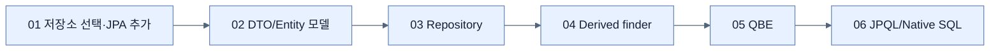

# Chapter 3 지도 — Querying for Data

## 추상화 선택 축

| 상황 | 우선 도구 | 이유 |
|---|---|---|
| CRUD·명확한 고정 조건 | Repository/derived finder | 코드가 가장 짧고 타입 메타데이터를 활용한다. |
| 입력 필드 조합이 동적 | QBE | null 필드를 무시하는 probe로 조합을 흡수한다. |
| 복잡한 관계·집계 | JPQL | Entity 모델 위에서 쿼리를 명시한다. |
| DB 고유 기능·대형 보고서 | Native SQL | 이식성을 포기하고 DB 표현력을 얻는다. |

## 경계 축

`외부 계약 DTO ↔ 매핑 ↔ 영속 Entity ↔ Repository ↔ DB`를 분리하면 웹 계약과 스키마를 독립적으로 바꿀 수 있다.

