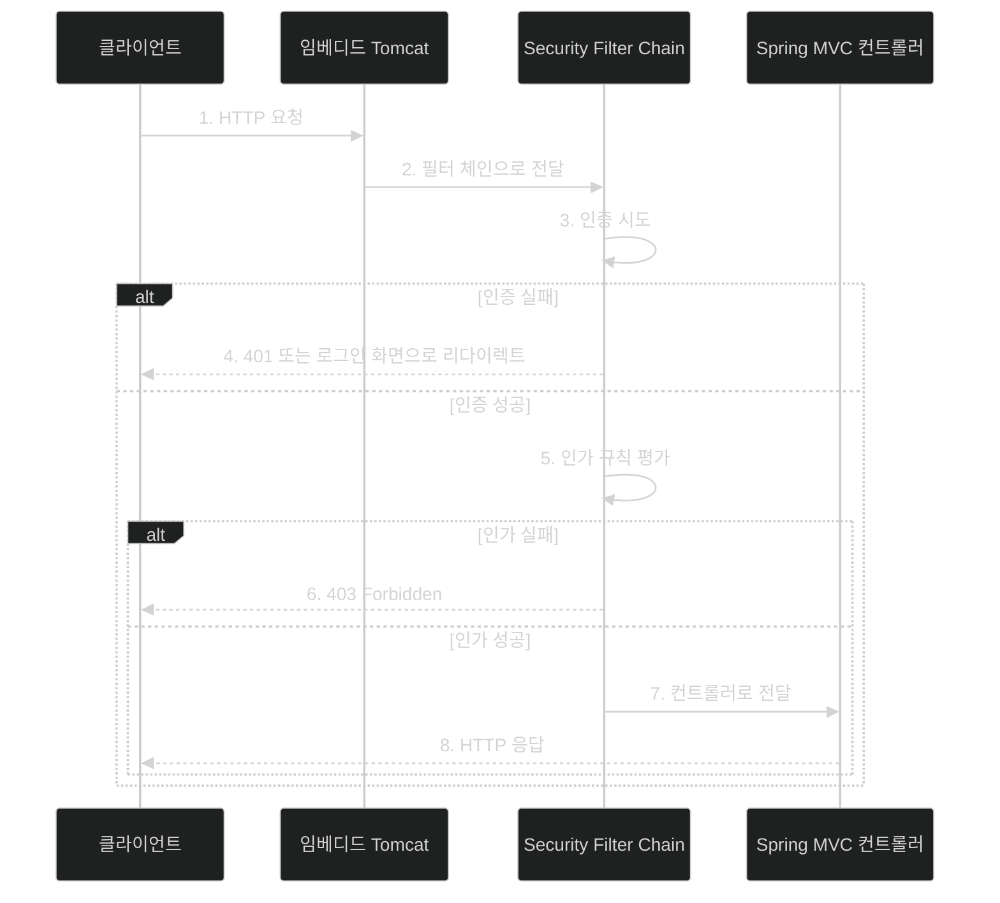
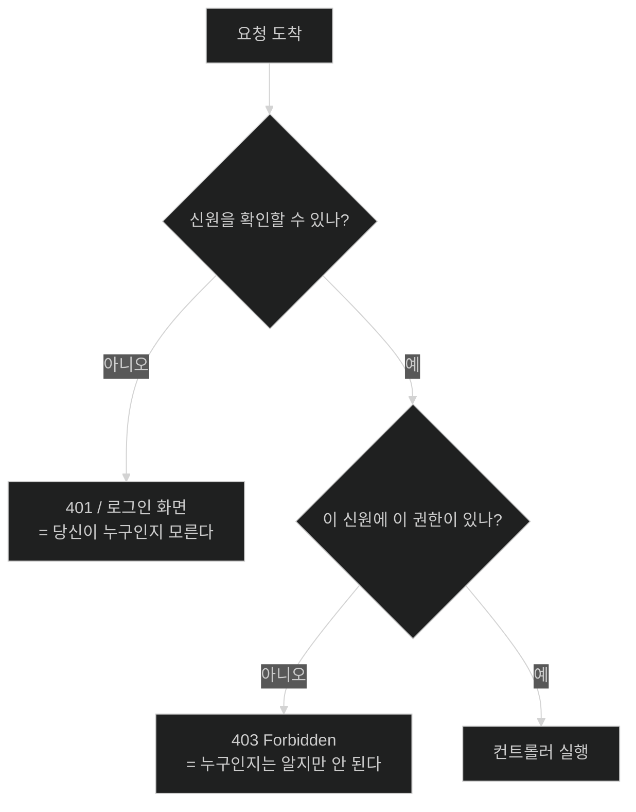

# 요청이 컨트롤러에 닿기 전에 — 필터 체인이라는 구조

## 한눈에 보기

| 질문 | 핵심 답 |
|---|---|
| 보안 코드는 어디에서 실행되나 | 컨트롤러 **앞**의 서블릿 필터 줄 안에서 |
| 그 줄의 중심 타입 | `SecurityFilterChain` |
| 필터가 하는 네 가지 | 인증 정보 추출 · 인증 · 인가 · CSRF 방어 |
| 인증(authentication)이 답하는 질문 | **이 사용자는 누구인가** |
| 인가(authorization)가 답하는 질문 | **이 사용자는 무엇을 해도 되는가** |
| 인증 실패의 응답 | 401 또는 로그인 화면으로 리다이렉트 |
| 인가 실패의 응답 | 403 |
| classpath에 Spring Security만 있으면 | 기본 `SecurityFilterChain`이 자동 등록돼 **모든 요청이 인증 필요** |
| 내가 `SecurityFilterChain` 빈을 만들면 | 자동 설정이 물러서고 내 규칙만 쓴다 |

## 1. 왜 이게 필요한가

### 출발 장면: `@PreAuthorize`를 붙였는데 왜 컨트롤러가 아예 실행되지 않는가

Chapter 3까지 만든 동영상 사이트에 보안을 붙이면 곧 이런 상황을 만난다. 브라우저로 `localhost:8080`을 열었는데 `HomeController.index()`에 걸어 둔 중단점이 **한 번도 걸리지 않고** 화면이 `/login`으로 튄다. 컨트롤러에는 아무 보안 코드도 없다. 그런데 실행 자체가 안 된다.

이유를 모르면 이 상황은 미궁이다. "내 코드 어디에도 리다이렉트가 없는데 누가 보냈지?"

답은 **내 코드가 아직 실행되지 않았다**는 것이다. 요청은 컨트롤러에 닿기 전에 다른 곳에서 이미 처리가 끝났다.

### 보안을 컨트롤러 안에 두면 무엇이 깨지는가

보안 검사를 컨트롤러 메서드 첫 줄에 두는 설계를 상상해 보자.

```java
@GetMapping("/admin")
public String admin(HttpSession session) {
    if (session.getAttribute("user") == null) {
        return "redirect:/login";      // 검사 1
    }
    if (!isAdmin(session)) {
        return "redirect:/denied";     // 검사 2
    }
    // ... 진짜 하려던 일
}
```

이 방식은 세 가지 이유로 무너진다.

1. **빠뜨리면 조용히 뚫린다.** 컨트롤러 메서드를 하나 새로 추가하면서 저 두 줄을 잊으면 그 엔드포인트만 무방비가 된다. 컴파일도 되고 테스트도 통과한다. 아무도 알려 주지 않는다.
2. **정책이 코드 전체에 흩어진다.** "관리자만 들어갈 수 있는 경로가 뭐지?"라는 질문에 답하려면 컨트롤러를 전부 읽어야 한다.
3. **컨트롤러가 실행되기 전에 막아야 하는 것들을 막을 수 없다.** 위조된 요청(CSRF)이나 잘못된 토큰은 비즈니스 로직에 들어오기 전에 걸러야 하는데, 컨트롤러 안에 있는 코드는 이미 늦었다.

Spring Security는 이 셋을 한 번에 해결하려고 **검사 위치를 컨트롤러 밖으로 끌어냈다.**

## 2. 어떻게 동작하는가

### 2.1 서블릿 필터라는 자리

서블릿 컨테이너(이 책에서는 임베디드 Tomcat)에는 원래 **[[필터-체인]]**(= 요청이 컨트롤러에 닿기 전에 차례로 통과하는 필터들의 줄)이라는 개념이 있다. 요청 하나가 들어오면 등록된 필터를 순서대로 통과한 뒤에야 서블릿(= Spring MVC의 `DispatcherServlet`)에 도착한다.

Spring Security가 한 일은 새로운 개념을 만든 게 아니라 **이미 있던 자리를 차지한 것**이다. 자기 필터들을 이 줄 중간에 끼워 넣는다. 그래서 컨트롤러 코드는 한 줄도 바뀌지 않았는데 동작이 달라진다.

이 위치 선택이 앞의 세 문제를 어떻게 푸는지 보자.

| 문제 | 필터 위치가 주는 해결 |
|---|---|
| 빠뜨리면 뚫린다 | 필터는 **모든** 요청을 통과시키므로 새 엔드포인트도 자동으로 검사를 받는다. 기본값이 "막힘"이고 여는 것이 명시적 선언이다 |
| 정책이 흩어진다 | 규칙이 `SecurityFilterChain` 빈 한 곳에 모인다. 그 파일 하나만 읽으면 정책 전체가 보인다 |
| 너무 늦다 | 컨트롤러·서비스·리포지토리가 아직 실행되기 전이라, 거절해도 **아무 부작용이 남지 않는다** |

### 2.2 중심 타입 `SecurityFilterChain`

**[[SecurityFilterChain]]**(= 보안 정책 한 벌을 담는 빈 타입)이 이 구조의 중심이다. 이름을 그대로 읽으면 "보안 필터들의 사슬"이다. 어떤 경로에 어떤 규칙을 걸지, 어떤 로그인 방식을 켤지가 전부 이 객체 하나에 들어간다.

책이 정리한 필터들의 책임은 네 가지다. 각 항목에 "왜 이 단계가 필요한가"를 붙여 보면 순서의 이유가 보인다.

| 단계 | 하는 일 | 이 단계가 필요한 이유 |
|---|---|---|
| 1 | 세션이나 베어러 토큰 같은 **인증 정보 추출** | 판정하려면 먼저 재료가 있어야 한다. 요청의 어느 자리에 자격 증명이 실려 있는지 아는 쪽은 필터뿐이다 |
| 2 | **인증 수행** | 추출한 재료가 진짜인지 확인해야 이후 판정이 의미를 갖는다 |
| 3 | **인가 규칙 적용** | 신원이 확정된 뒤에야 "이 사람이 이걸 해도 되는가"를 물을 수 있다 |
| 4 | **CSRF 같은 방어 적용** | 인증된 사용자를 노리는 공격이 있으므로, 인증에 성공했다고 곧바로 통과시키면 안 된다 |

### 2.3 인증과 인가 — 두 질문이 다른 이유

이 장 전체가 이 구분 위에 서 있다.

- **[[인증]]**(= 이 요청을 보낸 사람이 누구인지 확정하는 절차) → **누구인가?**
- **[[인가]]**(= 확정된 사용자가 이 일을 해도 되는지 판정하는 절차) → **무엇을 해도 되는가?**

둘을 섞으면 응답 코드부터 틀린다.

| 상황 | 코드 | 뜻 |
|---|---|---|
| 로그인하지 않았다 | **[[401-Unauthorized]]**(= 신원이 확인되지 않았다) 또는 로그인 화면 | "당신이 누구인지 모르겠다. 먼저 밝혀라" |
| 로그인했지만 권한이 없다 | **[[403-Forbidden]]**(= 신원은 알지만 허용되지 않는다) | "당신이 누구인지는 안다. 그런데 이건 안 된다" |

401을 받았는데 로그인 화면을 안 띄우면 사용자는 막힌 채로 남고, 403을 받았는데 로그인 화면을 띄우면 이미 로그인한 사용자에게 다시 로그인하라고 하는 꼴이 된다. 그래서 실패의 **종류**를 구분하는 것 자체가 기능이다.

> 401의 이름은 역사적 사고다. 실제 뜻은 "Unauthenticated"에 가깝지만 HTTP 규격에 `Unauthorized`로 굳어 버렸다. 이름만 보고 "인가 실패"로 읽으면 정확히 반대로 이해하게 된다.

### 2.4 요청 하나가 지나가는 길

책의 Figure 4.1은 이 흐름을 8단계로 나눈다. 개념 관계도이므로 원본 이미지 대신 다시 그렸다.



중요한 성질 두 가지가 이 그림에서 읽힌다.

1. **3번과 5번은 순서가 고정이다.** 인가는 인증 결과를 재료로 쓰기 때문에 뒤집을 수 없다.
2. **4번과 6번에서 화살표가 컨트롤러를 거치지 않고 곧장 클라이언트로 돌아간다.** 거절된 요청은 애플리케이션 코드에 아예 들어오지 않는다. 이것이 "부작용이 남지 않는다"의 구체적 의미다.

### 2.5 기본값은 "전부 잠김"

Spring Security가 classpath에 있고 내가 아무 설정도 하지 않으면, Spring Boot는 기본 `SecurityFilterChain`을 자동 등록한다. 그 기본값은 다음과 같다.

- **모든** 요청이 인증을 요구한다
- **[[폼-로그인]]**(= HTML 폼으로 아이디·비밀번호를 POST하는 방식)과 **[[HTTP-Basic]]**(= `Authorization` 헤더로 인증하는 방식)이 둘 다 켜진다
- 상태 변경 요청에 **[[CSRF]]**(= 로그인한 사용자의 브라우저를 이용해 위조 요청을 보내는 공격) 방어가 켜진다

여기서 설계 판단을 하나 읽을 수 있다. **기본값이 "열림"이 아니라 "닫힘"이다.** 설정을 잊었을 때 일어나는 일이 "전부 뚫림"이 아니라 "전부 막힘"이 되도록 방향을 정한 것이다. 잘못된 쪽으로 실패해도 데이터가 새지는 않는다.

그리고 내가 `SecurityFilterChain` 타입의 빈을 하나 정의하면 **[[자동-설정-백오프]]**(= 같은 역할의 빈이 있으면 자동 설정이 물러서는 동작)가 일어나 기본 정책은 등록되지 않는다. 즉 "기본값에 내 규칙을 얹는" 게 아니라 **"기본값을 통째로 대체한다".**

이 차이는 나중에 실수의 원인이 된다. 기본값이 켜 주던 폼 로그인을 내 정책에서 빼먹으면 로그인 화면 자체가 사라진다.

## 3. 그림으로 보기

두 실패의 갈림길만 따로 보면 이렇다.



| 구분 | 인증 | 인가 |
|---|---|---|
| 질문 | 누구인가 | 무엇을 해도 되는가 |
| 재료 | 비밀번호·토큰 같은 자격 증명 | 확정된 신원 + 규칙 |
| 실패 코드 | 401 | 403 |
| 실패 시 사용자가 할 일 | 로그인한다 | 할 수 있는 게 없다(권한을 받아야 한다) |
| 이 장에서 다루는 절 | [[03-creating-users-with-userdetailsservice]], [[04-spring-data-backed-users]] | [[05-securing-web-routes-and-http-verbs]], [[06d-locking-down-access-to-the-owner]] |

## 4. 이 노트에 나온 용어

| 용어 | 한 줄 뜻 | 정의 위치 |
|---|---|---|
| 필터 체인 | 컨트롤러 앞에서 요청이 차례로 통과하는 필터들의 줄 | [[_glossary#필터-체인]] |
| SecurityFilterChain | 보안 정책 한 벌을 담는 빈 타입 | [[_glossary#SecurityFilterChain]] |
| 인증 | 이 요청을 보낸 사람이 누구인지 확정하는 절차 | [[_glossary#인증]] |
| 인가 | 확정된 사용자가 이 일을 해도 되는지 판정하는 절차 | [[_glossary#인가]] |
| 401 Unauthorized | 신원이 확인되지 않았다는 상태 코드 | [[_glossary#401-Unauthorized]] |
| 403 Forbidden | 신원은 알지만 허용되지 않는다는 상태 코드 | [[_glossary#403-Forbidden]] |
| 폼 로그인 | HTML 폼으로 자격 증명을 POST하는 인증 방식 | [[_glossary#폼-로그인]] |
| HTTP Basic | `Authorization` 헤더로 인증하는 HTTP 표준 방식 | [[_glossary#HTTP-Basic]] |
| CSRF | 로그인한 사용자의 브라우저를 이용한 요청 위조 공격 | [[_glossary#CSRF]] |
| 자동 설정 백오프 | 같은 역할의 빈이 있으면 자동 설정이 물러서는 동작 | [[_glossary#자동-설정-백오프]] |

## 5. 자주 헷갈리는 것

**"401은 인가 실패다"** — 반대다. 이름이 `Unauthorized`라서 생기는 오해이며, 실제로는 인증 실패다. 인가 실패는 403이다.

**"`SecurityFilterChain` 빈을 만들면 기본 설정에 내 규칙이 추가된다"** — 대체된다. 기본이 켜 주던 폼 로그인·HTTP Basic도 내가 다시 켜지 않으면 사라진다. [[05-securing-web-routes-and-http-verbs]]에서 이 장의 모든 정책이 `formLogin`과 `httpBasic`을 매번 다시 적는 이유가 그것이다.

**"필터 체인은 Spring Security가 발명한 개념이다"** — 서블릿 명세에 원래 있던 개념이다. Spring Security는 그 자리에 자기 필터를 끼워 넣었을 뿐이라, Tomcat·Jetty 어디서 돌든 같은 방식으로 동작한다.

**"인증만 켜면 보안이 끝난다"** — 기본 정책은 `anyRequest().authenticated()`뿐이라, **로그인한 사람은 아무 엔드포인트나 갈 수 있다.** 관리자 전용 경로를 막는 것은 별도의 인가 규칙이다. 이 함정은 [[05-securing-web-routes-and-http-verbs]]에서 책이 직접 지적한다.

## 6. 언제 안 쓰나 / 경계

- **서블릿 기반이 아닌 경우.** 이 그림은 Spring MVC(서블릿) 기준이다. 리액티브인 Spring WebFlux는 `SecurityWebFilterChain`이라는 다른 타입을 쓰고, Spring Boot가 어느 쪽을 켤지 classpath를 보고 고른다.
- **필터로는 판정할 수 없는 규칙.** 필터는 URL과 HTTP 메서드를 본다. "이 동영상의 소유자인가"처럼 **데이터를 봐야 답이 나오는** 규칙은 URL만으로 표현할 수 없다. 그래서 [[06-securing-spring-data-methods]]의 메서드 레벨 보안이 따로 필요하다.
- **비유의 한계.** 필터 체인을 "건물 입구의 검색대"에 비유하면 이해가 빠르다. 신분증을 확인(인증)하고 출입증 등급을 확인(인가)한 뒤 들여보낸다. 다만 이 비유는 **입구를 통과한 뒤에는 검사가 없다**는 인상을 준다. 실제로는 통과한 뒤에도 메서드 호출마다 다시 검사할 수 있고, 이 장 후반부가 정확히 그 이야기다. 검색대는 건물 입구에만 있지만 Spring Security의 검사는 방마다 다시 놓을 수 있다.

## 7. 연결

- [[02-adding-spring-security-to-the-project]] — 여기서 설명한 기본 필터 체인이 의존성 두 줄만으로 실제로 켜지는 것을 확인한다.
- [[05-securing-web-routes-and-http-verbs]] — `SecurityFilterChain`을 직접 정의해 기본값을 대체하고, 경로별 인가 규칙을 쌓는다.
- [[06-securing-spring-data-methods]] — 필터가 볼 수 없는 것(요청 대상 데이터의 소유자)을 보기 위해 검사 지점을 메서드로 옮긴다.

## 8. 스스로 확인

1. 보안 검사를 컨트롤러 첫 줄이 아니라 필터에 두면 정확히 무엇이 좋아지는가? 세 가지를 각각의 실패 시나리오와 함께 말할 수 있는가?
2. 401과 403 중 하나를 잘못 돌려주면 사용자 경험에 무슨 일이 생기는가?
3. 인가를 인증보다 먼저 할 수 없는 이유는 무엇인가?
4. 기본값을 "전부 인증 필요"로 정한 것과 "전부 허용"으로 정한 것은 설정을 잊었을 때 각각 무엇이 다른가?
5. `SecurityFilterChain` 빈을 정의했더니 로그인 화면이 사라졌다. 왜인가?
6. 검색대 비유가 깨지는 지점은 어디인가?
7. 필터만으로는 표현할 수 없는 규칙의 예를 하나 들 수 있는가?

> 일곱 문항을 스스로 답한 **뒤에** [[_01-spring-security-filter-chain-foundations]]에서 모범답안과 대조한다. 먼저 열면 이 문항들은 다시 인출 문제로 쓸 수 없다.

<!-- ==== 아래는 내 영역 · 스킬 수정 금지 ==== -->

## 내 설명 시도


## 막혔던 지점


## 리뷰 이력
