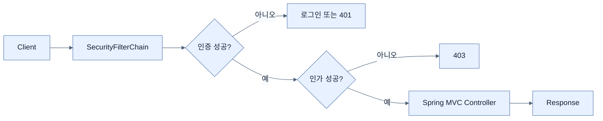

# Spring Security의 기반

## 한눈에 보기

서블릿 애플리케이션의 모든 요청은 MVC 컨트롤러 전에 `SecurityFilterChain`을 지난다. 필터는 자격 정보 추출, 인증, 인가, CSRF 같은 보호를 수행한다. **인증**은 누구인지, **인가**는 그 사용자가 무엇을 할 수 있는지를 판단한다.

## 1. 왜 이게 필요한가

보안은 컨트롤러마다 `if`를 넣는 단일 기능이 아니라 여러 공격면을 일관되게 막는 계층이다. 검증된 프레임워크가 모든 요청의 공통 경계에 정책을 적용해야 누락을 줄이고 인증 방식과 접근 규칙을 독립적으로 발전시킬 수 있다.

## 2. 어떻게 동작하는가

1. 내장 서블릿 컨테이너가 요청을 필터 체인에 넘긴다.
2. 세션·Basic·bearer token 등에서 인증 정보를 찾고 사용자를 확인한다.
3. 실패하면 로그인으로 이동하거나 401을 반환한다.
4. 성공하면 경로·동사·권한 규칙을 평가한다.
5. 인가 실패는 보통 403, 성공은 MVC 컨트롤러로 진행한다.

Security가 클래스패스에 있으면 Boot는 모든 요청 인증, form login/HTTP Basic, 상태 변경 요청 CSRF 보호를 갖춘 기본 체인을 만든다. 사용자 `SecurityFilterChain` Bean이 있으면 자동 구성이 back off한다.

## 3. 그림으로 보기

## 4. 이 노트에 나온 용어

- **authentication**: 제시된 자격 정보로 주체의 identity를 확인하는 과정.
- **authorization**: 인증된 주체가 특정 자원·행동에 접근 가능한지 판단하는 과정.
- **SecurityFilterChain**: 보안 필터의 순서와 요청 정책을 정의하는 중심 Bean.
- **security context**: 현재 요청·실행 흐름의 인증 정보를 보관하는 문맥.

## 7. 연결

- [[02-adding-spring-security-and-custom-users]] — 기본 체인을 실제 프로젝트에 활성화한다.
- [[04-securing-web-routes-and-http-verbs]] — 필터 체인에서 인가 규칙을 구체화한다.
- [[05-protecting-against-csrf]] — 상태 있는 브라우저 요청을 보호하는 기본 필터다.

## 8. 스스로 확인

- 전체 1차 정리 후: 미인증 401과 인증됐지만 권한 없는 403의 차이를 요청 흐름으로 설명한다.

<!-- ==== 아래는 내 영역 · 스킬 수정 금지 ==== -->

## 내 설명 시도

## 막혔던 지점

## 리뷰 이력

