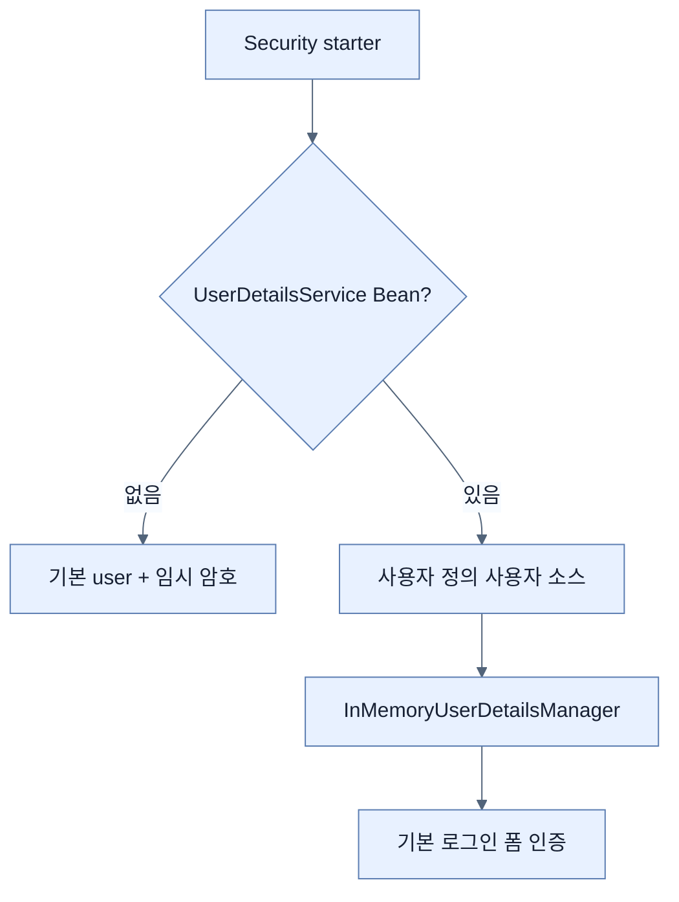

# Spring Security 추가와 사용자 정의

## 한눈에 보기

security runtime/test 스타터를 추가하면 Boot가 기본 사용자 `user`와 매 실행마다 생성된 암호로 전체 애플리케이션을 잠근다. 사용자 `UserDetailsService` Bean을 정의하면 기본 사용자는 사라지고 `InMemoryUserDetailsManager` 같은 자체 사용자 소스를 사용한다.

## 1. 왜 이게 필요한가

무보안 기본값보다 즉시 잠기는 편이 안전하지만 무작위 단일 사용자는 데모 이상으로 확장할 수 없다. 인증의 사용자 조회 계약을 `UserDetailsService`로 분리하면 메모리, DB, LDAP, 외부 identity provider를 정책의 나머지 부분과 독립적으로 교체할 수 있다.

## 2. 어떻게 동작하는가

`UserDetailsService`는 username으로 `UserDetails`를 로드하는 단일 계약이다. 책은 `user/ROLE_USER`, `admin/ROLE_ADMIN`을 메모리 manager에 넣는다. Spring Security 자동 구성은 이 Bean을 감지하고 자체 임시 사용자를 만들지 않는다. 기본 로그인 폼은 별도 HTML 없이 제공된다.

책의 `withDefaultPasswordEncoder()`는 학습용 편의 기능이며 평문에 가까운 입력을 그대로 코드에 둔다. 운영에서는 절대 사용하지 않고 명시적인 `PasswordEncoder`로 저장 전에 해시한다.

## 3. 그림으로 보기

## 4. 이 노트에 나온 용어

- **UserDetailsService**: username으로 Spring Security 사용자 정보를 조회하는 전략 인터페이스.
- **UserDetails**: username, password, authorities와 계정 상태를 나타내는 인증 모델.
- **password encoder**: 원문 암호를 저장·검증용 표현으로 변환하는 구성 요소.

## 7. 연결

- [[03-using-spring-data-backed-users]] — 메모리 사용자를 DB 조회로 교체한다.
- [[10-securing-data-at-rest]] — 학습용 암호 처리를 BCrypt로 교체한다.
- [[01-spring-security-foundations]] — 사용자 소스가 필터 체인의 인증 단계에 공급된다.

## 8. 스스로 확인

- 전체 1차 정리 후: 사용자 `UserDetailsService`가 있을 때 Boot 기본 사용자가 사라지는 이유를 설명한다.

<!-- ==== 아래는 내 영역 · 스킬 수정 금지 ==== -->

## 내 설명 시도

## 막혔던 지점

## 리뷰 이력

