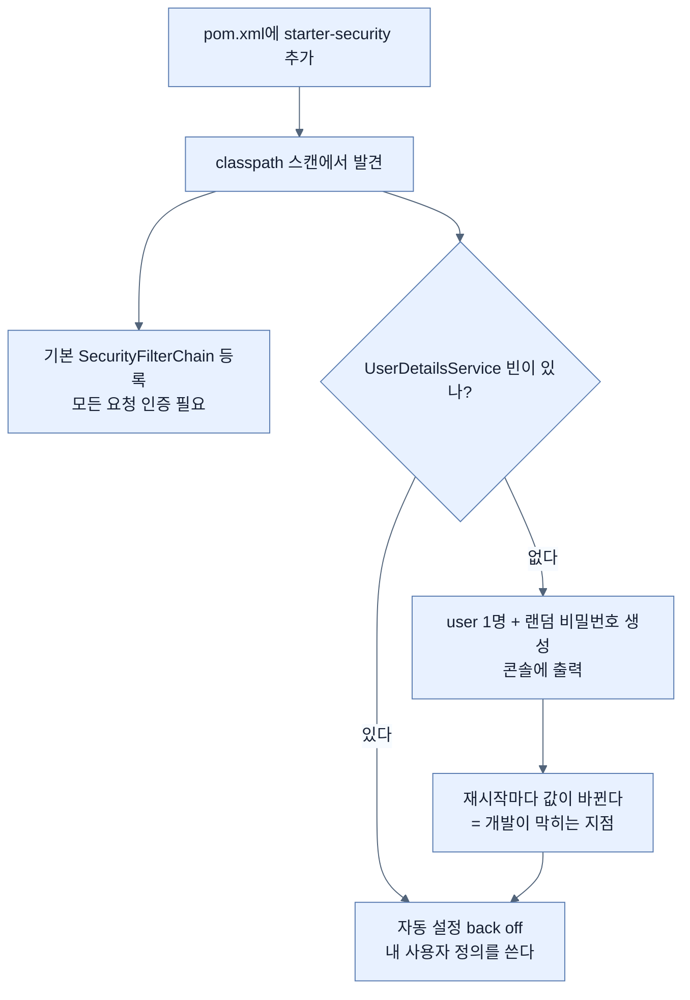

# 의존성 두 줄 — 잠기는 것과 잠긴 채로 쓸 수 없는 것

## 한눈에 보기

| 질문 | 핵심 답 |
|---|---|
| 추가하는 의존성 | `spring-boot-starter-security` + `spring-boot-starter-security-test`(test scope) |
| 코드 변경 | **없다.** 넣고 재시작만 하면 된다 |
| 그러면 무슨 일이 일어나나 | 앱 전체가 잠기고, 콘솔에 **랜덤 비밀번호**가 찍힌다 |
| 기본 사용자 이름 | `user` |
| 이게 좋은 점 | "Boot는 이만큼 쉽다"를 3분 만에 보여 줄 수 있다 |
| 이게 나쁜 점 | **재시작할 때마다 비밀번호가 바뀐다** |
| `application.properties`로 덮으면? | 되긴 하지만 사용자 한 명짜리라 확장되지 않는다 |

## 1. 왜 이게 필요한가

### 출발 장면: 아무것도 안 했는데 앱이 잠겼다

Chapter 3까지 만든 동영상 사이트의 `pom.xml`에 다음 두 블록을 붙이고, 자바 코드는 **한 글자도 건드리지 않은 채** 재시작해 보자.

```xml
<dependency>
    <groupId>org.springframework.boot</groupId>
    <artifactId>spring-boot-starter-security</artifactId>
</dependency>

<dependency>
    <groupId>org.springframework.boot</groupId>
    <artifactId>spring-boot-starter-security-test</artifactId>
    <scope>test</scope>
</dependency>
```

앱은 정상적으로 뜬다. Spring Data JPA도 그대로 동작한다. 그런데 콘솔에 이런 줄이 하나 찍혀 있다.

```text
Using generated security password: 8e557245-73f2-4f39-9dc5-3a0e60eb8d3f
```

그리고 `localhost:8080`을 열면 로그인 화면이 나온다. 아이디 `user`, 비밀번호는 저 UUID다.

이 장면이 이 절의 전부이고, 동시에 이 장 나머지 전부의 출발점이다. **"기본값으로 잠기는 것"은 시연에는 완벽하지만 개발에는 쓸 수 없다.**

### 왜 랜덤 비밀번호가 문제인가

CTO에게 "Spring Boot는 의존성 한 줄로 애플리케이션을 잠급니다"를 보여 주는 자리라면 이건 훌륭하다. 5초 만에 끝나는 시연이다.

하지만 개발을 계속하려는 순간 문제가 된다.

| 상황 | 무슨 일이 일어나는가 |
|---|---|
| 코드를 고치고 재시작 | 비밀번호가 **새로 생성된다.** 콘솔을 다시 뒤져야 한다 |
| 하루에 30번 재시작 | 30번 복사·붙여넣기 |
| 팀원과 화면 공유 | 상대의 콘솔 값은 내 것과 다르다 |
| 자동화된 통합 테스트 | 실행할 때마다 값이 달라 **테스트에 적을 수가 없다** |
| 역할(role) 구분 | 사용자가 `user` 하나뿐이라 "관리자만" 규칙을 시험할 수 없다 |

마지막 줄이 결정적이다. 이 장의 목표는 "관리자만 동영상을 추가할 수 있다" 같은 규칙을 만드는 것인데, **사용자가 한 명뿐이면 그 규칙이 동작하는지 확인할 방법이 없다.**

## 2. 어떻게 동작하는가

### 2.1 의존성이 왜 두 개인가

**[[스타터]]**(= 라이브러리와 자동 설정을 묶어 의존성 한 줄로 기능을 켜 주는 묶음)가 두 개인 이유는 **적용되는 시점이 다르기** 때문이다.

| 아티팩트 | scope | 하는 일 | 없으면 |
|---|---|---|---|
| `spring-boot-starter-security` | (기본) | 런타임에 필터 체인을 켠다 | 앱이 잠기지 않는다 |
| `spring-boot-starter-security-test` | `test` | `@WithMockUser`, `csrf()` 같은 테스트 지원을 준다 | 보안 규칙을 테스트할 수 없다 |

`test` scope로 선언한다는 것은 "이 라이브러리를 **최종 배포물에 넣지 말라**"는 지시다. 테스트 도구는 운영 환경에서 실행될 일이 없고, 오히려 들어 있으면 공격 표면만 넓힌다.

책이 이 둘을 처음부터 함께 넣는 것은 순서상의 힌트다. 보안 규칙은 **성공 경로와 실패 경로를 둘 다** 시험해야 하는데, 그건 [[../chapter-5-testing-with-spring-boot/08-testing-security-policies|Chapter 5 · 보안 정책 테스트]]에서 실제로 한다.

### 2.2 classpath에 있다는 사실만으로 켜지는 이유

자바 코드를 한 줄도 안 썼는데 동작이 바뀌는 것은 마법이 아니라 **조건부 자동 설정**이다. 흐름은 이렇다.

1. 앱이 뜰 때 Spring Boot가 classpath를 훑는다.
2. Spring Security 클래스가 보인다 → 보안 자동 설정을 켠다.
3. 자동 설정이 기본 **[[SecurityFilterChain]]**(= 보안 정책 한 벌을 담는 빈 타입)을 등록한다. 그 내용은 "모든 요청에 **[[인증]]**(= 요청자가 누구인지 확정하는 절차) 필요 + 폼 로그인 + HTTP Basic"이다.
4. 사용자 정보를 줄 빈이 필요한데 내가 만든 게 없다 → 임시로 `user` 한 명을 메모리에 만들고 비밀번호를 랜덤 생성한다.
5. 그 비밀번호를 콘솔에 찍는다. 안 찍으면 아무도 들어갈 수 없으니까.

각 단계에 이유를 붙여 보면 4단계가 핵심이다. **Spring Boot는 "사용자가 없으니 보안을 끄자"가 아니라 "사용자가 없으니 임시로 하나 만들자"를 골랐다.** 방향이 잠그는 쪽이다.

### 2.3 그래서 왜 `application.properties`로 안 끝나는가

랜덤 비밀번호가 싫다면 이렇게 고정할 수 있다.

```properties
spring.security.user.name=admin
spring.security.user.password=password
spring.security.user.roles=ADMIN
```

재시작해도 값이 유지된다. 문제가 해결된 것처럼 보인다. 그런데 책은 이 길을 "확장되지 않는다(this isn't scalable)"며 접는다. 이유는 셋이다.

1. **사용자가 여전히 한 명이다.** 이 프로퍼티는 "그 하나뿐인 기본 사용자"의 값을 바꿀 뿐, 두 번째 사용자를 만들 수단이 없다. alice와 bob이 서로의 동영상을 못 지우게 하려면 최소 두 명이 필요하다.
2. **비밀번호가 설정 파일에 평문으로 남는다.** 이 파일은 보통 형상 관리에 들어간다.
3. **다음 단계로 이어지지 않는다.** 결국 사용자는 데이터베이스에서 와야 하는데, 프로퍼티 방식은 그 방향으로 한 걸음도 나아가지 않는다.

그래서 책은 "비슷한 노력으로 더 현실적인 출발점에 설 수 있다"며 **[[UserDetailsService]]**(= 사용자 이름을 받아 사용자 정보를 돌려주는 인터페이스) 빈을 직접 만드는 길로 간다. 그 빈을 만드는 순간 **[[자동-설정-백오프]]**(= 같은 역할의 빈이 있으면 자동 설정이 물러서는 동작)가 일어나 랜덤 비밀번호는 더 이상 생성되지 않는다.

## 3. 그림으로 보기



| 선택지 | 사용자 수 | 재시작에 견디나 | 역할 구분 | 다음 단계로 이어지나 |
|---|---:|---|---|---|
| 아무것도 안 함(랜덤) | 1 | 아니오 | 불가 | 아니오 |
| `spring.security.user.*` | 1 | 예 | 한 명분만 | 아니오 |
| `UserDetailsService` 빈 | 여럿 | 예 | 가능 | **예** — DB 연동으로 그대로 확장 |

## 4. 이 노트에 나온 용어

| 용어 | 한 줄 뜻 | 정의 위치 |
|---|---|---|
| 스타터 | 라이브러리와 자동 설정을 묶은 의존성 | [[_glossary#스타터]] |
| SecurityFilterChain | 보안 정책 한 벌을 담는 빈 타입 | [[_glossary#SecurityFilterChain]] |
| 인증 | 요청자가 누구인지 확정하는 절차 | [[_glossary#인증]] |
| 자동 설정 백오프 | 같은 역할의 빈이 있으면 자동 설정이 물러섬 | [[_glossary#자동-설정-백오프]] |
| UserDetailsService | 사용자 이름으로 사용자 정보를 돌려주는 인터페이스 | [[_glossary#UserDetailsService]] |

## 5. 자주 헷갈리는 것

**"랜덤 비밀번호는 보안 기능이다"** — 편의 기능이다. 사용자를 정의하지 않은 앱을 **열어 두지 않기 위한** 임시 조치이며, 그대로 운영에 나가라고 만든 게 아니다. 콘솔에 평문으로 찍힌다는 사실 자체가 그 증거다.

**"`spring.security.user.password`를 쓰면 안전하다"** — 랜덤 비밀번호보다 **덜** 안전하다. 값이 고정이고 설정 파일에 평문으로 남는다. 개발 편의를 위한 것이지 보안 개선이 아니다.

**"`spring-boot-starter-security-test`는 나중에 넣어도 된다"** — 넣어도 되지만, 처음부터 넣는 편이 낫다. 보안 규칙은 "막히는지"를 확인해야 완성인데, 그 확인은 테스트로만 반복 가능하다.

## 6. 언제 안 쓰나 / 경계

- **잠금이 성공했다는 것이 정책이 맞다는 뜻은 아니다.** 이 시점의 앱은 "로그인하면 아무 데나 갈 수 있는" 상태다. 관리자 전용 경로 같은 구분은 [[05-securing-web-routes-and-http-verbs]]에서 따로 만든다.
- **비유의 한계.** 이 단계는 "새 집에 임시 자물쇠를 달아 주는 것"에 가깝다. 문은 확실히 잠기고 열쇠도 하나 준다. 다만 이 비유는 **열쇠가 매일 바뀐다**는 이상한 부분을 설명하지 못한다. 실제로는 자물쇠보다 "매번 새 비밀번호를 발급하는 임시 출입증"에 가깝고, 그래서 오래 쓸 수 없다는 점이 핵심이다.

## 7. 연결

- [[01-spring-security-filter-chain-foundations]] — 여기서 자동 등록되는 필터 체인의 내부 구조와 401/403 분기를 설명한다.
- [[03-creating-users-with-userdetailsservice]] — 랜덤 비밀번호를 없애기 위해 `UserDetailsService` 빈을 직접 만든다. 이 노트가 남긴 문제의 직접적인 답이다.

## 8. 스스로 확인

1. 자바 코드를 한 줄도 안 바꿨는데 앱이 잠기는 이유를 단계별로 설명할 수 있는가?
2. 랜덤 비밀번호가 "좋은 것이자 나쁜 것"인 이유를 각각의 상황과 함께 말할 수 있는가?
3. `spring.security.user.password`로 고정하는 방법을 책이 접는 이유 세 가지는?
4. 두 스타터의 scope가 다른 이유는 무엇이며, `test`를 빼면 무슨 위험이 생기는가?
5. `UserDetailsService` 빈을 만들면 랜덤 비밀번호가 사라지는 메커니즘의 이름은?
6. 임시 자물쇠 비유가 깨지는 지점은 어디인가?

<!-- ==== 아래는 내 영역 · 스킬 수정 금지 ==== -->

## 내 설명 시도


## 막혔던 지점


## 리뷰 이력
