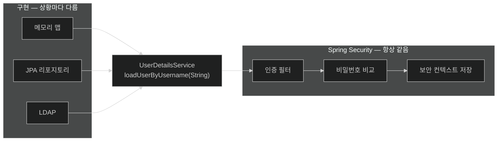
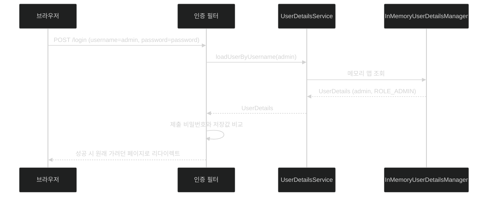

# 사용자의 출처를 내가 정한다 — UserDetailsService

## 한눈에 보기

| 질문 | 핵심 답 |
|---|---|
| 보안의 네 축 | 사용자 출처 → 접근 규칙 → 앱과 규칙의 연결 → 전 영역 적용 |
| 이 절이 다루는 축 | 첫 번째, **사용자 출처** |
| 사용자 출처를 표현하는 인터페이스 | `UserDetailsService` — 메서드 하나짜리 |
| 이번에 쓰는 구현 | `InMemoryUserDetailsManager` |
| 만드는 사용자 | `user`(ROLE_USER), `admin`(ROLE_ADMIN) |
| 이 빈이 생기면 | 랜덤 비밀번호 자동 설정이 물러선다 |
| `withDefaultPasswordEncoder()` | **deprecated.** 비밀번호를 평문으로 둔다. 운영 금지 |
| 결과 | 재시작해도 같은 계정으로 로그인되고, 로그인 폼은 Spring Security가 준다 |

## 1. 왜 이게 필요한가

### 출발 장면: 매번 콘솔을 뒤지는 일을 끝내려면

[[02-adding-spring-security-to-the-project]]에서 앱은 잠겼지만 재시작마다 비밀번호가 바뀐다. 이걸 끝내려면 **"사용자는 여기 있다"고 Spring Security에게 알려 주면 된다.**

문제는 "여기"가 상황마다 다르다는 것이다.

- 지금은 소스 코드 안(하드코딩)
- 조금 뒤에는 데이터베이스 테이블
- 회사에서는 LDAP이나 Active Directory
- 그 뒤에는 Google 같은 외부 제공자

Spring Security가 이 모두를 미리 지원할 수는 없다. 그래서 **"어디서 오든 상관없다. 나에게는 이 모양으로만 주면 된다"**는 계약을 하나 정의해 두었다. 그게 `UserDetailsService`다.

책이 이 절 앞머리에 적은 보안의 네 축을 보면 순서의 이유가 보인다.

| 축 | 하는 일 | 왜 이 순서인가 |
|---|---|---|
| 1. 사용자 출처 정의 | 누가 존재하는지 | 존재하지 않는 사용자에게 권한을 줄 수는 없다 |
| 2. 접근 규칙 생성 | 각 사용자가 뭘 할 수 있는지 | 사용자 목록이 있어야 역할을 붙일 수 있다 |
| 3. 앱의 각 부분과 규칙 연결 | 어느 경로에 어느 규칙을 | 규칙이 있어야 배치할 수 있다 |
| 4. 정책을 전 영역에 적용 | 웹·메서드·데이터 전부 | 한 군데라도 빠지면 우회로가 된다 |

이 절은 1번, [[05-securing-web-routes-and-http-verbs]]가 2·3번, [[06-securing-spring-data-methods]]가 4번이다.

## 2. 어떻게 동작하는가

### 2.1 코드가 하는 일

만드는 것은 설정 클래스 하나다.

```java
@Configuration
public class SecurityConfig {
    @Bean
    public UserDetailsService userDetailsService() {
        UserDetailsManager userDetailsManager =
            new InMemoryUserDetailsManager();
        userDetailsManager.createUser(
            User.withDefaultPasswordEncoder()
                 .username("user")
                 .password("password")
                 .roles("USER")
                 .build());
        userDetailsManager.createUser(
            User.withDefaultPasswordEncoder()
                 .username("admin")
                 .password("password")
                 .roles("ADMIN")
                 .build());
        return userDetailsManager;
    }
}
```

줄별로 무엇이 왜 있는지 보자.

| 요소 | 하는 일 | 없으면 |
|---|---|---|
| `@Configuration` | 이 클래스가 **애플리케이션 코드가 아니라 빈 정의의 출처**임을 표시한다. **[[컴포넌트-스캔]]**(= 패키지를 훑어 표시된 클래스를 빈으로 등록하는 동작)이 찾아낸다 | 클래스가 그냥 무시된다 |
| `@Bean` | 메서드의 반환값을 컨테이너에 등록한다 | Spring Security가 이 객체를 볼 수 없다 |
| 반환 타입 `UserDetailsService` | **계약**을 선언한다. 구현이 무엇이든 Spring Security는 이 타입으로만 본다 | 타입이 안 맞으면 자동 설정이 백오프하지 않는다 |
| `InMemoryUserDetailsManager` | **[[InMemoryUserDetailsManager]]**(= 사용자를 메모리 맵에 담아 두는 `UserDetailsService` 구현)가 실제 저장소 역할을 한다 | 사용자를 담을 곳이 없다 |
| `.roles("USER")` | **[[역할]]**(= 사용자를 묶어 부르는 이름표)을 붙인다. 내부적으로 `ROLE_USER`로 저장된다 | 인가 규칙이 걸 대상이 없다 |
| `withDefaultPasswordEncoder()` | 비밀번호를 **평문 그대로** 둔다 | (있어도 문제, 없어도 문제 — 아래 참고) |

### 2.2 왜 인터페이스 하나가 이렇게 강력한가

`UserDetailsService`를 열어 보면 메서드가 딱 하나다.

```java
UserDetails loadUserByUsername(String username) throws UsernameNotFoundException;
```

`String`을 받아 **[[UserDetails]]**(= Spring Security가 이해하는 사용자 정보의 표준 모양)를 돌려준다. 그게 전부다.

이 좁은 계약이 하는 일은 **"사용자가 어디 있는가"와 "인증이 어떻게 동작하는가"를 완전히 떼어 놓는 것**이다.



왼쪽을 통째로 바꿔도 오른쪽 코드는 한 줄도 바뀌지 않는다. [[04-spring-data-backed-users]]에서 실제로 왼쪽만 갈아 끼운다.

### 2.3 `@EnableWebSecurity`는 언제 켜지는가

책이 짚는 중요한 사실 하나. Spring Security가 classpath에 오면 Spring Boot의 자동 설정이 **[[EnableWebSecurity]]**(= 웹 보안 필터와 인프라 빈을 한꺼번에 켜는 애노테이션)를 활성화한다. 그래서 이 애노테이션을 직접 붙일 필요가 없다.

그리고 어떤 컴포넌트가 켜지는지는 **classpath를 보고 동적으로** 정해진다. Spring MVC면 서블릿용, Spring WebFlux면 리액티브용이 선택된다. 같은 `SecurityConfig` 코드가 두 세계에서 다르게 조립되는 이유다.

그렇게 켜지는 것들 중 **반드시 있어야 하는 빈이 `UserDetailsService`**다. 그래서 내가 안 만들면 Spring Boot가 임시로 하나 만들었던 것이고([[02-adding-spring-security-to-the-project]]), 내가 만들면 **[[자동-설정-백오프]]**(= 같은 역할의 빈이 있으면 자동 설정이 물러서는 동작)로 임시 사용자가 사라진다.

### 2.4 `withDefaultPasswordEncoder()`라는 지뢰

이 메서드는 **deprecated**다. 하는 일은 이름과 정반대에 가깝다 — "기본 인코더를 적용한다"고 읽히지만 실제 결과는 **비밀번호가 사실상 평문으로 저장되는 것**이다.

책도 Tip으로 못을 박는다.

> 지금까지의 코드에서 `withDefaultPasswordEncoder()`로 비밀번호를 평문 저장했다. 이것은 deprecated이며 시연 목적으로만 제공된다. **운영에서는 절대 쓰지 말 것.**

그러면 왜 쓰는가? 이 절의 목표가 "사용자 출처를 어떻게 갈아 끼우는가"이기 때문이다. 여기서 **[[비밀번호-인코더]]**(= 평문 비밀번호를 저장·비교 가능한 형태로 바꾸는 전략)까지 함께 도입하면 두 가지가 섞여 초점이 흐려진다. 그래서 책은 이 빚을 명시적으로 남겨 두고, 장의 마지막인 [[09b-securing-data-at-rest]]에서 `BCryptPasswordEncoder`로 갚는다.

**남겨 둔 빚을 남겨 둔 줄 알고 있는 것**과, 모르고 지나가는 것은 다르다. 이 Tip이 있는 이유가 그것이다.

### 2.5 실행하면 보이는 것

이제 앱을 띄우고 `localhost:8080`을 열면 `/login`으로 이동한다.

![[_assets/lsb4-p103-fig4-2-spring-security-default-login-form.png]]

이 화면을 만든 사람은 없다. `index.mustache`에도, 컨트롤러에도 `/login` 같은 건 없다. **[[폼-로그인]]**(= HTML 폼으로 자격 증명을 POST하는 인증 방식)을 켜면 Spring Security가 로그인 페이지를 직접 렌더링해 준다.

여기에 `user` / `password` 또는 `admin` / `password`를 넣으면 들어간다. 그리고 이번에는 **재시작해도 같은 값이 통한다.**

## 3. 그림으로 보기

로그인 요청 하나가 이 빈까지 도달하는 경로다.



| 선택 | 사용자 위치 | 재시작에 견디나 | 이 장에서 언제 |
|---|---|---|---|
| 자동 설정 임시 사용자 | 메모리(랜덤 생성) | 아니오 | [[02-adding-spring-security-to-the-project]] |
| `InMemoryUserDetailsManager` | 메모리(내가 지정) | 예(값은 고정, 데이터는 휘발) | **이 노트** |
| JPA 리포지토리 | 데이터베이스 | 예 | [[04-spring-data-backed-users]] |
| Google | 외부 제공자 | 예 | [[08-leveraging-google-to-authenticate-users]] |

## 4. 이 노트에 나온 용어

| 용어 | 한 줄 뜻 | 정의 위치 |
|---|---|---|
| UserDetailsService | 사용자 이름으로 사용자 정보를 돌려주는 인터페이스 | [[_glossary#UserDetailsService]] |
| UserDetails | Spring Security가 이해하는 사용자 정보의 표준 모양 | [[_glossary#UserDetails]] |
| InMemoryUserDetailsManager | 사용자를 메모리 맵에 담는 구현 | [[_glossary#InMemoryUserDetailsManager]] |
| 역할 | 사용자를 묶어 부르는 이름표 | [[_glossary#역할]] |
| 비밀번호 인코더 | 평문 비밀번호를 저장·비교 가능한 형태로 바꾸는 전략 | [[_glossary#비밀번호-인코더]] |
| @EnableWebSecurity | 웹 보안 인프라를 한꺼번에 켜는 애노테이션 | [[_glossary#EnableWebSecurity]] |
| 컴포넌트 스캔 | 표시된 클래스를 찾아 빈으로 등록하는 동작 | [[_glossary#컴포넌트-스캔]] |
| 자동 설정 백오프 | 같은 역할의 빈이 있으면 자동 설정이 물러섬 | [[_glossary#자동-설정-백오프]] |
| 폼 로그인 | HTML 폼으로 자격 증명을 POST하는 인증 방식 | [[_glossary#폼-로그인]] |

## 5. 자주 헷갈리는 것

**"`UserDetailsService`가 사용자다"** — 사용자를 **찾아 주는 서비스**다. 사용자 자체는 `UserDetails`다. 책도 [[04-spring-data-backed-users]]에서 이 혼동을 따로 경고할 만큼 자주 뒤섞인다.

**"`.roles("USER")`와 authority `USER`는 같다"** — 다르다. `.roles("USER")`는 authority **`ROLE_USER`**를 만든다. 이 비대칭은 [[05-securing-web-routes-and-http-verbs]]에서 다시 문제가 된다.

**"`withDefaultPasswordEncoder()`가 비밀번호를 인코딩해 준다"** — 이름과 달리 실질적으로 평문이다. deprecated 표시가 붙은 이유이며, 진짜 인코딩은 [[09b-securing-data-at-rest]]에서 한다.

**"`@EnableWebSecurity`를 직접 붙여야 한다"** — Spring Boot가 자동으로 활성화한다. 붙여도 해롭지는 않지만 필요 없다.

## 6. 언제 안 쓰나 / 경계

- **`InMemoryUserDetailsManager`는 운영용이 아니다.** 사용자가 프로세스 메모리에만 있어 재시작하면 사라지고, 인스턴스를 두 대로 늘리면 각자 다른 사용자 목록을 갖게 된다.
- **사용자 관리 기능이 없다.** 가입·비밀번호 변경·계정 잠금 같은 흐름을 이 방식으로 만들 수는 없다.
- **비유의 한계.** `UserDetailsService`는 "회사 안내 데스크"에 가깝다. 이름을 대면 그 사람의 사원증 정보를 찾아 준다. 다만 이 비유는 **안내 데스크가 비밀번호를 검사한다**는 오해를 부른다. 실제로 비밀번호 비교는 안내 데스크가 아니라 인증 필터가 한다. 안내 데스크는 "이 사람의 기록"을 꺼내 줄 뿐이고, 그 기록이 맞는지 판정하는 쪽은 따로 있다. 이 분리 덕분에 저장 위치를 바꿔도 비교 로직은 그대로 남는다.

## 7. 연결

- [[02-adding-spring-security-to-the-project]] — 이 노트는 거기서 생긴 "재시작마다 바뀌는 비밀번호" 문제를 직접 해결한다.
- [[04-spring-data-backed-users]] — 같은 `UserDetailsService` 계약을 유지한 채 구현만 메모리에서 데이터베이스로 바꾼다.
- [[09b-securing-data-at-rest]] — 여기서 미뤄 둔 비밀번호 인코딩 빚을 `BCryptPasswordEncoder`로 갚는다.

## 8. 스스로 확인

1. 보안의 네 축을 순서대로 말하고, 왜 그 순서여야 하는지 설명할 수 있는가?
2. `UserDetailsService`의 메서드가 하나뿐인 것이 왜 강점인가?
3. `UserDetailsService`와 `UserDetails`의 차이를 한 문장으로 구분할 수 있는가?
4. 이 빈을 만들면 랜덤 비밀번호가 사라지는 이유는?
5. `withDefaultPasswordEncoder()`를 책이 쓰면서 동시에 금지하는 이유는 무엇인가?
6. `.roles("ADMIN")`이 실제로 저장하는 문자열은 무엇인가?
7. 안내 데스크 비유가 깨지는 지점은 어디인가?

> 일곱 문항을 스스로 답한 **뒤에** [[_03-creating-users-with-userdetailsservice]]에서 모범답안과 대조한다. 먼저 열면 이 문항들은 다시 인출 문제로 쓸 수 없다.

<!-- ==== 아래는 내 영역 · 스킬 수정 금지 ==== -->

## 내 설명 시도


## 막혔던 지점


## 리뷰 이력
