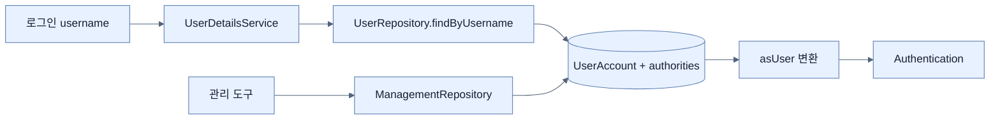

# Spring Data 기반 사용자 인증

## 한눈에 보기

`UserAccount` Entity에 username, password, authorities를 저장하고 Spring Data finder를 `UserDetailsService`에 연결한다. 책은 사용자 관리용 `JpaRepository`와 인증 조회만 노출하는 최소 `Repository`를 따로 둬 쓰기 권한과 읽기 계약을 분리한다.

## 1. 왜 이게 필요한가

하드코딩 사용자는 재배포 없이 추가·잠금·역할 변경을 할 수 없다. 외부 DB를 사용자 source of truth로 두면 별도 관리 도구와 보안 운영팀이 계정을 관리할 수 있고 애플리케이션은 인증 조회에 집중한다.

## 2. 어떻게 동작하는가

1. `UserAccount`를 JPA Entity로 만들고 authorities를 `@ElementCollection(fetch=EAGER)`로 별도 테이블에 저장한다.
2. `CommandLineRunner`는 데모 시작 데이터를 로딩한다.
3. 관리 repository는 save 등 전체 CRUD를, 인증 repository는 `findByUsername`만 제공한다.
4. `UserDetailsService` lambda가 조회한 Entity를 Spring Security `UserDetails`로 변환한다.
5. 인증 필터가 반환된 password와 authorities로 검증·principal을 구성한다.

데모의 시작 데이터 주입과 평문 암호는 운영 계정 프로비저닝 방식이 아니다. 존재하지 않는 사용자, 중복 username, 계정 잠금, 암호 정책과 migration도 실제 설계에 필요하다.

## 3. 그림으로 보기

## 4. 이 노트에 나온 용어

- **GrantedAuthority**: 인증 주체에 부여된 세부 permission 표현.
- **ElementCollection**: 값 타입 컬렉션을 Entity와 연관된 별도 테이블에 저장하는 JPA 매핑.
- **CommandLineRunner**: application context 준비 후 실행되는 Boot 시작 callback.

## 7. 연결

- [[02-adding-spring-security-and-custom-users]] — 교체 대상인 메모리 사용자 소스다.
- [[04-securing-web-routes-and-http-verbs]] — DB에서 읽은 authorities를 URL 규칙이 소비한다.
- [[10-securing-data-at-rest]] — 저장 password는 일방향 해시여야 한다.

## 8. 스스로 확인

- 전체 1차 정리 후: 관리 repository와 인증 repository를 분리하는 권한 최소화 효과를 설명한다.

<!-- ==== 아래는 내 영역 · 스킬 수정 금지 ==== -->

## 내 설명 시도

## 막혔던 지점

## 리뷰 이력

