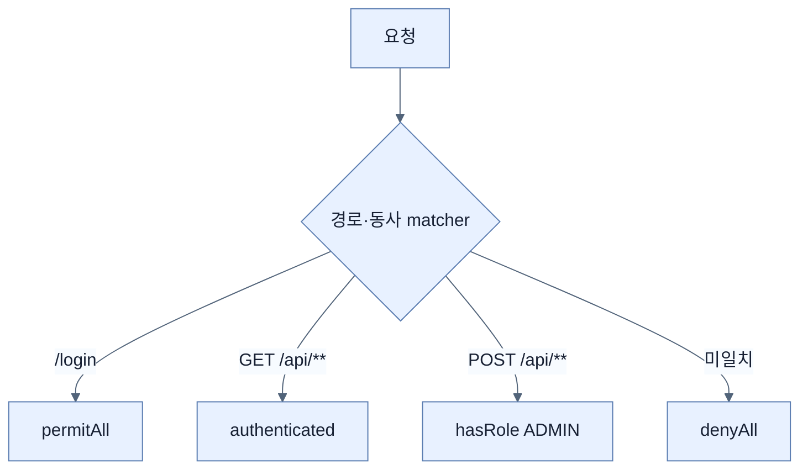

# 웹 경로와 HTTP 동사 보호

## 한눈에 보기

사용자 `SecurityFilterChain`에서 `authorizeHttpRequests` 규칙을 위에서 아래로 선언한다. 경로뿐 아니라 HTTP 동사를 결합해 읽기와 변경 권한을 분리하고 마지막은 `anyRequest().denyAll()`로 닫는다.

## 1. 왜 이게 필요한가

“로그인했으면 전부 허용”은 인증만 있고 인가가 없는 상태다. 일반 사용자는 목록을 읽되 관리자만 생성하도록, 같은 `/api/**`라도 GET과 POST 권한을 달리해야 최소 권한 원칙을 지킬 수 있다.

## 2. 어떻게 동작하는가

`permitAll`은 로그인 페이지·정적 자원, `authenticated`는 로그인한 모든 사용자, `hasRole("ADMIN")`은 내부적으로 `ROLE_ADMIN` authority를 요구한다. 여러 조건은 `AuthorizationManagers.allOf`처럼 조합할 수 있다. form login은 브라우저 HTML 흐름에, HTTP Basic은 curl 같은 programmatic client에 유용하다.

규칙 순서가 중요하다. 더 구체적인 경로·동사를 먼저 두고 포괄 규칙을 뒤에 둔다. 마지막 deny-all은 새 endpoint를 실수로 공개하지 않게 하는 안전망이다. 역할은 authority에 `ROLE_` 관례를 얹은 편의 모델이지 별개의 인증 정보가 아니다.

## 3. 그림으로 보기

## 4. 이 노트에 나온 용어

- **request matcher**: HTTP 요청의 경로·동사·속성을 판별하는 조건.
- **authority**: 주체에게 부여된 구체적인 접근 permission 문자열.
- **role**: `ROLE_` 접두사 관례를 쓰는 authority의 범주.
- **deny by default**: 명시적으로 허용되지 않은 접근을 모두 거부하는 정책.

## 7. 연결

- [[01-spring-security-foundations]] — 이 규칙이 실행되는 필터 기반 경계다.
- [[05-protecting-against-csrf]] — 인가된 상태 변경 요청도 출처 위조를 검사해야 한다.
- [[06-securing-data-methods-and-object-ownership]] — URL보다 세밀한 객체 ownership 규칙이다.

## 8. 스스로 확인

- 전체 1차 정리 후: GET `/api/**`와 POST `/api/**`를 다른 규칙으로 두는 이유를 설명한다.

<!-- ==== 아래는 내 영역 · 스킬 수정 금지 ==== -->

## 내 설명 시도

## 막혔던 지점

## 리뷰 이력

