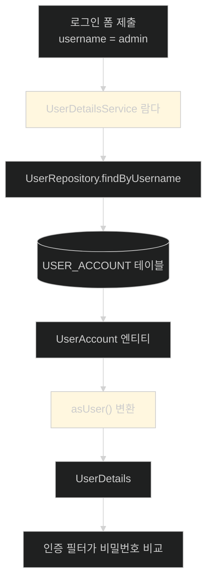
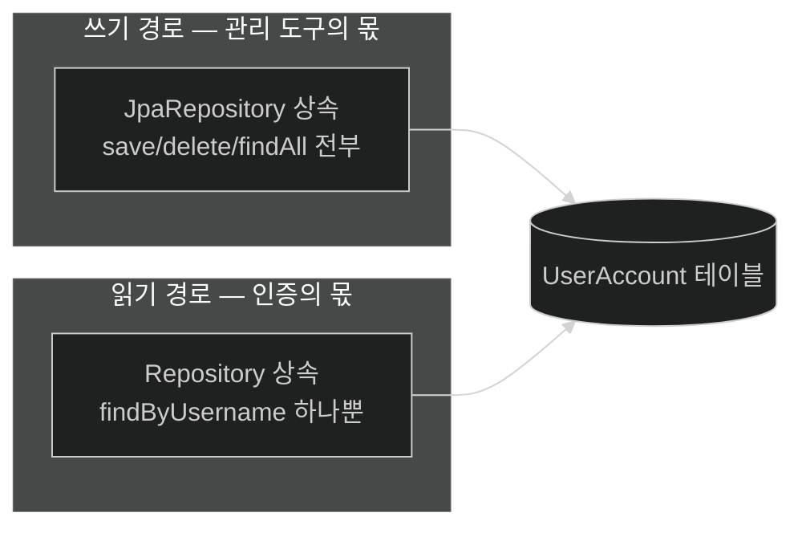

# 사용자를 데이터베이스로 옮기기 — 계약은 그대로, 구현만 교체

## 한눈에 보기

| 질문 | 핵심 답 |
|---|---|
| 왜 옮기나 | 사용자 관리와 사용자 인증을 **다른 팀·다른 도구가 담당**할 수 있게 하려고 |
| 새로 만드는 것 | `UserAccount` 엔티티, 리포지토리 **2개**, 새 `UserDetailsService` 빈, `asUser()` 변환 메서드 |
| 리포지토리가 2개인 이유 | 쓰기용(`JpaRepository`)과 읽기 전용(`Repository` + 파생 질의)의 **권한 범위가 다르다** |
| Spring Security가 바뀌나 | **아니다.** `UserDetailsService` 계약이 그대로라 인증 쪽 코드는 손대지 않는다 |
| `UserDetails`와 `UserAccount`의 관계 | `asUser()`가 엔티티를 Spring Security의 표준 모양으로 변환한다 |
| 남는 문제 | 비밀번호가 여전히 평문이고, 없는 사용자 조회 시 동작이 위태롭다 |
| 원문 오류 | 메서드 이름을 `loadUserByName`·`loadUserName()`이라 적는다. 실제는 `loadUserByUsername` |

## 1. 왜 이게 필요한가

### 출발 장면: 사용자를 한 명 추가하려면 재배포를 해야 한다

[[03-creating-users-with-userdetailsservice]]의 코드는 잘 동작한다. 그런데 운영에서 사용자를 한 명 더 만들려면 이렇게 해야 한다.

1. `SecurityConfig.java`를 연다
2. `createUser(...)` 블록을 하나 복사해 붙인다
3. 커밋한다
4. 빌드하고 배포한다
5. 앱을 재시작한다

**사용자 계정 하나 만드는 데 배포 파이프라인 전체가 돈다.** 그리고 그 일을 할 수 있는 사람은 자바 코드를 고칠 수 있는 사람뿐이다.

### 분리가 왜 보안을 높이는가

책이 드는 이유는 "편해서"가 아니다. **결합을 끊으면 보안 자체가 좋아진다**는 논지다.

| 결합된 구조 | 분리된 구조 |
|---|---|
| 계정을 만들려면 애플리케이션 소스를 고쳐야 한다 | 보안 엔지니어링 팀이 자기 도구로 DB를 관리한다 |
| 계정 관리 권한 = 코드 배포 권한 | 두 권한이 **서로 다른 사람**에게 나뉜다 |
| 계정 변경 이력이 git 커밋에만 남는다 | 사용자 관리 도구의 감사 로그에 남는다 |
| 비밀번호 정책·만료를 앱이 구현해야 한다 | 전용 도구가 담당한다 |

핵심은 **"사용자를 만드는 쪽"과 "사용자로 로그인시키는 쪽"이 같은 코드일 필요가 없다**는 것이다. 우리 앱은 인증만 하면 되고, 계정 관리는 남에게 넘긴다.

## 2. 어떻게 동작하는가

### 2.1 사용자 엔티티

Spring Data JPA와 H2는 [[../chapter-3-querying-for-data-with-spring-boot/01b-adding-spring-data-jpa-to-our-project|Chapter 3 · Spring Data JPA 추가]]에서 이미 classpath에 있으므로 엔티티부터 만든다.

```java
@Entity
public class UserAccount {
    @Id
    @GeneratedValue
    private Long id;
    private String username;
    private String password;
    @ElementCollection(fetch = FetchType.EAGER)
    private List<GrantedAuthority> authorities =
          new ArrayList<>();
}
```

`@Entity`·`@Id`·`@GeneratedValue`는 Chapter 3과 같은 뜻이다. 새로운 것은 마지막 필드다.

**[[ElementCollection]]**(= 엔티티가 소유한 값들의 모음을 별도 테이블에 저장하도록 지시하는 JPA 애노테이션)이 필요한 이유는 구조에 있다. 사용자 한 명이 권한을 여러 개 가질 수 있으므로 컬럼 하나에 담을 수 없다. 그렇다고 권한이 독립된 엔티티인 것도 아니다 — 사용자가 지워지면 그 권한도 의미가 없다. 이 "종속된 값들의 모음"이 정확히 `@ElementCollection`이 표현하는 관계이고, JPA는 이를 별도 테이블로 풀어낸다.

`fetch = FetchType.EAGER`가 붙은 이유도 명확하다. 인증 직후 권한 목록을 **반드시** 읽어야 하는데, 지연 로딩이면 영속성 컨텍스트가 이미 닫힌 뒤에 접근하게 되어 실패한다.

> **원문 경계.** 이 코드는 그대로는 부팅되지 않는다. `GrantedAuthority`는 **인터페이스**이고, `@ElementCollection`의 대상은 기본 타입이거나 `@Embeddable`이어야 한다. 실제로 돌리려면 `List<String>`으로 두고 읽을 때 `SimpleGrantedAuthority`로 감싸거나, `@Embeddable` 래퍼를 만들어야 한다. 책은 또 `new UserAccount("user", "password", "ROLE_USER")`라는 3인자 생성자를 계속 쓰면서 그 생성자를 끝까지 보여 주지 않는다.

### 2.2 리포지토리가 왜 두 개인가

이 절에서 가장 배울 게 많은 대목이다. 같은 `UserAccount` 테이블에 리포지토리를 **두 개** 만든다.

```java
public interface UserManagementRepository extends
     JpaRepository<UserAccount, Long> {
}
```

```java
public interface UserRepository extends
      Repository<UserAccount, Long> {
           UserAccount findByUsername(String username);
}
```

차이는 상속하는 부모다.

| | `UserManagementRepository` | `UserRepository` |
|---|---|---|
| 부모 | `JpaRepository` | **[[Repository-마커-인터페이스]]**(= 메서드가 하나도 없는 Spring Data의 최상위 마커) |
| 상속되는 메서드 | `save`, `delete`, `findAll`, `count` … 수십 개 | **없다** |
| 노출되는 것 | 전부 | `findByUsername` 하나뿐 |
| 용도 | 사용자 생성·수정 | 인증 시 조회 |

책이 `UserRepository`를 굳이 빈약하게 만든 이유는 **"인증 경로에서는 사용자를 지울 수도, 만들 수도 없어야 한다"**는 것이다. `JpaRepository`를 상속했다면 인증 코드가 실수로 `deleteAll()`을 부를 수 있는 상태가 된다. 부모를 바꾸는 것만으로 그 가능성이 타입 수준에서 사라진다.

`findByUsername`은 **[[파생-질의]]**(= 메서드 이름을 규칙에 따라 해석해 질의를 자동 생성하는 기능)다. JPQL도 SQL도 쓰지 않았는데 "username이 인자와 같은 행 하나"를 찾아 준다.

### 2.3 초기 데이터 적재

운영이라면 별도 도구가 계정을 만들겠지만, 지금은 앱이 뜰 때 직접 넣는다.

```java
@Bean
CommandLineRunner initUsers(UserManagementRepository
     repository) {
     return args -> {
             repository.save(new UserAccount("user", "password",
                 "ROLE_USER"));
             repository.save(new UserAccount("admin", "password",
                 "ROLE_ADMIN"));
    };
}
```

**[[CommandLineRunner]]**(= 컨텍스트가 다 뜬 직후 한 번 실행되는 콜백)를 람다로 쓸 수 있는 이유를 책은 Tip으로 설명한다. 이 인터페이스가 **[[SAM]]**(= 추상 메서드가 딱 하나뿐인 인터페이스)이기 때문이다. 자바 8부터 컴파일러가 람다를 그 유일한 메서드의 구현으로 변환해 주므로, 익명 클래스 다섯 줄이 화살표 하나로 줄어든다.

여기서 저장하는 authority가 `ROLE_USER`·`ROLE_ADMIN`이라는 점을 눈여겨보자. [[03-creating-users-with-userdetailsservice]]에서 `.roles("USER")`라고 썼던 것이 **DB에 직접 적을 때는 접두사를 포함한 전체 문자열**이 된다. `.roles()` 빌더가 대신 붙여 주던 `ROLE_`을 이제는 내가 붙여야 한다.

### 2.4 계약은 그대로, 구현만 갈아 끼우기

이제 핵심이다.

```java
@Bean
UserDetailsService userService(UserRepository repo) {
    return username -> repo.findByUsername(username)
        .asUser();
}
```

책은 여기서 "너무 빨리 지나갔을 수 있으니 천천히 다시 보자"며 멈춘다. 그럴 만하다. 이 세 줄에 개념이 세 개 겹쳐 있다.

1. **`UserDetailsService`도 SAM이다.** 그래서 람다 하나가 곧 구현체가 된다.
2. **그 유일한 메서드는 `loadUserByUsername(String)`**이다. 입력이 `username`, 출력이 `UserDetails`. 람다의 `username ->`가 바로 그 입력이고, 로그인 폼에 사용자가 입력한 값이 여기로 들어온다.
3. **반환하는 것은 `UserDetailsService`이지 `UserDetails`가 아니다.** 이 빈은 "사용자 정보"가 아니라 "사용자 정보를 가져오는 서비스"다.

> **원문 오류.** 책은 이 인터페이스의 메서드를 **`loadUserByName`**이라 쓰고, 두 문단 뒤에는 **`UserDetailsService.loadUserName()`**이라고 또 다르게 쓴다. 실제 이름은 `loadUserByUsername(String)` 하나다(Spring Security 7.1.0 jar에서 확인).

그런데 리포지토리가 돌려주는 것은 `UserAccount`(우리 엔티티)이고 Spring Security가 원하는 것은 **[[UserDetails]]**(= Spring Security가 이해하는 사용자 정보의 표준 모양)다. 그래서 변환이 필요하다.

```java
public UserDetails asUser() {
    return User.withDefaultPasswordEncoder()
        .username(getUsername())
        .password(getPassword())
        .authorities(getAuthorities())
        .build();
}
```

`asUser()`는 엔티티의 값을 Spring Security의 빌더에 그대로 옮겨 담는다. 이 메서드 하나가 **두 세계의 경계선**이다. 왼쪽은 우리 도메인(JPA 엔티티), 오른쪽은 Spring Security의 어휘(`UserDetails`, **[[authority]]**(= 무언가에 접근할 수 있다는 권한 하나를 나타내는 문자열)).

경계선을 이렇게 명시적으로 두면, 도메인 모델에 필드를 더해도 Spring Security 쪽에 영향이 없다. [[06a-updating-our-model]]에서 실제로 그런 변경이 일어난다.

### 2.5 무엇이 바뀌었고 무엇이 안 바뀌었나



노란 두 칸만 이번에 새로 썼다. 그 앞뒤인 로그인 폼과 인증 필터는 [[03-creating-users-with-userdetailsservice]]와 완전히 동일한 코드다. **계약을 좁게 잡아 둔 덕분에 교체가 국소적으로 끝났다.**

## 3. 그림으로 보기

| 관심사 | 담당 타입 | 이 절에서 새로 만들었나 |
|---|---|---|
| 사용자 저장 구조 | `UserAccount` (엔티티) | 새로 |
| 사용자 **쓰기** | `UserManagementRepository` | 새로 |
| 사용자 **읽기** | `UserRepository` | 새로 |
| 도메인 → 보안 어휘 변환 | `UserAccount.asUser()` | 새로 |
| 사용자 조회 계약 | `UserDetailsService` | 계약 동일, 구현만 교체 |
| 비밀번호 비교·세션 저장 | Spring Security 내부 | 그대로 |



## 4. 이 노트에 나온 용어

| 용어 | 한 줄 뜻 | 정의 위치 |
|---|---|---|
| UserDetailsService | 사용자 이름으로 사용자 정보를 돌려주는 인터페이스 | [[_glossary#UserDetailsService]] |
| UserDetails | Spring Security가 이해하는 사용자 정보의 표준 모양 | [[_glossary#UserDetails]] |
| @ElementCollection | 종속된 값들의 모음을 별도 테이블에 저장 | [[_glossary#ElementCollection]] |
| CommandLineRunner | 컨텍스트 기동 직후 한 번 실행되는 콜백 | [[_glossary#CommandLineRunner]] |
| SAM | 추상 메서드가 하나뿐이라 람다로 구현 가능한 인터페이스 | [[_glossary#SAM]] |
| Repository 마커 인터페이스 | 메서드가 없는 Spring Data 최상위 인터페이스 | [[_glossary#Repository-마커-인터페이스]] |
| 파생 질의 | 메서드 이름으로 질의를 자동 생성 | [[_glossary#파생-질의]] |
| authority | 접근 권한 하나를 나타내는 문자열 | [[_glossary#authority]] |
| 비밀번호 인코더 | 평문을 저장·비교 가능한 형태로 바꾸는 전략 | [[_glossary#비밀번호-인코더]] |

## 5. 자주 헷갈리는 것

**"리포지토리가 두 개면 데이터가 두 벌이다"** — 테이블은 하나다. 달라지는 것은 **각 코드 경로가 그 테이블에 할 수 있는 일의 범위**뿐이다.

**"`UserDetailsService` 빈이 `UserDetails`를 반환한다"** — 반환하는 것은 **서비스**다. 책이 한 문단을 통째로 써서 이 혼동을 경고한다. 람다 `username -> ...`가 서비스의 몸통이고, 그 람다를 **호출한 결과**가 `UserDetails`다.

**"`.roles("USER")`와 `"ROLE_USER"`를 섞어 써도 된다"** — 안 된다. 빌더의 `.roles()`는 접두사를 붙여 주고, `.authorities()`나 DB 직접 저장은 붙여 주지 않는다. `ROLE_`을 빠뜨리면 `hasRole("USER")` 검사가 조용히 실패한다.

## 6. 언제 안 쓰나 / 경계

- **없는 사용자를 조회하면 위험하다.** `repo.findByUsername(username).asUser()`는 조회 결과가 `null`이면 그대로 `NullPointerException`을 낸다. 규격대로라면 `UsernameNotFoundException`을 던져야 한다. 존재하지 않는 아이디로 로그인을 시도하는 것은 **정상적인 상황**이므로, 실제 코드에서는 반드시 처리해야 한다.
- **비밀번호가 아직 평문이다.** 책도 Note로 인정한다 — 인코딩, 역할 갱신, 해시 테이블 공격 대비는 "실제로 비밀번호를 저장하는 사용자 관리 도구"의 몫이라고. 그 빚은 [[09b-securing-data-at-rest]]에서 갚는다.
- **비유의 한계.** 이 구조는 "출입 관리 시스템과 인사 시스템을 분리하는 것"에 가깝다. 인사팀이 사원 정보를 관리하고, 출입 게이트는 사원증을 읽어 대조만 한다. 다만 이 비유는 **두 시스템이 같은 데이터베이스를 본다**는 사실을 흐린다. 실제로는 저장소가 하나이고 나뉜 것은 접근 권한이다. 그래서 "완전히 별개의 시스템"이라고 생각하면 트랜잭션이나 스키마 변경 시 서로 영향을 준다는 점을 놓치게 된다.

## 7. 연결

- [[03-creating-users-with-userdetailsservice]] — 같은 `UserDetailsService` 계약을 메모리 구현으로 먼저 만들어 둔 노트. 이 노트는 그 구현만 교체한다.
- [[06a-updating-our-model]] — 여기서 만든 사용자 집합을 alice·bob·admin으로 확장해 소유권 실험의 재료로 쓴다.
- [[09b-securing-data-at-rest]] — 이 노트가 남긴 평문 비밀번호 문제를 `BCryptPasswordEncoder`로 해결한다.

## 8. 스스로 확인

1. 사용자 관리와 인증을 분리하면 보안이 좋아지는 이유를 권한 관점에서 설명할 수 있는가?
2. 리포지토리를 두 개로 나눈 결정이 막아 주는 구체적인 사고는 무엇인가?
3. `UserDetailsService`가 SAM이라는 사실이 코드 모양을 어떻게 바꾸는가?
4. `asUser()`가 없으면 정확히 무엇이 깨지는가?
5. `@ElementCollection`에 `FetchType.EAGER`를 준 이유는?
6. 없는 아이디로 로그인하면 이 코드는 어떻게 되는가? 규격대로라면 무엇을 던져야 하는가?
7. 출입 관리/인사 시스템 비유가 깨지는 지점은 어디인가?

> 일곱 문항을 스스로 답한 **뒤에** [[_04-spring-data-backed-users]]에서 모범답안과 대조한다. 먼저 열면 이 문항들은 다시 인출 문제로 쓸 수 없다.

<!-- ==== 아래는 내 영역 · 스킬 수정 금지 ==== -->

## 내 설명 시도


## 막혔던 지점


## 리뷰 이력
