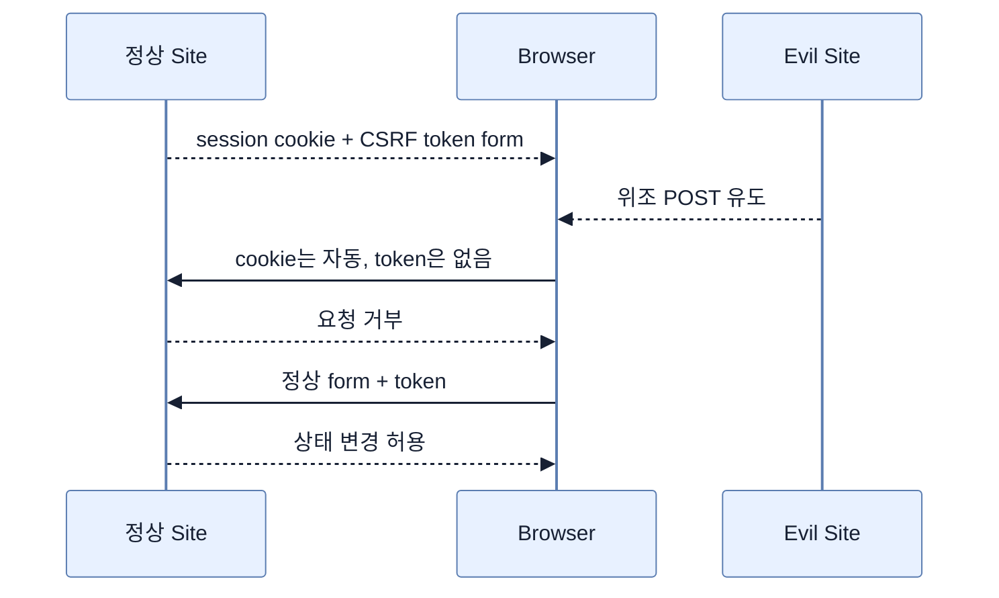

# CSRF 보호를 적용할지 판단하기

## 한눈에 보기

CSRF는 로그인 세션을 가진 브라우저가 공격자 페이지의 상태 변경 요청을 대신 보내도록 속이는 공격이다. Spring Security는 기본적으로 예측 불가능한 token을 요구한다. Mustache 폼은 요청 attribute를 노출하고 hidden input으로 token 이름과 값을 직접 넣어야 한다.

## 1. 왜 이게 필요한가

브라우저는 대상 사이트의 cookie를 자동 첨부한다. 서버가 cookie만 보고 요청자를 신뢰하면 사용자가 공격 페이지에서 누른 버튼이 정상 사이트의 POST로 실행될 수 있다. 요청마다 서버가 발행한 추가 증표를 확인해 공격 사이트가 올바른 요청을 만들지 못하게 한다.

## 2. 어떻게 동작하는가

서버 렌더링 폼은 `_csrf.parameterName`과 `_csrf.token`을 hidden input으로 전송한다. Spring Security 필터가 세션/저장된 token과 비교해 없거나 다르면 거부한다. Thymeleaf는 통합으로 자동 삽입할 수 있지만 책의 Mustache는 모든 상태 변경 폼에 수동으로 넣는다.

CSRF를 끌지 여부는 “JSON인가”가 아니라 **브라우저가 자동으로 보내는 인증 정보에 의존하는가**로 판단한다. bearer token을 명시적으로 넣는 truly stateless API라면 일반적으로 필요 없지만, form login/session과 API를 한 체인에 섞어 통째로 비활성화하면 위험하다. 책은 웹과 stateless API를 분리하는 아키텍처를 권한다.

## 3. 그림으로 보기

## 4. 이 노트에 나온 용어

- **CSRF**: 사용자의 자동 인증 정보를 악용해 다른 출처에서 상태 변경을 보내게 하는 공격.
- **nonce/token**: 공격자가 예측·획득하기 어려운 요청 정당성 증표.
- **stateless API**: 서버 세션에 사용자 대화 상태를 두지 않고 요청마다 자격 정보를 명시하는 API.

## 7. 연결

- [[04-securing-web-routes-and-http-verbs]] — URL 인가를 통과한 POST에도 CSRF 검사가 추가된다.
- [[06-securing-data-methods-and-object-ownership]] — CSRF는 요청 출처, method security는 대상 객체 권한을 각각 검증한다.

## 8. 스스로 확인

- 전체 1차 정리 후: “REST API니까 CSRF를 꺼도 된다”가 불충분한 판단 기준인 이유를 설명한다.

<!-- ==== 아래는 내 영역 · 스킬 수정 금지 ==== -->

## 내 설명 시도

## 막혔던 지점

## 리뷰 이력

