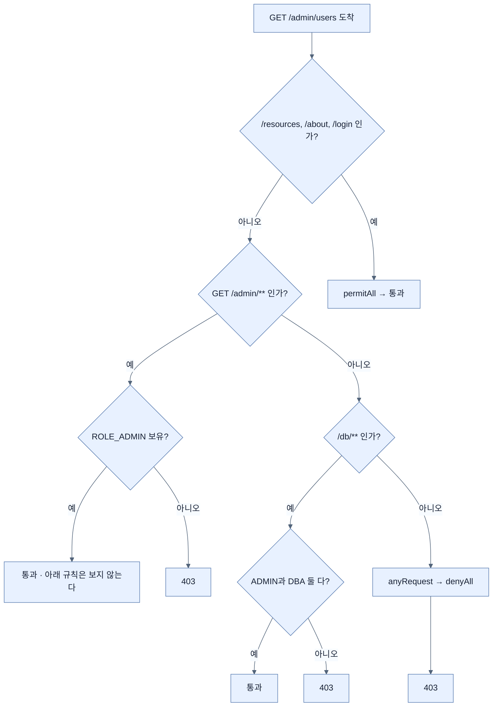
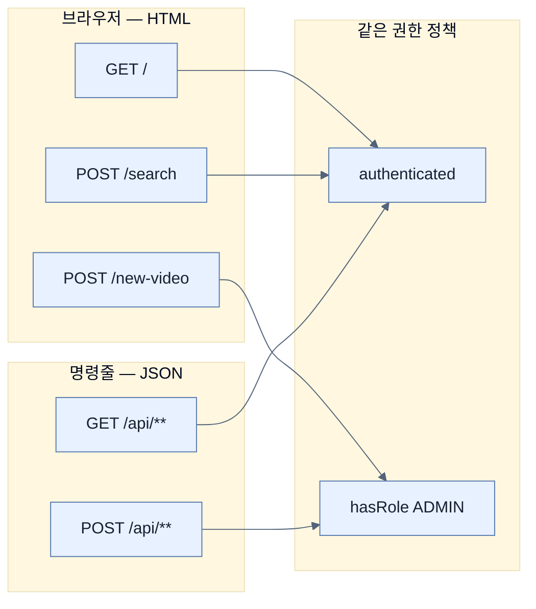

# 누가 무엇을 해도 되는가 — 경로와 HTTP 메서드로 거는 인가

## 한눈에 보기

| 질문 | 핵심 답 |
|---|---|
| Boot 기본 정책의 내용 | `anyRequest().authenticated()` + 폼 로그인 + HTTP Basic. **그게 전부** |
| 기본 정책의 한계 | 로그인만 하면 **아무 엔드포인트나 갈 수 있다** |
| 규칙을 쓰는 자리 | `SecurityFilterChain` 빈 안의 `authorizeHttpRequests` |
| 규칙 평가 순서 | **위에서부터, 처음 일치한 것에서 종료** |
| 경로만이 아니라 | `HttpMethod.GET` 같은 **HTTP 메서드도 조건에 넣을 수 있다** |
| 내장에 없는 조건 | `AuthorizationManagers.allOf`로 조합해 만든다 |
| 마지막에 놓는 규칙 | `anyRequest().denyAll()` — 어디에도 안 걸리면 거절 |
| `hasRole("ADMIN")`이 찾는 값 | authority **`ROLE_ADMIN`** |
| 원문 오류 | 코드에는 규칙이 6줄인데 설명은 5개뿐이고 `/admin` 규칙을 건너뛴다 |

## 1. 왜 이게 필요한가

### 출발 장면: 로그인한 일반 사용자가 관리자 페이지에 들어간다

지금까지의 앱은 잠겨 있다. 로그인해야 들어갈 수 있다. 그래서 안전해 보인다.

그런데 `user`로 로그인한 뒤 주소창에 `/admin`을 직접 쳐 보면 — **들어가진다.**

기본 정책이 정확히 이것만 말하고 있기 때문이다.

```java
@Bean
SecurityFilterChain defaultSecurityFilterChain(HttpSecurity http)
    throws Exception {
    http
           .authorizeHttpRequests(auth -> auth
               .anyRequest().authenticated()
           )
           .formLogin(Customizer.withDefaults())
           .httpBasic(Customizer.withDefaults());

    return http.build();
}
```

`anyRequest().authenticated()` — "아무 요청이나, 인증만 되어 있으면 OK". **역할은 한 번도 언급되지 않는다.**

> 이 코드는 책이 "Boot가 적용하는 기본 정책의 단순화 버전"으로 제시한 것이다. Spring Boot 4.1.0의 `ServletWebSecurityAutoConfiguration$SecurityFilterChainConfiguration#defaultSecurityFilterChain`을 실제로 열어 보면 메서드 이름까지 같고 내용도 `authorizeHttpRequests(anyRequest().authenticated())` → `formLogin` → `httpBasic` → `build()`로 동일하다. 책의 단순화가 정확했다.

책의 표현을 그대로 옮기면 이렇다. **"인증만으로는 부족하다(authentication alone is not enough)."** 문을 잠그는 것과 방마다 출입 등급을 나누는 것은 다른 일이다.

## 2. 어떻게 동작하는가

### 2.1 기본 정책을 대체한다는 것의 의미

내가 `SecurityFilterChain` 빈을 정의하면 **[[자동-설정-백오프]]**(= 같은 역할의 빈이 있으면 자동 설정이 물러서는 동작)로 기본 정책이 통째로 사라진다. 그래서 위 코드의 구성 요소를 하나씩 알아 둘 필요가 있다. 내가 빠뜨리면 그 기능도 함께 사라지기 때문이다.

| 요소 | 하는 일 | 내가 빠뜨리면 |
|---|---|---|
| `@Bean` | 이 메서드의 반환값을 컨테이너에 등록 | 정책이 적용되지 않는다 |
| 반환 타입 `SecurityFilterChain` | 보안 정책임을 타입으로 선언 | 백오프가 일어나지 않아 기본 정책이 남는다 |
| 인자 **[[HttpSecurity]]**(= 정책을 조립하는 빌더) | 규칙을 쌓을 손잡이 | 규칙을 쓸 방법이 없다 |
| **[[authorizeHttpRequests]]**(= 경로별 접근 규칙을 선언하는 진입점) | 인가 규칙 선언 | 인가가 없다 |
| **[[폼-로그인]]** `formLogin` | HTML 로그인 폼 제공 | **로그인 화면이 사라진다** |
| **[[HTTP-Basic]]** `httpBasic` | 헤더 기반 인증 허용 | `curl`로 접근할 수 없다 |
| `Customizer.withDefaults()` | 해당 기능의 기본 설정을 그대로 쓴다 | — |
| `http.build()` | 쌓은 규칙으로 실제 체인 생성 | 컴파일은 되지만 반환값이 없다 |

`Customizer.withDefaults()`는 **[[람다-DSL]]**(= 설정 블록을 람다로 받아 구성하는 현대적 문법)에서 "이 기능은 켜되 세부 설정은 건드리지 않겠다"는 뜻이다. 예전의 `.formLogin().and().httpBasic()` 같은 연쇄 방식을 대체한다.

### 2.2 폼 인증과 Basic 인증을 둘 다 켜는 이유

같은 앱에 인증 방식이 두 개나 켜져 있는 게 낭비처럼 보이지만, 둘은 **대상 사용자가 다르다.**

| | 폼 인증 | Basic 인증 |
|---|---|---|
| 화면 | HTML 폼. 앱 테마에 맞춰 꾸밀 수 있다 | 브라우저 내장 팝업. 꾸밀 수 없다 |
| 로그아웃 | 지원한다 | **없다.** 브라우저를 닫거나 재시작해야 자격 증명이 버려진다 |
| 명령줄 도구 | 쓰기 어렵다 | `curl -u user:password`로 간단하다 |
| 주 사용자 | 사람(브라우저) | 스크립트·CI·API 호출 |

즉 **브라우저 사용자는 폼으로, 프로그램은 Basic으로** 들어오게 하는 조합이다. 이 앱이 웹 페이지와 `/api` JSON을 함께 서빙하기 때문에 둘 다 필요하다.

### 2.3 진짜 인가 규칙 쓰기

책이 보여 주는 상세 정책 예제다.

```java
@Bean
SecurityFilterChain configureSecurity(HttpSecurity http)
     throws Exception {
     http
            .authorizeHttpRequests(auth -> auth
                .requestMatchers("/resources/**", "/about",
                    "/login").permitAll()
                .requestMatchers(HttpMethod.GET,
                    "/admin/**").hasRole("ADMIN")
                .requestMatchers("/db/**").access(
                    AuthorizationManagers.allOf(
                                   hasRole("ADMIN"),
                                   hasRole("DBA")
                    )
                )
            .anyRequest().denyAll()
            )
            .formLogin(Customizer.withDefaults())
            .httpBasic(Customizer.withDefaults());
     return http.build();
}
```

규칙 하나하나가 무엇을 하고 왜 그 자리인지 보자.

| # | 규칙 | 뜻 | 이 규칙이 필요한 이유 |
|---:|---|---|---|
| 1 | `"/resources/**", "/about", "/login"` → `permitAll()` | 인증 여부와 무관하게 통과 | **로그인 페이지가 인증을 요구하면 아무도 로그인할 수 없다.** 정적 자원도 마찬가지 |
| 2 | `GET /admin/**` → `hasRole("ADMIN")` | 관리자만 | 경로와 **[[requestMatcher]]**(= 이 요청이 이 규칙에 해당하는지 판정하는 조건)의 HTTP 메서드를 결합한 예. `DELETE`만 잠그는 식으로도 쓴다 |
| 3 | `/db/**` → `allOf(hasRole("ADMIN"), hasRole("DBA"))` | 두 역할을 **모두** 가진 사람만 | 내장에 없는 조건을 조합으로 만든다 |
| 4 | `anyRequest().denyAll()` | 나머지 전부 거절 | **명시적으로 허용한 것만 통과**시키는 안전한 기본값 |

4번이 특히 중요하다. `denyAll()`을 마지막에 두면, 새 엔드포인트를 추가하고 규칙 추가를 잊었을 때 **뚫리는 게 아니라 막힌다.** 실패의 방향을 안전한 쪽으로 정하는 패턴이다.

### 2.4 규칙은 순서대로 평가된다

`authorizeHttpRequests` 안의 규칙은 **선언 순서대로** 검사되고 **처음 일치한 규칙에서 판정이 끝난다.**



이 성질 때문에 **넓은 규칙을 위에 두면 아래 규칙이 죽는다.** `anyRequest().denyAll()`을 첫 줄에 쓰면 그 아래는 전부 무의미해진다.

### 2.5 왜 커스텀 검사를 열어 두는가

3번 규칙이 존재하는 이유를 책이 직접 설명한다. Spring Security에는 `hasAnyRole`(**하나라도** 가졌으면 통과)은 있지만, **여러 역할을 모두** 가졌는지 보는 내장 함수는 없다. 실제로 Spring Security 7.1.0의 `AuthorityAuthorizationManager`를 열어 보면 `hasRole`·`hasAuthority`·`hasAnyRole`·`hasAnyAuthority`뿐이고 `hasAllRoles`는 없다.

프레임워크가 모든 조합을 미리 만들어 두는 것은 불가능하다. 그래서 **[[AuthorizationManager]]**(= 인가 판정 하나를 담당하는 함수형 타입)를 조합할 수 있게 열어 두었다. `AuthorizationManagers`에는 `allOf`·`anyOf`·`not`이 있고, 이것들로 대부분의 조합을 만들 수 있다.

책은 여기에 경고를 덧붙인다. 이렇게 직접 쓴 규칙일수록 **성공 경로와 실패 경로를 둘 다 테스트해야 한다.** 규칙이 복잡할수록 "통과해야 할 사람이 막히는" 실수와 "막혀야 할 사람이 통과하는" 실수가 동시에 가능하다. 그 테스트는 [[../chapter-5-testing-with-spring-boot/08-testing-security-policies|Chapter 5 · 보안 정책 테스트]]에서 한다.

### 2.6 role과 authority의 비대칭

책이 Note로 정리하는 개념이다. Spring Security의 근본 단위는 **[[authority]]**(= 접근 권한 하나를 나타내는 문자열)다. "역할"이라는 개념은 따로 있는 게 아니라, authority 중 **[[ROLE-접두사]]**(= 역할을 authority로 표현할 때 붙이는 관례적 접두사)로 시작하는 것들을 부르는 이름일 뿐이다.

너무 흔히 쓰이다 보니 Spring Security가 전용 API를 갖췄고, 그 결과 이런 비대칭이 생겼다.

| 쓰는 자리 | 적는 값 |
|---|---|
| `.roles("ADMIN")` 빌더 | `ADMIN` (접두사 없이) |
| `hasRole("ADMIN")` 규칙 | `ADMIN` (접두사 없이) |
| DB에 저장하는 authority | **`ROLE_ADMIN`** (접두사 포함) |
| `.authorities("...")` 빌더 | **`ROLE_ADMIN`** (접두사 포함) |
| `hasAuthority("...")` 규칙 | **`ROLE_ADMIN`** (접두사 포함) |

`Role`이 붙은 API는 접두사를 대신 붙여 주고, `Authority`가 붙은 API는 있는 그대로 쓴다. 규칙은 단순하지만 섞어 쓰면 **아무 오류 없이 조용히 실패한다.**

### 2.7 동영상 사이트에 적용하기

책은 요구사항을 먼저 문장으로 적는다.

1. 무엇에 접근하든 로그인해야 한다
2. 동영상 목록은 인증된 사용자에게만
3. 검색 기능도 인증된 사용자에게만
4. 새 동영상 추가는 관리자만
5. 그 밖의 접근은 전부 차단
6. 이 규칙은 HTML 페이지와 명령줄 접근 **양쪽에** 적용된다

그리고 그것을 코드로 옮긴다.

```java
@Bean
SecurityFilterChain configureSecurity(HttpSecurity http)
       throws Exception {
       http
              .authorizeHttpRequests(auth -> auth
                                 .requestMatchers("/login").permitAll()
                                 .requestMatchers("/", "/search").authenticated()
                                 .requestMatchers(HttpMethod.GET, "/api/**").authenticated()
                                 .requestMatchers("/admin").hasRole("ADMIN")
                                 .requestMatchers(HttpMethod.POST, "/new-video",
                                    "/api/**").hasRole("ADMIN")
                                 .anyRequest().denyAll()
              )
              .formLogin(Customizer.withDefaults())
              .httpBasic(Customizer.withDefaults());

       return http.build();
}
```

요구사항 6번이 규칙 3번과 5번의 존재 이유다. `/` 와 `/search`는 브라우저용이고 `GET /api/**`·`POST /api/**`는 같은 규칙을 명령줄 쪽에 다시 적은 것이다. **같은 권한 정책을 두 표현(HTML, JSON)에 각각 걸어야 한다.**

> **원문 오류 두 가지.** 코드에는 규칙이 **6줄**인데 책의 항목별 설명은 **5개**뿐이고, `.requestMatchers("/admin").hasRole("ADMIN")` 줄을 통째로 건너뛴다. 또 코드의 `POST /api/**`를 본문은 "`/new-video`와 `/api/new-video`"라고 옮기는데, 실제 코드는 `/api` 아래 **모든** POST를 관리자로 제한한다.

## 3. 그림으로 보기



| 축 | 어떤 조건을 표현하나 | 예 |
|---|---|---|
| 경로 | 어디에 접근하는가 | `/admin/**` |
| HTTP 메서드 | 무엇을 하려 하는가 | `GET`은 허용, `DELETE`는 차단 |
| 인증 여부 | 로그인했는가 | `authenticated()` |
| authority | 어떤 권한을 가졌는가 | `hasRole("ADMIN")` |
| 조합 | 위 조건들의 논리 결합 | `AuthorizationManagers.allOf(...)` |

## 4. 이 노트에 나온 용어

| 용어 | 한 줄 뜻 | 정의 위치 |
|---|---|---|
| 인가 | 확정된 사용자가 이 일을 해도 되는지 판정 | [[_glossary#인가]] |
| SecurityFilterChain | 보안 정책 한 벌을 담는 빈 타입 | [[_glossary#SecurityFilterChain]] |
| HttpSecurity | 정책을 조립하는 빌더 | [[_glossary#HttpSecurity]] |
| authorizeHttpRequests | 경로별 접근 규칙 선언 진입점 | [[_glossary#authorizeHttpRequests]] |
| RequestMatcher | 요청이 규칙에 해당하는지 판정하는 조건 | [[_glossary#requestMatcher]] |
| AuthorizationManager | 인가 판정 하나를 담당하는 함수형 타입 | [[_glossary#AuthorizationManager]] |
| authority | 접근 권한 하나를 나타내는 문자열 | [[_glossary#authority]] |
| ROLE_ 접두사 | 역할을 authority로 표현할 때의 관례 접두사 | [[_glossary#ROLE-접두사]] |
| 람다 DSL | 설정 블록을 람다로 받는 현대적 문법 | [[_glossary#람다-DSL]] |
| 폼 로그인 | HTML 폼 기반 인증 | [[_glossary#폼-로그인]] |
| HTTP Basic | 헤더 기반 인증 | [[_glossary#HTTP-Basic]] |
| 자동 설정 백오프 | 같은 역할의 빈이 있으면 자동 설정이 물러섬 | [[_glossary#자동-설정-백오프]] |

## 5. 자주 헷갈리는 것

**"규칙 순서는 상관없다"** — 결정적이다. 위에서부터 평가하고 처음 일치에서 끝나므로, 넓은 규칙이 위에 있으면 아래가 죽는다.

**"`hasRole("ROLE_ADMIN")`이라고 써야 한다"** — 반대다. `hasRole`은 접두사를 스스로 붙이므로 `hasRole("ADMIN")`이 맞다. `ROLE_`까지 적으면 `ROLE_ROLE_ADMIN`을 찾게 된다.

**"`denyAll()`은 없어도 된다"** — 없으면 매칭되지 않은 요청의 처리가 불명확해진다. 마지막에 두는 것이 명시적 화이트리스트를 만드는 방법이다.

**"`permitAll()`은 위험하다"** — `/login`에는 **반드시** 필요하다. 로그인 페이지가 인증을 요구하면 무한 리다이렉트가 된다.

## 6. 언제 안 쓰나 / 경계

- **URL로 표현할 수 없는 규칙.** "alice는 자기 동영상만 지운다"는 조건은 요청 URL만 봐서는 판정할 수 없다. 대상 데이터를 읽어야 한다. 그래서 [[06-securing-spring-data-methods]]가 필요하다.
- **화면에 보이는 것과 실제 권한은 다르다.** 인가 규칙은 서버에서 막을 뿐, 템플릿이 버튼을 안 그리게 해 주지는 않는다. [[06f-displaying-user-details-on-the-site]]의 화면에서 alice에게 bob 동영상의 Delete 버튼이 그대로 보이는 것이 그 증거다.
- **비유의 한계.** 이 규칙 목록은 "건물 층별 출입 등급표"에 가깝다. 다만 이 비유는 **같은 층이라도 무엇을 하러 왔는지에 따라 다르다**는 점을 담지 못한다. 실제로는 `GET /admin`은 되고 `POST /admin`은 안 되는 식으로 **동작(HTTP 메서드)까지 조건에 들어간다.** 출입 등급표에 "들어와서 볼 수는 있지만 만질 수는 없다"는 칸이 하나 더 있는 셈이다.

## 7. 연결

- [[01-spring-security-filter-chain-foundations]] — 여기서 만드는 `SecurityFilterChain`이 요청 흐름 어디에 놓이는지, 왜 401과 403이 갈리는지를 설명한다.
- [[05a-to-csrf-or-not-to-csrf]] — 이 정책에 남은 마지막 결정(CSRF를 켤 것인가)을 이어서 다룬다.
- [[06-securing-spring-data-methods]] — URL만으로는 표현할 수 없는 규칙을 위해 검사 지점을 메서드로 옮긴다.

## 8. 스스로 확인

1. `anyRequest().authenticated()`만 있는 앱에서 일반 사용자가 `/admin`에 들어갈 수 있는 이유는?
2. `SecurityFilterChain` 빈을 만들면서 `formLogin`을 빼면 무슨 일이 생기는가?
3. 폼 인증과 Basic 인증을 둘 다 켜는 실질적 이유는?
4. 규칙 순서가 왜 결정적인가? 잘못된 순서의 예를 하나 만들 수 있는가?
5. `denyAll()`을 마지막에 두는 것이 어떤 종류의 실수를 막아 주는가?
6. `.roles("ADMIN")`, `hasRole("ADMIN")`, DB의 `ROLE_ADMIN`이 왜 표기가 다른가?
7. Spring Security에 "모든 역할을 가졌는가"가 내장돼 있지 않은데도 그 규칙을 쓸 수 있는 이유는?
8. 출입 등급표 비유가 깨지는 지점은 어디인가?

<!-- ==== 아래는 내 영역 · 스킬 수정 금지 ==== -->

## 내 설명 시도


## 막혔던 지점


## 리뷰 이력
