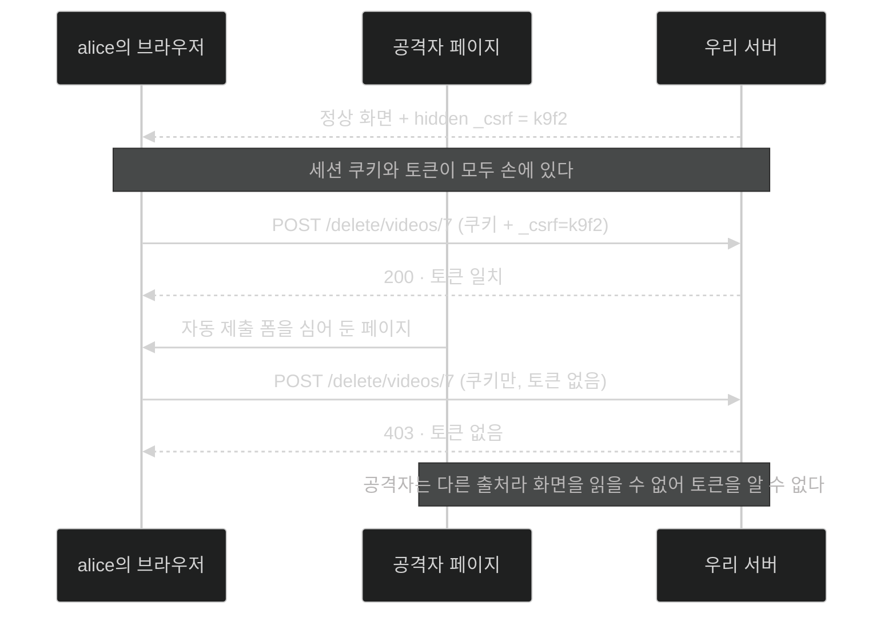

# CSRF를 켤 것인가 — 한 앱에 두 성격이 섞였을 때의 결정

## 한눈에 보기

| 질문 | 핵심 답 |
|---|---|
| CSRF가 노리는 것 | **이미 로그인한 사용자**의 브라우저 |
| 방어 원리 | 서버가 만든 nonce를 폼에 심고, 없는 요청을 거절 |
| 적용 대상 | **상태를 바꾸는 요청**(POST·PUT·DELETE)만 |
| Thymeleaf | 자동으로 hidden input을 넣어 준다 |
| Mustache | 넣어 주지 않는다. `spring.mustache.servlet.expose-request-attributes=true` 필요 |
| 왜 "결정"인가 | CSRF 필터는 **템플릿과 JSON API에 한꺼번에 적용되거나 한꺼번에 꺼진다** |
| 상태를 안 쓰는 REST API | CSRF 방어가 **필요 없다** |
| 책의 최종 선택 | `ApiController`를 떼어 내고 **CSRF를 켠 채로** 간다 |

## 1. 왜 이게 필요한가

### 출발 장면: 로그인한 채로 다른 사이트를 열었을 뿐인데

alice가 우리 동영상 사이트에 로그인해 둔 상태로 다른 탭에서 낚시 링크를 하나 연다. 그 페이지에는 이런 게 숨어 있다.

```html
<form action="https://our-video-site.example/delete/videos/7" method="post">
  <input type="hidden" name="ignored" value="x">
</form>
<script>document.forms[0].submit();</script>
```

브라우저는 우리 사이트로 POST를 보내면서 **alice의 세션 쿠키를 자동으로 함께 실어 보낸다.** 쿠키는 "이 도메인으로 가는 요청"이면 출처가 어디든 붙기 때문이다.

서버 입장에서 이 요청은 완벽하게 정상이다. alice의 세션이고, alice는 7번 동영상의 소유자다. **[[05-securing-web-routes-and-http-verbs]]에서 만든 경로 규칙도 전부 통과한다.**

이것이 **[[CSRF]]**(= 로그인한 사용자의 브라우저를 이용해 위조 요청을 보내게 만드는 공격)다. 인증도 인가도 뚫지 않는다. **정당한 사용자를 도구로 쓴다.**

### 왜 인증·인가로는 막을 수 없는가

| 방어 수단 | 이 공격을 막나 | 이유 |
|---|---|---|
| 인증 | 아니오 | alice는 정말로 로그인해 있다 |
| 경로 인가 | 아니오 | 규칙에 걸리지 않는 정상 경로다 |
| 메서드 보안(소유권) | 아니오 | alice는 정말로 그 동영상의 소유자다 |
| **CSRF 방어** | **예** | "이 요청이 **우리가 내려준 화면**에서 출발했는가"를 따로 묻는다 |

앞의 세 방어는 전부 **"누가 보냈는가"**를 묻는다. CSRF 방어만 **"어디서 출발했는가"**를 묻는다. 질문이 다르기 때문에 다른 방어가 필요하다.

## 2. 어떻게 동작하는가

### 2.1 nonce라는 아이디어

방어의 핵심은 **[[nonce]]**(= 한 번만 쓰는, 서버가 만든 준랜덤 값)다. 서버가 화면을 내려줄 때 이 값을 폼 안에 심어 두고, 돌아오는 요청에 그 값이 없거나 틀리면 거절한다.

왜 이게 통하는지 단계별로 보자.

| 단계 | 일어나는 일 | 이 단계가 필요한 이유 |
|---|---|---|
| 1 | 서버가 세션마다 nonce를 만든다 | 값이 고정이면 한 번 알아낸 공격자가 계속 쓴다 |
| 2 | 화면을 렌더링할 때 폼에 hidden input으로 심는다 | 사용자가 실제로 받은 화면임을 증명할 표식 |
| 3 | 폼을 제출하면 그 값이 함께 온다 | 우리 화면에서 출발했다는 증거 |
| 4 | 서버가 세션에 보관한 값과 대조한다 | 위조 폼은 이 값을 만들 수 없다 |
| 5 | 불일치면 403 | — |

공격자의 페이지가 이 값을 알아낼 수 없는 이유가 결정적이다. 브라우저의 **동일 출처 정책** 때문에 다른 도메인의 페이지는 우리 사이트의 HTML을 읽을 수 없다. 요청을 **보낼** 수는 있어도 응답을 **읽을** 수는 없다. 그래서 폼 안에 심어 둔 값을 가져갈 방법이 없다.

책의 표현대로 "값이 요청마다 바뀌므로 다른 사이트가 캐시하거나 예측할 방법이 없다."

### 2.2 왜 상태 변경 요청만인가

CSRF 방어는 **[[상태-변경-요청]]**(= 서버의 데이터를 바꾸는 요청)에만 적용된다. GET에는 걸지 않는다.

이유는 두 가지다.

1. **GET은 원래 데이터를 바꾸면 안 된다.** 규격상 안전한 메서드다. GET으로 삭제를 구현했다면 CSRF 이전에 그 설계가 문제다.
2. **GET에 토큰을 요구하면 링크가 전부 깨진다.** 북마크, 검색 엔진, 다른 사이트에서 걸어 준 링크가 모두 토큰 없이 오기 때문이다.

### 2.3 Thymeleaf는 되고 Mustache는 안 되는 이유

Thymeleaf를 쓰면 아무것도 안 해도 된다. Spring Boot와 통합이 깊어서 폼을 렌더링할 때 CSRF hidden input을 **자동으로** 끼워 넣는다.

**[[Mustache]]**(= `{{ }}` 표기만으로 값을 끼워 넣는 가벼운 템플릿 엔진)에는 그 통합이 없다. 가볍다는 것이 곧 "프레임워크를 잘 모른다"는 뜻이기 때문이다. 대신 프로퍼티 하나로 재료를 넘겨줄 수는 있다.

```properties
spring.mustache.servlet.expose-request-attributes=true
```

이 설정이 켜지면 요청 속성이 템플릿 **[[모델-속성]]**(= 컨트롤러가 템플릿에 넘기는 이름 붙은 값)처럼 노출되고, 그중 `_csrf`를 꺼내 쓸 수 있다.

```html
<form action="/search" method="post">
    <label for="value">Search:</label>
    <input type="text" name="value">
    <input type="hidden" name="{{_csrf.parameterName}}"
          value="{{_csrf.token}}">
    <button type="submit">Search</button>
</form>
```

`{{_csrf.parameterName}}`과 `{{_csrf.token}}`이 각각 파라미터 이름과 **[[CSRF-토큰]]**(= 서버가 발급한 nonce를 폼에 실어 보내는 값)이다. 이름까지 서버에서 받아 오는 이유는 설정에 따라 파라미터 이름이 달라질 수 있어서다.

같은 처리를 동영상 등록 폼에도 해야 한다.

```html
<form action="/new-video" method="post">
    <input type="text" name="name">
    <input type="text" name="description">
    <input type="hidden" name="{{_csrf.parameterName}}"
          value="{{_csrf.token}}">
    <button type="submit">Submit</button>
</form>
```

**모든 상태 변경 폼에 빠짐없이** 넣어야 한다는 점이 Mustache를 쓰는 대가다. 하나라도 빠뜨리면 그 폼만 403이 된다. 이 부담은 [[06c-adding-a-delete-button]]과 [[06f-displaying-user-details-on-the-site]]에서 폼이 늘어날 때마다 반복된다.

### 2.4 그래서 왜 "결정"인가

여기가 이 절의 제목이 묻는 지점이다. 문제는 **[[람다-DSL]]**(= 설정 블록을 람다로 받는 문법)로 CSRF를 끄면 그 효과가 앱 전체에 걸린다는 것이다.

```java
.csrf(csrf -> csrf.disable());
```

이 한 줄은 **경로별로 켜고 끌 수 없다.** 우리 앱은 성격이 다른 둘을 함께 서빙하고 있다.

| | HTML 웹 페이지 | JSON API |
|---|---|---|
| 세션 쿠키를 쓰나 | 예 | 아니오(토큰 방식) |
| 브라우저가 쿠키를 자동으로 붙이나 | 예 | 아니오 |
| CSRF 공격이 성립하나 | **예** | 아니오 |
| CSRF 토큰이 필요한가 | 필요 | 불필요하고 오히려 방해 |

**[[무상태]]**(= 서버가 요청 사이에 대화 상태를 보관하지 않는 방식) API에서 CSRF 방어가 불필요한 이유는 공격의 전제가 무너지기 때문이다. CSRF는 "브라우저가 쿠키를 자동으로 붙인다"는 성질을 이용한다. 매 요청에 토큰을 **명시적으로** 실어 보내는 API 클라이언트에는 그 자동 첨부가 없다. 공격자의 페이지는 그 토큰을 만들 수 없다.

책은 여기서 **아키텍처 판단**을 내린다. 두 성격이 한 앱에 섞인 게 문제의 원인이므로, 제대로 된 구조라면 **애플리케이션을 둘로 나눠야 한다.**

- 웹 애플리케이션 → CSRF 방어를 켠 채로 둔다
- 무상태 REST API → 아래처럼 끈다

```java
@Bean
SecurityFilterChain configureSecurity(HttpSecurity http)
    throws Exception {
    http
           .authorizeHttpRequests(auth -> auth
               .requestMatchers("/login").permitAll()
               .requestMatchers("/", "/search").authenticated()
               .requestMatchers(HttpMethod.GET, "/api/**").authenticated()
               .requestMatchers(HttpMethod.POST, "/new-video",
                  "/api/**").hasRole("ADMIN")
               .anyRequest().denyAll()
           )
           .formLogin(withDefaults())
           .httpBasic(withDefaults())
           .csrf(csrf -> csrf.disable());
    return http.build();
}
```

그리고 이 책의 선택은 **`ApiController`를 이 앱에서 덜어 내고, CSRF를 켠 채로 가는 것**이다. JSON API는 "다른 애플리케이션에 있다고 치자"고 가정한다.

> **원문 오류.** 책은 이 정책을 두고 "직전 정책과 **거의 같고 뒤에서 둘째 줄만 다르다**"고 한다. 실제로는 `.requestMatchers("/admin").hasRole("ADMIN")` 규칙도 함께 사라졌다. `.csrf(...)` 한 줄만 바뀐 게 아니다. 또 `Customizer.withDefaults()`가 `withDefaults()`로 바뀌어 있는데(정적 임포트) 책은 이 변화를 언급하지 않는다.

## 3. 그림으로 보기



| 질문 | 인증 | 경로 인가 | CSRF 방어 |
|---|---|---|---|
| 무엇을 묻나 | 누구인가 | 무엇을 해도 되나 | **어디서 출발했나** |
| 위조 요청을 막나 | 아니오 | 아니오 | **예** |
| 적용 대상 | 모든 요청 | 모든 요청 | 상태 변경 요청만 |
| 무상태 API에 필요한가 | 예 | 예 | **아니오** |

## 4. 이 노트에 나온 용어

| 용어 | 한 줄 뜻 | 정의 위치 |
|---|---|---|
| CSRF | 로그인한 사용자의 브라우저를 이용한 요청 위조 공격 | [[_glossary#CSRF]] |
| nonce | 한 번만 쓰는, 서버가 만든 준랜덤 값 | [[_glossary#nonce]] |
| CSRF 토큰 | nonce를 폼이나 헤더에 실어 보내는 값 | [[_glossary#CSRF-토큰]] |
| 상태 변경 요청 | 서버 데이터를 바꾸는 요청 | [[_glossary#상태-변경-요청]] |
| 무상태 | 요청 사이에 대화 상태를 보관하지 않는 방식 | [[_glossary#무상태]] |
| Mustache | `{{ }}` 표기의 가벼운 템플릿 엔진 | [[_glossary#Mustache]] |
| 람다 DSL | 설정 블록을 람다로 받는 문법 | [[_glossary#람다-DSL]] |
| 모델 속성 | 컨트롤러가 템플릿에 넘기는 이름 붙은 값 | [[_glossary#모델-속성]] |

## 5. 자주 헷갈리는 것

**"CSRF는 인증을 뚫는 공격이다"** — 반대다. **인증에 성공한 상태를 전제로** 성립한다. 로그인하지 않은 사용자에게는 이 공격이 통하지 않는다.

**"HTTPS를 쓰면 CSRF도 막힌다"** — 무관하다. HTTPS는 전송 구간을 암호화할 뿐, 요청이 어느 페이지에서 출발했는지는 따지지 않는다.

**"CSRF 토큰은 비밀번호처럼 숨겨야 한다"** — HTML 소스에 그대로 보인다. 비밀이라서가 아니라 **다른 출처에서 읽을 수 없어서** 안전하다.

**"API도 안전하게 CSRF를 켜 두면 된다"** — 켜 두면 API 클라이언트가 토큰을 얻을 방법이 없어 모든 POST가 403이 된다. 무상태 API에서는 방해만 된다.

## 6. 언제 안 쓰나 / 경계

- **완전한 무상태 API.** 세션 쿠키를 쓰지 않고 매 요청 토큰을 명시적으로 싣는다면 CSRF 방어는 불필요하다.
- **경로별로 끌 수 없다는 제약.** 이것이 이 절의 핵심 긴장이다. 한 앱에 두 성격이 섞이면 어느 쪽이든 타협해야 하고, 그래서 책은 **앱을 나누라**고 권한다.
- **비유의 한계.** CSRF 토큰은 "은행 창구에서 받은 번호표"에 비유할 수 있다. 창구에서 직접 받은 사람만 갖고 있고, 그게 없으면 처리해 주지 않는다. 다만 이 비유는 **번호표를 남에게 건네줄 수 있다**는 인상을 준다. 실제로는 공격자가 사용자에게서 토큰을 받아 낼 수 없다는 것이 방어의 근거이고, 그 근거는 종이가 아니라 **브라우저의 동일 출처 정책**이 만든다. 물리적 종이가 아니라 "다른 창구에서는 볼 수 없는 번호"에 가깝다.

## 7. 연결

- [[05-securing-web-routes-and-http-verbs]] — 여기서 만든 경로 정책에 남아 있던 마지막 결정이 이 노트의 주제다.
- [[06c-adding-a-delete-button]] — 새 폼을 만들 때마다 `_csrf` hidden input을 반복해서 넣어야 하는 부담이 실제로 나타난다.
- [[06f-displaying-user-details-on-the-site]] — 로그아웃 폼까지도 상태 변경 요청이라 토큰이 필요하다는 것을 확인한다.

## 8. 스스로 확인

1. CSRF 공격이 인증·인가를 모두 통과하는 이유를 요청 하나의 흐름으로 설명할 수 있는가?
2. nonce가 공격자에게 노출되지 않는 근거는 무엇인가?
3. GET에는 CSRF 방어를 걸지 않는 두 가지 이유는?
4. Thymeleaf와 Mustache의 차이가 여기서 코드량으로 어떻게 나타나는가?
5. 이 절의 제목이 "결정"인 이유는 무엇인가? 무엇을 경로별로 할 수 없어서인가?
6. 무상태 REST API에서 CSRF 방어가 불필요한 이유를 공격의 전제로 설명할 수 있는가?
7. 번호표 비유가 깨지는 지점은 어디인가?

> 일곱 문항을 스스로 답한 **뒤에** [[_05a-to-csrf-or-not-to-csrf]]에서 모범답안과 대조한다. 먼저 열면 이 문항들은 다시 인출 문제로 쓸 수 없다.

<!-- ==== 아래는 내 영역 · 스킬 수정 금지 ==== -->

## 내 설명 시도


## 막혔던 지점


## 리뷰 이력
