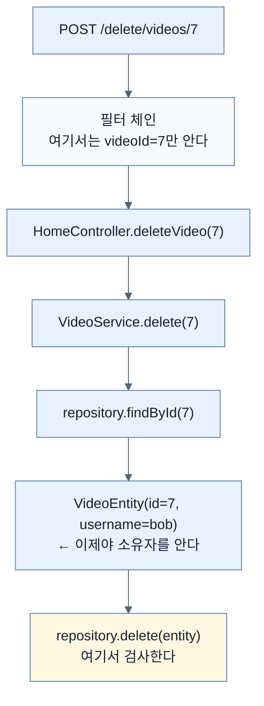
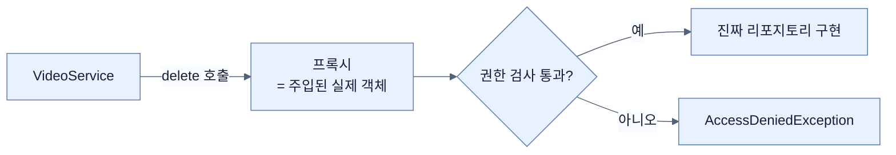
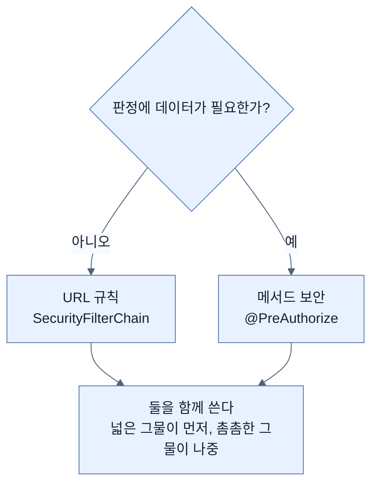

# URL이 볼 수 없는 것 — 검사 지점을 메서드로 옮기는 이유

## 한눈에 보기

| 질문 | 핵심 답 |
|---|---|
| 지금까지의 검사 기준 | 요청의 **URL과 HTTP 메서드** |
| 그것으로 표현할 수 없는 것 | "이 데이터의 **소유자인가**" |
| 새 검사 지점 | 자바 **메서드 호출** |
| 걸 수 있는 곳 | 컨트롤러·서비스·리포지토리 — 사실상 모든 Spring 빈의 메서드 |
| URL 검사와의 결정적 차이 | 메서드는 **인자와 반환값을 볼 수 있다** |
| 동작 방식 | 원본 빈을 감싼 AOP 프록시가 먼저 권한을 검사 |
| 이 절의 소스 | 저장소의 `ch4-method-security` 폴더 |

## 1. 왜 이게 필요한가

### 출발 장면: 규칙을 URL로 쓸 수 없다

동영상 사이트에 삭제 기능을 붙이려 한다. 요구사항은 한 문장이다.

> **alice는 자기가 올린 동영상만 지울 수 있다. bob의 동영상은 지울 수 없다.**

[[05-securing-web-routes-and-http-verbs]]에서 배운 방식으로 이걸 써 보자.

```java
.requestMatchers(HttpMethod.POST, "/delete/videos/**").??????
```

물음표 자리에 무엇을 넣어야 할까.

- `authenticated()` → alice와 bob 모두 통과. 서로의 동영상을 지울 수 있다. **틀렸다.**
- `hasRole("USER")` → 같은 결과. **틀렸다.**
- `hasRole("ADMIN")` → alice는 자기 것도 못 지운다. **틀렸다.**

넣을 수 있는 게 없다. 이유는 근본적이다.

### **[[requestMatcher]]**가 볼 수 있는 것과 없는 것

| 재료 | URL 규칙이 볼 수 있나 | 왜 |
|---|---|---|
| 요청 경로 `/delete/videos/7` | 예 | 요청 줄에 그대로 있다 |
| HTTP 메서드 `POST` | 예 | 요청 줄에 그대로 있다 |
| 현재 사용자가 alice라는 것 | 예 | 보안 컨텍스트에 있다 |
| **7번 동영상의 소유자가 누구인지** | **아니오** | **데이터베이스를 읽어야 안다** |

마지막 줄이 벽이다. 판정에 필요한 정보가 **요청 안에 없다.** 데이터베이스를 조회해야만 알 수 있다.

그런데 필터는 컨트롤러보다 **먼저** 실행된다([[01-spring-security-filter-chain-foundations]]). 아직 아무 조회도 일어나지 않은 시점이다. 필터가 직접 DB를 뒤지게 만들 수도 있겠지만, 그러면 같은 조회를 두 번 하게 되고 보안 설정 파일에 데이터 접근 코드가 들어간다.

**[[소유권]]**(= 데이터 한 건이 어떤 사용자에게 속하는지 나타내는 관계)을 다루는 규칙은 URL 레벨에서 표현할 수 없다. 이것이 이 절이 존재하는 이유다.

## 2. 어떻게 동작하는가

### 2.1 검사 지점을 옮긴다

**[[메서드-레벨-보안]]**(= URL이 아니라 자바 메서드 호출을 단위로 인가를 거는 방식)의 아이디어는 단순하다. **판정에 필요한 정보가 갖춰지는 자리로 검사를 옮긴다.**



필터가 있는 지점에서는 소유자를 모른다. 엔티티를 손에 넣은 뒤에야 알 수 있고, **그 자리가 `repository.delete(entity)` 호출 직전**이다.

### 2.2 어디에나 걸 수 있다는 것의 함정

메서드 보안은 컨트롤러 메서드에도, 서비스 메서드에도, 리포지토리 메서드에도 걸 수 있다. 사실상 모든 Spring 빈이 대상이다.

책은 여기서 한 문장 경고한다 — 그렇게 되면 **"한 방식을 다른 방식으로 바꾼 것뿐"**처럼 보일 수 있다고. 컨트롤러 메서드마다 `@PreAuthorize("hasRole('ADMIN')")`을 붙이는 것은 URL 규칙을 애노테이션으로 옮겨 적은 것에 지나지 않는다. 이 경우 [[05-securing-web-routes-and-http-verbs]]가 지적한 문제(정책이 코드 전체에 흩어진다)가 그대로 돌아온다.

그래서 판단 기준을 세워야 한다.

| 규칙의 성격 | 어디에 거나 | 이유 |
|---|---|---|
| "이 경로는 관리자만" | **URL 규칙** | 요청 정보만으로 판정된다. 한곳에 모여야 읽기 쉽다 |
| "이 데이터의 소유자만" | **메서드 보안** | 데이터를 봐야 판정된다. URL로는 불가능하다 |
| "인증한 사람만" | **URL 규칙** | 가장 넓은 그물은 가장 앞에 |

메서드 보안의 존재 이유는 "더 세밀한 잠금(finer-grained ability to lock things down)"이지, URL 규칙의 대체가 아니다. **둘은 같이 쓴다.**

### 2.3 어떻게 메서드 호출을 가로채는가

애노테이션 하나가 메서드 실행을 막을 수 있는 이유는 **[[AOP-프록시]]**(= 원본 빈을 감싸 호출 전후에 부가 동작을 끼워 넣는 대리 객체)다.



Spring이 `VideoRepository`를 주입할 때 실제로 주는 것은 **원본이 아니라 프록시**다. 호출자는 그 사실을 모른다. 프록시가 먼저 권한을 검사하고, 통과하면 진짜 구현에 넘기고, 아니면 예외를 던진다.

이 구조가 만드는 중요한 성질이 있다. **프록시를 거치지 않는 호출은 검사되지 않는다.** 같은 클래스 안에서 자기 메서드를 직접 부르면(`this.delete(...)`) 프록시를 지나가지 않으므로 애노테이션이 무시된다. [[06e-enabling-method-level-security]]에서 다시 짚는다.

## 3. 그림으로 보기

| 축 | URL 레벨 보안 | 메서드 레벨 보안 |
|---|---|---|
| 검사 시점 | 컨트롤러 **이전** | 메서드 호출 **직전** |
| 볼 수 있는 것 | 경로, HTTP 메서드, 현재 사용자 | 위에 더해 **호출 인자와 대상 객체** |
| 정책이 있는 곳 | `SecurityFilterChain` 한 곳 | 각 메서드의 애노테이션 |
| 거절될 때 상태 | 아무 코드도 실행되지 않음 | 조회는 이미 일어난 뒤 |
| 잘 맞는 규칙 | "관리자 전용 경로" | "자기 데이터만" |
| 이 장에서 | [[05-securing-web-routes-and-http-verbs]] | [[06d-locking-down-access-to-the-owner]] |



## 4. 이 노트에 나온 용어

| 용어 | 한 줄 뜻 | 정의 위치 |
|---|---|---|
| 메서드 레벨 보안 | 메서드 호출을 단위로 인가를 거는 방식 | [[_glossary#메서드-레벨-보안]] |
| AOP 프록시 | 원본 빈을 감싸 호출 전후에 동작을 끼워 넣는 대리 객체 | [[_glossary#AOP-프록시]] |
| 인가 | 확정된 사용자가 이 일을 해도 되는지 판정 | [[_glossary#인가]] |
| RequestMatcher | 요청이 규칙에 해당하는지 판정하는 조건 | [[_glossary#requestMatcher]] |
| 소유권 | 데이터가 어떤 사용자에게 속하는지 나타내는 관계 | [[_glossary#소유권]] |

## 5. 자주 헷갈리는 것

**"메서드 보안이 URL 보안보다 낫다"** — 용도가 다르다. URL 보안은 정책을 한곳에 모아 읽기 쉽게 하고, 거절된 요청이 애플리케이션 코드에 아예 들어오지 못하게 한다. 메서드 보안은 그 대신 데이터를 볼 수 있다. **넓은 그물을 앞에, 촘촘한 그물을 뒤에** 두는 조합이 정답이다.

**"메서드 보안을 켜면 URL 규칙이 필요 없다"** — 그러면 인증되지 않은 요청도 서비스 계층까지 들어와 조회를 일으킨 뒤에야 거절된다. 낭비이고 공격 표면도 넓어진다.

**"애노테이션만 붙이면 동작한다"** — 프록시를 만들라는 스위치가 따로 필요하다. [[06e-enabling-method-level-security]]가 그 이야기다.

## 6. 언제 안 쓰나 / 경계

- **자기 클래스 내부 호출에는 걸리지 않는다.** 프록시를 지나지 않기 때문이다.
- **거절 시점이 늦다.** 소유자를 알려면 조회가 먼저 일어나야 하므로, 권한 없는 요청도 DB 조회 한 번은 유발한다. URL 규칙처럼 "아무것도 실행하지 않고 거절"은 불가능하다.
- **비유의 한계.** URL 보안이 건물 입구 검색대라면 메서드 보안은 **금고 앞에서 다시 하는 확인**이다. 입구를 통과했더라도 금고를 열려면 이 금고가 내 것인지 다시 본다. 다만 이 비유는 **금고 문 앞에 서기 전까지는 그 금고가 누구 것인지 알 수 없다**는 이상한 부분을 담지 못한다. 실제로는 그게 핵심이다 — 대상을 손에 넣기 전에는 판정할 재료가 없다.

## 7. 연결

- [[05-securing-web-routes-and-http-verbs]] — 이 노트가 지적하는 한계의 출처. 두 방식은 대체가 아니라 보완 관계다.
- [[06a-updating-our-model]] — 소유권 규칙을 쓰려면 먼저 데이터에 소유자 필드가 있어야 한다. 그 준비를 한다.
- [[06d-locking-down-access-to-the-owner]] — 여기서 말한 "메서드 호출 직전 검사"를 `@PreAuthorize`로 실제로 구현한다.

## 8. 스스로 확인

1. "자기 동영상만 삭제"를 URL 규칙으로 쓸 수 없는 이유를 판정 재료의 관점에서 설명할 수 있는가?
2. 필터가 직접 DB를 조회하게 만들면 무엇이 나빠지는가?
3. 메서드 보안을 컨트롤러에 남발하면 어떤 문제가 되돌아오는가?
4. 애노테이션 하나가 메서드 실행을 막을 수 있는 메커니즘의 이름은?
5. 같은 클래스 안에서 자기 메서드를 부르면 왜 검사가 안 되는가?
6. URL 보안과 메서드 보안 중 하나만 골라야 한다면 무엇을 잃게 되는가?
7. 금고 비유가 깨지는 지점은 어디인가?

<!-- ==== 아래는 내 영역 · 스킬 수정 금지 ==== -->

## 내 설명 시도


## 막혔던 지점


## 리뷰 이력
