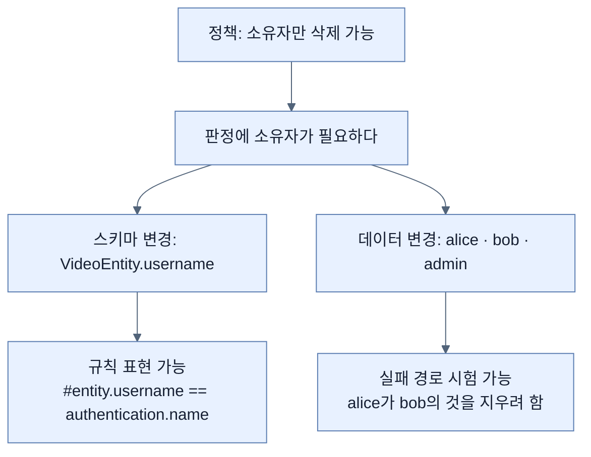

# 소유자 필드 하나 — 규칙이 데이터를 요구할 때

## 한눈에 보기

| 질문 | 핵심 답 |
|---|---|
| 무엇을 바꾸나 | `VideoEntity`에 **`username` 필드 하나**를 더한다 |
| 왜 그 하나인가 | 소유권 규칙을 쓰려면 소유자가 **데이터에 적혀 있어야** 한다 |
| 사용자 집합 변경 | `user`·`admin` → **`alice`·`bob`·`admin`** |
| 왜 사용자가 늘어야 하나 | "남의 것은 못 지운다"를 시험하려면 **남이 있어야 한다** |
| protected 무인자 생성자 | JPA가 요구한다. 유지 |
| Alice와 Bob은 누구인가 | 1978년 RSA 논문에서 온 보안 시나리오의 관례 이름 |

## 1. 왜 이게 필요한가

### 출발 장면: 규칙을 쓰려는데 쓸 재료가 없다

[[06-securing-spring-data-methods]]에서 도달한 결론은 "메서드 호출 직전에 소유자를 확인하자"였다. 그런데 막상 쓰려고 보면 확인할 것이 없다.

Chapter 3에서 만든 엔티티는 이랬다.

```java
@Entity
class VideoEntity {
    private @Id @GeneratedValue Long id;
    private String name;
    private String description;
    // ...
}
```

`id`, `name`, `description`. **누가 올렸는지가 어디에도 없다.**

7번 동영상을 꺼내 봐도 소유자를 알 수 없다. 규칙을 쓸 재료 자체가 없는 것이다.

이 장면이 알려 주는 일반적인 사실이 있다. **보안 규칙은 데이터 모델에 요구사항을 만든다.** "소유자만 지울 수 있다"는 정책은 순수한 정책 문제처럼 보이지만, 실현하려면 스키마에 컬럼이 하나 늘어야 한다.

## 2. 어떻게 동작하는가

### 2.1 소유자 필드 추가

```java
@Entity
class VideoEntity {
    private @Id @GeneratedValue Long id;
    private String username;
    private String name;
    private String description;
    protected VideoEntity() {
          this(null, null, null);
    }
    VideoEntity(String username, String name, String
          description) {
             this.id = null;
             this.username = username;
             this.description = description;
             this.name = name;
         }
    // getters and setters
}
```

바뀐 것은 `username` 필드 하나와 그것을 받는 생성자다. 나머지는 Chapter 3과 같다.

각 요소가 왜 그대로인지도 짚어 두자.

| 요소 | 이유 |
|---|---|
| `protected VideoEntity()` | JPA가 리플렉션으로 객체를 만들 때 무인자 생성자를 요구한다. `protected`로 두어 애플리케이션 코드가 실수로 쓰지 못하게 한다 |
| `this(null, null, null)` | 무인자 생성자가 3인자 생성자로 위임한다. 초기화 로직이 한 곳에만 있게 된다 |
| `this.id = null` | 새 객체는 아직 저장 전이므로 식별자가 없다는 표시. JPA가 `@GeneratedValue`로 채운다 |
| `username`을 **문자열**로 | `UserAccount` 엔티티를 참조하지 않고 이름만 복사해 둔다 |

마지막 항목이 설계 판단이다. `@ManyToOne UserAccount owner`처럼 연관관계로 만들 수도 있었다. 문자열을 고른 이유는 **비교 대상이 문자열이기 때문**이다. 보안 컨텍스트에서 꺼내는 값(`authentication.name`)은 문자열이고, 규칙은 `#entity.username == authentication.name`처럼 쓰인다([[06d-locking-down-access-to-the-owner]]). 연관관계였다면 판정할 때마다 사용자 엔티티를 추가로 로딩해야 한다.

대가도 있다. **참조 무결성이 없다.** 존재하지 않는 사용자 이름을 넣어도 DB가 막아 주지 않고, 사용자 이름이 바뀌면 동영상의 `username`은 옛 값으로 남는다.

### 2.2 사용자를 셋으로 늘리는 이유

**[[소유권]]**(= 데이터가 어떤 사용자에게 속하는지 나타내는 관계) 규칙을 시험하려면 최소 조건이 있다.

| 사용자 수 | 시험할 수 있는 것 | 시험할 수 없는 것 |
|---|---|---|
| 1명 (`user`) | 자기 것 삭제 | **남의 것 삭제 거부** — 남이 없다 |
| 2명 (`alice`, `bob`) | 둘 다 | — |
| 3명 (+ `admin`) | 둘 다 + 역할 기반 규칙 | — |

**"막혀야 하는 경로"를 시험하려면 막힐 사람이 필요하다.** 이것이 `user`·`admin`을 `alice`·`bob`·`admin`으로 바꾸는 이유다.

```java
@Bean
CommandLineRunner initUsers(UserManagementRepository
       repository) {
            return args -> {
                repository.save(new UserAccount("alice", "password",
                                 "ROLE_USER"));
                repository.save(new UserAccount("bob", "password",
                                 "ROLE_USER"));
                repository.save(new UserAccount("admin", "password",
                                 "ROLE_ADMIN"));
       };
}
```

[[04-spring-data-backed-users]]에서 만든 **[[CommandLineRunner]]**(= 컨텍스트 기동 직후 한 번 실행되는 콜백)를 그대로 두고 내용만 바꿨다. 저장하는 **[[authority]]**(= 접근 권한 하나를 나타내는 문자열)에 **[[ROLE-접두사]]**(= 역할을 authority로 표현할 때 붙이는 관례 접두사)가 포함돼 있다는 점도 그대로다.

alice와 bob이 둘 다 `ROLE_USER`인 것이 핵심이다. **역할이 같아도 소유권으로 갈린다.** 역할만으로는 이 둘을 구분할 수 없다는 사실이 [[06-securing-spring-data-methods]]가 필요한 이유를 다시 확인해 준다.

### 2.3 Alice와 Bob이라는 이름

책이 Note로 붙인 배경이다. 보안 시나리오를 설명할 때 A와 B 대신 alice와 bob을 쓰는 관례는 **1978년 Rivest·Shamir·Adleman의 논문** *A Method for Obtaining Digital Signatures and Public-key Cryptosystems*에서 시작됐다. RSA 암호를 만든 그 셋이다.

왜 이름을 붙였을까. "A가 B에게 메시지를 보내고 C가 가로챈다"보다 "alice가 bob에게 보내고 eve가 엿듣는다"가 **누가 무엇을 하는지 훨씬 덜 헷갈리기 때문**이다. 문자는 서로 구분이 안 되지만 이름은 구분된다. 이름 자체가 이해를 돕는 장치다.

## 3. 그림으로 보기



| 무엇을 바꿨나 | 무엇을 가능하게 하나 |
|---|---|
| `VideoEntity.username` 필드 | 규칙의 좌변 — "이 데이터의 소유자" |
| 사용자를 alice·bob으로 | 규칙의 실패 경로 — "남의 데이터" |
| 둘 다 `ROLE_USER` | 역할로는 구분되지 않음을 확인 |
| `admin`은 `ROLE_ADMIN` | 역할 기반 규칙과 소유권 규칙을 함께 시험 |

## 4. 이 노트에 나온 용어

| 용어 | 한 줄 뜻 | 정의 위치 |
|---|---|---|
| 소유권 | 데이터가 어떤 사용자에게 속하는지 나타내는 관계 | [[_glossary#소유권]] |
| 메서드 레벨 보안 | 메서드 호출을 단위로 인가를 거는 방식 | [[_glossary#메서드-레벨-보안]] |
| CommandLineRunner | 컨텍스트 기동 직후 한 번 실행되는 콜백 | [[_glossary#CommandLineRunner]] |
| authority | 접근 권한 하나를 나타내는 문자열 | [[_glossary#authority]] |
| ROLE_ 접두사 | 역할을 authority로 표현할 때의 관례 접두사 | [[_glossary#ROLE-접두사]] |

## 5. 자주 헷갈리는 것

**"소유자는 역할로 표현하면 된다"** — 안 된다. alice와 bob은 **같은 역할**이다. 역할은 사용자를 묶는 이름표이지 개별 데이터와의 관계가 아니다.

**"`username`을 문자열로 둔 건 대충 한 것이다"** — 의도적 선택이다. 비교 대상이 문자열이라 판정이 한 번에 끝난다. 대신 참조 무결성을 포기한 것이며, 그 대가를 알고 고르는 것이 중요하다.

**"사용자 이름을 늘린 건 예제를 예쁘게 하려는 것"** — 실패 경로를 시험하기 위한 최소 조건이다. 사용자가 한 명이면 "막혀야 할 때 막히는가"를 확인할 방법이 없다.

## 6. 언제 안 쓰나 / 경계

- **사용자 이름이 바뀌면 깨진다.** 문자열 복사본이므로 개명이나 이메일 변경 같은 일이 생기면 소유권 연결이 끊어진다. 실제 시스템에서는 변하지 않는 내부 식별자를 쓰는 편이 안전하다.
- **`@ElementCollection` 문제는 그대로다.** [[04-spring-data-backed-users]]에서 지적한 `UserAccount`의 authority 매핑 문제는 이 절에서도 해결되지 않는다.
- **비유의 한계.** 소유자 필드는 "물건에 붙인 이름표"에 가깝다. 다만 이름표 비유는 **누구든 이름표를 바꿔 붙일 수 있다**는 인상을 준다. 실제로는 이 필드를 채우는 코드가 [[06b-taking-ownership-of-data]]에서 보듯 **사용자 입력이 아니라 보안 컨텍스트**에서 값을 가져오기 때문에, 사용자가 남의 이름으로 이름표를 달 수는 없다. 이름표를 다는 사람이 물건 주인이 아니라 창구 직원인 셈이다.

## 7. 연결

- [[06-securing-spring-data-methods]] — 여기서 "데이터를 봐야 판정된다"고 말한 그 데이터를 실제로 만든다.
- [[06b-taking-ownership-of-data]] — 새로 만든 `username` 필드를 **누가 어떤 값으로 채우는가**를 정한다.
- [[04-spring-data-backed-users]] — 여기서 만든 사용자 집합을 alice·bob·admin으로 교체한다.

## 8. 스스로 확인

1. 보안 정책이 데이터 모델을 바꾸게 만드는 이 상황을 일반화하면 어떤 원칙이 되는가?
2. `username`을 `@ManyToOne` 대신 문자열로 둔 이유와 그 대가는?
3. 사용자를 두 명 이상으로 늘려야 하는 이유를 테스트 관점에서 설명할 수 있는가?
4. alice와 bob이 같은 역할인데도 서로의 데이터를 못 건드리게 할 수 있는 근거는 무엇인가?
5. `protected` 무인자 생성자가 여전히 필요한 이유는?
6. Alice/Bob 관례가 A/B보다 나은 실질적 이유는?
7. 이름표 비유가 깨지는 지점은 어디인가?

<!-- ==== 아래는 내 영역 · 스킬 수정 금지 ==== -->

## 내 설명 시도


## 막혔던 지점


## 리뷰 이력
