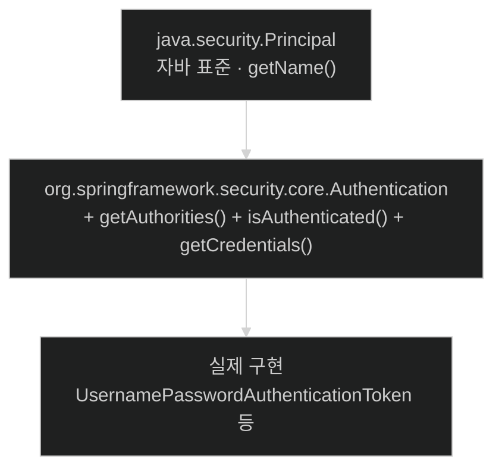
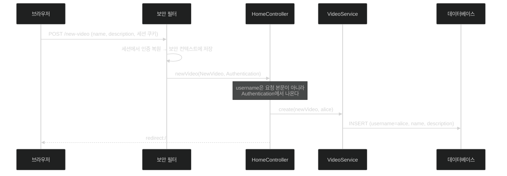
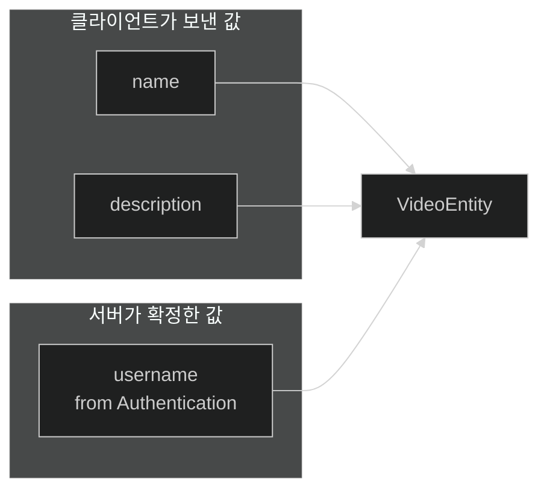

# 소유자를 누가 정하는가 — Authentication을 컨트롤러에 주입하기

## 한눈에 보기

| 질문 | 핵심 답 |
|---|---|
| 소유자 값을 어디서 가져오나 | **보안 컨텍스트** — 사용자 입력이 아니다 |
| 어떻게 가져오나 | 컨트롤러 메서드에 `Authentication` 파라미터를 **선언만** 하면 주입된다 |
| 왜 그게 되나 | Spring Security가 classpath에 있으면 Spring MVC가 이 타입을 인자로 풀어 준다 |
| 사용자 이름 꺼내기 | `authentication.getName()` |
| `getName()`이 있는 이유 | `Authentication`이 `java.security.Principal`을 확장한다 |
| 서비스 시그니처 변경 | `create(newVideo)` → `create(newVideo, username)` |
| 왜 이 방식이 안전한가 | 소유자를 **클라이언트가 보낼 수 없다** |

## 1. 왜 이게 필요한가

### 출발 장면: 소유자를 폼으로 받으면 어떻게 되나

[[06a-updating-our-model]]에서 `VideoEntity.username` 필드를 만들었다. 이제 누가 채울 것인가.

가장 단순해 보이는 답은 "폼에 넣자"다.

```html
<form action="/new-video" method="post">
    <input type="text" name="name">
    <input type="text" name="description">
    <input type="text" name="username">   <!-- 이렇게? -->
    <button type="submit">Submit</button>
</form>
```

이러면 **모든 보안이 무너진다.** bob이 개발자 도구로 그 입력값을 `alice`로 바꿔 제출하면, bob이 올린 동영상이 alice 소유로 저장된다. 더 나쁘게는, hidden으로 숨겨도 마찬가지다 — HTTP 요청은 클라이언트가 만드는 것이고 브라우저 화면은 그것을 제약하지 못한다.

**클라이언트가 보낸 값으로 소유권을 정하면 소유권이 아무 의미가 없다.**

### 그래서 값은 어디서 와야 하나

서버가 **이미 확실히 알고 있는 곳**에서 와야 한다. 그곳이 **[[보안-컨텍스트]]**(= 현재 요청에 묶인 인증 결과를 보관하는 자리)다.

로그인 과정에서 비밀번호를 검사하고 신원을 확정한 것은 서버다. 그 결과가 보안 컨텍스트에 들어 있다. 클라이언트는 그 값을 조작할 수 없다 — 요청에 실려 오는 것이 아니라 **서버가 세션에서 복원한 값**이기 때문이다.

## 2. 어떻게 동작하는가

### 2.1 파라미터를 선언하는 것만으로

```java
@PostMapping("/new-video")
public String newVideo(@ModelAttribute NewVideo newVideo,
    Authentication authentication) {
         videoService.create(newVideo, authentication.getName());
         return "redirect:/";
}
```

Chapter 2의 같은 메서드와 비교하면 파라미터가 **하나 늘었을 뿐**이다. 애노테이션도 없다. 그런데 값이 들어온다.

Spring Security가 classpath에 있으면 Spring MVC는 **[[Authentication]]**(= 현재 요청의 인증 결과를 담은 객체) 타입 파라미터를 알아보고 보안 컨텍스트에서 꺼내 넣어 준다. 애노테이션이 필요 없는 이유는 **타입 자체가 신호**이기 때문이다. 이 타입을 다른 목적으로 쓸 일이 없으니 모호함이 없다.

이 방식의 이점은 명시성이다. 메서드 시그니처만 봐도 **"이 핸들러는 인증된 사용자를 필요로 한다"**가 드러난다. `SecurityContextHolder.getContext().getAuthentication()`처럼 전역 상태를 뒤지는 코드보다 읽기 쉽고 테스트하기도 쉽다.

### 2.2 `getName()`은 어디서 왔나

`authentication.getName()`이 사용자 이름을 돌려준다. 이 메서드가 `Authentication`에 있는 이유는 상속 때문이다.



**[[Principal]]**(= 이름을 가진 인증된 주체를 뜻하는 자바 표준 인터페이스)은 JDK에 원래 있는 타입이다. Spring Security가 자기 `Authentication`을 그 위에 얹은 것은 우연이 아니다. **자바 표준 어휘를 재사용하면 다른 라이브러리와 말이 통한다.** 서블릿 API의 `HttpServletRequest.getUserPrincipal()`도 같은 타입을 돌려준다.

`getName()`이 돌려주는 값은 "인증에 쓰인 주체의 이름", 즉 보통 로그인 아이디다. 이 값이 [[06a-updating-our-model]]의 `username` 필드와 같은 값이어야 한다는 것이 전체 설계의 전제다.

### 2.3 서비스로 값을 흘려보내기

```java
public VideoEntity create(NewVideo newVideo, String
    username) {
         return repository.saveAndFlush(new VideoEntity
             (username, newVideo.name(), newVideo.description()));
}
```

바뀐 것은 둘이다.

1. **인자가 하나 늘었다** — `username`
2. **그 값을 `VideoEntity` 생성자에 넘긴다**

주목할 점은 `VideoService`가 `Authentication`을 **모른다**는 것이다. 받는 것은 평범한 `String`이다.

이 선택이 왜 좋은지는 세 가지로 갈린다.

| 이점 | 설명 |
|---|---|
| 계층 분리 | 서비스가 웹·보안 프레임워크에 의존하지 않는다. 배치 작업에서 같은 메서드를 부를 수 있다 |
| 테스트 용이 | 테스트에서 `Authentication` 목을 만들 필요 없이 문자열만 주면 된다 |
| 책임 명확 | "현재 사용자를 알아내는 일"은 웹 계층의 책임이고, 서비스는 받은 값을 쓰기만 한다 |

### 2.4 값이 흘러가는 전체 경로



이 그림의 요점은 **`username`이 브라우저에서 출발하지 않는다**는 것이다. 화살표의 출처가 다르다. 요청 본문에서 온 것은 `name`과 `description`뿐이고 `username`은 서버 안쪽에서 합류한다.

## 3. 그림으로 보기

| 값 | 출처 | 클라이언트가 조작할 수 있나 |
|---|---|---|
| `name` | 요청 본문 | 예 (사용자가 입력하는 값이므로 정상) |
| `description` | 요청 본문 | 예 (정상) |
| **`username`** | **보안 컨텍스트** | **아니오** |
| `id` | 데이터베이스 시퀀스 | 아니오 |



## 4. 이 노트에 나온 용어

| 용어 | 한 줄 뜻 | 정의 위치 |
|---|---|---|
| Authentication | 현재 요청의 인증 결과를 담은 Spring Security 객체 | [[_glossary#Authentication]] |
| Principal | 이름을 가진 인증된 주체를 뜻하는 자바 표준 인터페이스 | [[_glossary#Principal]] |
| 보안 컨텍스트 | 현재 요청에 묶인 `Authentication`을 보관하는 자리 | [[_glossary#보안-컨텍스트]] |
| 소유권 | 데이터가 어떤 사용자에게 속하는지 나타내는 관계 | [[_glossary#소유권]] |
| 모델 속성 | 컨트롤러가 템플릿에 넘기는 이름 붙은 값 | [[_glossary#모델-속성]] |

## 5. 자주 헷갈리는 것

**"`@ModelAttribute`처럼 애노테이션이 필요하다"** — 필요 없다. `Authentication`은 타입만으로 인식된다.

**"소유자를 hidden input으로 숨기면 안전하다"** — 아니다. hidden은 화면에 안 보일 뿐 요청에는 평범한 파라미터로 실린다. 클라이언트가 보내는 모든 값은 조작 가능하다고 봐야 한다.

**"`Authentication`과 `UserDetails`는 같은 것"** — 다르다. `UserDetails`는 저장된 사용자 정보이고([[04-spring-data-backed-users]]), `Authentication`은 **이번 요청의 인증 결과**다. `Authentication` 안에 `UserDetails`가 들어 있는 구조다.

**"서비스도 `Authentication`을 받으면 편하다"** — 편하지만 서비스가 웹·보안 프레임워크에 묶인다. 문자열로 받으면 배치 작업이나 테스트에서 같은 메서드를 그대로 쓸 수 있다.

## 6. 언제 안 쓰나 / 경계

- **인증되지 않은 요청에서는 `null`이다.** 이 엔드포인트는 인가 규칙이 인증을 강제하고 있어 실제로는 도달하지 않지만, `permitAll()` 경로에 같은 파라미터를 선언하면 `null`이 들어올 수 있다.
- **`getName()`이 항상 로그인 아이디인 것은 아니다.** OAuth 로그인에서는 제공자가 주는 식별자가 들어갈 수 있다. [[08-leveraging-google-to-authenticate-users]]처럼 인증 방식을 바꾸면 이 값의 의미가 달라진다.
- **비유의 한계.** 이 구조는 "은행 창구에서 입금 전표를 쓸 때 계좌 명의를 손님이 아니라 직원이 채우는 것"에 가깝다. 손님은 금액만 적고, 명의는 이미 확인된 신분증에서 온다. 다만 이 비유는 **한 사람이 여러 계좌를 가질 수 있다**는 현실을 담지 못한다. 여기서는 인증된 사용자 하나에 이름 하나가 대응한다고 전제하며, 대리 입금 같은 상황(관리자가 남을 대신해 등록)은 이 코드로 표현할 수 없다.

## 7. 연결

- [[06a-updating-our-model]] — 여기서 만든 `username` 필드를 이 노트가 실제로 채운다.
- [[06d-locking-down-access-to-the-owner]] — 이 노트가 저장한 값과 `authentication.name`을 비교해 삭제 권한을 판정한다.
- [[06f-displaying-user-details-on-the-site]] — 같은 `Authentication` 주입을 화면 렌더링에도 쓴다.

## 8. 스스로 확인

1. 소유자를 폼 입력으로 받으면 정확히 어떤 공격이 가능한가?
2. hidden input이 안전하지 않은 이유를 HTTP 관점에서 설명할 수 있는가?
3. `Authentication` 파라미터에 애노테이션이 필요 없는 이유는?
4. `getName()`이 `Authentication`에 있는 근본 이유는 무엇인가?
5. `VideoService`가 `Authentication` 대신 `String`을 받는 것의 이점 세 가지는?
6. 이 코드에서 클라이언트가 정할 수 있는 값과 없는 값을 구분할 수 있는가?
7. 은행 창구 비유가 깨지는 지점은 어디인가?

> 일곱 문항을 스스로 답한 **뒤에** [[_06b-taking-ownership-of-data]]에서 모범답안과 대조한다. 먼저 열면 이 문항들은 다시 인출 문제로 쓸 수 없다.

<!-- ==== 아래는 내 영역 · 스킬 수정 금지 ==== -->

## 내 설명 시도


## 막혔던 지점


## 리뷰 이력
