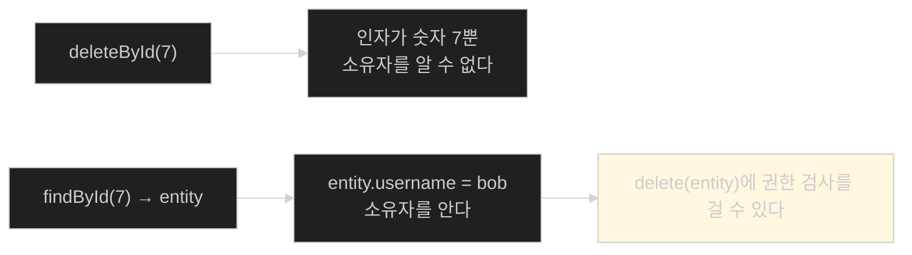
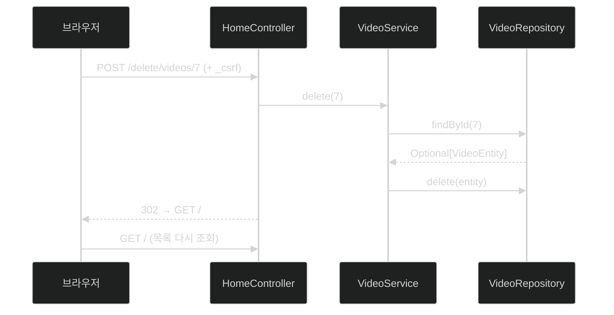

# 삭제 버튼 하나 — HTML이 DELETE를 못 보내서 생기는 일

## 한눈에 보기

| 질문 | 핵심 답 |
|---|---|
| 왜 링크가 아니라 폼인가 | 삭제는 **상태를 바꾸는 요청**이라 GET이면 안 된다 |
| 왜 DELETE가 아니라 POST인가 | HTML 표준 폼은 **GET과 POST만** 지원한다 |
| 그래서 필요한 것 | `_csrf` hidden input |
| 경로에서 id 꺼내기 | `@PathVariable Long videoId` — **이름 매칭** |
| 반환 `"redirect:/"` | HTTP 302를 내려 브라우저를 `GET /`으로 되돌린다 |
| 서비스의 `delete` | `findById` → `map` → `delete` → 없으면 예외 |
| `map` 안에서 `true`를 왜 돌려주나 | `delete()`가 `void`인데 `Optional.map`은 반환값을 요구한다 |
| 원문 공백 | 이 경로를 허용하는 `requestMatchers` 규칙을 책이 끝내 보여 주지 않는다 |

## 1. 왜 이게 필요한가

### 출발 장면: 삭제 링크를 만들면 벌어지는 일

목록에 삭제 기능을 붙이는 가장 짧은 코드는 링크다.

```html
<a href="/delete/videos/{{id}}">Delete</a>
```

이건 세 가지 이유로 잘못됐다.

1. **GET이 데이터를 지운다.** HTTP 규격상 GET은 안전한 메서드여야 한다. 브라우저·프록시·검색 봇은 GET을 마음대로 재시도하거나 미리 가져와도 된다고 전제한다.
2. **크롤러가 목록을 훑으면 전부 사라진다.** 실제로 일어났던 유명한 사고다.
3. **CSRF 방어가 GET에는 걸리지 않는다**([[05a-to-csrf-or-not-to-csrf]]). 그래서 공격자가 `` 한 줄로 남의 데이터를 지울 수 있다.

그래서 삭제는 반드시 **[[상태-변경-요청]]**(= 서버 데이터를 바꾸는 요청)으로, 즉 POST 계열로 보내야 한다.

### 그런데 왜 DELETE가 아닌가

REST 관점에서는 `DELETE /videos/7`이 맞다. 하지만 **HTML 표준 폼은 `method` 속성에 `get`과 `post`만 받는다.** `method="delete"`라고 쓰면 브라우저는 그냥 GET으로 처리한다.

자바스크립트로 `fetch`를 쓰면 DELETE를 보낼 수 있지만, 이 장은 JS 없이 순수 폼으로 간다. 그래서 책의 선택은 **POST로 보내고 경로에 의도를 담는 것**이다 — `/delete/videos/{id}`.

## 2. 어떻게 동작하는가

### 2.1 템플릿

```html
{{#videos}}
    <li>
           {{name}}
        <form action="/delete/videos/{{id}}" method="post">
              <input type="hidden"
                                             name="{{_csrf.parameterName}}"
                                             value="{{_csrf.token}}">
              <button type="submit">Delete</button>
        </form>
    </li>
{{/videos}}
```

**[[Mustache]]**(= `{{ }}` 표기의 가벼운 템플릿 엔진) 문법이 하는 일을 하나씩 보자.

| 표기 | 하는 일 | 이 자리에 필요한 이유 |
|---|---|---|
| `{{#videos}}` … `{{/videos}}` | `videos` 배열을 순회하며 안쪽 HTML을 반복 | 동영상 개수를 미리 알 수 없다 |
| `{{name}}` | 현재 항목의 `name` 필드 출력 | 무엇을 지우는지 보여야 한다 |
| `{{id}}` | 현재 항목의 `id`를 **URL 안에** 끼워 넣음 | 폼마다 대상이 달라야 한다 |
| `{{_csrf.parameterName}}` / `{{_csrf.token}}` | **[[CSRF-토큰]]**(= 서버가 발급한 nonce를 폼에 실어 보내는 값) | 없으면 이 POST는 403이 된다 |

`{{#videos}}`는 **[[로직리스-템플릿]]**(= 프로그램 로직을 템플릿에 두지 않는다는 설계 원칙)에서 반복을 표현하는 유일한 수단이다. `if`나 `for` 문법이 없기 때문에 "배열이면 반복, 값이면 출력"이라는 규칙 하나로 처리한다.

동영상마다 `<form>`이 하나씩 생긴다는 점이 중요하다. 폼은 중첩할 수 없으므로 목록 전체를 감싸는 폼 하나로는 개별 삭제를 표현할 수 없다.

### 2.2 컨트롤러

```java
@PostMapping("/delete/videos/{videoId}")
public String deleteVideo(@PathVariable Long videoId) {
    videoService.delete(videoId);
    return "redirect:/";
}
```

| 요소 | 하는 일 | 이 요소가 필요한 이유 |
|---|---|---|
| `@PostMapping` | POST 요청만 받는다 | GET으로 삭제되면 안 된다 |
| `{videoId}` 경로 변수 | URL의 한 조각을 이름으로 표시 | 대상 식별자를 경로에 담기로 했으니까 |
| **[[PathVariable]]**(= 경로의 일부를 메서드 인자로 꺼내 주는 애노테이션) | `{videoId}`를 같은 이름의 인자에 넣는다 | **이름 매칭**이라 순서에 의존하지 않는다 |
| `Long videoId` | 문자열을 숫자로 변환까지 해 준다 | 잘못된 값이면 여기서 400이 난다 |
| `return "redirect:/"` | **[[소프트-리다이렉트]]**(= 이 주소로 다시 요청하라고 알리는 302 응답) | 아래 참고 |

`"redirect:/"`가 왜 중요한가. 삭제 후 목록 HTML을 그대로 응답하면 브라우저의 주소창에는 여전히 `POST /delete/videos/7`이 남는다. 사용자가 새로고침하면 **같은 POST가 다시 전송된다.** 302로 `GET /`에 넘겨 두면 새로고침해도 조회만 반복된다. 이것이 POST-Redirect-GET 패턴이며, `redirect:` 접두사 하나가 그 패턴을 구현한다.

### 2.3 서비스

```java
public void delete(Long videoId) {
    repository.findById(videoId)
         .map(videoEntity -> {
                         repository.delete(videoEntity);
                         return true;
         })
         .orElseThrow(() -> new RuntimeException("No video at "
                                                                + videoId));
}
```

각 단계가 왜 있는지 보자.

| 단계 | 하는 일 | 왜 필요한가 |
|---|---|---|
| `findById(videoId)` | id로 엔티티를 조회 | **삭제하려면 엔티티가 손에 있어야 한다.** 이것이 [[06d-locking-down-access-to-the-owner]]의 전제다 |
| `Optional` 반환 | 없을 수도 있음을 타입으로 표현 | `null` 검사를 잊는 사고를 막는다 |
| `.map(...)` | 값이 있을 때만 안쪽을 실행 | 없으면 자동으로 건너뛴다 |
| `repository.delete(entity)` | 실제 삭제 | — |
| `return true` | **아무 의미 없는 반환값** | `delete()`가 `void`인데 `map`은 반환값을 요구한다 |
| `.orElseThrow(...)` | 값이 없으면 예외 | 조용히 성공한 척하면 호출자가 속는다 |

`return true`는 책이 직접 설명하는 대목이다. `Optional.map`은 "값을 다른 값으로 바꾸는" 연산이라 반드시 무언가를 돌려줘야 하는데, 우리가 하려는 일(삭제)은 돌려줄 값이 없다. 그래서 자리를 채우는 더미다.

> 의도를 그대로 표현하려면 `map` 대신 `ifPresentOrElse`나 `orElseThrow` 후 삭제가 더 맞는다. `map`을 쓰면 "변환"이라는 이름과 "삭제"라는 실제 동작이 어긋난다.

### 2.4 `id`로 조회한 뒤 엔티티로 삭제하는 이유

`repository.deleteById(videoId)` 한 줄이면 될 것을 왜 두 단계로 나눴을까. 여기가 이 절과 다음 절을 잇는 고리다.



**조회를 먼저 하는 것은 성능 낭비가 아니라 보안 규칙의 전제 조건이다.** `deleteById(7)`에 `@PreAuthorize`를 걸면 표현식이 볼 수 있는 것은 숫자 `7`뿐이라 소유자 비교가 불가능하다.

## 3. 그림으로 보기



| 설계 선택 | 대안 | 왜 이쪽인가 |
|---|---|---|
| POST | GET 링크 | GET은 안전해야 하고 CSRF 방어도 안 걸린다 |
| POST + 경로에 `delete` | HTTP DELETE | HTML 폼이 DELETE를 못 보낸다 |
| `redirect:/` | 목록 HTML 직접 반환 | 새로고침 시 재전송을 막는다 |
| `findById` → `delete(entity)` | `deleteById` | 소유권 검사에 엔티티가 필요하다 |
| `orElseThrow` | 조용히 무시 | 없는 것을 지웠다고 하면 호출자가 속는다 |

## 4. 이 노트에 나온 용어

| 용어 | 한 줄 뜻 | 정의 위치 |
|---|---|---|
| Mustache | `{{ }}` 표기의 가벼운 템플릿 엔진 | [[_glossary#Mustache]] |
| CSRF 토큰 | 서버가 발급한 nonce를 폼에 실어 보내는 값 | [[_glossary#CSRF-토큰]] |
| 상태 변경 요청 | 서버 데이터를 바꾸는 요청 | [[_glossary#상태-변경-요청]] |
| @PathVariable | 경로의 일부를 메서드 인자로 꺼내는 애노테이션 | [[_glossary#PathVariable]] |
| 302 Found | 이 주소로 다시 요청하라는 소프트 리다이렉트 | [[_glossary#소프트-리다이렉트]] |
| 로직리스 템플릿 | 프로그램 로직을 템플릿에 두지 않는 설계 원칙 | [[_glossary#로직리스-템플릿]] |

## 5. 자주 헷갈리는 것

**"`method="delete"`라고 쓰면 DELETE가 나간다"** — 브라우저는 인식하지 못하고 GET으로 처리한다. HTML 표준 폼은 GET과 POST만 지원한다.

**"`@PathVariable`은 순서로 매칭된다"** — 이름으로 매칭된다. `{videoId}`와 인자 이름 `videoId`가 같아서 붙는다. 다르면 `@PathVariable("videoId")`로 명시해야 한다.

**"`return true`에 의미가 있다"** — 없다. `Optional.map`의 형식 요구를 채우는 더미다.

**"`deleteById`가 더 효율적이니 그걸 쓰자"** — 조회 한 번을 아끼는 대신 **소유권 검사를 포기하게 된다.** [[06d-locking-down-access-to-the-owner]]의 규칙을 걸 수 없다.

## 6. 언제 안 쓰나 / 경계

- **`RuntimeException`은 적절한 예외가 아니다.** 이 경우 클라이언트에게 500이 나가지만 실제 상황은 "없는 자원"이므로 404가 맞다. 학습용 코드라 단순화한 것이다.
- **경로 규칙이 빠져 있다.** 책은 `/delete/videos/**`를 허용하는 `requestMatchers` 규칙을 끝내 보여 주지 않는다. [[05-securing-web-routes-and-http-verbs]]의 정책에는 `anyRequest().denyAll()`이 있으므로, 그 정책을 그대로 쓰면 **소유자 본인도 403을 받는다.** 이 절의 코드는 저장소의 `ch4-method-security` 폴더에 있는 별도 설정을 전제한다.
- **비유의 한계.** POST-Redirect-GET은 "결제 후 영수증 화면으로 넘겨 주는 것"에 가깝다. 새로고침해도 두 번 결제되지 않는다. 다만 이 비유는 **결제 자체가 실패했을 때**를 담지 못한다. 여기서도 예외가 나면 리다이렉트에 도달하지 못하고 오류 페이지가 뜨며, 사용자는 무엇이 잘못됐는지 알기 어렵다.

## 7. 연결

- [[05a-to-csrf-or-not-to-csrf]] — 여기서 `_csrf` hidden input을 넣어야 하는 이유가 그 노트에 있다. 폼이 늘 때마다 반복되는 부담의 실례다.
- [[06b-taking-ownership-of-data]] — 소유자를 심는 쪽이 그 노트, 그것을 근거로 지우는 쪽이 이 노트다.
- [[06d-locking-down-access-to-the-owner]] — 이 노트가 만든 `delete(entity)` 호출 지점에 권한 검사를 붙인다.

## 8. 스스로 확인

1. 삭제를 GET 링크로 만들면 벌어지는 사고 세 가지를 말할 수 있는가?
2. HTML 폼으로 DELETE를 보낼 수 없는 이유와, 책이 고른 우회 방법은?
3. `"redirect:/"`가 없으면 사용자가 새로고침할 때 무슨 일이 생기는가?
4. `return true`가 있는 이유를 `Optional.map`의 계약으로 설명할 수 있는가?
5. `deleteById(id)` 대신 `findById(id)` → `delete(entity)`를 고른 진짜 이유는?
6. 이 코드에서 `_csrf` hidden input을 빼면 어떤 응답이 오는가?
7. POST-Redirect-GET 비유가 깨지는 지점은 어디인가?

> 일곱 문항을 스스로 답한 **뒤에** [[_06c-adding-a-delete-button]]에서 모범답안과 대조한다. 먼저 열면 이 문항들은 다시 인출 문제로 쓸 수 없다.

<!-- ==== 아래는 내 영역 · 스킬 수정 금지 ==== -->

## 내 설명 시도


## 막혔던 지점


## 리뷰 이력
