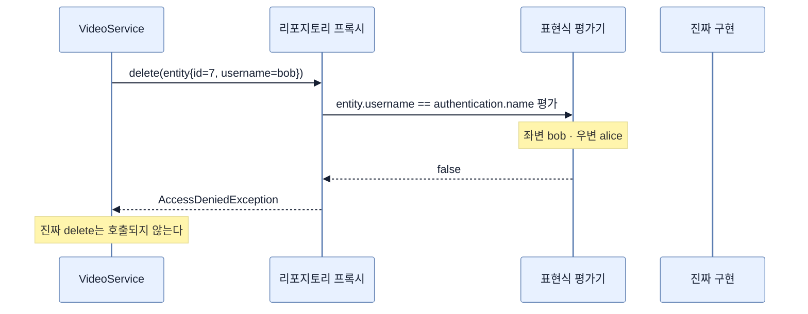
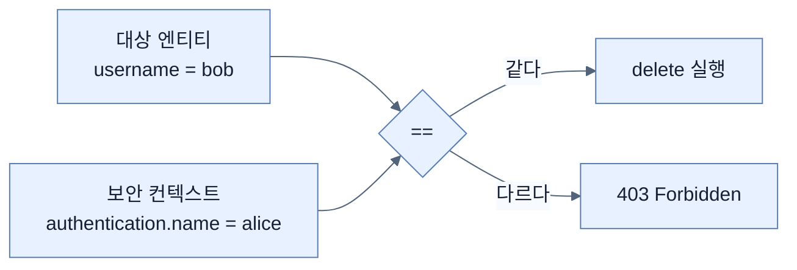

# @PreAuthorize 한 줄 — 상속받은 메서드를 다시 선언해 잠그기

## 한눈에 보기

| 질문 | 핵심 답 |
|---|---|
| 잠그는 대상 | `JpaRepository`가 **상속시켜 준** `delete(VideoEntity)` |
| 어떻게 잠그나 | 리포지토리 인터페이스에서 그 메서드를 `@Override`로 **다시 선언**하고 애노테이션을 붙인다 |
| 규칙 | `@PreAuthorize("#entity.username == authentication.name")` |
| `#entity` | 첫 번째 파라미터를 이름으로 참조 |
| `.username` | 자바 빈 프로퍼티 규칙으로 `getUsername()` 호출 |
| `authentication.name` | 현재 보안 컨텍스트의 사용자 이름 |
| `@Override`를 붙이는 이유 | 시그니처를 잘못 적으면 **컴파일 에러**로 잡히게 하려고 |
| 실패하면 | 403 |

## 1. 왜 이게 필요한가

### 출발 장면: 내가 쓰지 않은 메서드에 규칙을 걸어야 한다

[[06c-adding-a-delete-button]]에서 만든 흐름의 마지막 줄은 이것이다.

```java
repository.delete(videoEntity);
```

이 `delete` 메서드는 **내가 쓴 적이 없다.** `JpaRepository`를 상속하는 순간 딸려 온 것이다.

```java
public interface VideoRepository extends JpaRepository<VideoEntity, Long> {
    // delete()는 여기 없다. 부모에 있다.
}
```

그런데 소유권 검사를 걸 자리는 바로 그 메서드다. 부모 인터페이스는 Spring Data가 배포한 라이브러리 코드라 내가 고칠 수 없다.

**남이 만든 메서드에 내 규칙을 붙여야 하는 상황**이다.

## 2. 어떻게 동작하는가

### 2.1 재선언이라는 해법

자바 인터페이스는 부모의 메서드를 자식에서 **다시 선언**할 수 있다. 동작은 그대로이고, 다른 애노테이션을 붙일 자리가 생긴다.

```java
@PreAuthorize("#entity.username == authentication.name")
@Override
void delete(VideoEntity entity);
```

세 줄에 담긴 결정을 하나씩 보자.

| 요소 | 하는 일 | 없으면 |
|---|---|---|
| `@Override` | 부모에 정말 이 시그니처가 있는지 컴파일러가 검사 | 오타가 나면 **새 메서드가 하나 추가될 뿐** 규칙이 아무 데도 걸리지 않는다. 그런데 컴파일은 된다 |
| **[[PreAuthorize]]**(= 메서드 실행 전에 표현식을 평가해 통과 여부를 정하는 애노테이션) | 검사를 건다 | 아무 검사도 없다 |
| `void delete(VideoEntity entity)` | 부모와 완전히 같은 시그니처 | 다르면 `@Override`가 컴파일 에러를 낸다 |

`@Override`의 역할이 특히 중요하다. 이것은 문서용 표시가 아니라 **안전장치**다. 만약 `void delte(VideoEntity entity)`처럼 오타를 냈다면, `@Override` 없이는 "새 메서드 `delte`에 보안 규칙을 걸었다"가 되고 진짜 `delete`는 무방비로 남는다. 조용히 뚫리는 종류의 버그다. `@Override`가 그것을 컴파일 시점에 잡는다.

### 2.2 표현식 뜯어보기

`"#entity.username == authentication.name"`은 **[[SpEL]]**(= Spring이 문자열 안에서 객체를 읽고 계산할 때 쓰는 식 언어)로 쓰였다. 좌변과 우변의 출처가 완전히 다르다.

| 조각 | 어디서 오나 | 무엇을 하나 |
|---|---|---|
| `#entity` | **메서드 인자** | `#` 접두사는 "파라미터를 이름으로 참조하라"는 뜻. 첫 번째 인자 `entity`를 가리킨다 |
| `.username` | 그 객체 | 자바 빈 프로퍼티 규칙에 따라 `getUsername()`을 호출한다 |
| `authentication` | **보안 컨텍스트** | Spring Security가 표현식에 미리 넣어 주는 루트 객체 |
| `.name` | 그 객체 | **[[Authentication]]**의 `getName()`. 현재 로그인한 사용자 이름 |
| `==` | — | 두 문자열 비교 |

**좌변은 데이터, 우변은 요청자.** 이 둘을 나란히 놓고 비교할 수 있다는 것이 **[[메서드-레벨-보안]]**(= 메서드 호출을 단위로 인가를 거는 방식)의 전부다. [[05-securing-web-routes-and-http-verbs]]의 URL 규칙에는 좌변에 해당하는 것이 없었다.

`.username`이 `getUsername()`을 부른다는 점도 짚어 둘 만하다. SpEL은 필드를 직접 읽는 게 아니라 접근자 메서드를 통한다. 그래서 [[06a-updating-our-model]]이 "getters and setters"를 남겨 둔 것이 여기서 필요해진다.

### 2.3 실행 순서



alice가 자기 동영상을 지울 때는 좌변과 우변이 모두 `alice`라 통과하고, 진짜 구현이 호출된다.

### 2.4 거절되면 사용자가 보는 것

alice가 bob의 동영상 옆 Delete 버튼을 누르면 책의 Figure 4.5 화면이 나온다. 브라우저가 만든 기본 오류 화면이고 내용은 이렇다.

```text
Access to localhost was denied
You don't have authorization to view this page.
HTTP ERROR 403
```

**[[403-Forbidden]]**(= 신원은 알지만 허용되지 않는다는 상태 코드)이 맞는 코드다. alice가 누구인지는 서버가 정확히 안다. 다만 이 일은 허용되지 않는다. 로그인 화면으로 보내면(401 계열 처리) alice는 "이미 로그인했는데 왜?"라며 혼란에 빠질 것이다.

책은 뒤로 가기를 눌러 자기 동영상을 지워 보면 정상 동작한다고 확인시킨다. **같은 버튼, 같은 코드 경로, 다른 데이터 → 다른 결과.** 이것이 데이터에 근거한 판정의 모습이다.

## 3. 그림으로 보기

| 규칙의 종류 | 좌변(대상) | 우변(요청자) | 어디에 쓰나 |
|---|---|---|---|
| `hasRole("ADMIN")` | 없음 | 요청자의 authority | URL 규칙 또는 메서드 보안 |
| `authenticated()` | 없음 | 인증 여부 | URL 규칙 |
| `#entity.username == authentication.name` | **대상 데이터의 소유자** | 요청자의 이름 | **메서드 보안만** |



## 4. 이 노트에 나온 용어

| 용어 | 한 줄 뜻 | 정의 위치 |
|---|---|---|
| @PreAuthorize | 메서드 실행 전에 표현식을 평가해 통과 여부를 정함 | [[_glossary#PreAuthorize]] |
| SpEL | Spring이 문자열 안에서 객체를 읽고 계산하는 식 언어 | [[_glossary#SpEL]] |
| 소유권 | 데이터가 어떤 사용자에게 속하는지 나타내는 관계 | [[_glossary#소유권]] |
| 메서드 레벨 보안 | 메서드 호출을 단위로 인가를 거는 방식 | [[_glossary#메서드-레벨-보안]] |
| Authentication | 현재 요청의 인증 결과를 담은 객체 | [[_glossary#Authentication]] |
| 403 Forbidden | 신원은 알지만 허용되지 않는다는 상태 코드 | [[_glossary#403-Forbidden]] |

## 5. 자주 헷갈리는 것

**"`@Override`는 문서용 표시다"** — 여기서는 **보안 장치**다. 시그니처 오타를 컴파일 시점에 잡아 "규칙이 엉뚱한 메서드에 걸리는" 사고를 막는다.

**"`#entity`의 `entity`는 아무 이름이나 된다"** — 파라미터 이름과 같아야 한다. 파라미터 이름이 `videoEntity`면 `#videoEntity`라고 써야 한다.

**"`authentication`도 `#`을 붙여야 한다"** — 붙이지 않는다. `#`은 메서드 인자를 가리키는 접두사이고, `authentication`은 Spring Security가 표현식 루트에 넣어 주는 값이다.

**"이 애노테이션만 붙이면 동작한다"** — [[06e-enabling-method-level-security]]의 스위치가 없으면 애노테이션은 아무 일도 하지 않는다. **조용히** 아무 일도 하지 않는다는 점이 위험하다.

## 6. 언제 안 쓰나 / 경계

- **조회는 이미 일어난 뒤다.** 거절되더라도 `findById`는 실행됐다. 권한 없는 사용자가 조회를 유발할 수 있다는 뜻이고, 조회 자체가 비싸다면 앞단에서 한 번 더 거르는 편이 낫다.
- **문자열 표현식이라 컴파일 검사가 없다.** `#entity.usernme`처럼 오타를 내면 컴파일은 통과하고 런타임에 평가가 실패한다. 그래서 이 규칙에는 **성공·실패 두 경로 모두** 테스트가 필요하다.
- **관리자 예외를 표현하려면 식이 길어진다.** "소유자 또는 관리자"를 원하면 `#entity.username == authentication.name or hasRole('ADMIN')`처럼 붙여야 하고, 조건이 늘수록 문자열이 읽기 어려워진다.
- **비유의 한계.** 이 검사는 "사물함을 열기 전에 이름표와 학생증을 대조하는 것"에 가깝다. 다만 이 비유는 **사물함 앞에 서기 위해 이미 사물함을 열어 본 셈**이라는 이상한 부분을 감춘다. 실제로는 소유자를 알기 위해 엔티티를 먼저 읽어야 했고, 그 읽기는 검사 전에 일어난다. 읽기와 쓰기의 권한이 다를 수 있다는 점을 이 구조는 표현하지 못한다.

## 7. 연결

- [[06c-adding-a-delete-button]] — 그 노트의 `findById` → `delete(entity)` 순서가 이 검사를 가능하게 만든 전제다.
- [[06e-enabling-method-level-security]] — 이 애노테이션을 실제로 동작시키는 스위치. 없으면 이 노트의 코드는 무력하다.
- [[06-securing-spring-data-methods]] — "URL로는 표현할 수 없는 규칙"이라는 문제 제기에 대한 구체적인 답이 이 노트다.

## 8. 스스로 확인

1. 부모 인터페이스의 메서드에 규칙을 걸어야 할 때 쓰는 방법은 무엇인가?
2. `@Override`를 빼면 어떤 종류의 버그가 생기는가? 왜 조용한가?
3. `#entity`와 `authentication`의 출처가 어떻게 다른지 설명할 수 있는가?
4. `.username`이 필드가 아니라 `getUsername()`을 부른다는 사실이 왜 중요한가?
5. 이 규칙이 URL 규칙으로 표현될 수 없는 근본 이유는?
6. alice가 bob의 동영상을 지우려 할 때 401이 아니라 403인 이유는?
7. 사물함 비유가 깨지는 지점은 어디인가?

<!-- ==== 아래는 내 영역 · 스킬 수정 금지 ==== -->

## 내 설명 시도


## 막혔던 지점


## 리뷰 이력
