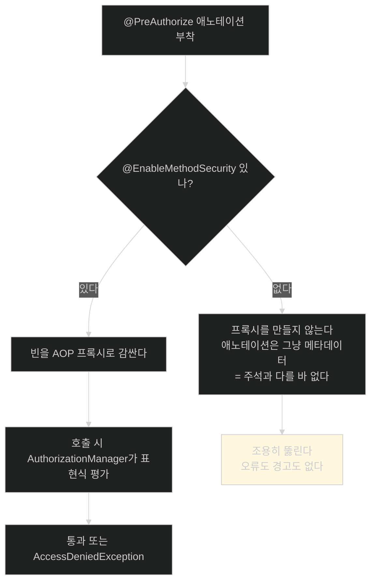

# 스위치를 켜지 않으면 애노테이션은 주석이다 — @EnableMethodSecurity

## 한눈에 보기

| 질문 | 핵심 답 |
|---|---|
| 필요한 것 | `SecurityConfig`에 `@EnableMethodSecurity` 한 줄 |
| 없으면 | `@PreAuthorize`가 **아무 일도 하지 않는다.** 오류도 경고도 없다 |
| 옛 애노테이션 | `@EnableGlobalMethodSecurity` — deprecated |
| 새 것이 기본으로 켜는 것 | `@PreAuthorize`·`@PostAuthorize`와 관련 filter 애노테이션 |
| 새 것이 기본으로 **끄는** 것 | `@Secured`, JSR-250의 `@RolesAllowed` |
| 내부 구조 변화 | metadata-source + decision-voter → **AuthorizationManager 기반** |
| 왜 위험한가 | 실패가 "막힘"이 아니라 **"뚫림"**으로 나타난다 |

## 1. 왜 이게 필요한가

### 출발 장면: 애노테이션은 붙였는데 alice가 bob의 동영상을 지운다

[[06d-locking-down-access-to-the-owner]]까지 다 했다고 하자. 리포지토리에 `@PreAuthorize`가 붙어 있다. 그런데 alice로 로그인해 bob의 동영상 Delete를 누르면 — **지워진다.**

로그를 봐도 아무것도 없다. 예외도, 경고도, "권한 검사를 건너뜁니다" 같은 안내도 없다. 애노테이션은 분명히 거기 있는데 동작하지 않는다.

이것이 **보안에서 가장 위험한 실패 모양**이다. [[05-securing-web-routes-and-http-verbs]]의 `denyAll()`은 잘못되면 **막힌다** — 사용자가 즉시 불평하니 금방 발견된다. 반면 이 실패는 **뚫린다** — 아무도 불평하지 않으므로 사고가 날 때까지 아무도 모른다.

### 왜 자동으로 켜지지 않는가

Spring Security가 알아서 켜 줄 수도 있었을 텐데 왜 명시적 스위치를 요구할까.

메서드 보안을 켠다는 것은 **모든 후보 빈을 프록시로 감싼다**는 뜻이다([[06-securing-spring-data-methods]]). 이것은 공짜가 아니다.

| 비용 | 내용 |
|---|---|
| 성능 | 모든 메서드 호출이 프록시를 한 겹 더 지난다 |
| 동작 변화 | `this.method()` 같은 내부 호출과 프록시 호출의 동작이 갈린다 |
| 디버깅 | 스택 트레이스에 프록시 프레임이 끼어든다 |

메서드 보안을 안 쓰는 앱에 이 비용을 강제할 수는 없다. 그래서 **켜는 쪽을 명시적 선언으로** 만들었다. 대가로 "켜는 걸 잊으면 조용히 무력해진다"는 함정이 생겼다.

## 2. 어떻게 동작하는가

### 2.1 한 줄

```java
@Configuration
@EnableMethodSecurity
public class SecurityConfig {
    // prior security configuration details
}
```

**[[EnableMethodSecurity]]**(= 메서드 보안 애노테이션을 실제로 동작시키는 스위치)를 붙이면 Spring이 다음을 한다.

1. `@PreAuthorize` 같은 애노테이션이 붙은 빈을 찾는다
2. 그 빈들을 **[[AOP-프록시]]**(= 원본 빈을 감싸 호출 전후에 동작을 끼워 넣는 대리 객체)로 감싼다
3. 프록시가 메서드 호출을 가로채 표현식을 평가한다

`SecurityConfig`에 붙이는 이유는 특별하지 않다. 이 애노테이션은 **애플리케이션 전체**에 적용되므로 `@Configuration` 클래스 아무 데나 붙어도 된다. 보안 설정을 한곳에 모아 두려는 관례일 뿐이다.

### 2.2 옛 애노테이션과 무엇이 다른가

책이 Note로 정리하는 부분이다. 예전에는 `@EnableGlobalMethodSecurity`를 썼고, 지금은 deprecated다. Spring Security 7.1.0에도 클래스 자체는 남아 있지만 새 코드에서 쓸 이유가 없다.

차이는 **기본값**과 **내부 구조** 두 가지다.

| | `@EnableGlobalMethodSecurity` (옛) | `@EnableMethodSecurity` (새) |
|---|---|---|
| `@PreAuthorize`·`@PostAuthorize` | 옵션으로 켜야 함 | **기본으로 켜짐** |
| `@Secured` | 옵션 | **기본으로 꺼짐** (`securedEnabled = true` 필요) |
| `@RolesAllowed` (JSR-250) | 옵션 | **기본으로 꺼짐** (`jsr250Enabled = true` 필요) |
| 내부 판정 구조 | metadata source + decision voter | **[[AuthorizationManager]]** |

기본값이 이렇게 뒤집힌 데에는 이유가 있다. `@PreAuthorize`는 **표현식**을 받아 `@Secured`나 `@RolesAllowed`가 표현할 수 없는 조건까지 쓸 수 있다. 우리가 [[06d-locking-down-access-to-the-owner]]에서 쓴 `#entity.username == authentication.name`이 정확히 그런 예다. `@Secured("ROLE_ADMIN")`으로는 소유권 비교를 쓸 수 없다.

**표현력이 가장 큰 것을 기본으로, 나머지는 필요할 때 켜는 것**으로 정리한 셈이다.

### 2.3 내부 구조가 바뀐 이유

옛 구조는 두 부분으로 나뉘어 있었다.

- **metadata source**: 애노테이션을 읽어 "이 메서드에 어떤 조건이 붙어 있는가"를 수집
- **decision voter**: 여러 투표자가 각각 찬성·반대·기권을 내고 그걸 집계

이 구조는 유연했지만 **결과를 예측하기 어려웠다.** 투표자가 여럿이면 "누가 왜 반대했는가"를 추적하기 힘들고, 기권 처리 규칙까지 설정에 얽혔다.

새 구조인 `AuthorizationManager`는 인가 판정 하나를 **함수 하나**로 본다. 입력을 주면 결과가 나온다. 책의 표현대로 "추론하기 쉽고, 현대적인 Spring Security 구조와 더 잘 맞고, 인가 설정의 복잡도를 줄인다."

그리고 이것은 [[05-securing-web-routes-and-http-verbs]]에서 이미 만난 타입이다. `AuthorizationManagers.allOf(...)`로 URL 규칙을 조합했던 그 인터페이스다. **URL 보안과 메서드 보안이 같은 추상 위에서 동작하게 된 것**이 이 변화의 실질적 의미다.

## 3. 그림으로 보기



| 축 | URL 보안 | 메서드 보안 |
|---|---|---|
| 켜는 방법 | Spring Security가 classpath에 있으면 자동 | **`@EnableMethodSecurity` 명시 필요** |
| 안 켜면 | 전부 잠긴다(안전한 실패) | **전부 열린다(위험한 실패)** |
| 판정 추상 | `AuthorizationManager` | `AuthorizationManager` (Boot 4 기준 동일) |
| 비용 | 필터 통과 | 대상 빈마다 프록시 |

## 4. 이 노트에 나온 용어

| 용어 | 한 줄 뜻 | 정의 위치 |
|---|---|---|
| @EnableMethodSecurity | 메서드 보안 애노테이션을 동작시키는 스위치 | [[_glossary#EnableMethodSecurity]] |
| @PreAuthorize | 메서드 실행 전에 표현식을 평가해 통과 여부를 정함 | [[_glossary#PreAuthorize]] |
| AOP 프록시 | 원본 빈을 감싸 호출 전후에 동작을 끼워 넣는 대리 객체 | [[_glossary#AOP-프록시]] |
| AuthorizationManager | 인가 판정 하나를 담당하는 함수형 타입 | [[_glossary#AuthorizationManager]] |
| 메서드 레벨 보안 | 메서드 호출을 단위로 인가를 거는 방식 | [[_glossary#메서드-레벨-보안]] |

## 5. 자주 헷갈리는 것

**"애노테이션을 붙였으니 켜진 것이다"** — 애노테이션은 메타데이터일 뿐이다. 그것을 읽어 프록시를 만드는 인프라가 켜져 있어야 의미가 생긴다.

**"안 켜면 오류가 난다"** — 나지 않는다. 그래서 위험하다. 확인하는 유일한 방법은 **막혀야 할 요청이 실제로 막히는지 테스트**하는 것이다.

**"`@EnableGlobalMethodSecurity`도 여전히 쓸 수 있다"** — 클래스는 남아 있지만 deprecated다. 새 코드에서 쓸 이유가 없다.

**"`@Secured`도 같이 켜진다"** — 켜지지 않는다. `@EnableMethodSecurity(securedEnabled = true)`가 필요하다. 이걸 모르고 `@Secured`만 붙이면 [[06d-locking-down-access-to-the-owner]]와 같은 조용한 실패가 반복된다.

## 6. 언제 안 쓰나 / 경계

- **프록시를 지나지 않는 호출은 검사되지 않는다.** 같은 클래스 안에서 `this.delete(...)`를 부르면 프록시를 우회하므로 애노테이션이 무시된다. 우리 코드는 `VideoService`가 `VideoRepository`를 **주입받아** 호출하므로 프록시를 지나간다.
- **메서드 보안이 필요 없는 앱에는 켜지 마라.** 모든 후보 빈을 감싸는 비용이 있고, 얻는 게 없다.
- **비유의 한계.** 이 애노테이션은 "경보기를 설치하고 전원을 켜는 것"에 비유할 수 있다. 센서를 아무리 많이 달아도 전원이 꺼져 있으면 아무 소리도 안 난다. 다만 이 비유는 **경보기는 꺼져 있는지 눈으로 보인다**는 점에서 실제와 다르다. 여기서는 꺼져 있다는 신호가 어디에도 없다. 유일한 확인 방법은 침입을 실제로 시도해 보는 것, 즉 테스트다.

## 7. 연결

- [[06d-locking-down-access-to-the-owner]] — 그 노트가 만든 애노테이션은 이 스위치가 없으면 무력하다. 짝으로 이해해야 한다.
- [[06-securing-spring-data-methods]] — 여기서 말한 AOP 프록시 메커니즘이 실제로 켜지는 지점이 이 노트다.
- [[05-securing-web-routes-and-http-verbs]] — 거기서 조합에 썼던 `AuthorizationManager`가 이제 메서드 보안의 내부 구조이기도 하다.

## 8. 스스로 확인

1. 이 애노테이션을 빠뜨렸을 때의 실패가 왜 특별히 위험한가? `denyAll()`을 빠뜨린 경우와 비교할 수 있는가?
2. Spring Security가 메서드 보안을 자동으로 켜지 않는 이유 세 가지는?
3. 새 애노테이션이 `@PreAuthorize`를 기본으로 켜고 `@Secured`를 끄는 판단의 근거는?
4. metadata source + decision voter 구조가 `AuthorizationManager`로 바뀌면서 좋아진 점은?
5. URL 보안과 메서드 보안이 같은 추상을 공유하게 된 것이 왜 의미가 있는가?
6. 이 스위치가 켜졌는지 코드만 보고 확인할 수 없다면 무엇으로 확인하는가?
7. 경보기 비유가 깨지는 지점은 어디인가?

> 일곱 문항을 스스로 답한 **뒤에** [[_06e-enabling-method-level-security]]에서 모범답안과 대조한다. 먼저 열면 이 문항들은 다시 인출 문제로 쓸 수 없다.

<!-- ==== 아래는 내 영역 · 스킬 수정 금지 ==== -->

## 내 설명 시도


## 막혔던 지점


## 리뷰 이력
