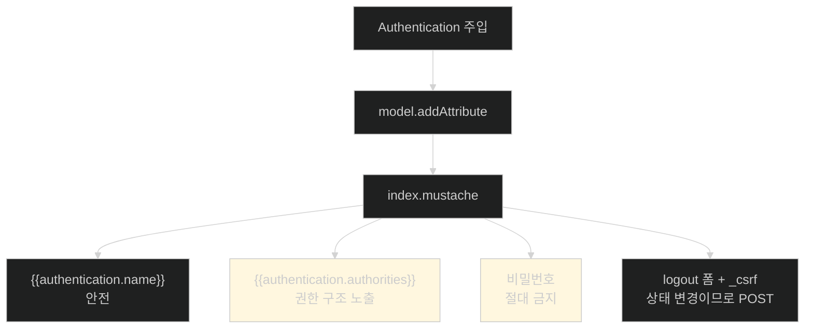

# 화면에 나를 보여 주기 — 그리고 보여 주면 안 되는 것

## 한눈에 보기

| 질문 | 핵심 답 |
|---|---|
| 어떻게 넘기나 | 컨트롤러에 `Authentication`을 주입해 **모델 속성**으로 담는다 |
| 템플릿에서 | `{{authentication.name}}`, `{{authentication.authorities}}` |
| 로그아웃 | `/logout`으로 **POST**하는 폼. 상태 변경이라 `_csrf` 필수 |
| 화면에 넣으면 안 되는 것 | **비밀번호는 절대.** authority 목록도 굳이 넣지 말 것 |
| 실제 화면에서 발견되는 것 | `ROLE_USER` 옆의 `FactorGrantedAuthority [FACTOR_PASSWORD, …]` |
| Mustache의 한계 | 로직이 없어 "관리자에게만 보이기" 같은 조건부 렌더링을 못 한다 |
| 이 절이 남기는 결론 | 사용자·역할 관리 부담이 커서 외부 제공자로 눈을 돌리게 된다 |

## 1. 왜 이게 필요한가

### 출발 장면: 내가 누구로 로그인해 있는지 알 수 없다

alice와 bob을 만들어 두고 소유권 규칙을 걸었다([[06d-locking-down-access-to-the-owner]]). 그런데 브라우저를 열면 화면 어디에도 **지금 누구로 로그인해 있는지**가 없다.

이것은 UX 문제이기 전에 **검증 문제**다. alice의 삭제가 성공했을 때 그게 규칙이 맞아서인지, 아니면 실은 bob으로 로그인해 있어서인지 구분할 수 없다. 로그아웃할 방법도 없어서 다른 사용자로 바꿔 시험하려면 브라우저 세션을 통째로 지워야 한다.

**보안 규칙을 시험하려면 현재 신원이 화면에 보여야 한다.**

## 2. 어떻게 동작하는가

### 2.1 컨트롤러가 신원을 템플릿에 넘긴다

```java
@GetMapping
public String index(Model model,
    Authentication authentication) {
                        model.addAttribute("videos", videoService.getVideos());
                        model.addAttribute("authentication", authentication);
                        return "index";
    }
```

[[06b-taking-ownership-of-data]]에서 쓴 것과 **완전히 같은 주입 방식**이다. 파라미터를 선언하면 값이 들어온다. 다른 점은 그 값을 서비스에 넘기는 대신 **[[모델-속성]]**(= 컨트롤러가 템플릿에 넘기는 이름 붙은 값)으로 담는다는 것뿐이다.

같은 `Authentication` 객체가 두 방향으로 쓰이는 셈이다.

| 용도 | 어디로 | 무엇을 위해 |
|---|---|---|
| `authentication.getName()` | 서비스 → 엔티티 | 소유권 기록 |
| `authentication` 객체 자체 | 모델 → 템플릿 | 화면 표시 |

### 2.2 템플릿

```html
<h3>User Profile</h3>
<ul>
      <li>Username: {{authentication.name}}</li>
      <li>Authorities: {{authentication.authorities}}</li>
</ul>
<form action="/logout" method="post">
      <input type="hidden" name="{{_csrf.parameterName}}"
           value="{{_csrf.token}}">
      <button type="submit">Logout</button>
</form>
```

| 표기 | 무엇을 부르나 |
|---|---|
| `{{authentication.name}}` | **[[Authentication]]**의 `getName()` |
| `{{authentication.authorities}}` | `getAuthorities()`가 돌려주는 컬렉션의 `toString()` |

로그아웃이 링크가 아니라 **폼**이라는 점이 중요하다. 로그아웃은 세션을 무효화하므로 **[[상태-변경-요청]]**(= 서버 데이터를 바꾸는 요청)이고, 따라서 POST여야 하며 **[[CSRF-토큰]]**(= 서버가 발급한 nonce를 폼에 실어 보내는 값)이 필요하다.

만약 로그아웃이 GET 링크라면 공격자가 `` 하나로 아무 사용자나 강제 로그아웃시킬 수 있다. 데이터가 새지는 않지만 서비스 방해로는 충분하다.

책은 여기서 Note로 다시 못을 박는다 — **`index.mustache`(그리고 여러분이 추가한 모든 템플릿)의 모든 HTML 폼에 `_csrf` hidden input이 있어야 한다.** Thymeleaf였다면 자동이지만 Mustache는 하나씩 넣어야 한다([[05a-to-csrf-or-not-to-csrf]]).

### 2.3 샘플 데이터에 소유자 붙이기

화면에 사용자가 나오기 시작하면 초기 데이터도 소유자를 가져야 한다.

```java
@PostConstruct
void initDatabase() {
       repository.save(new VideoEntity("alice", "Need HELP with
           your SPRING BOOT 4 App?", "..."));
       repository.save(new VideoEntity("alice", "Don't do THIS
           to your own CODE!", "..."));
       repository.save(new VideoEntity("bob", "SECRETS to fix
           BROKEN CODE!", "..."));
}
```

`@PostConstruct`는 Jakarta EE 표준 애노테이션으로, **빈이 만들어지고 의존성 주입이 끝난 직후** 한 번 실행된다. `CommandLineRunner`([[04-spring-data-backed-users]])와 목적은 비슷하지만 실행 시점이 더 이르고 대상이 그 빈 하나로 한정된다.

alice가 둘, bob이 하나. 이 배치가 다음 확인을 가능하게 한다 — **alice로 로그인하면 목록에는 세 개가 다 보이지만 지울 수 있는 것은 둘뿐이다.**

### 2.4 실제 화면이 알려 주는 것

alice로 로그인하면 이런 화면이 나온다.

![[_assets/lsb4-p125-fig4-4-index-rendering-authentication-details.png]]

여기서 책 본문이 말하지 않는 두 가지가 보인다.

**첫째, authority 목록에 `ROLE_USER` 말고 하나가 더 있다.**

```text
Authorities: [ROLE_USER, FactorGrantedAuthority [authority=FACTOR_PASSWORD, issuedAt=2026-02-25T23:16:17.624534Z]]
```

**[[FactorGrantedAuthority]]**(= 어떤 방식으로 인증을 통과했는지를 나타내는 Spring Security 7의 authority)는 우리가 저장한 적이 없다. Spring Security가 인증 과정에서 붙인 것이다. `FACTOR_PASSWORD`는 "이 사용자는 비밀번호로 인증했다"는 뜻이고 `issuedAt`은 그 시각이다.

왜 이런 게 생겼을까. 다중 인증을 표현하기 위해서다. "비밀번호만으로는 조회까지, 추가 인증을 거쳐야 이체까지"처럼 **인증 수단에 따라 권한을 나누는** 규칙을 쓰려면 "어떻게 인증했는가"가 **[[authority]]**(= 접근 권한 하나를 나타내는 문자열)로 표현돼 있어야 한다. Spring Security 7이 그것을 표준화한 결과다.

**둘째, bob의 동영상 옆에도 Delete 버튼이 그대로 보인다.**

alice에게 "SECRETS to fix BROKEN CODE!"(bob 소유)의 삭제 버튼이 렌더링돼 있다. 누르면 403이 나지만([[06d-locking-down-access-to-the-owner]]) **화면은 그것을 미리 알려 주지 않는다.**

이유는 **[[로직리스-템플릿]]**(= 프로그램 로직을 템플릿에 두지 않는 설계 원칙)이다. Mustache에는 "이 동영상의 소유자가 현재 사용자와 같은가"를 판정할 수단이 없다. 조건부 렌더링을 하려면 컨트롤러가 미리 계산해 모델에 담아 줘야 한다.

**서버 측 인가와 화면 렌더링은 별개**라는 사실이 이 화면 하나에 그대로 드러난다. 규칙은 지켜지고 있지만 사용자 경험은 나쁘다.

### 2.5 무엇을 보여 주면 안 되는가

책이 Note로 강하게 경고한다.

> **사용자의 비밀번호를 페이지에 넣지 마라!** 사실 authority 목록도 넣지 않는 편이 낫다. Figure 4.4는 템플릿에 얼마나 많은 정보가 전달되는지를 보여 주기 위한 것일 뿐이다.

이유를 나눠 보면 이렇다.

| 항목 | 왜 위험한가 |
|---|---|
| 비밀번호 | 화면 캡처·어깨 너머 훔쳐보기·브라우저 캐시로 새어 나간다. 애초에 화면에 보낼 이유가 없다 |
| authority 목록 | 공격자에게 **권한 구조의 지도**를 준다. `ROLE_DBA` 같은 게 있다는 사실 자체가 힌트다 |

`{{authentication.authorities}}` 같은 표현식이 **가능하다**는 것과 **써야 한다**는 것은 다르다. 프레임워크는 정보를 다 넘겨주고, 무엇을 쓸지는 개발자가 고른다.

책은 Thymeleaf에는 보안 확장이 있어 조건부 렌더링과 권한 검사를 템플릿에서 할 수 있다고 덧붙인다. 다루지 않는 이유는 "이 책 제목이 *Learning Thymeleaf*가 아니라서"이고, 선택지가 있다는 것만 알려 준다.

### 2.6 그래서 다음으로 이어지는 것

이 절 끝에서 책이 정리하는 결론이 이 장의 후반부를 만든다.

세밀한 제어에는 **대가**가 있다. 누군가는 사용자와 역할을 관리해야 한다. 사용자 관리는 지루하고, 규모가 커지면 그 일만 하는 보안 운영 팀이 필요해진다. 그래서 많은 팀이 **[[신원-제공자]]**(= 사용자 계정과 인증을 대신 책임지는 외부 서비스)에게 통째로 넘기는 쪽을 택한다 — Facebook, GitHub, Google, Okta 같은 곳이다.

## 3. 그림으로 보기



| 계층 | 무엇을 보장하나 | 이 화면에서의 증거 |
|---|---|---|
| 서버 인가 | bob의 동영상은 alice가 못 지운다 | Delete를 누르면 403 |
| 화면 렌더링 | 아무것도 보장하지 않는다 | Delete 버튼이 그대로 보인다 |

## 4. 이 노트에 나온 용어

| 용어 | 한 줄 뜻 | 정의 위치 |
|---|---|---|
| 모델 속성 | 컨트롤러가 템플릿에 넘기는 이름 붙은 값 | [[_glossary#모델-속성]] |
| Authentication | 현재 요청의 인증 결과를 담은 객체 | [[_glossary#Authentication]] |
| CSRF 토큰 | 서버가 발급한 nonce를 폼에 실어 보내는 값 | [[_glossary#CSRF-토큰]] |
| 상태 변경 요청 | 서버 데이터를 바꾸는 요청 | [[_glossary#상태-변경-요청]] |
| FactorGrantedAuthority | 어떤 방식으로 인증했는지를 나타내는 authority | [[_glossary#FactorGrantedAuthority]] |
| 로직리스 템플릿 | 프로그램 로직을 템플릿에 두지 않는 설계 원칙 | [[_glossary#로직리스-템플릿]] |
| authority | 접근 권한 하나를 나타내는 문자열 | [[_glossary#authority]] |
| 신원 제공자 | 사용자 계정과 인증을 대신 책임지는 외부 서비스 | [[_glossary#신원-제공자]] |

## 5. 자주 헷갈리는 것

**"버튼이 보이면 권한이 있는 것이다"** — 아니다. 화면 렌더링과 서버 인가는 별개다. 이 화면이 그 반례다.

**"버튼을 숨기면 보안이 된다"** — 되지 않는다. 숨겨도 요청은 직접 만들어 보낼 수 있다. 숨기는 것은 **UX 개선**이고 보안은 서버가 한다. 둘 다 필요하다.

**"로그아웃은 GET이어도 된다"** — 세션을 무효화하는 상태 변경이다. GET이면 강제 로그아웃 공격이 가능하다.

**"authority 목록을 보여 주는 건 그냥 편의 기능이다"** — 공격자에게 권한 구조를 알려 준다. 책이 굳이 "authority도 넣지 말라"고 하는 이유다.

## 6. 언제 안 쓰나 / 경계

- **조건부 렌더링이 필요하면 Mustache로는 부족하다.** "소유자에게만 Delete 보이기"를 하려면 컨트롤러에서 미리 계산해 모델에 담거나, Thymeleaf 같은 다른 엔진을 쓰거나, 클라이언트 측 렌더링으로 가야 한다.
- **`FactorGrantedAuthority`에 의존한 규칙은 조심해서.** Spring Security 7에서 도입된 것이라 버전이 다르면 나타나지 않는다.
- **비유의 한계.** 화면에 신원을 표시하는 것은 "출입증을 목에 걸고 다니는 것"에 가깝다. 내가 누구인지 나도 남도 볼 수 있다. 다만 이 비유는 **출입증에 적힌 등급이 곧 문을 여는 힘**이라는 인상을 준다. 실제로는 화면에 표시된 authority가 아무 힘도 갖지 않는다. 힘은 서버 쪽 보안 컨텍스트에 있고, 화면은 그 사본을 보여 줄 뿐이다. 사본을 위조해도 문은 열리지 않는다.

## 7. 연결

- [[06b-taking-ownership-of-data]] — 같은 `Authentication` 주입을 그쪽은 데이터 저장에, 이쪽은 화면 표시에 쓴다.
- [[05a-to-csrf-or-not-to-csrf]] — 로그아웃 폼에도 `_csrf`가 필요한 이유가 그 노트에 있다.
- [[08-leveraging-google-to-authenticate-users]] — 이 절이 남긴 "사용자 관리 부담"이라는 결론이 그 절의 출발점이 된다.

## 8. 스스로 확인

1. 현재 신원을 화면에 표시하는 것이 UX 문제이자 검증 문제인 이유는?
2. 같은 `Authentication` 객체가 이 장에서 어떤 두 방향으로 쓰이는가?
3. 로그아웃이 폼이어야 하는 이유와, 링크였다면 가능한 공격은?
4. Figure 4.4에서 `FACTOR_PASSWORD`가 나타나는 이유와 그것이 쓰이는 곳은?
5. alice에게 bob 동영상의 Delete 버튼이 보이는 것이 보안 결함인가? 왜 그렇게 판단하는가?
6. 화면에 authority 목록을 넣지 말라는 조언의 근거는?
7. 출입증 비유가 깨지는 지점은 어디인가?

> 일곱 문항을 스스로 답한 **뒤에** [[_06f-displaying-user-details-on-the-site]]에서 모범답안과 대조한다. 먼저 열면 이 문항들은 다시 인출 문제로 쓸 수 없다.

<!-- ==== 아래는 내 영역 · 스킬 수정 금지 ==== -->

## 내 설명 시도


## 막혔던 지점


## 리뷰 이력
